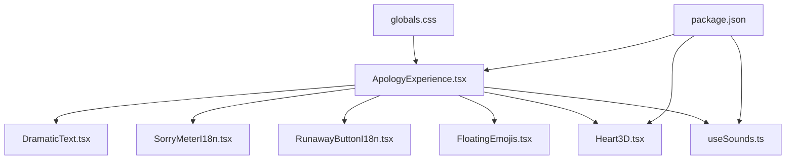
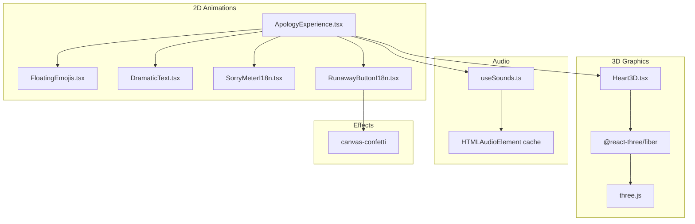
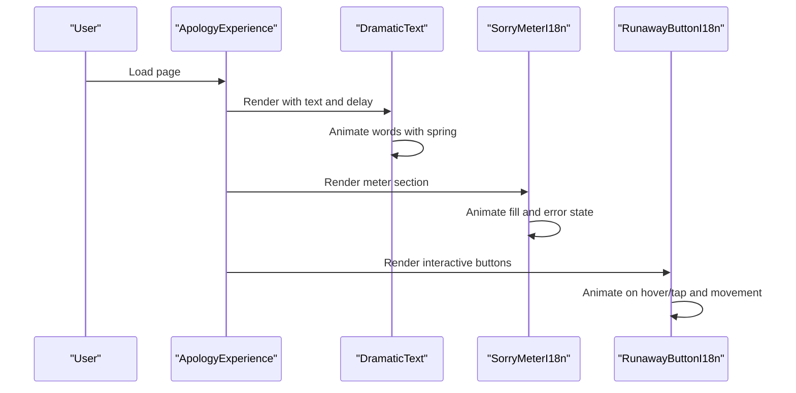
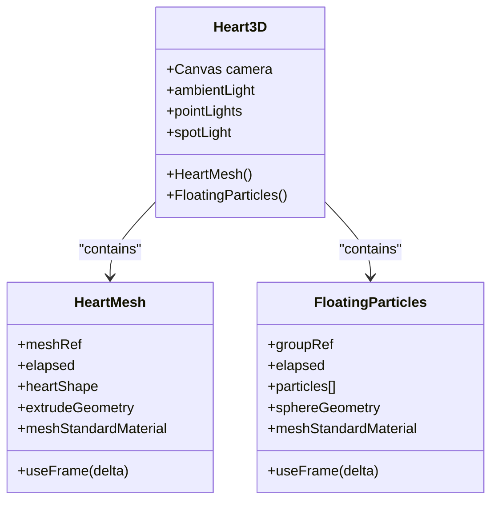
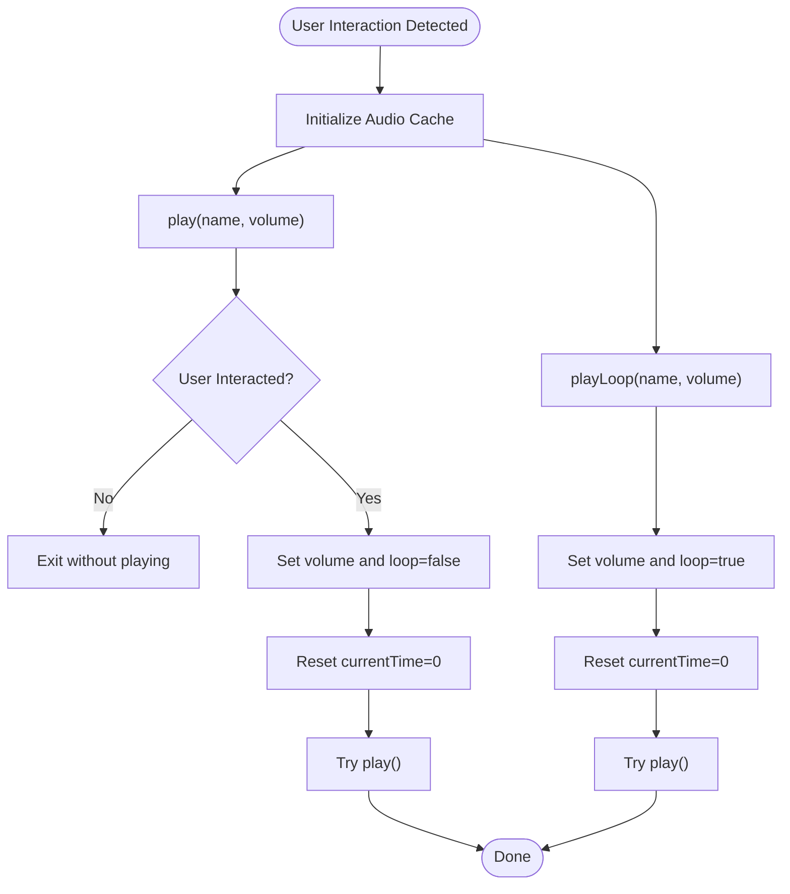
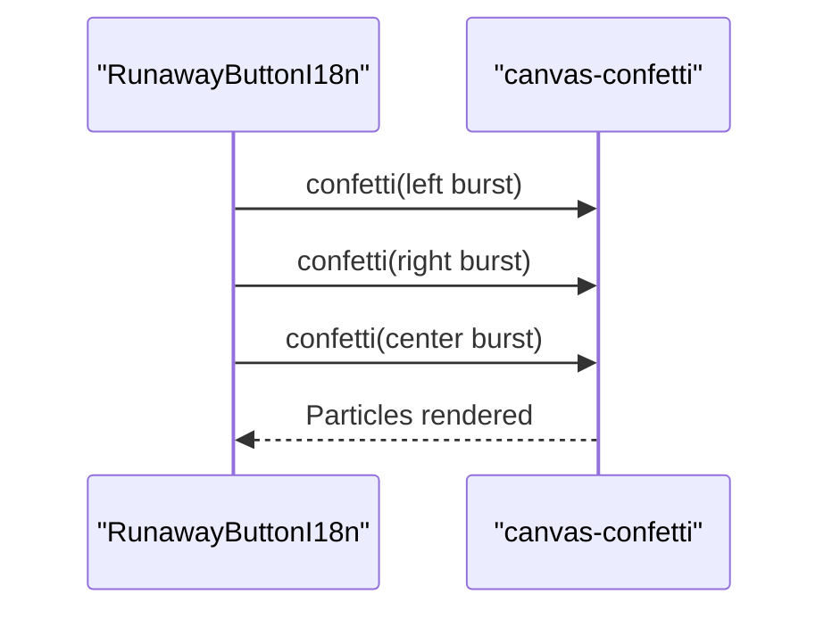
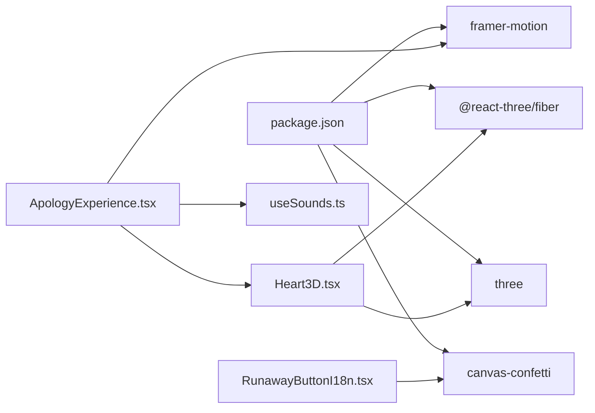

# Animation & Graphics Layer

<cite>
**Referenced Files in This Document**
- [ApologyExperience.tsx](file://src/components/ApologyExperience.tsx)
- [Heart3D.tsx](file://src/components/Heart3D.tsx)
- [useSounds.ts](file://src/components/useSounds.ts)
- [FloatingEmojis.tsx](file://src/components/FloatingEmojis.tsx)
- [DramaticText.tsx](file://src/components/DramaticText.tsx)
- [RunawayButton.tsx](file://src/components/RunawayButton.tsx)
- [RunawayButtonI18n.tsx](file://src/components/RunawayButtonI18n.tsx)
- [SorryMeterI18n.tsx](file://src/components/SorryMeterI18n.tsx)
- [globals.css](file://src/app/globals.css)
- [package.json](file://package.json)
- [next.config.ts](file://next.config.ts)
- [layout.tsx](file://src/app/[lang]/layout.tsx)
</cite>

## Table of Contents
1. [Introduction](#introduction)
2. [Project Structure](#project-structure)
3. [Core Components](#core-components)
4. [Architecture Overview](#architecture-overview)
5. [Detailed Component Analysis](#detailed-component-analysis)
6. [Dependency Analysis](#dependency-analysis)
7. [Performance Considerations](#performance-considerations)
8. [Troubleshooting Guide](#troubleshooting-guide)
9. [Conclusion](#conclusion)

## Introduction
This document describes the animation and graphics architecture layer of the interactive apology experience. It covers:
- Framer Motion-driven 2D animations and transitions
- Three.js with React Three Fiber for 3D heart animations, lighting, and materials
- Confetti particle system using canvas-confetti
- Audio system with caching, autoplay policy compliance, and volume management
- CSS animation framework and responsive design patterns
- Performance optimization techniques
- Coordination between 2D, 3D, and audio to deliver cohesive interactive experiences

## Project Structure
The animation layer is primarily implemented in the components directory, orchestrated by the main experience component and integrated with global styles and audio hooks. Third-party libraries are declared in the project dependencies.

**Diagram sources**
- [ApologyExperience.tsx:1-219](file://src/components/ApologyExperience.tsx#L1-L219)
- [DramaticText.tsx:1-43](file://src/components/DramaticText.tsx#L1-L43)
- [SorryMeterI18n.tsx:1-102](file://src/components/SorryMeterI18n.tsx#L1-L102)
- [RunawayButtonI18n.tsx:1-156](file://src/components/RunawayButtonI18n.tsx#L1-L156)
- [FloatingEmojis.tsx:1-64](file://src/components/FloatingEmojis.tsx#L1-L64)
- [Heart3D.tsx:1-107](file://src/components/Heart3D.tsx#L1-L107)
- [useSounds.ts:1-69](file://src/components/useSounds.ts#L1-L69)
- [globals.css:1-42](file://src/app/globals.css#L1-L42)
- [package.json:1-36](file://package.json#L1-L36)

**Section sources**
- [ApologyExperience.tsx:1-219](file://src/components/ApologyExperience.tsx#L1-L219)
- [globals.css:1-42](file://src/app/globals.css#L1-L42)
- [package.json:1-36](file://package.json#L1-L36)

## Core Components
- Framer Motion orchestration: Entrance, state-based, and scroll-triggered animations across sections.
- 3D scene: Heart geometry with beating animation, ambient and directional lighting, and floating particle effects.
- Audio system: Shared audio cache, user-interaction gating for autoplay, and volume control.
- Particle effects: Confetti bursts coordinated with user actions.
- Responsive design: Tailwind-based layouts and media-aware animation parameters.

**Section sources**
- [ApologyExperience.tsx:32-219](file://src/components/ApologyExperience.tsx#L32-L219)
- [Heart3D.tsx:1-107](file://src/components/Heart3D.tsx#L1-L107)
- [useSounds.ts:1-69](file://src/components/useSounds.ts#L1-L69)
- [RunawayButton.tsx:1-184](file://src/components/RunawayButton.tsx#L1-L184)
- [RunawayButtonI18n.tsx:1-156](file://src/components/RunawayButtonI18n.tsx#L1-L156)
- [SorryMeterI18n.tsx:1-102](file://src/components/SorryMeterI18n.tsx#L1-L102)
- [FloatingEmojis.tsx:1-64](file://src/components/FloatingEmojis.tsx#L1-L64)

## Architecture Overview
The experience composes multiple animation domains:
- 2D animations via Framer Motion for page sections, typography, and interactive buttons
- 3D animations via React Three Fiber for a heart model with dynamic scaling and rotation
- Audio playback managed centrally with a shared cache and user-interaction gating
- Particle effects triggered by user actions using canvas-confetti
- Responsive and accessible styling through Tailwind and CSS custom properties

**Diagram sources**
- [ApologyExperience.tsx:1-219](file://src/components/ApologyExperience.tsx#L1-L219)
- [Heart3D.tsx:1-107](file://src/components/Heart3D.tsx#L1-L107)
- [useSounds.ts:1-69](file://src/components/useSounds.ts#L1-L69)
- [FloatingEmojis.tsx:1-64](file://src/components/FloatingEmojis.tsx#L1-L64)
- [DramaticText.tsx:1-43](file://src/components/DramaticText.tsx#L1-L43)
- [SorryMeterI18n.tsx:1-102](file://src/components/SorryMeterI18n.tsx#L1-L102)
- [RunawayButtonI18n.tsx:1-156](file://src/components/RunawayButtonI18n.tsx#L1-L156)
- [package.json:11-24](file://package.json#L11-L24)

## Detailed Component Analysis

### Framer Motion Integration (2D Animations)
- Entrance animations: Sections fade in and scale with spring easing; staggered delays create rhythm.
- Scroll-triggered animations: Elements animate when scrolled into view using viewport triggers.
- Interactive feedback: Buttons apply hover, tap, and state-based transforms; lists animate on mount with staggered timing.
- Text animations: Words animate individually with spring physics for dramatic reveals.

**Diagram sources**
- [ApologyExperience.tsx:64-134](file://src/components/ApologyExperience.tsx#L64-L134)
- [DramaticText.tsx:12-42](file://src/components/DramaticText.tsx#L12-L42)
- [SorryMeterI18n.tsx:24-45](file://src/components/SorryMeterI18n.tsx#L24-L45)
- [RunawayButtonI18n.tsx:20-74](file://src/components/RunawayButtonI18n.tsx#L20-L74)

**Section sources**
- [ApologyExperience.tsx:64-134](file://src/components/ApologyExperience.tsx#L64-L134)
- [DramaticText.tsx:12-42](file://src/components/DramaticText.tsx#L12-L42)
- [SorryMeterI18n.tsx:24-45](file://src/components/SorryMeterI18n.tsx#L24-L45)
- [RunawayButtonI18n.tsx:20-74](file://src/components/RunawayButtonI18n.tsx#L20-L74)

### Three.js with React Three Fiber (3D Heart)
- Scene composition: Canvas with camera, ambient and point lights, and spot light for highlights.
- Heart geometry: Parametric heart shape extruded with beveled edges; animated scaling and rotation.
- Materials: Standard material with color, metalness, and roughness; emissive particles for sparkle.
- Particles: Group of spheres around the heart with shared rotation animation.

**Diagram sources**
- [Heart3D.tsx:87-106](file://src/components/Heart3D.tsx#L87-L106)
- [Heart3D.tsx:7-48](file://src/components/Heart3D.tsx#L7-L48)
- [Heart3D.tsx:50-85](file://src/components/Heart3D.tsx#L50-L85)

**Section sources**
- [Heart3D.tsx:1-107](file://src/components/Heart3D.tsx#L1-L107)

### Audio System Architecture
- Autoplay policy compliance: Tracks first user interaction (click, touch, scroll) and gates non-looped playback.
- Global audio cache: Reuses HTMLAudioElement instances to avoid redundant decoding and improve responsiveness.
- Volume management: Per-call volume control; looped vs non-looped modes handled distinctly.
- Playback controls: Play once, play loop, and stop helpers exposed via a hook.

**Diagram sources**
- [useSounds.ts:14-69](file://src/components/useSounds.ts#L14-L69)

**Section sources**
- [useSounds.ts:1-69](file://src/components/useSounds.ts#L1-L69)
- [ApologyExperience.tsx:33-46](file://src/components/ApologyExperience.tsx#L33-L46)

### Confetti Particle System
- Triggered on successful action: Confetti bursts coordinated with user confirmation.
- Dual-phase effect: Side bursts from edges and a central burst for impact.
- Performance note: Uses requestAnimationFrame loops for continuous emission within a bounded duration.

**Diagram sources**
- [RunawayButtonI18n.tsx:41-74](file://src/components/RunawayButtonI18n.tsx#L41-L74)

**Section sources**
- [RunawayButtonI18n.tsx:41-74](file://src/components/RunawayButtonI18n.tsx#L41-L74)
- [RunawayButton.tsx:56-94](file://src/components/RunawayButton.tsx#L56-L94)

### Floating Emojis Background
- Dynamic generation: Emojis spawn based on viewport size with reduced counts on mobile.
- Continuous looping: Opacity and vertical movement form an infinite loop with randomized durations and delays.
- Performance: Minimal DOM nodes per viewport; linear easing for smooth motion.

**Section sources**
- [FloatingEmojis.tsx:15-64](file://src/components/FloatingEmojis.tsx#L15-L64)

### Responsive Design Patterns
- Layout primitives: Flex and grid layouts adapt to breakpoints; typography scales with responsive units.
- Viewport-triggered animations: useInView integrates with scroll margins for precise reveal timing.
- Media-aware parameters: Button sizes, emoji counts, and animation durations adjust for mobile.

**Section sources**
- [ApologyExperience.tsx:137-162](file://src/components/ApologyExperience.tsx#L137-L162)
- [DramaticText.tsx:17-18](file://src/components/DramaticText.tsx#L17-L18)
- [FloatingEmojis.tsx:22-34](file://src/components/FloatingEmojis.tsx#L22-L34)

## Dependency Analysis
External libraries and their roles:
- @react-three/fiber and three: 3D rendering and scene management
- framer-motion: 2D and 3D motion orchestration
- canvas-confetti: Particle effects
- useSounds.ts: Audio playback abstraction

**Diagram sources**
- [package.json:11-24](file://package.json#L11-L24)
- [ApologyExperience.tsx:1-219](file://src/components/ApologyExperience.tsx#L1-L219)
- [Heart3D.tsx:1-107](file://src/components/Heart3D.tsx#L1-L107)
- [useSounds.ts:1-69](file://src/components/useSounds.ts#L1-L69)
- [RunawayButtonI18n.tsx:1-156](file://src/components/RunawayButtonI18n.tsx#L1-L156)

**Section sources**
- [package.json:11-24](file://package.json#L11-L24)

## Performance Considerations
- 3D performance
  - Geometry complexity: Extrusion settings balance detail and performance; reduce bevel segments or steps if needed.
  - Frame loop: Canvas configured for consistent updates; keep per-frame calculations lightweight.
  - Lighting: Limit number of intense lights; ambient and subtle point lights suffice for mood.
- 2D performance
  - useInView with once and adjusted margins prevents repeated work.
  - Staggered animations avoid simultaneous heavy layout recalculations.
- Audio
  - Shared cache avoids decoding overhead; catch-play errors prevent unhandled rejections.
  - Autoplay gating ensures compliance and avoids browser restrictions.
- Background effects
  - Floating emojis capped by viewport size; linear easing reduces CPU load.
- Rendering
  - requestAnimationFrame-based confetti loops bound by time to avoid long-running tasks.

[No sources needed since this section provides general guidance]

## Troubleshooting Guide
- Audio does not play on first interaction
  - Ensure user interaction events are registered; the hook listens to click, touchstart, and scroll.
  - Non-looped sounds are gated until interaction; looped sounds bypass this gate.
- Confetti not appearing
  - Verify canvas-confetti is imported and the trigger logic executes on success.
  - Confirm requestAnimationFrame loop runs within the expected time window.
- 3D scene not rendering
  - Check React Three Fiber and three versions match expectations.
  - Ensure Canvas is visible and has explicit height; the component sets responsive heights.
- Animations stuttering
  - Reduce bevel segments or steps in geometry; simplify materials.
  - Prefer linear easing for long-running animations; avoid excessive nested transforms.

**Section sources**
- [useSounds.ts:14-69](file://src/components/useSounds.ts#L14-L69)
- [RunawayButtonI18n.tsx:41-74](file://src/components/RunawayButtonI18n.tsx#L41-L74)
- [Heart3D.tsx:87-106](file://src/components/Heart3D.tsx#L87-L106)

## Conclusion
The animation and graphics layer combines Framer Motion’s declarative animations, React Three Fiber’s 3D rendering, centralized audio management, and canvas-based confetti to create a rich, responsive, and cohesive interactive experience. By coordinating 2D, 3D, and audio elements with performance-conscious patterns, the system delivers delightful user moments while remaining accessible and efficient across devices.