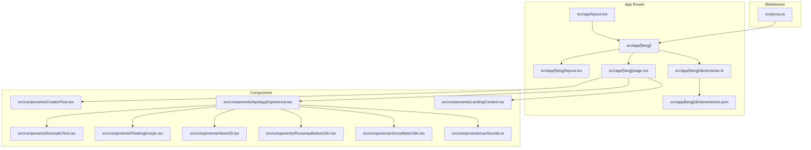
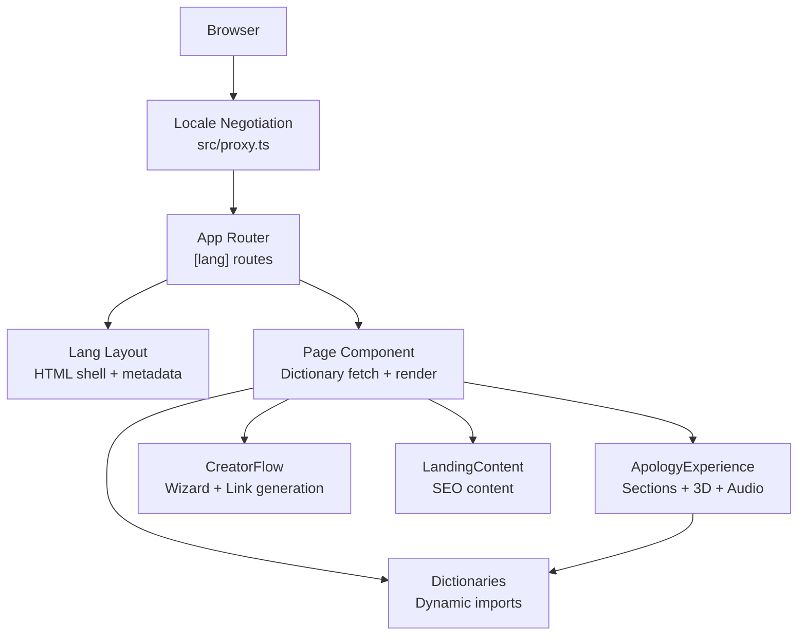
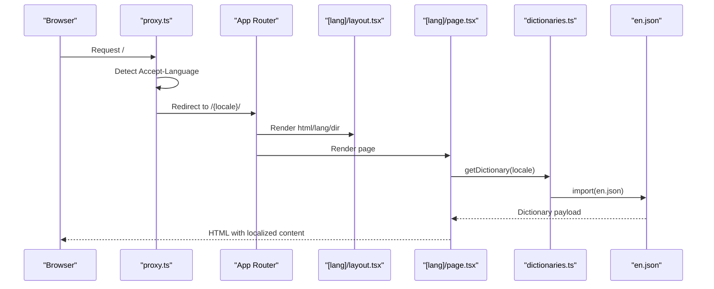
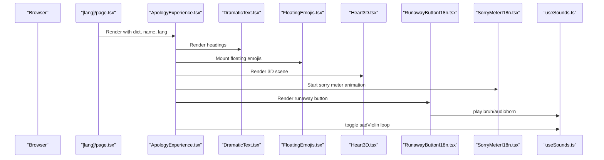
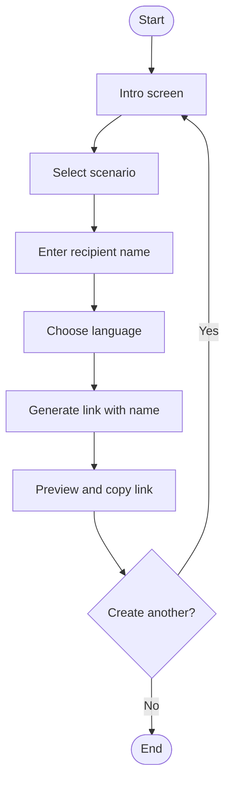
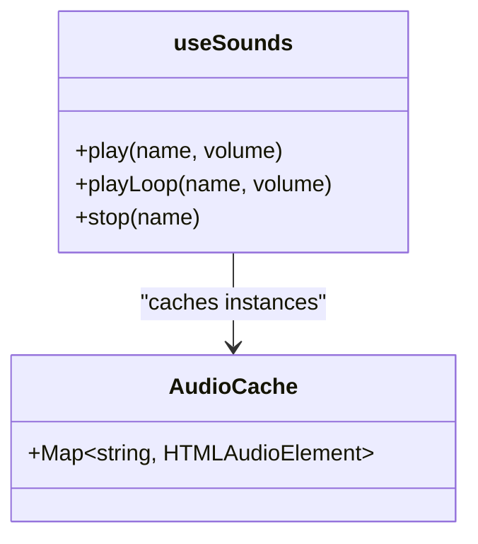
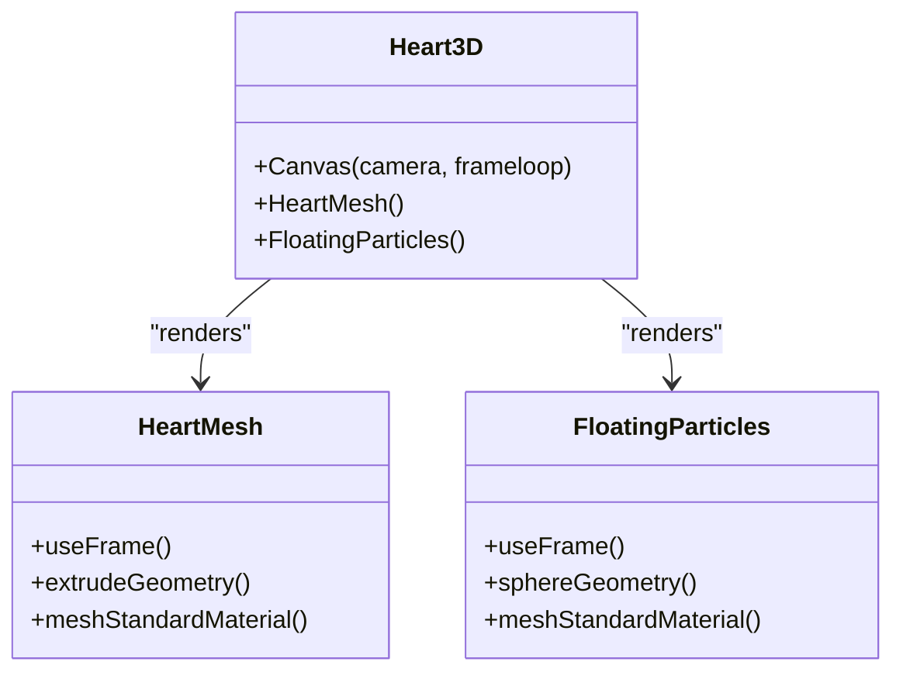
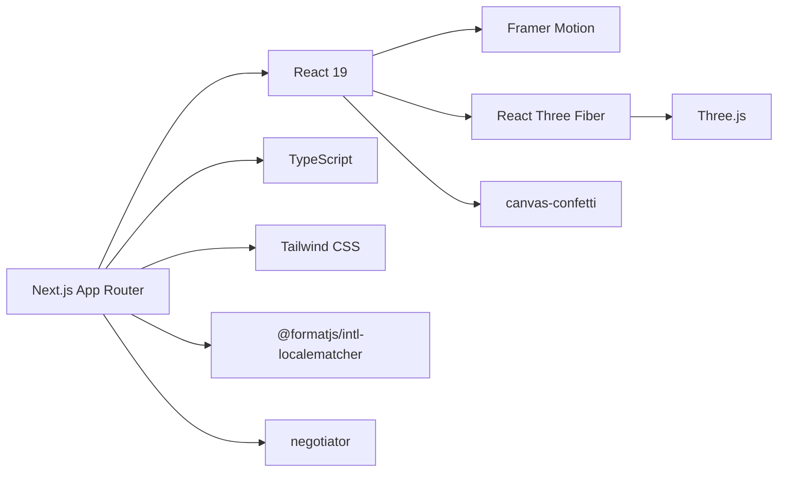

# Architecture Overview

<cite>
**Referenced Files in This Document**
- [package.json](file://package.json)
- [next.config.ts](file://next.config.ts)
- [src/app/layout.tsx](file://src/app/layout.tsx)
- [src/app/[lang]/layout.tsx](file://src/app/[lang]/layout.tsx)
- [src/app/[lang]/page.tsx](file://src/app/[lang]/page.tsx)
- [src/app/[lang]/dictionaries.ts](file://src/app/[lang]/dictionaries.ts)
- [src/app/[lang]/dictionaries/en.json](file://src/app/[lang]/dictionaries/en.json)
- [src/proxy.ts](file://src/proxy.ts)
- [src/components/ApologyExperience.tsx](file://src/components/ApologyExperience.tsx)
- [src/components/CreatorFlow.tsx](file://src/components/CreatorFlow.tsx)
- [src/components/LandingContent.tsx](file://src/components/LandingContent.tsx)
- [src/components/DramaticText.tsx](file://src/components/DramaticText.tsx)
- [src/components/FloatingEmojis.tsx](file://src/components/FloatingEmojis.tsx)
- [src/components/Heart3D.tsx](file://src/components/Heart3D.tsx)
- [src/components/RunawayButtonI18n.tsx](file://src/components/RunawayButtonI18n.tsx)
- [src/components/SorryMeterI18n.tsx](file://src/components/SorryMeterI18n.tsx)
- [src/components/useSounds.ts](file://src/components/useSounds.ts)
</cite>

## Table of Contents
1. [Introduction](#introduction)
2. [Project Structure](#project-structure)
3. [Core Components](#core-components)
4. [Architecture Overview](#architecture-overview)
5. [Detailed Component Analysis](#detailed-component-analysis)
6. [Dependency Analysis](#dependency-analysis)
7. [Performance Considerations](#performance-considerations)
8. [Troubleshooting Guide](#troubleshooting-guide)
9. [Conclusion](#conclusion)

## Introduction
This document describes the architecture of the I Am Really Sorry platform built with Next.js 13+ App Router. The system emphasizes dynamic language routing, server-side rendering, and a layered component model separating presentation, animation, audio, and content concerns. It leverages React 19, TypeScript, Framer Motion for animations, Three.js with React Three Fiber for 3D graphics, and Tailwind CSS for styling. The platform supports multiple locales with dynamic dictionary loading and locale-specific routing, and provides a creator flow for generating personalized apology experiences.

## Project Structure
The project follows Next.js App Router conventions with a root layout delegating to language-specific layouts. Language routes are parameterized under [lang], enabling static generation of localized pages and metadata. Internationalization is handled by per-locale dictionary modules loaded dynamically at runtime. A proxy middleware performs locale negotiation for requests without explicit locale prefixes.

**Diagram sources**
- [src/app/layout.tsx:1-9](file://src/app/layout.tsx#L1-L9)
- [src/app/[lang]/layout.tsx](file://src/app/[lang]/layout.tsx#L1-L108)
- [src/app/[lang]/page.tsx](file://src/app/[lang]/page.tsx#L1-L32)
- [src/app/[lang]/dictionaries.ts](file://src/app/[lang]/dictionaries.ts#L1-L26)
- [src/app/[lang]/dictionaries/en.json](file://src/app/[lang]/dictionaries/en.json#L1-L88)
- [src/proxy.ts:1-50](file://src/proxy.ts#L1-L50)
- [src/components/ApologyExperience.tsx:1-219](file://src/components/ApologyExperience.tsx#L1-L219)
- [src/components/CreatorFlow.tsx:1-335](file://src/components/CreatorFlow.tsx#L1-L335)
- [src/components/LandingContent.tsx:1-158](file://src/components/LandingContent.tsx#L1-L158)
- [src/components/DramaticText.tsx:1-43](file://src/components/DramaticText.tsx#L1-L43)
- [src/components/FloatingEmojis.tsx:1-64](file://src/components/FloatingEmojis.tsx#L1-L64)
- [src/components/Heart3D.tsx:1-107](file://src/components/Heart3D.tsx#L1-L107)
- [src/components/RunawayButtonI18n.tsx:1-156](file://src/components/RunawayButtonI18n.tsx#L1-L156)
- [src/components/SorryMeterI18n.tsx:1-102](file://src/components/SorryMeterI18n.tsx#L1-L102)
- [src/components/useSounds.ts:1-69](file://src/components/useSounds.ts#L1-L69)

**Section sources**
- [src/app/layout.tsx:1-9](file://src/app/layout.tsx#L1-L9)
- [src/app/[lang]/layout.tsx](file://src/app/[lang]/layout.tsx#L1-L108)
- [src/app/[lang]/page.tsx](file://src/app/[lang]/page.tsx#L1-L32)
- [src/app/[lang]/dictionaries.ts](file://src/app/[lang]/dictionaries.ts#L1-L26)
- [src/proxy.ts:1-50](file://src/proxy.ts#L1-L50)

## Core Components
- Language routing and metadata: The [lang] route generates static params for supported locales, validates incoming locales, and produces localized metadata and Open Graph tags. It also sets HTML directionality for RTL languages.
- Dynamic dictionary loading: Per-locale dictionaries are imported asynchronously via a registry keyed by locale code, enabling on-demand loading without bundling all translations upfront.
- Creator flow: A guided, animated wizard that collects scenario, recipient name, and preferred language, then generates a sharable apology link with the recipient's name embedded in the URL.
- Apology experience: A rich, interactive page with hero, animated sections, a 3D heart, a sorry meter, reasons, promises, and a runaway "No" button experience powered by animations and audio.
- Content layer: Landing content and blog-related navigation are rendered server-side with localized text and structured data for SEO.
- Animation layer: Framer Motion orchestrates entrance, hover, and continuous animations for text, buttons, and floating elements.
- Audio layer: A shared audio hook manages looping and one-shot sounds with user-interaction gating and caching to avoid redundant audio instances.
- 3D layer: React Three Fiber renders a beating heart and floating particles with material lighting and continuous animation frames.

**Section sources**
- [src/app/[lang]/layout.tsx](file://src/app/[lang]/layout.tsx#L6-L66)
- [src/app/[lang]/dictionaries.ts](file://src/app/[lang]/dictionaries.ts#L1-L26)
- [src/components/CreatorFlow.tsx:1-335](file://src/components/CreatorFlow.tsx#L1-L335)
- [src/components/ApologyExperience.tsx:1-219](file://src/components/ApologyExperience.tsx#L1-L219)
- [src/components/LandingContent.tsx:1-158](file://src/components/LandingContent.tsx#L1-L158)
- [src/components/DramaticText.tsx:1-43](file://src/components/DramaticText.tsx#L1-L43)
- [src/components/useSounds.ts:1-69](file://src/components/useSounds.ts#L1-L69)
- [src/components/Heart3D.tsx:1-107](file://src/components/Heart3D.tsx#L1-L107)

## Architecture Overview
The system is a layered, component-driven architecture with clear separation of concerns:

- Presentation layer: Components render UI and manage local state for animations and interactions.
- Animation layer: Framer Motion provides declarative motion primitives integrated across components.
- Audio layer: Centralized sound management ensures consistent audio behavior and performance.
- 3D layer: React Three Fiber encapsulates Three.js scene setup and frame updates.
- Content layer: Localized content is injected via dictionaries and rendered server-side for SEO and performance.
- Routing and i18n: App Router handles dynamic language routing; middleware negotiates locale for initial visits.

**Diagram sources**
- [src/proxy.ts:1-50](file://src/proxy.ts#L1-L50)
- [src/app/[lang]/layout.tsx](file://src/app/[lang]/layout.tsx#L1-L108)
- [src/app/[lang]/page.tsx](file://src/app/[lang]/page.tsx#L1-L32)
- [src/app/[lang]/dictionaries.ts](file://src/app/[lang]/dictionaries.ts#L1-L26)
- [src/components/ApologyExperience.tsx:1-219](file://src/components/ApologyExperience.tsx#L1-L219)
- [src/components/CreatorFlow.tsx:1-335](file://src/components/CreatorFlow.tsx#L1-L335)
- [src/components/LandingContent.tsx:1-158](file://src/components/LandingContent.tsx#L1-L158)

## Detailed Component Analysis

### Language Routing and Internationalization
The system uses Next.js dynamic routes with [lang] to enforce locale-specific URLs and generate static params for all supported locales. The dictionaries module exports a registry of locale loaders, enabling asynchronous import of per-locale JSON files. The page component fetches the dictionary and decides between the creator flow and the apology experience based on URL parameters. The layout component sets HTML attributes and generates metadata, including alternate links for SEO.

**Diagram sources**
- [src/proxy.ts:1-50](file://src/proxy.ts#L1-L50)
- [src/app/[lang]/layout.tsx](file://src/app/[lang]/layout.tsx#L1-L108)
- [src/app/[lang]/page.tsx](file://src/app/[lang]/page.tsx#L1-L32)
- [src/app/[lang]/dictionaries.ts](file://src/app/[lang]/dictionaries.ts#L1-L26)
- [src/app/[lang]/dictionaries/en.json](file://src/app/[lang]/dictionaries/en.json#L1-L88)

**Section sources**
- [src/app/[lang]/layout.tsx](file://src/app/[lang]/layout.tsx#L6-L66)
- [src/app/[lang]/page.tsx](file://src/app/[lang]/page.tsx#L12-L31)
- [src/app/[lang]/dictionaries.ts](file://src/app/[lang]/dictionaries.ts#L1-L26)
- [src/proxy.ts:9-44](file://src/proxy.ts#L9-L44)

### Apology Experience Flow
The ApologyExperience composes multiple specialized components: animated hero, 3D heart, sorry meter, reasons cards, promises list, runaway button, and floating emojis. It receives the dictionary and optional name parameter to personalize the experience. Animations leverage Framer Motion for entrance, hover, and continuous effects. Audio playback toggles a looping sad violin track. The 3D heart is rendered client-side with React Three Fiber.

**Diagram sources**
- [src/app/[lang]/page.tsx](file://src/app/[lang]/page.tsx#L12-L31)
- [src/components/ApologyExperience.tsx:1-219](file://src/components/ApologyExperience.tsx#L1-L219)
- [src/components/DramaticText.tsx:1-43](file://src/components/DramaticText.tsx#L1-L43)
- [src/components/FloatingEmojis.tsx:1-64](file://src/components/FloatingEmojis.tsx#L1-L64)
- [src/components/Heart3D.tsx:1-107](file://src/components/Heart3D.tsx#L1-L107)
- [src/components/RunawayButtonI18n.tsx:1-156](file://src/components/RunawayButtonI18n.tsx#L1-L156)
- [src/components/SorryMeterI18n.tsx:1-102](file://src/components/SorryMeterI18n.tsx#L1-L102)
- [src/components/useSounds.ts:1-69](file://src/components/useSounds.ts#L1-L69)

**Section sources**
- [src/components/ApologyExperience.tsx:32-219](file://src/components/ApologyExperience.tsx#L32-L219)
- [src/components/Heart3D.tsx:87-107](file://src/components/Heart3D.tsx#L87-L107)
- [src/components/SorryMeterI18n.tsx:17-102](file://src/components/SorryMeterI18n.tsx#L17-L102)
- [src/components/RunawayButtonI18n.tsx:20-156](file://src/components/RunawayButtonI18n.tsx#L20-L156)
- [src/components/useSounds.ts:41-69](file://src/components/useSounds.ts#L41-L69)

### Creator Flow and Link Generation
The CreatorFlow presents a guided wizard across three steps: selecting a scenario, entering the recipient's name, and choosing a language. On completion, it generates a sharable link embedding the recipient's name in the URL. Animations are orchestrated with Framer Motion, and the flow uses a copy-to-clipboard action with user feedback.

**Diagram sources**
- [src/components/CreatorFlow.tsx:44-335](file://src/components/CreatorFlow.tsx#L44-L335)

**Section sources**
- [src/components/CreatorFlow.tsx:44-335](file://src/components/CreatorFlow.tsx#L44-L335)

### Audio Layer Design
The useSounds hook centralizes audio behavior with:
- User-interaction gating to satisfy browser autoplay policies
- Global audio cache to reuse instances and reduce overhead
- Methods for one-shot and looping playback with configurable volumes
- Cleanup on stop to pause and reset audio

**Diagram sources**
- [src/components/useSounds.ts:1-69](file://src/components/useSounds.ts#L1-L69)

**Section sources**
- [src/components/useSounds.ts:14-69](file://src/components/useSounds.ts#L14-L69)

### 3D Graphics with React Three Fiber
The Heart3D component defines a heart geometry, extrusion settings, materials, and continuous animation loops. It renders within a Canvas configured for lighting and camera position, with a group of floating particles that rotate continuously.

**Diagram sources**
- [src/components/Heart3D.tsx:7-107](file://src/components/Heart3D.tsx#L7-L107)

**Section sources**
- [src/components/Heart3D.tsx:87-107](file://src/components/Heart3D.tsx#L87-L107)

## Dependency Analysis
External technologies and their roles:
- Next.js 16.2.9: App Router, SSR, static params generation, middleware integration
- React 19.2.4: Component model and hooks
- TypeScript 5: Type safety for dictionaries, props, and middleware
- Framer Motion 12.40.0: Animation orchestration across components
- Three.js 0.184.0 + @react-three/fiber 9.6.1: 3D rendering and frame loop
- canvas-confetti: Particle effects on success
- Tailwind CSS 4: Utility-first styling
- @formatjs/intl-localematcher + negotiator: Locale negotiation in middleware

**Diagram sources**
- [package.json:11-34](file://package.json#L11-L34)

**Section sources**
- [package.json:11-34](file://package.json#L11-L34)

## Performance Considerations
- Lazy loading and SSR:
  - Dynamic imports for dictionaries minimize initial bundle size and load only the requested locale.
  - Static params generation for [lang] enables prerendering of locale roots for improved performance.
  - Root layout delegates to language layout, keeping HTML shell minimal.
- Client-side rendering boundaries:
  - Heart3D is loaded dynamically with SSR disabled to avoid server-side WebGL limitations.
  - useSounds caches audio instances globally to prevent redundant initialization.
- Animation and rendering:
  - DramaticText and FloatingEmojis use viewport-based triggers to animate only when in view.
  - FloatingEmojis reduces emoji counts on smaller screens to maintain smooth performance.
- Middleware redirection:
  - Early exit for static assets and internal paths avoids unnecessary redirects.
  - Locale detection uses Accept-Language headers and a fast matcher to choose the appropriate locale quickly.

**Section sources**
- [src/app/[lang]/dictionaries.ts](file://src/app/[lang]/dictionaries.ts#L1-L26)
- [src/app/[lang]/layout.tsx](file://src/app/[lang]/layout.tsx#L6-L16)
- [src/components/ApologyExperience.tsx:12-12](file://src/components/ApologyExperience.tsx#L12-L12)
- [src/components/useSounds.ts:29-69](file://src/components/useSounds.ts#L29-L69)
- [src/components/DramaticText.tsx:17-18](file://src/components/DramaticText.tsx#L17-L18)
- [src/components/FloatingEmojis.tsx:19-34](file://src/components/FloatingEmojis.tsx#L19-L34)
- [src/proxy.ts:25-44](file://src/proxy.ts#L25-L44)

## Troubleshooting Guide
- Locale not found:
  - The layout throws a 404 for unsupported locales, preventing invalid routes from rendering.
- Missing dictionary:
  - Ensure the locale exists in the dictionaries registry and the corresponding JSON file is present.
- Audio not playing:
  - Verify user interaction occurred before attempting to play sounds; the hook gates playback until interaction.
- 3D content blank:
  - Confirm the component is marked as client-only and that the environment supports WebGL.
- Redirect loops:
  - Ensure the middleware matcher excludes internal paths and static assets.

**Section sources**
- [src/app/[lang]/layout.tsx](file://src/app/[lang]/layout.tsx#L76-L76)
- [src/app/[lang]/dictionaries.ts](file://src/app/[lang]/dictionaries.ts#L22-L26)
- [src/components/useSounds.ts:42-49](file://src/components/useSounds.ts#L42-L49)
- [src/components/Heart3D.tsx:1-2](file://src/components/Heart3D.tsx#L1-L2)
- [src/proxy.ts:47-49](file://src/proxy.ts#L47-L49)

## Conclusion
The I Am Really Sorry platform demonstrates a clean, scalable architecture leveraging Next.js App Router for dynamic language routing and SSR, with a strong separation of concerns across presentation, animation, audio, and content layers. The internationalization system uses dynamic dictionary loading and locale negotiation, while the creator flow and interactive experience showcase modern web technologies including Framer Motion, React Three Fiber, and thoughtful performance optimizations.