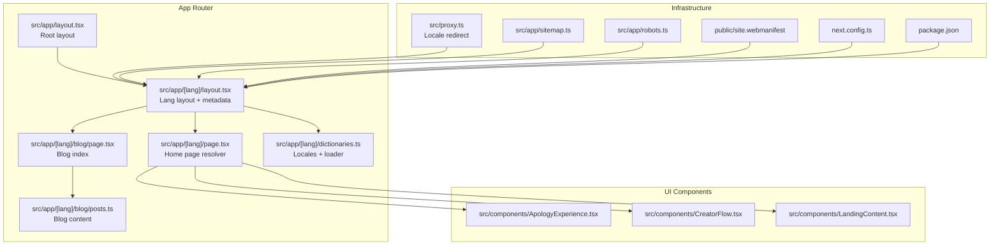
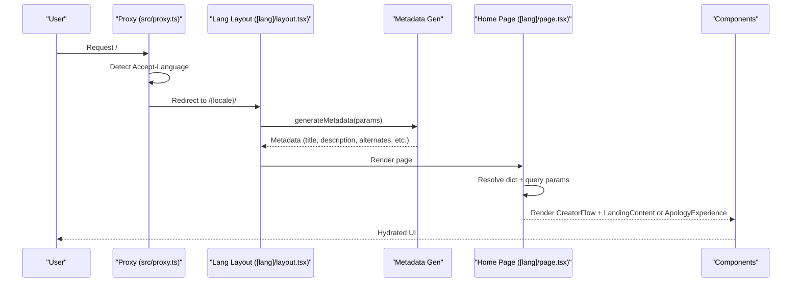
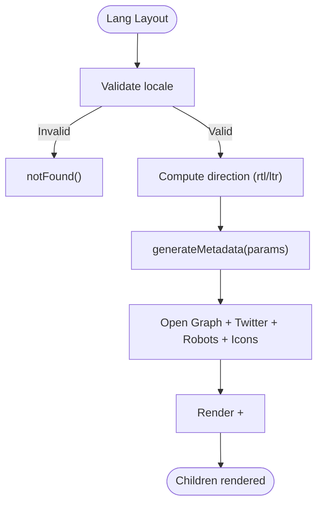
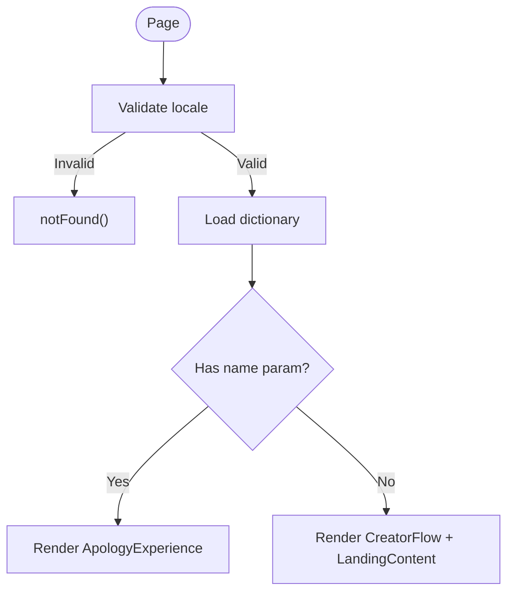
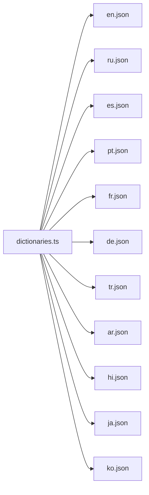
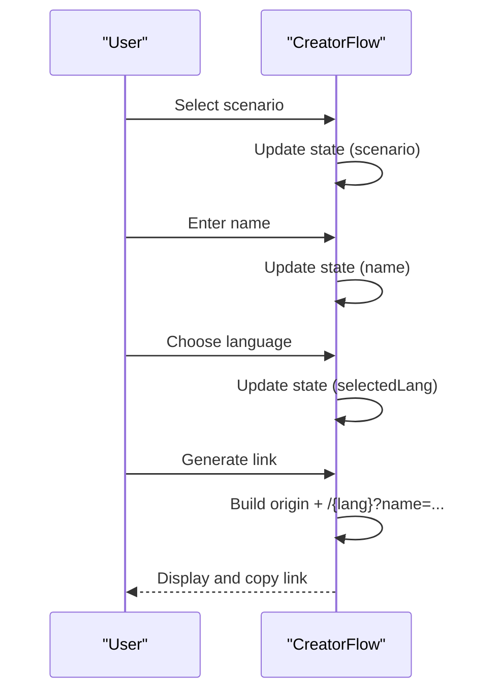
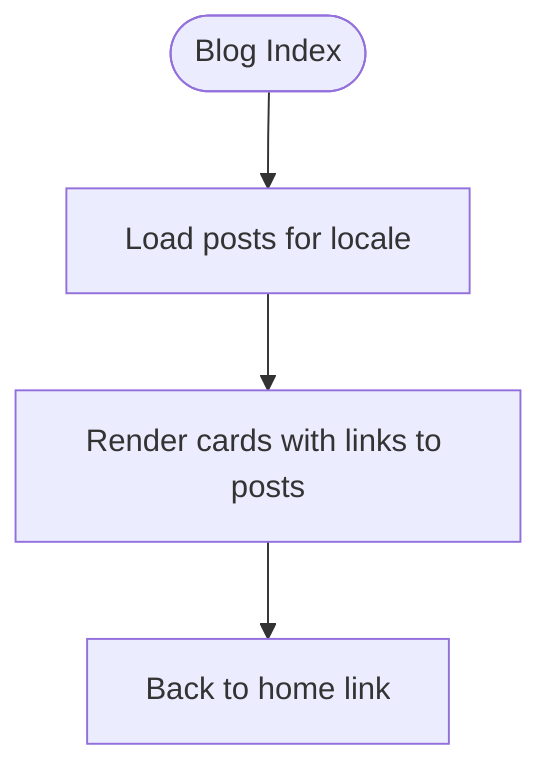
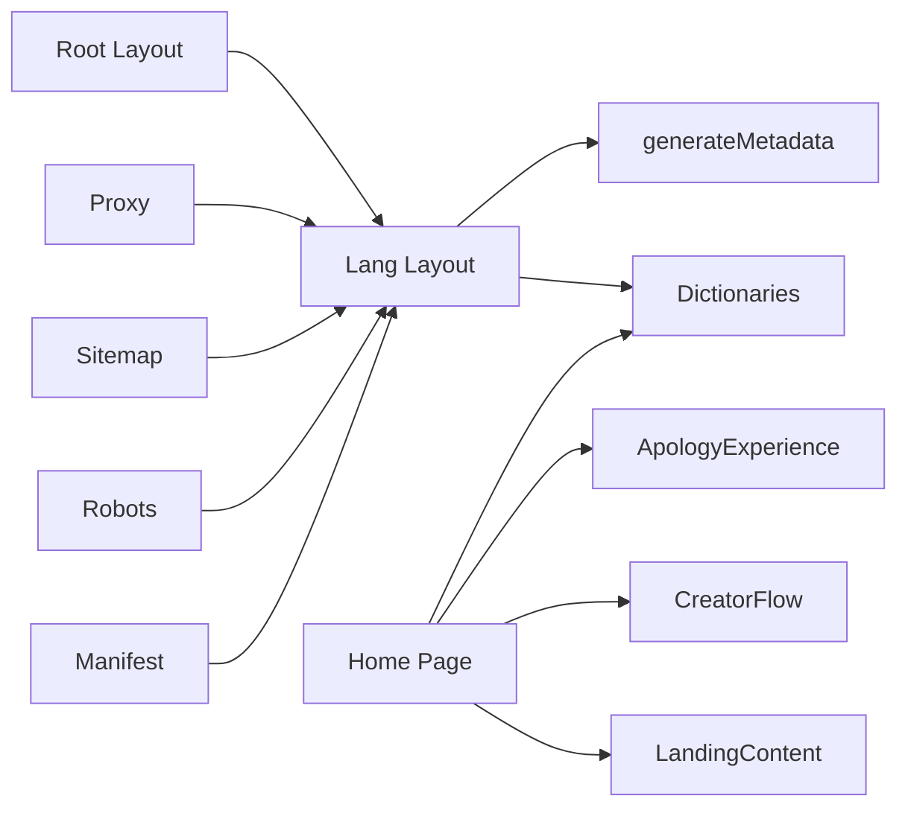

# Frontend Architecture

<cite>
**Referenced Files in This Document**
- [src/app/layout.tsx](file://src/app/layout.tsx)
- [src/app/[lang]/layout.tsx](file://src/app/[lang]/layout.tsx)
- [src/app/[lang]/page.tsx](file://src/app/[lang]/page.tsx)
- [src/app/[lang]/dictionaries.ts](file://src/app/[lang]/dictionaries.ts)
- [src/app/[lang]/blog/page.tsx](file://src/app/[lang]/blog/page.tsx)
- [src/app/[lang]/blog/posts.ts](file://src/app/[lang]/blog/posts.ts)
- [src/app/sitemap.ts](file://src/app/sitemap.ts)
- [src/app/robots.ts](file://src/app/robots.ts)
- [src/proxy.ts](file://src/proxy.ts)
- [src/components/ApologyExperience.tsx](file://src/components/ApologyExperience.tsx)
- [src/components/CreatorFlow.tsx](file://src/components/CreatorFlow.tsx)
- [src/components/LandingContent.tsx](file://src/components/LandingContent.tsx)
- [public/site.webmanifest](file://public/site.webmanifest)
- [next.config.ts](file://next.config.ts)
- [package.json](file://package.json)
</cite>

## Table of Contents
1. [Introduction](#introduction)
2. [Project Structure](#project-structure)
3. [Core Components](#core-components)
4. [Architecture Overview](#architecture-overview)
5. [Detailed Component Analysis](#detailed-component-analysis)
6. [Dependency Analysis](#dependency-analysis)
7. [Performance Considerations](#performance-considerations)
8. [Troubleshooting Guide](#troubleshooting-guide)
9. [Conclusion](#conclusion)
10. [Appendices](#appendices)

## Introduction
This document describes the frontend architecture of the I Am Really Sorry platform built with Next.js 13+ App Router. It explains the dynamic language routing using catch-all-like segments, server-side rendering and static generation strategies, client-side hydration, and the component hierarchy from root layout to interactive UI components. It also covers routing for language-specific URLs, canonical and alternate language handling, SEO metadata generation, build configuration, asset optimization, deployment pipeline, and Progressive Web App (PWA) support for progressive enhancement and offline readiness.

## Project Structure
The project follows Next.js App Router conventions with a language segment route under src/app/[lang]. Internationalization is handled via locale-aware dictionaries and a proxy middleware for automatic locale redirection. The UI is composed of reusable components that encapsulate presentation and interactivity.



**Diagram sources**
- [src/app/layout.tsx:1-9](file://src/app/layout.tsx#L1-L9)
- [src/app/[lang]/layout.tsx](file://src/app/[lang]/layout.tsx#L1-L108)
- [src/app/[lang]/page.tsx](file://src/app/[lang]/page.tsx#L1-L32)
- [src/app/[lang]/blog/page.tsx](file://src/app/[lang]/blog/page.tsx#L1-L87)
- [src/app/[lang]/blog/posts.ts](file://src/app/[lang]/blog/posts.ts#L1-L446)
- [src/app/[lang]/dictionaries.ts](file://src/app/[lang]/dictionaries.ts#L1-L26)
- [src/proxy.ts:1-50](file://src/proxy.ts#L1-L50)
- [src/app/sitemap.ts:1-60](file://src/app/sitemap.ts#L1-L60)
- [src/app/robots.ts:1-15](file://src/app/robots.ts#L1-L15)
- [public/site.webmanifest:1-1](file://public/site.webmanifest#L1-L1)
- [next.config.ts:1-8](file://next.config.ts#L1-L8)
- [package.json:1-36](file://package.json#L1-L36)

**Section sources**
- [src/app/layout.tsx:1-9](file://src/app/layout.tsx#L1-L9)
- [src/app/[lang]/layout.tsx](file://src/app/[lang]/layout.tsx#L1-L108)
- [src/app/[lang]/page.tsx](file://src/app/[lang]/page.tsx#L1-L32)
- [src/app/[lang]/blog/page.tsx](file://src/app/[lang]/blog/page.tsx#L1-L87)
- [src/app/[lang]/blog/posts.ts](file://src/app/[lang]/blog/posts.ts#L1-L446)
- [src/app/[lang]/dictionaries.ts](file://src/app/[lang]/dictionaries.ts#L1-L26)
- [src/proxy.ts:1-50](file://src/proxy.ts#L1-L50)
- [src/app/sitemap.ts:1-60](file://src/app/sitemap.ts#L1-L60)
- [src/app/robots.ts:1-15](file://src/app/robots.ts#L1-L15)
- [public/site.webmanifest:1-1](file://public/site.webmanifest#L1-L1)
- [next.config.ts:1-8](file://next.config.ts#L1-L8)
- [package.json:1-36](file://package.json#L1-L36)

## Core Components
- Root layout: Minimal wrapper delegating to language layout.
- Language layout: Validates locale, sets html lang/dir, generates metadata, and injects structured data.
- Home page resolver: Determines whether to render the creator flow and landing content or the receiver’s apology experience based on query parameters.
- Dictionary system: Async locale loaders for metadata and UI text.
- Blog index: Lists localized posts and links to post pages.
- UI components: CreatorFlow (client), ApologyExperience (client), LandingContent (SSR).
- Infrastructure: Proxy for locale redirection, sitemap/robots generators, web app manifest.

Key responsibilities:
- Routing: Catch-all-like [lang] segment with explicit generateStaticParams for known locales.
- SSR: generateMetadata, generateStaticParams, and blog index rendering.
- Hydration: Client components marked with "use client".
- SEO: Canonical alternates, Open Graph, Twitter, robots.txt, sitemap.xml.

**Section sources**
- [src/app/layout.tsx:1-9](file://src/app/layout.tsx#L1-L9)
- [src/app/[lang]/layout.tsx](file://src/app/[lang]/layout.tsx#L6-L66)
- [src/app/[lang]/page.tsx](file://src/app/[lang]/page.tsx#L12-L31)
- [src/app/[lang]/dictionaries.ts](file://src/app/[lang]/dictionaries.ts#L1-L26)
- [src/app/[lang]/blog/page.tsx](file://src/app/[lang]/blog/page.tsx#L23-L86)
- [src/components/CreatorFlow.tsx:1-335](file://src/components/CreatorFlow.tsx#L1-L335)
- [src/components/ApologyExperience.tsx:1-219](file://src/components/ApologyExperience.tsx#L1-L219)
- [src/components/LandingContent.tsx:1-158](file://src/components/LandingContent.tsx#L1-L158)
- [src/proxy.ts:22-49](file://src/proxy.ts#L22-L49)
- [src/app/sitemap.ts:20-59](file://src/app/sitemap.ts#L20-L59)
- [src/app/robots.ts:3-14](file://src/app/robots.ts#L3-L14)
- [public/site.webmanifest:1-1](file://public/site.webmanifest#L1-L1)

## Architecture Overview
The architecture centers on Next.js App Router with a language segment. The language layout acts as a boundary for locale validation, metadata generation, and HTML shell setup. Pages resolve content server-side and hydrate interactive components on the client. A proxy middleware handles automatic locale redirection for visitors without an explicit locale. SEO is driven by generated metadata, sitemap, and robots configuration.



**Diagram sources**
- [src/proxy.ts:9-44](file://src/proxy.ts#L9-L44)
- [src/app/[lang]/layout.tsx](file://src/app/[lang]/layout.tsx#L10-L66)
- [src/app/[lang]/page.tsx](file://src/app/[lang]/page.tsx#L12-L31)
- [src/components/CreatorFlow.tsx:1-335](file://src/components/CreatorFlow.tsx#L1-L335)
- [src/components/ApologyExperience.tsx:1-219](file://src/components/ApologyExperience.tsx#L1-L219)
- [src/components/LandingContent.tsx:1-158](file://src/components/LandingContent.tsx#L1-L158)

## Detailed Component Analysis

### Language Layout and Metadata
- Validates locale via hasLocale; otherwise triggers 404.
- Sets html lang and direction based on locale (RTL for Arabic).
- Generates rich metadata including title, description, canonical alternates, Open Graph, Twitter, robots directives, icons, and manifest.
- Injects structured data (WebApplication) and FAQ structured data for SEO.



**Diagram sources**
- [src/app/[lang]/layout.tsx](file://src/app/[lang]/layout.tsx#L68-L107)
- [src/app/[lang]/layout.tsx](file://src/app/[lang]/layout.tsx#L10-L66)

**Section sources**
- [src/app/[lang]/layout.tsx](file://src/app/[lang]/layout.tsx#L6-L66)
- [src/app/[lang]/layout.tsx](file://src/app/[lang]/layout.tsx#L68-L107)

### Home Page Resolver
- Resolves locale and loads dictionary.
- Reads optional name query parameter to decide between:
  - Receiver view: ApologyExperience
  - Creator view: CreatorFlow + LandingContent



**Diagram sources**
- [src/app/[lang]/page.tsx](file://src/app/[lang]/page.tsx#L12-L31)

**Section sources**
- [src/app/[lang]/page.tsx](file://src/app/[lang]/page.tsx#L12-L31)

### Internationalization Dictionary System
- Declares supported locales and default locale.
- Exports hasLocale and getDictionary for runtime loading.
- Dictionaries are loaded server-side for metadata and page rendering.



**Diagram sources**
- [src/app/[lang]/dictionaries.ts](file://src/app/[lang]/dictionaries.ts#L3-L15)

**Section sources**
- [src/app/[lang]/dictionaries.ts](file://src/app/[lang]/dictionaries.ts#L1-L26)

### CreatorFlow (Client Component)
- Client-side wizard guiding creators through scenario selection, recipient name, language choice, and link generation.
- Uses Framer Motion for animations and AnimatePresence for transitions.
- Generates sharable link with encoded name and selected language.



**Diagram sources**
- [src/components/CreatorFlow.tsx:44-63](file://src/components/CreatorFlow.tsx#L44-L63)

**Section sources**
- [src/components/CreatorFlow.tsx:1-335](file://src/components/CreatorFlow.tsx#L1-L335)

### ApologyExperience (Client Component)
- Client-rendered experience for recipients with interactive elements:
  - Music toggle with looping audio
  - 3D heart animation (SSR disabled)
  - Dramatic text, sorry meter, reasons, promises, runaway button
- Uses Framer Motion for animations and dynamic imports for 3D components.

```mermaid
classDiagram
class ApologyExperience {
+props : dict, name, lang, isReceiver
+toggleMusic()
+render()
}
class Heart3D
class SorryMeterI18n
class RunwayButtonI18n
class DramaticText
class FloatingEmojis
class useSounds
ApologyExperience --> Heart3D : "dynamic import (ssr : false)"
ApologyExperience --> SorryMeterI18n : "renders"
ApologyExperience --> RunwayButtonI18n : "renders"
ApologyExperience --> DramaticText : "renders"
ApologyExperience --> FloatingEmojis : "renders"
ApologyExperience --> useSounds : "plays audio"
```

**Diagram sources**
- [src/components/ApologyExperience.tsx:32-218](file://src/components/ApologyExperience.tsx#L32-L218)

**Section sources**
- [src/components/ApologyExperience.tsx:1-219](file://src/components/ApologyExperience.tsx#L1-L219)

### LandingContent (SSR Component)
- Server-rendered informational section with RTL support for Arabic.
- Emits FAQ structured data for SEO.
- Provides internal navigation to blog and creator flow.

**Section sources**
- [src/components/LandingContent.tsx:1-158](file://src/components/LandingContent.tsx#L1-L158)

### Blog Index and Content
- Blog index page lists localized posts with titles, excerpts, emojis, and tags.
- Post data is statically organized per locale and returned by getters.
- Generates localized metadata for the blog index.



**Diagram sources**
- [src/app/[lang]/blog/page.tsx](file://src/app/[lang]/blog/page.tsx#L23-L86)
- [src/app/[lang]/blog/posts.ts](file://src/app/[lang]/blog/posts.ts#L433-L446)

**Section sources**
- [src/app/[lang]/blog/page.tsx](file://src/app/[lang]/blog/page.tsx#L1-L87)
- [src/app/[lang]/blog/posts.ts](file://src/app/[lang]/blog/posts.ts#L1-L446)

### Infrastructure: Proxy, Sitemap, Robots, Manifest
- Proxy: Intercepts requests, detects preferred locale via Accept-Language, and redirects to locale-prefixed path if missing.
- Sitemap: Generates routes for each locale and blog slugs with alternates.
- Robots: Allows crawling and points to sitemap.
- Manifest: PWA configuration for installability and standalone display.

**Section sources**
- [src/proxy.ts:1-50](file://src/proxy.ts#L1-L50)
- [src/app/sitemap.ts:1-60](file://src/app/sitemap.ts#L1-L60)
- [src/app/robots.ts:1-15](file://src/app/robots.ts#L1-L15)
- [public/site.webmanifest:1-1](file://public/site.webmanifest#L1-L1)

## Dependency Analysis
- Root layout depends on language layout.
- Language layout depends on dictionaries and Next.js metadata APIs.
- Home page depends on dictionaries and query parameters to choose between creator and receiver views.
- UI components depend on shared assets and third-party libraries (Framer Motion, Three.js via @react-three/fiber/drei).
- Infrastructure components (proxy, sitemap, robots) are decoupled and invoked by Next.js runtime.



**Diagram sources**
- [src/app/layout.tsx:1-9](file://src/app/layout.tsx#L1-L9)
- [src/app/[lang]/layout.tsx](file://src/app/[lang]/layout.tsx#L1-L108)
- [src/app/[lang]/page.tsx](file://src/app/[lang]/page.tsx#L1-L32)
- [src/app/[lang]/dictionaries.ts](file://src/app/[lang]/dictionaries.ts#L1-L26)
- [src/proxy.ts:1-50](file://src/proxy.ts#L1-L50)
- [src/app/sitemap.ts:1-60](file://src/app/sitemap.ts#L1-L60)
- [src/app/robots.ts:1-15](file://src/app/robots.ts#L1-L15)
- [public/site.webmanifest:1-1](file://public/site.webmanifest#L1-L1)

**Section sources**
- [src/app/layout.tsx:1-9](file://src/app/layout.tsx#L1-L9)
- [src/app/[lang]/layout.tsx](file://src/app/[lang]/layout.tsx#L1-L108)
- [src/app/[lang]/page.tsx](file://src/app/[lang]/page.tsx#L1-L32)
- [src/app/[lang]/dictionaries.ts](file://src/app/[lang]/dictionaries.ts#L1-L26)
- [src/proxy.ts:1-50](file://src/proxy.ts#L1-L50)
- [src/app/sitemap.ts:1-60](file://src/app/sitemap.ts#L1-L60)
- [src/app/robots.ts:1-15](file://src/app/robots.ts#L1-L15)
- [public/site.webmanifest:1-1](file://public/site.webmanifest#L1-L1)

## Performance Considerations
- Static generation: generateStaticParams for known locales ensures pre-rendered pages for SEO and faster load times.
- Dynamic imports: 3D components are SSR-disabled to reduce server payload and improve TTFB.
- Client components: Marked with "use client" to keep server rendering lean and hydrate only where needed.
- Asset optimization: Next.js handles image and static asset optimization automatically; ensure favicon and PWA icons are appropriately sized.
- Animations: Framer Motion is efficient but should be scoped to minimize layout thrashing.
- Fonts and CSS: Global CSS is included in the language layout; ensure critical CSS is extracted and non-critical styles deferred.

[No sources needed since this section provides general guidance]

## Troubleshooting Guide
- 404 on invalid locale: The language layout checks locale validity and triggers notFound for unsupported locales.
- Missing locale prefix: The proxy middleware redirects unlocalized paths to the detected locale.
- Metadata inconsistencies: Verify generateMetadata returns canonical alternates and correct locales.
- PWA not installing: Ensure manifest path is correct and icons are present; check browser devtools for manifest errors.
- SSR vs client hydration mismatch: Confirm client components are properly marked and dynamic imports are used for heavy client-only libraries.

**Section sources**
- [src/app/[lang]/layout.tsx](file://src/app/[lang]/layout.tsx#L76-L76)
- [src/proxy.ts:34-44](file://src/proxy.ts#L34-L44)
- [src/app/[lang]/layout.tsx](file://src/app/[lang]/layout.tsx#L19-L64)
- [public/site.webmanifest:1-1](file://public/site.webmanifest#L1-L1)

## Conclusion
The I Am Really Sorry platform leverages Next.js 13+ App Router to deliver a localized, SEO-friendly, and interactive experience. The language layout centralizes locale validation and metadata generation, while pages dynamically select between creator and receiver experiences. Client components manage rich interactivity, and infrastructure ensures proper SEO, localization redirection, and PWA readiness. This architecture balances SSR for performance and SEO with client-side hydration for engaging UI.

[No sources needed since this section summarizes without analyzing specific files]

## Appendices

### Build Configuration and Deployment Pipeline
- Next.js configuration: Empty default configuration allows defaults; customize via next.config.ts if needed.
- Dependencies: Includes Next.js, React 19, Tailwind 4, Framer Motion, Three.js ecosystem, and negotiation utilities.
- Scripts: Dev, build, start, lint; deploy using standard Next.js hosting targets.

**Section sources**
- [next.config.ts:1-8](file://next.config.ts#L1-L8)
- [package.json:1-36](file://package.json#L1-L36)