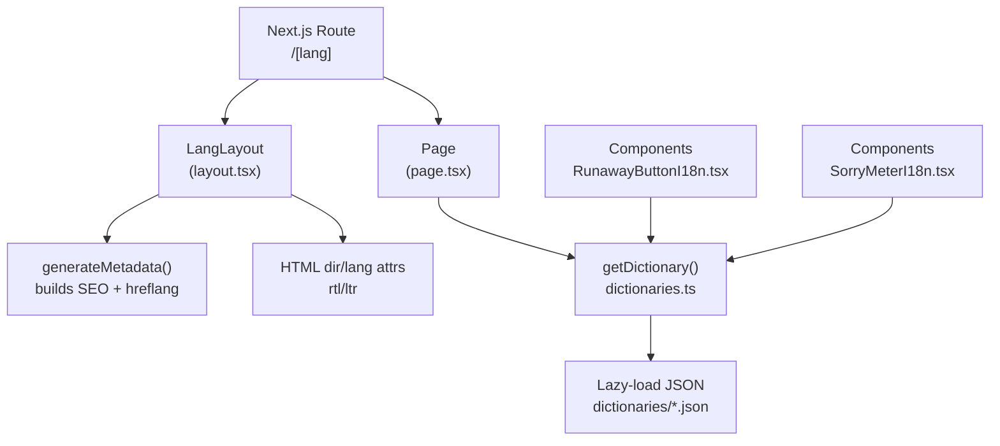
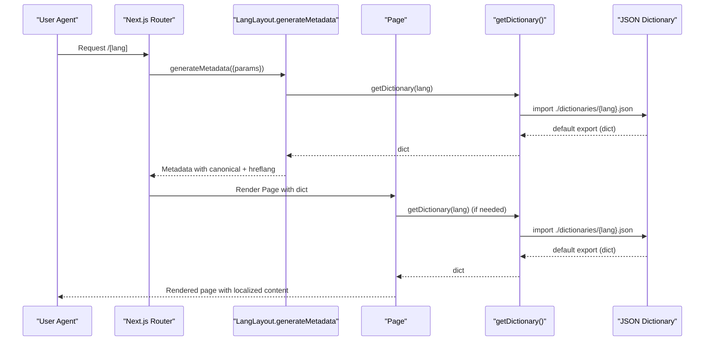
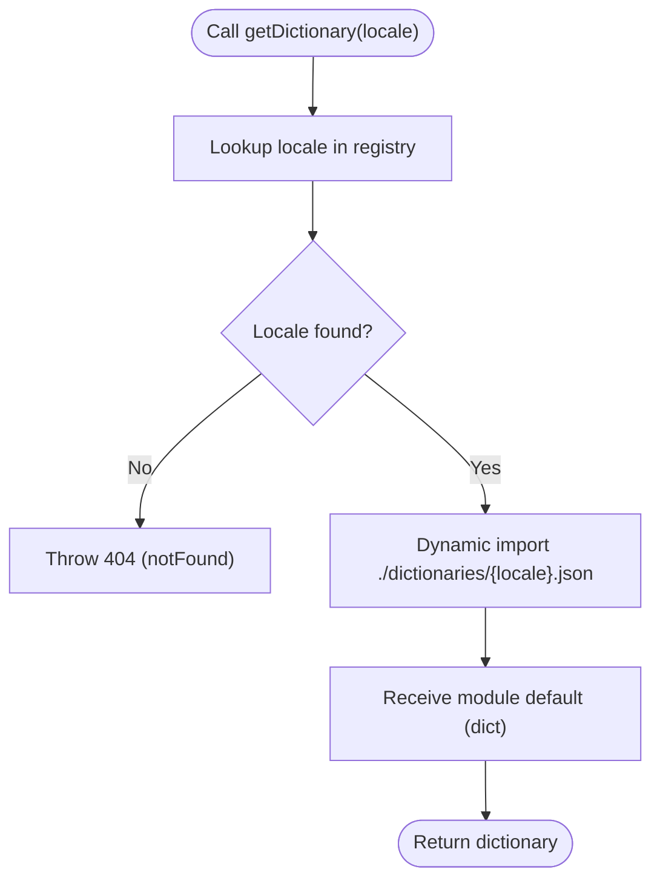
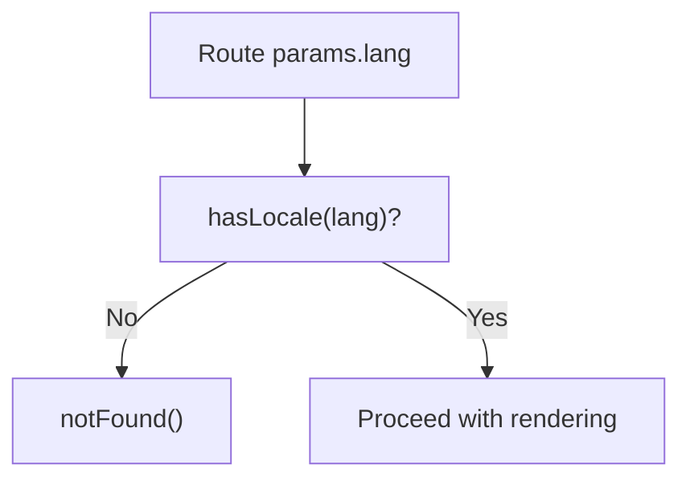
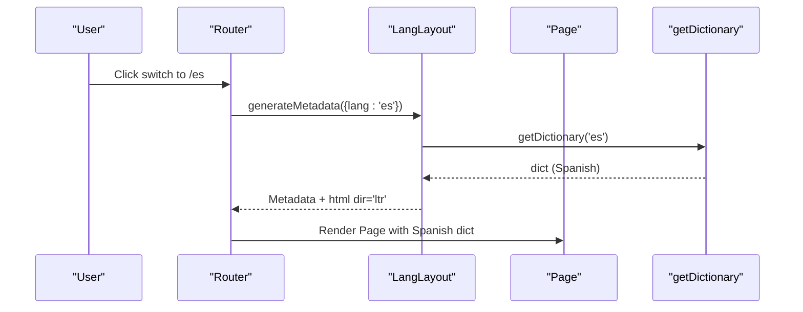
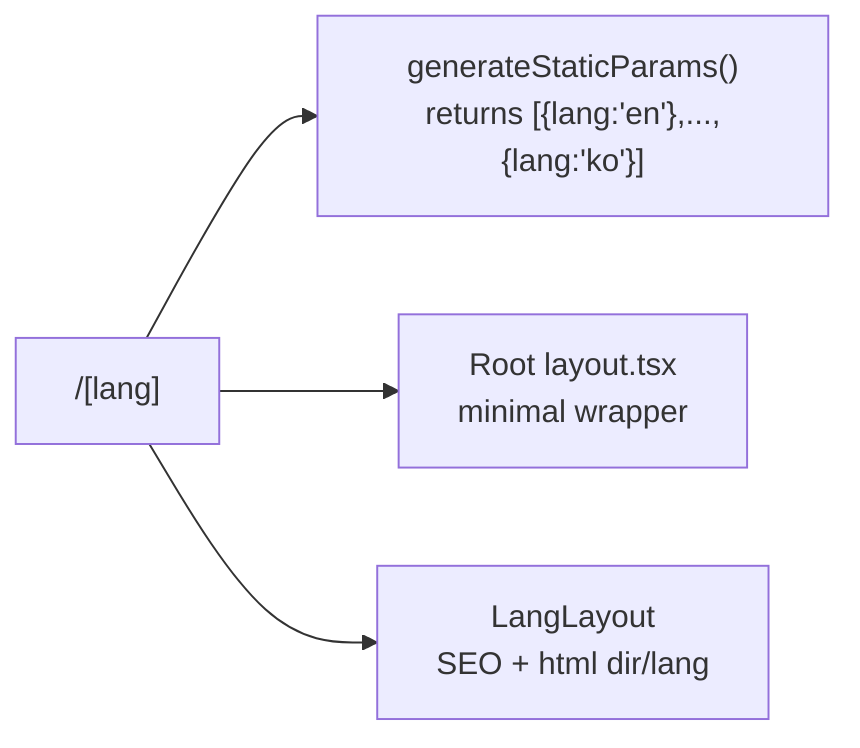
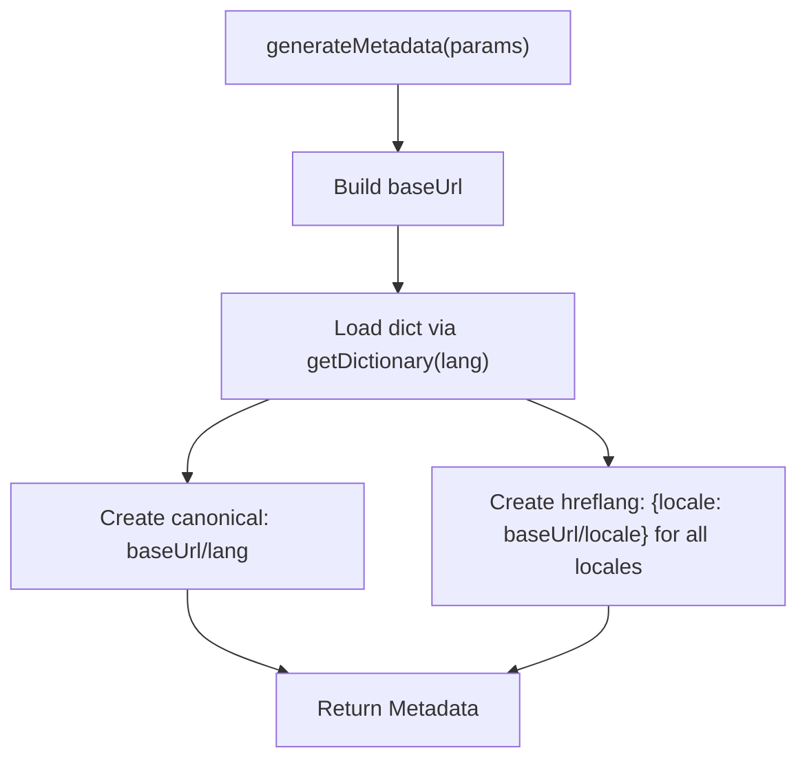
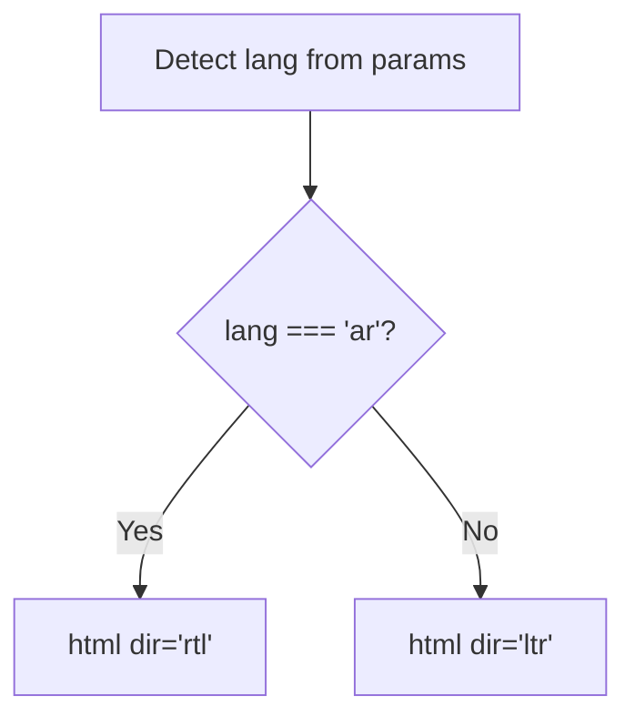
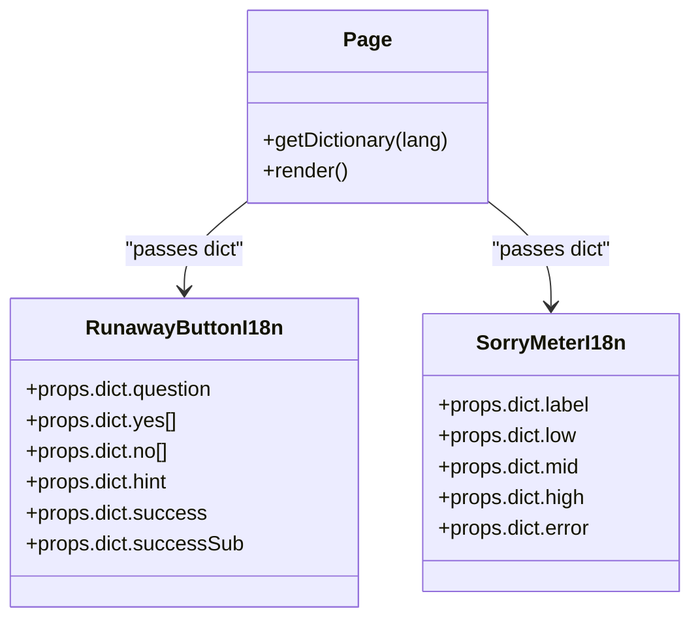
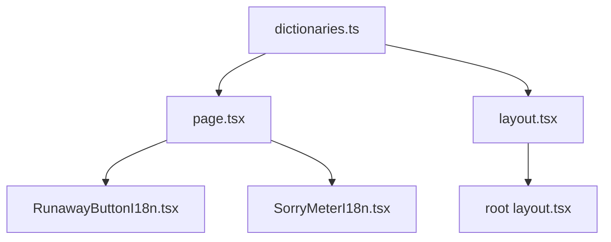

# Internationalization System

<cite>
**Referenced Files in This Document**
- [src/app/[lang]/dictionaries.ts](file://src/app/[lang]/dictionaries.ts)
- [src/app/[lang]/layout.tsx](file://src/app/[lang]/layout.tsx)
- [src/app/[lang]/page.tsx](file://src/app/[lang]/page.tsx)
- [src/app/[lang]/dictionaries/en.json](file://src/app/[lang]/dictionaries/en.json)
- [src/app/[lang]/dictionaries/ar.json](file://src/app/[lang]/dictionaries/ar.json)
- [src/app/[lang]/dictionaries/es.json](file://src/app/[lang]/dictionaries/es.json)
- [src/app/[lang]/dictionaries/fr.json](file://src/app/[lang]/dictionaries/fr.json)
- [src/app/[lang]/dictionaries/de.json](file://src/app/[lang]/dictionaries/de.json)
- [src/app/[lang]/dictionaries/ru.json](file://src/app/[lang]/dictionaries/ru.json)
- [src/app/[lang]/dictionaries/pt.json](file://src/app/[lang]/dictionaries/pt.json)
- [src/app/[lang]/dictionaries/tr.json](file://src/app/[lang]/dictionaries/tr.json)
- [src/app/[lang]/dictionaries/hi.json](file://src/app/[lang]/dictionaries/hi.json)
- [src/app/[lang]/dictionaries/ja.json](file://src/app/[lang]/dictionaries/ja.json)
- [src/app/[lang]/dictionaries/ko.json](file://src/app/[lang]/dictionaries/ko.json)
- [src/app/layout.tsx](file://src/app/layout.tsx)
- [src/components/RunawayButtonI18n.tsx](file://src/components/RunawayButtonI18n.tsx)
- [src/components/SorryMeterI18n.tsx](file://src/components/SorryMeterI18n.tsx)
</cite>

## Table of Contents
1. [Introduction](#introduction)
2. [Project Structure](#project-structure)
3. [Core Components](#core-components)
4. [Architecture Overview](#architecture-overview)
5. [Detailed Component Analysis](#detailed-component-analysis)
6. [Dependency Analysis](#dependency-analysis)
7. [Performance Considerations](#performance-considerations)
8. [Troubleshooting Guide](#troubleshooting-guide)
9. [Conclusion](#conclusion)
10. [Appendices](#appendices)

## Introduction
This document explains the internationalization (i18n) system for the multilingual apology platform. It covers dynamic dictionary loading based on URL locale parameters, the 11 supported languages (including Arabic as a right-to-left RTL language), locale detection and fallback mechanisms, runtime language switching capabilities, Next.js dynamic routing integration, canonical URL generation, RTL support, character encoding considerations, cultural adaptations, and SEO implications including hreflang attributes and localized metadata.

## Project Structure
The i18n system is organized around Next.js dynamic route segments and per-language JSON dictionaries:
- Dynamic route: `/[lang]` captures the locale from the URL
- Dictionary loader: a module mapping locales to lazy-loaded JSON modules
- Language-specific dictionaries: JSON files under `/dictionaries/<locale>.json`
- Layout and page: generate metadata, detect locales, and render content
- Components: consume dictionary entries for UI text

**Diagram sources**
- [src/app/[lang]/layout.tsx:10-66](file://src/app/[lang]/layout.tsx#L10-L66)
- [src/app/[lang]/page.tsx:12-31](file://src/app/[lang]/page.tsx#L12-L31)
- [src/app/[lang]/dictionaries.ts:3-25](file://src/app/[lang]/dictionaries.ts#L3-L25)

**Section sources**
- [src/app/[lang]/layout.tsx:1-108](file://src/app/[lang]/layout.tsx#L1-L108)
- [src/app/[lang]/page.tsx:1-32](file://src/app/[lang]/page.tsx#L1-L32)
- [src/app/[lang]/dictionaries.ts:1-26](file://src/app/[lang]/dictionaries.ts#L1-L26)

## Core Components
- Locale dictionary loader: maps locales to async imports of JSON files
- Locale registry: defines supported locales, default locale, and validation
- Dynamic route handler: validates locale, loads dictionary, renders content
- Metadata generator: builds localized SEO metadata and hreflang alternatives
- RTL detection: sets html dir attribute for right-to-left languages

Key responsibilities:
- On-demand loading: dictionaries are imported only when requested
- Validation: rejects unknown locales with a 404
- SEO: generates canonical and hreflang links for all locales
- Accessibility: sets proper lang and dir attributes

**Section sources**
- [src/app/[lang]/dictionaries.ts:3-25](file://src/app/[lang]/dictionaries.ts#L3-L25)
- [src/app/[lang]/layout.tsx:6-66](file://src/app/[lang]/layout.tsx#L6-L66)
- [src/app/[lang]/page.tsx:12-31](file://src/app/[lang]/page.tsx#L12-L31)

## Architecture Overview
The i18n pipeline integrates Next.js dynamic routing with on-demand dictionary loading and SEO metadata generation.

**Diagram sources**
- [src/app/[lang]/layout.tsx:10-66](file://src/app/[lang]/layout.tsx#L10-L66)
- [src/app/[lang]/page.tsx:12-31](file://src/app/[lang]/page.tsx#L12-L31)
- [src/app/[lang]/dictionaries.ts:25](file://src/app/[lang]/dictionaries.ts#L25)

## Detailed Component Analysis

### Dynamic Dictionary Loading Mechanism
The system uses a small registry mapping locales to async importers. Each locale resolves to a function that dynamically imports its JSON file and returns the default export (the dictionary object). This enables on-demand loading and avoids bundling all dictionaries at build time.

**Diagram sources**
- [src/app/[lang]/dictionaries.ts:3-25](file://src/app/[lang]/dictionaries.ts#L3-L25)
- [src/app/[lang]/page.tsx:16](file://src/app/[lang]/page.tsx#L16)

**Section sources**
- [src/app/[lang]/dictionaries.ts:3-25](file://src/app/[lang]/dictionaries.ts#L3-L25)

### Locale Detection and Validation
- Supported locales are defined in the registry and exposed as a typed union.
- The page and layout validate the incoming locale against the registry; invalid locales trigger a 404.
- A default locale is defined for internal fallbacks and static generation.

**Diagram sources**
- [src/app/[lang]/dictionaries.ts:22-23](file://src/app/[lang]/dictionaries.ts#L22-L23)
- [src/app/[lang]/page.tsx:14](file://src/app/[lang]/page.tsx#L14)
- [src/app/[lang]/layout.tsx:76](file://src/app/[lang]/layout.tsx#L76)

**Section sources**
- [src/app/[lang]/dictionaries.ts:17-23](file://src/app/[lang]/dictionaries.ts#L17-L23)
- [src/app/[lang]/page.tsx:12-16](file://src/app/[lang]/page.tsx#L12-L16)
- [src/app/[lang]/layout.tsx:68-78](file://src/app/[lang]/layout.tsx#L68-L78)

### Runtime Language Switching
The platform supports changing languages at runtime by navigating to a different locale URL. The dictionary loader remains unchanged; the new URL triggers a fresh render with the target locale’s dictionary. The layout applies the appropriate html dir attribute (ltr/rtl) based on the selected locale.

**Diagram sources**
- [src/app/[lang]/layout.tsx:78](file://src/app/[lang]/layout.tsx#L78)
- [src/app/[lang]/page.tsx:16](file://src/app/[lang]/page.tsx#L16)

**Section sources**
- [src/app/[lang]/layout.tsx:78](file://src/app/[lang]/layout.tsx#L78)
- [src/app/[lang]/page.tsx:12-31](file://src/app/[lang]/page.tsx#L12-L31)

### Next.js Dynamic Routing Integration
- The dynamic segment `[lang]` captures the locale from the URL.
- Static generation uses `generateStaticParams` to pre-render routes for all supported locales.
- The root layout delegates the HTML shell to the language-specific layout.

**Diagram sources**
- [src/app/[lang]/layout.tsx:6-8](file://src/app/[lang]/layout.tsx#L6-L8)
- [src/app/layout.tsx:1-9](file://src/app/layout.tsx#L1-L9)

**Section sources**
- [src/app/[lang]/layout.tsx:6-8](file://src/app/[lang]/layout.tsx#L6-L8)
- [src/app/layout.tsx:1-9](file://src/app/layout.tsx#L1-L9)

### Canonical URL Generation and hreflang
The metadata generator constructs:
- A canonical URL pointing to the base URL with the current locale path
- An alternates.languages map enumerating all locales with their URLs
- Open Graph and Twitter metadata localized using the dictionary

**Diagram sources**
- [src/app/[lang]/layout.tsx:19-31](file://src/app/[lang]/layout.tsx#L19-L31)

**Section sources**
- [src/app/[lang]/layout.tsx:10-66](file://src/app/[lang]/layout.tsx#L10-L66)

### Right-to-Left Language Support
Arabic is configured as the sole RTL language. The layout sets the html dir attribute to "rtl" when the locale is Arabic and "ltr" otherwise. This ensures proper text direction and alignment for Arabic content.

**Diagram sources**
- [src/app/[lang]/layout.tsx:78](file://src/app/[lang]/layout.tsx#L78)

**Section sources**
- [src/app/[lang]/layout.tsx:78](file://src/app/[lang]/layout.tsx#L78)

### Character Encoding and Cultural Adaptation
- All dictionaries are UTF-8 encoded JSON files, ensuring correct rendering of international characters.
- Cultural adaptations include localized metaphors, idioms, and UI phrasing (e.g., tone, emoji choices, and humor styles) present in each dictionary.

**Section sources**
- [src/app/[lang]/dictionaries/en.json:1-150](file://src/app/[lang]/dictionaries/en.json#L1-L150)
- [src/app/[lang]/dictionaries/ar.json:1-88](file://src/app/[lang]/dictionaries/ar.json#L1-L88)
- [src/app/[lang]/dictionaries/es.json:1-88](file://src/app/[lang]/dictionaries/es.json#L1-L88)
- [src/app/[lang]/dictionaries/fr.json:1-88](file://src/app/[lang]/dictionaries/fr.json#L1-L88)
- [src/app/[lang]/dictionaries/de.json:1-88](file://src/app/[lang]/dictionaries/de.json#L1-L88)
- [src/app/[lang]/dictionaries/ru.json:1-88](file://src/app/[lang]/dictionaries/ru.json#L1-L88)
- [src/app/[lang]/dictionaries/pt.json:1-88](file://src/app/[lang]/dictionaries/pt.json#L1-L88)
- [src/app/[lang]/dictionaries/tr.json:1-88](file://src/app/[lang]/dictionaries/tr.json#L1-L88)
- [src/app/[lang]/dictionaries/hi.json:1-88](file://src/app/[lang]/dictionaries/hi.json#L1-L88)
- [src/app/[lang]/dictionaries/ja.json](file://src/app/[lang]/dictionaries/ja.json)
- [src/app/[lang]/dictionaries/ko.json](file://src/app/[lang]/dictionaries/ko.json)

### Supported Languages and Dictionary Structure
The system supports 11 languages. Each dictionary follows a consistent structure with keys for meta, hero, meter, reasons, promises, forgive, music, footer, landing, and FAQ content.

Supported locales: English, Russian, Spanish, Portuguese, French, German, Turkish, Arabic, Hindi, Japanese, Korean.

Dictionary structure outline:
- meta: title, description, keywords
- hero: subtitle, nameLabel, namePlaceholder, heading, subtext, scrollHint
- meter: title, label, low, mid, high, error, footnote
- reasons: title, items[] with emoji, title, text
- promises: title, subtitle, items[]
- forgive: title, question, yes[], no[], hint, success, successSub
- music: on, off
- footer: madeWith, copyright
- landing: h1, h2_1, p1, h2_2, steps[], h2_3, features[], h2_faq, faq[], cta
- Additional locale-specific keys as needed

Examples of dictionary files:
- English: [src/app/[lang]/dictionaries/en.json](file://src/app/[lang]/dictionaries/en.json)
- Arabic: [src/app/[lang]/dictionaries/ar.json](file://src/app/[lang]/dictionaries/ar.json)
- Spanish: [src/app/[lang]/dictionaries/es.json](file://src/app/[lang]/dictionaries/es.json)
- French: [src/app/[lang]/dictionaries/fr.json](file://src/app/[lang]/dictionaries/fr.json)
- German: [src/app/[lang]/dictionaries/de.json](file://src/app/[lang]/dictionaries/de.json)
- Russian: [src/app/[lang]/dictionaries/ru.json](file://src/app/[lang]/dictionaries/ru.json)
- Portuguese: [src/app/[lang]/dictionaries/pt.json](file://src/app/[lang]/dictionaries/pt.json)
- Turkish: [src/app/[lang]/dictionaries/tr.json](file://src/app/[lang]/dictionaries/tr.json)
- Hindi: [src/app/[lang]/dictionaries/hi.json](file://src/app/[lang]/dictionaries/hi.json)
- Japanese: [src/app/[lang]/dictionaries/ja.json](file://src/app/[lang]/dictionaries/ja.json)
- Korean: [src/app/[lang]/dictionaries/ko.json](file://src/app/[lang]/dictionaries/ko.json)

**Section sources**
- [src/app/[lang]/dictionaries.ts:3-15](file://src/app/[lang]/dictionaries.ts#L3-L15)
- [src/app/[lang]/dictionaries/en.json:1-150](file://src/app/[lang]/dictionaries/en.json#L1-L150)
- [src/app/[lang]/dictionaries/ar.json:1-88](file://src/app/[lang]/dictionaries/ar.json#L1-L88)

### Component Integration with Dictionaries
Components receive dictionary fragments via props and render localized text:
- RunawayButtonI18n consumes question, yes[], no[], hint, success, successSub
- SorryMeterI18n consumes label, low, mid, high, error

**Diagram sources**
- [src/components/RunawayButtonI18n.tsx:8-18](file://src/components/RunawayButtonI18n.tsx#L8-L18)
- [src/components/SorryMeterI18n.tsx:7-15](file://src/components/SorryMeterI18n.tsx#L7-L15)
- [src/app/[lang]/page.tsx:16](file://src/app/[lang]/page.tsx#L16)

**Section sources**
- [src/components/RunawayButtonI18n.tsx:20-156](file://src/components/RunawayButtonI18n.tsx#L20-L156)
- [src/components/SorryMeterI18n.tsx:17-102](file://src/components/SorryMeterI18n.tsx#L17-L102)
- [src/app/[lang]/page.tsx:12-31](file://src/app/[lang]/page.tsx#L12-L31)

## Dependency Analysis
The i18n system exhibits clear separation of concerns:
- dictionaries.ts: central registry and loader
- layout.tsx: metadata and HTML shell (lang/dir)
- page.tsx: route handler and dictionary consumer
- components: UI consumers of dictionary fragments
- root layout.tsx: minimal wrapper delegating to language layout

**Diagram sources**
- [src/app/[lang]/dictionaries.ts:3-25](file://src/app/[lang]/dictionaries.ts#L3-L25)
- [src/app/[lang]/page.tsx:12-31](file://src/app/[lang]/page.tsx#L12-L31)
- [src/app/[lang]/layout.tsx:1-108](file://src/app/[lang]/layout.tsx#L1-L108)
- [src/app/layout.tsx:1-9](file://src/app/layout.tsx#L1-L9)
- [src/components/RunawayButtonI18n.tsx:1-156](file://src/components/RunawayButtonI18n.tsx#L1-L156)
- [src/components/SorryMeterI18n.tsx:1-102](file://src/components/SorryMeterI18n.tsx#L1-L102)

**Section sources**
- [src/app/[lang]/dictionaries.ts:3-25](file://src/app/[lang]/dictionaries.ts#L3-L25)
- [src/app/[lang]/layout.tsx:1-108](file://src/app/[lang]/layout.tsx#L1-L108)
- [src/app/[lang]/page.tsx:12-31](file://src/app/[lang]/page.tsx#L12-L31)
- [src/app/layout.tsx:1-9](file://src/app/layout.tsx#L1-L9)

## Performance Considerations
- On-demand loading: dictionaries are imported only when needed, reducing initial bundle size.
- Static generation: generateStaticParams pre-renders all locale routes, improving first-load performance.
- Minimal overhead: dictionary access is a simple lookup and async import; keep dictionary keys shallow and avoid deep nesting to minimize parsing costs.
- CDN caching: canonical and hreflang metadata enable efficient caching and indexing across locales.

[No sources needed since this section provides general guidance]

## Troubleshooting Guide
Common issues and resolutions:
- Unknown locale: If a locale is not in the registry, the route triggers a 404. Ensure the locale is included in the registry and generateStaticParams.
- Missing dictionary keys: If a component expects a key not present in the dictionary, it will render empty or undefined text. Validate dictionary completeness per locale.
- RTL layout problems: Verify that Arabic is handled separately for html dir and consider CSS directionality resets for mixed-content containers.
- Metadata inconsistencies: Confirm that generateMetadata loads the dictionary for the current locale and that alternates.languages includes all supported locales.

**Section sources**
- [src/app/[lang]/dictionaries.ts:22-23](file://src/app/[lang]/dictionaries.ts#L22-L23)
- [src/app/[lang]/layout.tsx:19-31](file://src/app/[lang]/layout.tsx#L19-L31)
- [src/app/[lang]/page.tsx:14](file://src/app/[lang]/page.tsx#L14)

## Conclusion
The platform’s i18n system leverages Next.js dynamic routing and on-demand dictionary loading to deliver a scalable, SEO-friendly multilingual experience. With 11 supported languages, robust metadata generation, and explicit RTL handling for Arabic, the system balances performance, maintainability, and user experience across diverse markets.

[No sources needed since this section summarizes without analyzing specific files]

## Appendices

### SEO Implications and Best Practices
- Canonical URLs: Each locale has a canonical URL derived from the base URL plus the locale path.
- Hreflang: Alternates.languages enumerates all locales with their respective URLs, aiding search engines in serving the correct language variant.
- Localized metadata: Titles, descriptions, and keywords are localized using the dictionary, improving relevance and click-through rates.
- Structured data: The layout injects structured data with the current locale URL to enhance rich results.

**Section sources**
- [src/app/[lang]/layout.tsx:19-65](file://src/app/[lang]/layout.tsx#L19-L65)