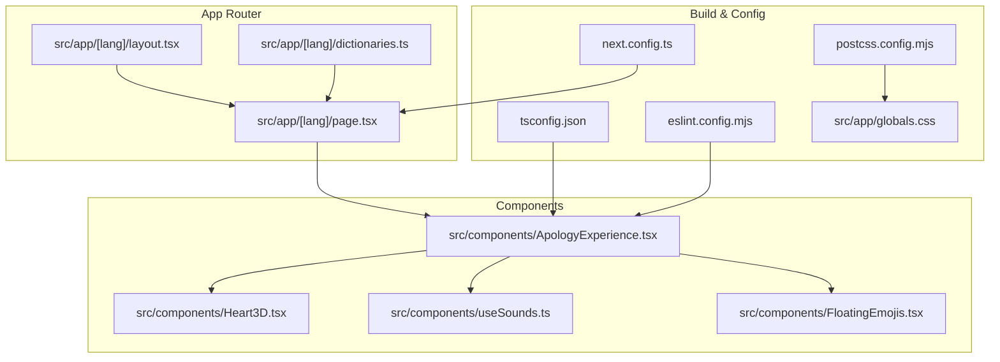
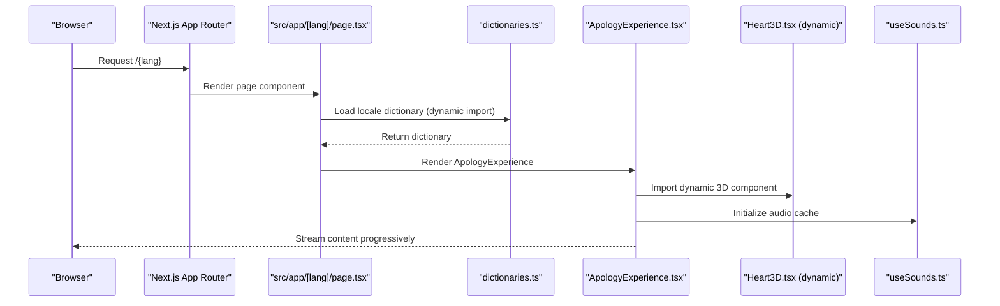
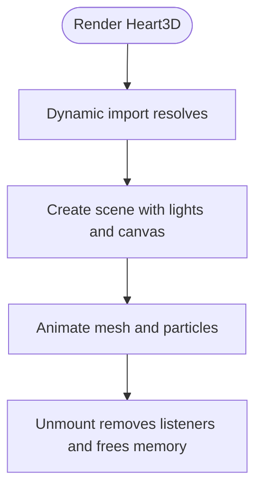
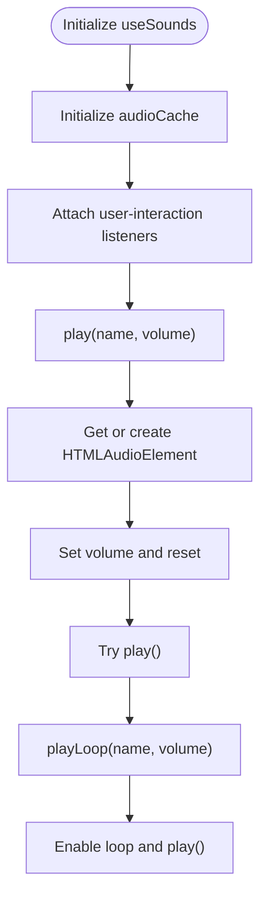
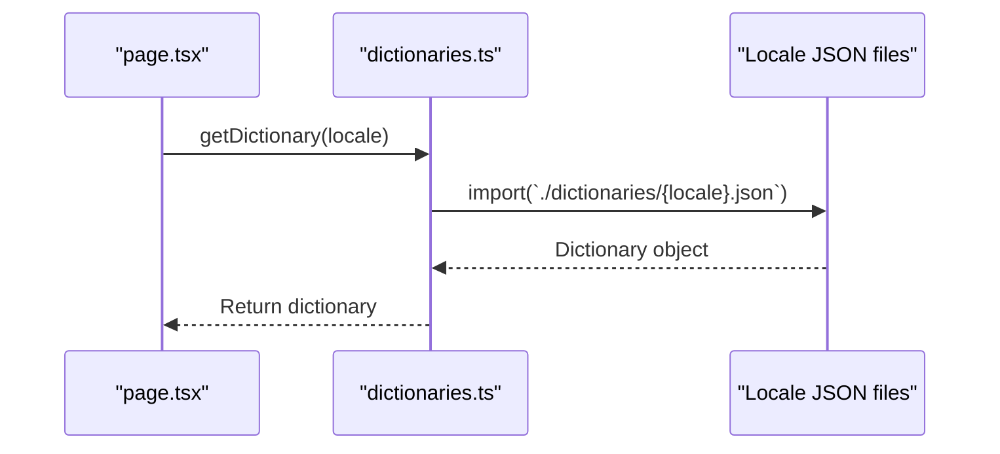
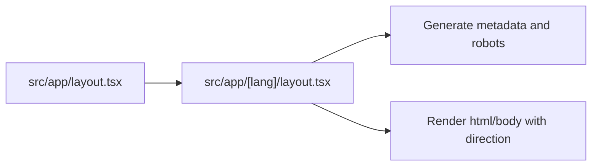
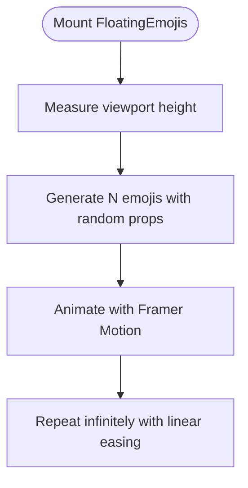
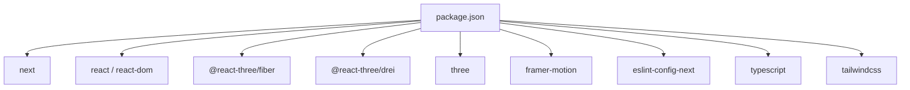

# Performance Architecture

<cite>
**Referenced Files in This Document**
- [next.config.ts](file://next.config.ts)
- [tsconfig.json](file://tsconfig.json)
- [package.json](file://package.json)
- [eslint.config.mjs](file://eslint.config.mjs)
- [postcss.config.mjs](file://postcss.config.mjs)
- [src/app/[lang]/layout.tsx](file://src/app/[lang]/layout.tsx)
- [src/app/[lang]/page.tsx](file://src/app/[lang]/page.tsx)
- [src/app/[lang]/dictionaries.ts](file://src/app/[lang]/dictionaries.ts)
- [src/app/layout.tsx](file://src/app/layout.tsx)
- [src/app/globals.css](file://src/app/globals.css)
- [src/components/ApologyExperience.tsx](file://src/components/ApologyExperience.tsx)
- [src/components/Heart3D.tsx](file://src/components/Heart3D.tsx)
- [src/components/useSounds.ts](file://src/components/useSounds.ts)
- [src/components/FloatingEmojis.tsx](file://src/components/FloatingEmojis.tsx)
</cite>

## Table of Contents
1. [Introduction](#introduction)
2. [Project Structure](#project-structure)
3. [Core Components](#core-components)
4. [Architecture Overview](#architecture-overview)
5. [Detailed Component Analysis](#detailed-component-analysis)
6. [Dependency Analysis](#dependency-analysis)
7. [Performance Considerations](#performance-considerations)
8. [Troubleshooting Guide](#troubleshooting-guide)
9. [Conclusion](#conclusion)

## Introduction
This document describes the performance architecture of the interactive apology platform built with Next.js. It focuses on optimization strategies enabled by the framework and the codebase, including automatic code splitting, dynamic imports for 3D components, lazy-loading patterns, bundle optimization, asset compression, CDN integration strategies, audio resource management, 3D graphics optimization, TypeScript configuration, linting and formatting, and monitoring approaches.

## Project Structure
The project follows Next.js App Router conventions with locale-aware static generation and per-route internationalization. Key performance-relevant areas:
- App Shell and Routing: Root and language-specific layouts, static generation of locales, and route-level metadata.
- Internationalization: Dynamic imports of locale dictionaries for on-demand loading.
- UI and Animations: Framer Motion for lightweight DOM animations; Three.js via @react-three/fiber for GPU-accelerated 3D rendering.
- Assets: Static assets under public/, including audio and web app manifest.
- Build Toolchain: TypeScript compiler options, ESLint configuration aligned with Next.js, Tailwind PostCSS pipeline.

**Diagram sources**
- [src/app/[lang]/layout.tsx](file://src/app/[lang]/layout.tsx#L1-L108)
- [src/app/[lang]/page.tsx](file://src/app/[lang]/page.tsx#L1-L32)
- [src/app/[lang]/dictionaries.ts](file://src/app/[lang]/dictionaries.ts#L1-L26)
- [src/components/ApologyExperience.tsx:1-219](file://src/components/ApologyExperience.tsx#L1-L219)
- [src/components/Heart3D.tsx:1-107](file://src/components/Heart3D.tsx#L1-L107)
- [src/components/useSounds.ts:1-69](file://src/components/useSounds.ts#L1-L69)
- [src/components/FloatingEmojis.tsx:1-64](file://src/components/FloatingEmojis.tsx#L1-L64)
- [next.config.ts:1-8](file://next.config.ts#L1-L8)
- [tsconfig.json:1-35](file://tsconfig.json#L1-L35)
- [eslint.config.mjs:1-19](file://eslint.config.mjs#L1-L19)
- [postcss.config.mjs:1-8](file://postcss.config.mjs#L1-L8)
- [src/app/globals.css:1-42](file://src/app/globals.css#L1-L42)

**Section sources**
- [src/app/[lang]/layout.tsx](file://src/app/[lang]/layout.tsx#L1-L108)
- [src/app/[lang]/page.tsx](file://src/app/[lang]/page.tsx#L1-L32)
- [src/app/[lang]/dictionaries.ts](file://src/app/[lang]/dictionaries.ts#L1-L26)
- [src/app/layout.tsx:1-9](file://src/app/layout.tsx#L1-L9)
- [src/app/globals.css:1-42](file://src/app/globals.css#L1-L42)
- [next.config.ts:1-8](file://next.config.ts#L1-L8)
- [tsconfig.json:1-35](file://tsconfig.json#L1-L35)
- [eslint.config.mjs:1-19](file://eslint.config.mjs#L1-L19)
- [postcss.config.mjs:1-8](file://postcss.config.mjs#L1-L8)

## Core Components
- Dynamic 3D Component: The Heart3D component is loaded dynamically on the client to avoid SSR overhead and reduce initial bundle size.
- Lazy Dictionary Loading: Locale dictionaries are imported dynamically to load only the required language resources.
- Client-Side Hooks: useSounds centralizes audio playback and caching; FloatingEmojis generates lightweight animated DOM elements.
- Animation Engine: Framer Motion handles DOM animations with reduced JS overhead compared to heavy animation libraries.
- Asset Pipeline: Tailwind CSS via PostCSS and a minimal CSS baseline for efficient styling.

**Section sources**
- [src/components/ApologyExperience.tsx:1-219](file://src/components/ApologyExperience.tsx#L1-L219)
- [src/components/Heart3D.tsx:1-107](file://src/components/Heart3D.tsx#L1-L107)
- [src/components/useSounds.ts:1-69](file://src/components/useSounds.ts#L1-L69)
- [src/components/FloatingEmojis.tsx:1-64](file://src/components/FloatingEmojis.tsx#L1-L64)
- [src/app/[lang]/dictionaries.ts](file://src/app/[lang]/dictionaries.ts#L1-L26)

## Architecture Overview
The platform leverages Next.js’s automatic code splitting and dynamic imports to minimize the initial payload. Route-level static generation reduces server load, while per-locale dictionaries ensure only needed translations are fetched. The 3D experience is isolated to a single dynamic component, keeping the rest of the UI lightweight. Audio resources are cached globally to avoid redundant network requests and improve responsiveness.

**Diagram sources**
- [src/app/[lang]/page.tsx](file://src/app/[lang]/page.tsx#L1-L32)
- [src/app/[lang]/dictionaries.ts](file://src/app/[lang]/dictionaries.ts#L1-L26)
- [src/components/ApologyExperience.tsx:1-219](file://src/components/ApologyExperience.tsx#L1-L219)
- [src/components/Heart3D.tsx:1-107](file://src/components/Heart3D.tsx#L1-L107)
- [src/components/useSounds.ts:1-69](file://src/components/useSounds.ts#L1-L69)

## Detailed Component Analysis

### Dynamic 3D Component (Heart3D)
- Dynamic import ensures the 3D bundle loads only when the component is rendered.
- Client-only rendering avoids SSR overhead and keeps the server response small.
- Frame loop runs continuously but is scoped to a small viewport area, minimizing GPU pressure.
- Geometry and material parameters are tuned for readability and performance.

**Diagram sources**
- [src/components/Heart3D.tsx:1-107](file://src/components/Heart3D.tsx#L1-L107)

**Section sources**
- [src/components/Heart3D.tsx:1-107](file://src/components/Heart3D.tsx#L1-L107)
- [src/components/ApologyExperience.tsx:12-12](file://src/components/ApologyExperience.tsx#L12-L12)

### Audio Resource Management (useSounds)
- Global audio cache prevents duplicate instances and reduces memory churn.
- Autoplay policy compliance: tracks first user interaction events and gates looping audio until interaction occurs.
- Preload-friendly design: audio resources are referenced by static paths and streamed via HTMLAudioElement.

**Diagram sources**
- [src/components/useSounds.ts:1-69](file://src/components/useSounds.ts#L1-L69)

**Section sources**
- [src/components/useSounds.ts:1-69](file://src/components/useSounds.ts#L1-L69)

### Internationalization and Lazy Loading (dictionaries.ts)
- Locale dictionaries are resolved via dynamic imports, ensuring only requested language bundles are downloaded.
- Static generation of locales supports fast cold starts and CDN caching.

**Diagram sources**
- [src/app/[lang]/dictionaries.ts](file://src/app/[lang]/dictionaries.ts#L1-L26)
- [src/app/[lang]/page.tsx](file://src/app/[lang]/page.tsx#L16-L16)

**Section sources**
- [src/app/[lang]/dictionaries.ts](file://src/app/[lang]/dictionaries.ts#L1-L26)
- [src/app/[lang]/page.tsx](file://src/app/[lang]/page.tsx#L1-L32)

### Layout and Metadata (Root and Language Layout)
- Root layout is minimal to reduce overhead.
- Language layout sets metadata, canonical URLs, and Open Graph tags for SEO and social sharing.
- Static generation of locales improves caching and reduces server load.

**Diagram sources**
- [src/app/layout.tsx:1-9](file://src/app/layout.tsx#L1-L9)
- [src/app/[lang]/layout.tsx](file://src/app/[lang]/layout.tsx#L1-L108)

**Section sources**
- [src/app/layout.tsx:1-9](file://src/app/layout.tsx#L1-L9)
- [src/app/[lang]/layout.tsx](file://src/app/[lang]/layout.tsx#L1-L108)

### Animation and Effects (FloatingEmojis)
- Generates a small, responsive set of floating emojis with motion primitives.
- Reduces count on smaller screens to limit DOM nodes and animation work.

**Diagram sources**
- [src/components/FloatingEmojis.tsx:1-64](file://src/components/FloatingEmojis.tsx#L1-L64)

**Section sources**
- [src/components/FloatingEmojis.tsx:1-64](file://src/components/FloatingEmojis.tsx#L1-L64)

## Dependency Analysis
- Runtime dependencies include Next.js, React, Framer Motion, three.js, and @react-three/fiber for 3D rendering.
- Dev dependencies include ESLint, Tailwind PostCSS plugin, and TypeScript for type safety and linting.
- The build pipeline integrates Tailwind via PostCSS and TypeScript compilation with strict checks.

**Diagram sources**
- [package.json:1-36](file://package.json#L1-L36)

**Section sources**
- [package.json:1-36](file://package.json#L1-L36)

## Performance Considerations

### Next.js Optimization Strategies
- Automatic code splitting: Dynamic imports for 3D components and locale dictionaries ensure only required code is sent to the client.
- Client-side rendering for 3D: Keeps server-rendered pages lean and defers heavy WebGL initialization to the client.
- Static generation of locales: Improves caching and reduces server-side processing.

**Section sources**
- [src/components/ApologyExperience.tsx:12-12](file://src/components/ApologyExperience.tsx#L12-L12)
- [src/app/[lang]/dictionaries.ts](file://src/app/[lang]/dictionaries.ts#L1-L26)
- [src/app/[lang]/layout.tsx](file://src/app/[lang]/layout.tsx#L6-L8)

### Bundle Optimization and Asset Compression
- Minimal root layout and CSS baseline reduce initial CSS payload.
- Tailwind PostCSS pipeline compiles and purges unused styles; ensure production builds purge unused classes.
- Public assets (audio, manifest) are served uncompressed by default; enable gzip/brotli on the server or CDN.

**Section sources**
- [src/app/layout.tsx:1-9](file://src/app/layout.tsx#L1-L9)
- [src/app/globals.css:1-42](file://src/app/globals.css#L1-L42)
- [postcss.config.mjs:1-8](file://postcss.config.mjs#L1-L8)

### CDN Integration Strategies
- Canonical URLs and alternate languages support multi-region caching.
- Static generation of locales enables long-lived cache headers for locale pages.
- Consider hosting public assets on a CDN with appropriate cache-control headers.

**Section sources**
- [src/app/[lang]/layout.tsx](file://src/app/[lang]/layout.tsx#L19-L65)

### Audio Resource Management
- Global audio cache: Reuses HTMLAudioElement instances to avoid repeated network fetches and reduce GC pressure.
- Autoplay policy compliance: Tracks first user interaction to gate looping audio after initial engagement.
- Preload strategies: Keep audio files small and seekable; consider preloading short intro sounds on interaction.

**Section sources**
- [src/components/useSounds.ts:14-27](file://src/components/useSounds.ts#L14-L27)
- [src/components/useSounds.ts:29-39](file://src/components/useSounds.ts#L29-L39)
- [src/components/useSounds.ts:51-57](file://src/components/useSounds.ts#L51-L57)

### 3D Graphics Optimization
- Geometry simplification: Heart shape uses a simple extruded profile with modest bevel segments.
- Material tuning: Metalness and roughness values balance realism with performance.
- Frame loop control: Canvas uses continuous frame updates; keep viewport small and limit particle counts.
- Lighting: Ambient and directional lights keep shading efficient; avoid excessive shadow calculations.

**Section sources**
- [src/components/Heart3D.tsx:33-47](file://src/components/Heart3D.tsx#L33-L47)
- [src/components/Heart3D.tsx:90-103](file://src/components/Heart3D.tsx#L90-L103)

### TypeScript Configuration
- Strict type checking: Enabled for safer refactors and earlier bug detection.
- Bundler module resolution: Uses bundler for modern ESM handling.
- Incremental builds: Speed up development rebuilds.
- Path aliases: Simplifies imports and improves maintainability.

**Section sources**
- [tsconfig.json:6-23](file://tsconfig.json#L6-L23)

### Linting and Formatting
- ESLint configured with Next.js core-web-vitals and TypeScript presets.
- Overrides remove default ignores for local development convenience.
- Enforce performance-conscious rules (e.g., no-unused-vars, restrict-plus-operands) to maintain clean code.

**Section sources**
- [eslint.config.mjs:1-19](file://eslint.config.mjs#L1-L19)

### Monitoring and Metrics
- Core Web Vitals: Integrated via ESLint preset; monitor Largest Contentful Paint, First Input Delay, and Cumulative Layout Shift.
- Build-time metrics: Use Next.js telemetry or external tools to track bundle sizes and asset counts.
- Runtime metrics: Add lightweight analytics for audio interactions and 3D component load timing.

[No sources needed since this section provides general guidance]

## Troubleshooting Guide
- 3D component not rendering:
  - Verify dynamic import path and client directive.
  - Confirm Canvas is mounted within a client component and device supports WebGL.
- Audio does not play:
  - Ensure user interaction occurred before enabling looping audio.
  - Check browser autoplay policies and network errors for audio files.
- Excessive bundle size:
  - Audit dynamic imports and locale dictionaries.
  - Enable gzip/brotli and review Tailwind purging in production.
- Slow animations:
  - Reduce emoji count on small screens.
  - Limit 3D particle count and simplify geometry.

**Section sources**
- [src/components/Heart3D.tsx:1-107](file://src/components/Heart3D.tsx#L1-L107)
- [src/components/useSounds.ts:14-27](file://src/components/useSounds.ts#L14-L27)
- [src/components/FloatingEmojis.tsx:23-24](file://src/components/FloatingEmojis.tsx#L23-L24)

## Conclusion
The platform achieves strong performance through strategic use of Next.js’s automatic code splitting, dynamic imports for 3D content, and locale-specific dictionary loading. Audio caching and autoplay policy compliance improve user experience and accessibility. The 3D scene is optimized for simplicity and efficiency, while TypeScript and ESLint configurations enforce code quality. With CDN and asset compression enabled, the runtime remains responsive and scalable.