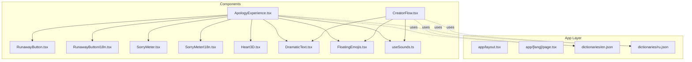
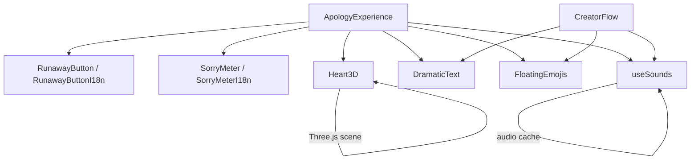
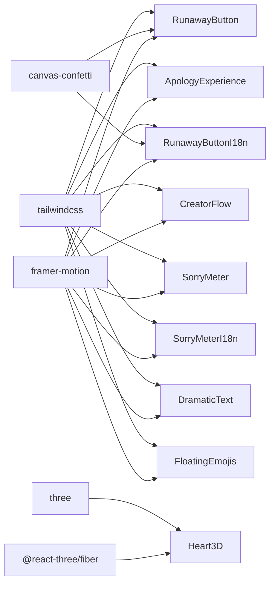

# Component Library

<cite>
**Referenced Files in This Document**
- [ApologyExperience.tsx](file://src/components/ApologyExperience.tsx)
- [CreatorFlow.tsx](file://src/components/CreatorFlow.tsx)
- [RunawayButton.tsx](file://src/components/RunawayButton.tsx)
- [RunawayButtonI18n.tsx](file://src/components/RunawayButtonI18n.tsx)
- [SorryMeter.tsx](file://src/components/SorryMeter.tsx)
- [SorryMeterI18n.tsx](file://src/components/SorryMeterI18n.tsx)
- [Heart3D.tsx](file://src/components/Heart3D.tsx)
- [DramaticText.tsx](file://src/components/DramaticText.tsx)
- [FloatingEmojis.tsx](file://src/components/FloatingEmojis.tsx)
- [useSounds.ts](file://src/components/useSounds.ts)
- [globals.css](file://src/app/globals.css)
- [package.json](file://package.json)
- [en.json](file://src/app/[lang]/dictionaries/en.json)
- [ru.json](file://src/app/[lang]/dictionaries/ru.json)
</cite>

## Table of Contents
1. [Introduction](#introduction)
2. [Project Structure](#project-structure)
3. [Core Components](#core-components)
4. [Architecture Overview](#architecture-overview)
5. [Detailed Component Analysis](#detailed-component-analysis)
6. [Dependency Analysis](#dependency-analysis)
7. [Performance Considerations](#performance-considerations)
8. [Troubleshooting Guide](#troubleshooting-guide)
9. [Conclusion](#conclusion)
10. [Appendices](#appendices)

## Introduction
This document describes the reusable component library that powers the I Am Really Sorry platform. It focuses on the ApologyExperience, CreatorFlow, RunawayButton variants, SorryMeter components, Heart3D visualization, and supporting animation components. For each component, you will find visual appearance, behavior, user interaction patterns, props/attributes, events, customization options, usage examples, integration patterns, lifecycle management, state management, theming, accessibility, and performance guidance.

## Project Structure
The component library is organized around feature-focused React components with shared animation and audio utilities. Internationalization is handled via per-language dictionary files. Styling leverages Tailwind CSS and global theme variables.

**Diagram sources**
- [ApologyExperience.tsx:1-219](file://src/components/ApologyExperience.tsx#L1-L219)
- [CreatorFlow.tsx:1-335](file://src/components/CreatorFlow.tsx#L1-L335)
- [RunawayButton.tsx:1-184](file://src/components/RunawayButton.tsx#L1-L184)
- [RunawayButtonI18n.tsx:1-156](file://src/components/RunawayButtonI18n.tsx#L1-L156)
- [SorryMeter.tsx:1-100](file://src/components/SorryMeter.tsx#L1-L100)
- [SorryMeterI18n.tsx:1-102](file://src/components/SorryMeterI18n.tsx#L1-L102)
- [Heart3D.tsx:1-107](file://src/components/Heart3D.tsx#L1-L107)
- [DramaticText.tsx:1-43](file://src/components/DramaticText.tsx#L1-L43)
- [FloatingEmojis.tsx:1-64](file://src/components/FloatingEmojis.tsx#L1-L64)
- [useSounds.ts:1-69](file://src/components/useSounds.ts#L1-L69)
- [en.json:1-88](file://src/app/[lang]/dictionaries/en.json#L1-L88)
- [ru.json:1-88](file://src/app/[lang]/dictionaries/ru.json#L1-L88)

**Section sources**
- [ApologyExperience.tsx:1-219](file://src/components/ApologyExperience.tsx#L1-L219)
- [CreatorFlow.tsx:1-335](file://src/components/CreatorFlow.tsx#L1-L335)
- [useSounds.ts:1-69](file://src/components/useSounds.ts#L1-L69)
- [globals.css:1-42](file://src/app/globals.css#L1-L42)
- [package.json:1-36](file://package.json#L1-L36)

## Core Components
- ApologyExperience: Orchestrates the full apology experience, integrating Hero, Sorry Meter, Reasons, Promises, and the Forgiveness flow. Uses dynamic imports for 3D visuals and Framer Motion for animations.
- CreatorFlow: A guided wizard to create a personalized apology page, generating a shareable link with language and recipient selection.
- RunawayButton variants: Interactive buttons with a “No” that runs away and a “Yes” that grows larger; localized versions accept dictionary props.
- SorryMeter variants: Animated progress indicator with a “breaking past 100%” effect and optional sound cue.
- Heart3D: A 3D animated heart rendered with @react-three/fiber and Three.js, with floating particles.
- Supporting animations: DramaticText for word-by-word entrance, FloatingEmojis for ambient floating emoji effects, and useSounds for audio playback.

**Section sources**
- [ApologyExperience.tsx:32-219](file://src/components/ApologyExperience.tsx#L32-L219)
- [CreatorFlow.tsx:44-335](file://src/components/CreatorFlow.tsx#L44-L335)
- [RunawayButton.tsx:8-184](file://src/components/RunawayButton.tsx#L8-L184)
- [RunawayButtonI18n.tsx:20-156](file://src/components/RunawayButtonI18n.tsx#L20-L156)
- [SorryMeter.tsx:7-100](file://src/components/SorryMeter.tsx#L7-L100)
- [SorryMeterI18n.tsx:17-102](file://src/components/SorryMeterI18n.tsx#L17-L102)
- [Heart3D.tsx:87-107](file://src/components/Heart3D.tsx#L87-L107)
- [DramaticText.tsx:12-43](file://src/components/DramaticText.tsx#L12-L43)
- [FloatingEmojis.tsx:15-64](file://src/components/FloatingEmojis.tsx#L15-L64)
- [useSounds.ts:41-69](file://src/components/useSounds.ts#L41-L69)

## Architecture Overview
The components are client-side React components integrated with:
- Animation: Framer Motion for declarative animations and viewport-triggered effects.
- 3D rendering: @react-three/fiber and Three.js for interactive 3D scenes.
- Audio: Shared audio cache and playback utilities with user-interaction gating.
- Theming: Tailwind utilities and CSS variables for consistent dark theme and gradients.
- Internationalization: Dictionary-driven props passed into components to render localized content.

**Diagram sources**
- [ApologyExperience.tsx:1-219](file://src/components/ApologyExperience.tsx#L1-L219)
- [CreatorFlow.tsx:1-335](file://src/components/CreatorFlow.tsx#L1-L335)
- [useSounds.ts:1-69](file://src/components/useSounds.ts#L1-L69)
- [Heart3D.tsx:1-107](file://src/components/Heart3D.tsx#L1-L107)

## Detailed Component Analysis

### ApologyExperience
- Purpose: Full-page apology experience with Hero, interactive meter, reasons, promises, and forgiveness flow.
- Props:
  - dict: Dictionary object containing keys for hero, meter, reasons, promises, forgive, music, footer, and landing.
  - name?: string (optional recipient name).
  - lang: string (used for future features).
  - isReceiver?: boolean (placeholder for receiver-specific behavior).
- Behavior:
  - Toggles background music loop via useSounds.
  - Renders a Hero section with gradient text and floating emojis.
  - Displays a localized SorryMeter and reasons/promises cards with staggered viewport animations.
  - Integrates RunawayButtonI18n for the forgiveness prompt.
  - Includes a persistent music toggle with Framer Motion entrance.
- States:
  - musicPlaying: boolean toggled by the music button.
- Animations/transitions:
  - Hero entrance with spring scaling and staggered text.
  - Floating heart 3D scene.
  - Staggered card reveals and hover effects.
  - Persistent bounce hint for scrolling.
- Accessibility:
  - Ensure sufficient color contrast for gradient text and backgrounds.
  - Provide keyboard focus styles for interactive elements.
- Customization:
  - Theme via Tailwind classes and CSS variables.
  - Replace Heart3D with a lighter fallback if needed.
- Integration:
  - Consumed by app/[lang]/page.tsx and driven by dictionaries.

**Section sources**
- [ApologyExperience.tsx:25-30](file://src/components/ApologyExperience.tsx#L25-L30)
- [ApologyExperience.tsx:39-46](file://src/components/ApologyExperience.tsx#L39-L46)
- [ApologyExperience.tsx:65-105](file://src/components/ApologyExperience.tsx#L65-L105)
- [ApologyExperience.tsx:119-134](file://src/components/ApologyExperience.tsx#L119-L134)
- [ApologyExperience.tsx:137-162](file://src/components/ApologyExperience.tsx#L137-L162)
- [ApologyExperience.tsx:165-200](file://src/components/ApologyExperience.tsx#L165-L200)
- [ApologyExperience.tsx:203-210](file://src/components/ApologyExperience.tsx#L203-L210)
- [ApologyExperience.tsx:107-107](file://src/components/ApologyExperience.tsx#L107-L107)

### CreatorFlow
- Purpose: Wizard to create a personalized apology page link.
- Props:
  - lang: string (initial language selection).
- Steps:
  - Step 0: Intro screen with animated emoji.
  - Step 1: Scenario selection with contextual reactions.
  - Step 2: Recipient name input.
  - Step 3: Language selection among supported locales.
  - Step 4: Generated link display with copy-to-clipboard and preview actions.
- States:
  - step: number (0–4).
  - scenario: string.
  - name: string.
  - selectedLang: string.
  - generatedLink: string.
  - copied: boolean.
- Animations/transitions:
  - AnimatePresence with exit/enter transitions between steps.
  - Hover/tap animations on buttons.
  - Spring-based entrance for result screen.
- Accessibility:
  - Ensure focus management across steps.
  - Provide visible focus indicators for buttons and inputs.
- Customization:
  - Add/remove languages/scenarios by editing static arrays.
- Integration:
  - Driven by dictionaries for localized prompts and options.

**Section sources**
- [CreatorFlow.tsx:40-42](file://src/components/CreatorFlow.tsx#L40-L42)
- [CreatorFlow.tsx:44-57](file://src/components/CreatorFlow.tsx#L44-L57)
- [CreatorFlow.tsx:104-159](file://src/components/CreatorFlow.tsx#L104-L159)
- [CreatorFlow.tsx:161-205](file://src/components/CreatorFlow.tsx#L161-L205)
- [CreatorFlow.tsx:207-253](file://src/components/CreatorFlow.tsx#L207-L253)
- [CreatorFlow.tsx:255-330](file://src/components/CreatorFlow.tsx#L255-L330)

### RunawayButton (Russian)
- Purpose: Interactive forgiveness prompt with a “Yes” that grows and a “No” that runs away.
- Props: None (hardcoded Russian text and assets).
- Behavior:
  - On “No” hover/touch/click: random movement within container bounds, decreasing size, increasing “noAttempts”.
  - On “Yes”: triggers confetti explosion, stops music, displays success message.
- States:
  - noPosition: {x, y}.
  - noAttempts: number.
  - forgiven: boolean.
  - noSize: number.
- Events:
  - Mouse enter/move, touch start, click on “No”.
  - Click on “Yes”.
- Animations/transitions:
  - “No” button spring physics with randomized displacement.
  - “Yes” button scales with attempts.
  - Confetti bursts using canvas-confetti.
- Accessibility:
  - Ensure large touch targets and keyboard operability.
  - Provide alternative feedback for non-sighted users.
- Customization:
  - Adjust confetti colors and sizes.
  - Change messages arrays for different tone.

**Section sources**
- [RunawayButton.tsx:8-184](file://src/components/RunawayButton.tsx#L8-L184)
- [RunawayButton.tsx:42-54](file://src/components/RunawayButton.tsx#L42-L54)
- [RunawayButton.tsx:56-94](file://src/components/RunawayButton.tsx#L56-L94)
- [RunawayButton.tsx:96-130](file://src/components/RunawayButton.tsx#L96-L130)
- [RunawayButton.tsx:132-182](file://src/components/RunawayButton.tsx#L132-L182)

### RunawayButtonI18n (Internationalized)
- Purpose: Same interaction model as RunawayButton but accepts a dictionary prop for localization.
- Props:
  - dict: { question, yes[], no[], hint, success, successSub }.
  - name?: string (optional recipient name).
- Behavior:
  - Mirrors RunawayButton with dictionary-driven text and optional name interpolation in success state.
- States/events/animations: Same as RunawayButton.
- Accessibility:
  - Same as above; ensure translated strings are concise and accessible.

**Section sources**
- [RunawayButtonI18n.tsx:8-18](file://src/components/RunawayButtonI18n.tsx#L8-L18)
- [RunawayButtonI18n.tsx:20-156](file://src/components/RunawayButtonI18n.tsx#L20-L156)
- [RunawayButtonI18n.tsx:76-110](file://src/components/RunawayButtonI18n.tsx#L76-L110)
- [RunawayButtonI18n.tsx:112-154](file://src/components/RunawayButtonI18n.tsx#L112-L154)

### SorryMeter (Russian)
- Purpose: Animated progress bar quantifying remorse with a “breaking past 100%” effect.
- Props: None.
- Behavior:
  - Animates from 0% to 147% after viewport entry; plays a sound when crossing 100%.
- States:
  - percentage: number.
  - boomPlayed: useRef to prevent repeated sound.
- Animations/transitions:
  - Linearly increasing width with viewport-triggered start.
  - Overflow highlight with pulsing animation when exceeding 100%.
  - Pulsing percentage display when over 100%.
- Accessibility:
  - Provide numeric announcements for assistive tech.
- Customization:
  - Adjust gradient colors and thresholds.
  - Modify sound cue timing.

**Section sources**
- [SorryMeter.tsx:7-100](file://src/components/SorryMeter.tsx#L7-L100)
- [SorryMeter.tsx:14-37](file://src/components/SorryMeter.tsx#L14-L37)
- [SorryMeter.tsx:46-68](file://src/components/SorryMeter.tsx#L46-L68)
- [SorryMeter.tsx:78-96](file://src/components/SorryMeter.tsx#L78-L96)

### SorryMeterI18n (Internationalized)
- Purpose: Same as SorryMeter but accepts a dictionary prop for labels and error text.
- Props:
  - dict: { label, low, mid, high, error }.
- Behavior:
  - Mirrors SorryMeter with dictionary-driven labels and error message.
- States/events/animations: Same as SorryMeter.

**Section sources**
- [SorryMeterI18n.tsx:7-15](file://src/components/SorryMeterI18n.tsx#L7-L15)
- [SorryMeterI18n.tsx:17-102](file://src/components/SorryMeterI18n.tsx#L17-L102)
- [SorryMeterI18n.tsx:47-98](file://src/components/SorryMeterI18n.tsx#L47-L98)

### Heart3D
- Purpose: 3D animated heart with floating particles using @react-three/fiber and Three.js.
- Props: None.
- Behavior:
  - Heart mesh beats gently and rotates slowly.
  - Floating particles rotate in formation.
- Rendering:
  - Canvas with lighting and materials.
- Accessibility:
  - Provide text alternatives for non-visual users.
- Customization:
  - Adjust geometry, materials, lighting, and animation curves.

**Section sources**
- [Heart3D.tsx:7-48](file://src/components/Heart3D.tsx#L7-L48)
- [Heart3D.tsx:50-85](file://src/components/Heart3D.tsx#L50-L85)
- [Heart3D.tsx:87-107](file://src/components/Heart3D.tsx#L87-L107)

### DramaticText
- Purpose: Word-by-word entrance animation triggered when in view.
- Props:
  - text: string.
  - className?: string.
  - delay?: number.
- Behavior:
  - Splits text into words and animates each with staggered delays.
- Accessibility:
  - Keep animations reduced-motion friendly.
- Customization:
  - Adjust spring stiffness and delays.

**Section sources**
- [DramaticText.tsx:6-10](file://src/components/DramaticText.tsx#L6-L10)
- [DramaticText.tsx:12-43](file://src/components/DramaticText.tsx#L12-L43)

### FloatingEmojis
- Purpose: Ambient floating emoji background for visual ambiance.
- Props: None.
- Behavior:
  - Generates a set of emojis with randomized positions, sizes, durations, and delays.
  - Infinite loop with linear easing.
- Performance:
  - Reduces count on small screens.

**Section sources**
- [FloatingEmojis.tsx:6-13](file://src/components/FloatingEmojis.tsx#L6-L13)
- [FloatingEmojis.tsx:15-64](file://src/components/FloatingEmojis.tsx#L15-L64)

### useSounds
- Purpose: Centralized audio playback with caching and user-interaction gating.
- Exports:
  - play(name, volume?)
  - playLoop(name, volume?)
  - stop(name)
- Behavior:
  - Tracks first user interaction to enable autoplay.
  - Caches audio elements globally to avoid duplication.
- Accessibility:
  - Respect user’s choice to keep media muted.
- Customization:
  - Extend SOUNDS map with new audio assets.

**Section sources**
- [useSounds.ts:5-10](file://src/components/useSounds.ts#L5-L10)
- [useSounds.ts:41-69](file://src/components/useSounds.ts#L41-L69)

## Dependency Analysis
External libraries and their roles:
- framer-motion: Animations and viewport triggers.
- @react-three/fiber + three: 3D rendering.
- canvas-confetti: Visual confetti effects.
- tailwindcss: Utility-first styling and responsive design.

**Diagram sources**
- [package.json:11-24](file://package.json#L11-L24)
- [ApologyExperience.tsx:1-12](file://src/components/ApologyExperience.tsx#L1-L12)
- [CreatorFlow.tsx:1-4](file://src/components/CreatorFlow.tsx#L1-L4)
- [RunawayButton.tsx:1-6](file://src/components/RunawayButton.tsx#L1-L6)
- [RunawayButtonI18n.tsx:1-6](file://src/components/RunawayButtonI18n.tsx#L1-L6)
- [SorryMeter.tsx:1-5](file://src/components/SorryMeter.tsx#L1-L5)
- [SorryMeterI18n.tsx:1-5](file://src/components/SorryMeterI18n.tsx#L1-L5)
- [DramaticText.tsx:1-3](file://src/components/DramaticText.tsx#L1-L3)
- [FloatingEmojis.tsx:1-3](file://src/components/FloatingEmojis.tsx#L1-L3)
- [Heart3D.tsx:1-5](file://src/components/Heart3D.tsx#L1-L5)
- [globals.css:1-1](file://src/app/globals.css#L1-L1)

**Section sources**
- [package.json:11-24](file://package.json#L11-L24)

## Performance Considerations
- 3D rendering:
  - Heart3D uses a simple geometry and modest particle count; consider lowering particle count on lower-end devices.
  - Use lazy initialization and disable rendering when offscreen.
- Animations:
  - Prefer transform/opacity for GPU acceleration; avoid layout thrashing.
  - Use viewport triggers (useInView) to start animations only when needed.
- Audio:
  - Reuse cached audio instances; gate playback behind user interaction.
- Images and assets:
  - Preload critical audio assets to reduce latency.
- Mobile:
  - FloatingEmojis reduces count on smaller screens; keep animations lightweight.
- CSS:
  - Leverage Tailwind utilities to minimize custom CSS and maintain consistency.

[No sources needed since this section provides general guidance]

## Troubleshooting Guide
- Music toggle not working:
  - Ensure user interaction occurred before attempting to play audio.
  - Verify audio files are present at configured paths.
- Confetti not appearing:
  - Confirm canvas-confetti is imported and initialized.
  - Check browser support for canvas and requestAnimationFrame.
- 3D scene not rendering:
  - Ensure @react-three/fiber and three are installed.
  - Verify Canvas is mounted and camera parameters are valid.
- Animations not triggering:
  - Confirm viewport intersection settings and that elements are visible.
  - Reduce spring stiffness if animations feel sluggish.
- Accessibility issues:
  - Provide keyboard navigation and ARIA labels where appropriate.
  - Offer reduced-motion alternatives.

**Section sources**
- [useSounds.ts:14-27](file://src/components/useSounds.ts#L14-L27)
- [useSounds.ts:41-69](file://src/components/useSounds.ts#L41-L69)
- [Heart3D.tsx:87-107](file://src/components/Heart3D.tsx#L87-L107)
- [FloatingEmojis.tsx:19-34](file://src/components/FloatingEmojis.tsx#L19-L34)

## Conclusion
The component library combines expressive animations, immersive 3D visuals, and interactive gameplay to deliver a memorable apology experience. By centralizing audio, animations, and internationalization, the components remain cohesive, customizable, and accessible across devices and languages.

[No sources needed since this section summarizes without analyzing specific files]

## Appendices

### Props Reference

- ApologyExperience
  - dict: Dictionary object with keys for hero, meter, reasons, promises, forgive, music, footer, landing.
  - name?: string
  - lang: string
  - isReceiver?: boolean

- CreatorFlow
  - lang: string

- RunawayButton
  - None

- RunawayButtonI18n
  - dict: { question, yes[], no[], hint, success, successSub }
  - name?: string

- SorryMeter
  - None

- SorryMeterI18n
  - dict: { label, low, mid, high, error }

- Heart3D
  - None

- DramaticText
  - text: string
  - className?: string
  - delay?: number

- FloatingEmojis
  - None

- useSounds
  - play(name, volume?)
  - playLoop(name, volume?)
  - stop(name)

**Section sources**
- [ApologyExperience.tsx:25-30](file://src/components/ApologyExperience.tsx#L25-L30)
- [CreatorFlow.tsx:40-42](file://src/components/CreatorFlow.tsx#L40-L42)
- [RunawayButtonI18n.tsx:8-18](file://src/components/RunawayButtonI18n.tsx#L8-L18)
- [SorryMeterI18n.tsx:7-15](file://src/components/SorryMeterI18n.tsx#L7-L15)
- [DramaticText.tsx:6-10](file://src/components/DramaticText.tsx#L6-L10)
- [useSounds.ts:41-69](file://src/components/useSounds.ts#L41-L69)

### Usage Examples and Composition Guidelines
- Compose ApologyExperience with localized dictionaries to render a full-screen experience.
- Use SorryMeterI18n inside sections requiring quantitative remorse display.
- Integrate RunawayButtonI18n in decision-heavy sections to encourage engagement.
- Combine FloatingEmojis and DramaticText for ambient and headline animations.
- Use CreatorFlow to generate personalized links with language and name parameters.

**Section sources**
- [ApologyExperience.tsx:119-134](file://src/components/ApologyExperience.tsx#L119-L134)
- [ApologyExperience.tsx:203-210](file://src/components/ApologyExperience.tsx#L203-L210)
- [CreatorFlow.tsx:52-57](file://src/components/CreatorFlow.tsx#L52-L57)
- [CreatorFlow.tsx:255-330](file://src/components/CreatorFlow.tsx#L255-L330)

### Accessibility Compliance Guidelines
- Color contrast: Ensure foreground/background contrast meets WCAG AA.
- Focus management: Provide visible focus indicators and logical tab order.
- Reduced motion: Honor prefers-reduced-motion and offer static alternatives.
- ARIA: Use aria-labels for decorative visuals; announce dynamic content changes.
- Keyboard: Ensure all interactive elements are operable via keyboard.

[No sources needed since this section provides general guidance]

### Cross-Browser Compatibility
- Framer Motion: Tested on modern browsers; verify CSS 3D transforms and Web Animations API support.
- @react-three/fiber: Requires WebGL-capable environments; degrade gracefully on unsupported devices.
- canvas-confetti: Supported in modern browsers; test fallbacks for older environments.
- Tailwind: Ensure PostCSS pipeline is configured for target browsers.

[No sources needed since this section provides general guidance]

### Theming and Style Customization
- Global theme variables: Adjust CSS variables for background and foreground.
- Tailwind utilities: Use built-in spacing, typography, and color utilities consistently.
- Component-level overrides: Pass className props to customize appearance without altering core logic.

**Section sources**
- [globals.css:3-12](file://src/app/globals.css#L3-L12)

### Extension Possibilities
- Add new RunawayButton variants with different messaging or animations.
- Extend SorryMeter with additional thresholds or labels.
- Introduce new 3D scenes or effects via @react-three/fiber.
- Expand dictionary structure to support additional locales and content blocks.

[No sources needed since this section provides general guidance]