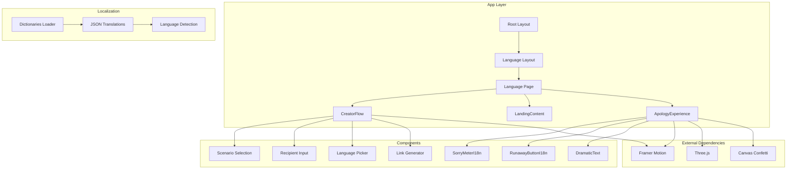
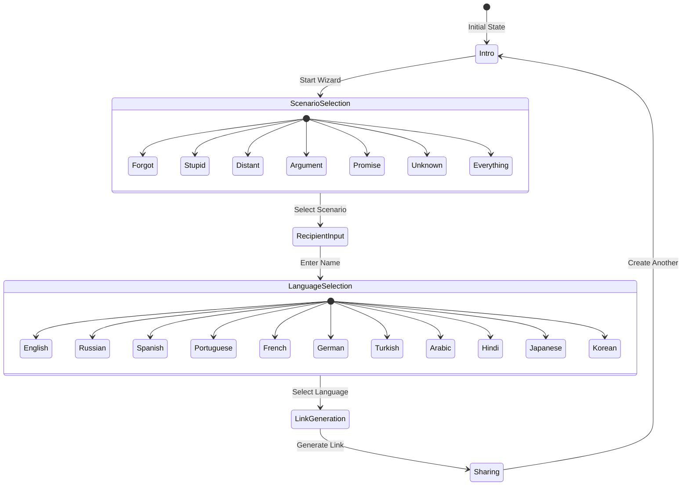
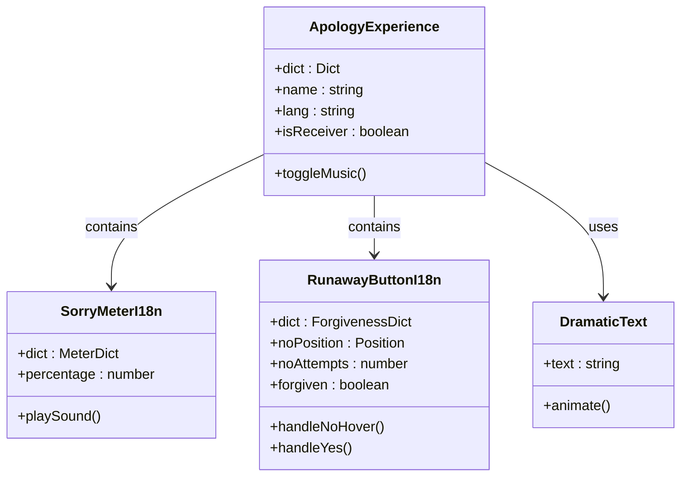
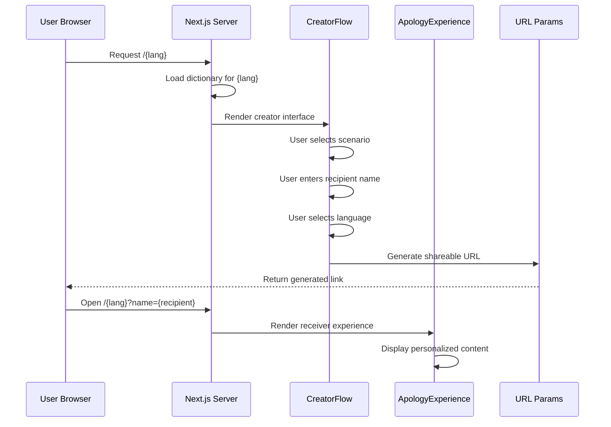
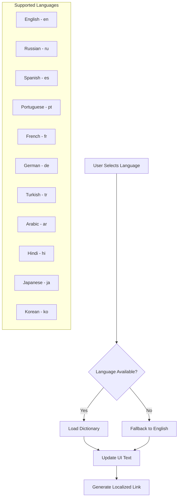
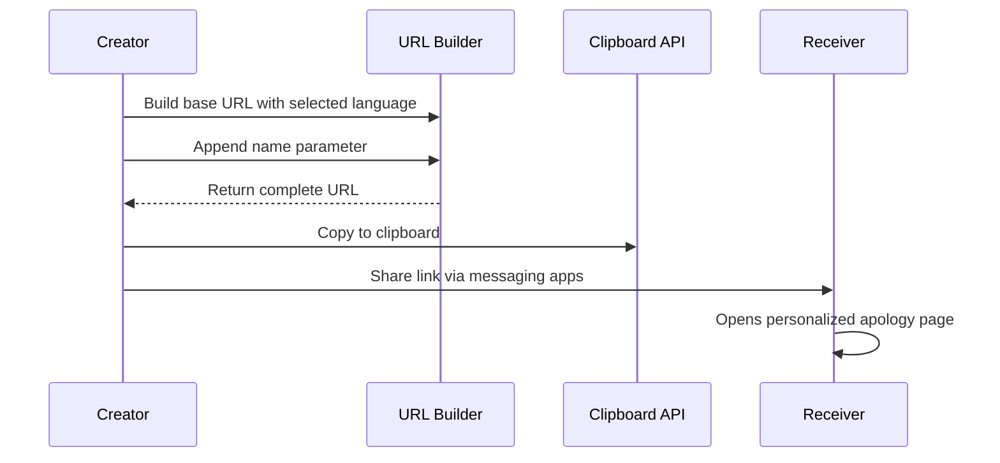
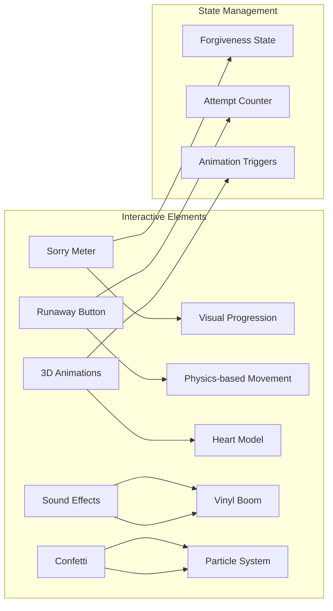

# Apology Creation System

<cite>
**Referenced Files in This Document**
- [CreatorFlow.tsx](file://src/components/CreatorFlow.tsx)
- [ApologyExperience.tsx](file://src/components/ApologyExperience.tsx)
- [page.tsx](file://src/app/[lang]/page.tsx)
- [dictionaries.ts](file://src/app/[lang]/dictionaries.ts)
- [en.json](file://src/app/[lang]/dictionaries/en.json)
- [ar.json](file://src/app/[lang]/dictionaries/ar.json)
- [layout.tsx](file://src/app/[lang]/layout.tsx)
- [LandingContent.tsx](file://src/components/LandingContent.tsx)
- [RunawayButtonI18n.tsx](file://src/components/RunawayButtonI18n.tsx)
- [SorryMeterI18n.tsx](file://src/components/SorryMeterI18n.tsx)
- [package.json](file://package.json)
</cite>

## Table of Contents
1. [Introduction](#introduction)
2. [Project Structure](#project-structure)
3. [Core Components](#core-components)
4. [Architecture Overview](#architecture-overview)
5. [Detailed Component Analysis](#detailed-component-analysis)
6. [Dependency Analysis](#dependency-analysis)
7. [Performance Considerations](#performance-considerations)
8. [Troubleshooting Guide](#troubleshooting-guide)
9. [Conclusion](#conclusion)

## Introduction
The Apology Creation System is an interactive web application that enables users to craft personalized, entertaining apologies. It features a multi-step wizard for scenario selection, recipient identification, language configuration, and link generation for sharing. The system supports 11 languages and integrates with an immersive receiver experience that includes animations, sound effects, and interactive elements.

## Project Structure
The application follows a Next.js routing pattern with locale-specific pages and shared components:



**Diagram sources**
- [layout.tsx:68-107](file://src/app/[lang]/layout.tsx#L68-L107)
- [page.tsx:12-31](file://src/app/[lang]/page.tsx#L12-L31)
- [CreatorFlow.tsx:1-335](file://src/components/CreatorFlow.tsx#L1-L335)

**Section sources**
- [layout.tsx:1-108](file://src/app/[lang]/layout.tsx#L1-L108)
- [page.tsx:1-32](file://src/app/[lang]/page.tsx#L1-L32)
- [dictionaries.ts:1-26](file://src/app/[lang]/dictionaries.ts#L1-L26)

## Core Components
The system consists of three primary components working together to deliver the complete user experience:

### CreatorFlow Component
The central wizard component managing the multi-step apology creation process with state management and validation:



**Diagram sources**
- [CreatorFlow.tsx:44-335](file://src/components/CreatorFlow.tsx#L44-L335)

### ApologyExperience Component
The receiver-side experience featuring interactive elements and localized content:



**Diagram sources**
- [ApologyExperience.tsx:32-219](file://src/components/ApologyExperience.tsx#L32-L219)
- [SorryMeterI18n.tsx:17-102](file://src/components/SorryMeterI18n.tsx#L17-L102)
- [RunawayButtonI18n.tsx:20-156](file://src/components/RunawayButtonI18n.tsx#L20-L156)

**Section sources**
- [CreatorFlow.tsx:1-335](file://src/components/CreatorFlow.tsx#L1-L335)
- [ApologyExperience.tsx:1-219](file://src/components/ApologyExperience.tsx#L1-L219)

## Architecture Overview
The system implements a client-server architecture with server-side rendering for localization and client-side interactivity for user interactions:



**Diagram sources**
- [page.tsx:12-31](file://src/app/[lang]/page.tsx#L12-L31)
- [CreatorFlow.tsx:52-63](file://src/components/CreatorFlow.tsx#L52-L63)

The architecture supports:
- **Server-Side Localization**: Dynamic loading of language dictionaries
- **Client-Side State Management**: React hooks for wizard progression
- **URL-Based Persistence**: Shareable links with embedded parameters
- **Responsive Design**: Mobile-first approach with Tailwind CSS

## Detailed Component Analysis

### Scenario System
The system provides 7 predefined apology scenarios with contextual reactions:

| Scenario | Emoji | Purpose |
|----------|-------|---------|
| Forgot | 😤 | Important items or commitments |
| Stupid | 🤡 | Embarrassing or foolish actions |
| Distant | 📱 | Ignoring or being emotionally unavailable |
| Argument | 😡 | Unnecessary conflicts or fights |
| Promise | 💔 | Broken commitments or agreements |
| Unknown | 🤷 | Unclear or ambiguous situations |
| Everything | ☠️ | Comprehensive apologies |

Each scenario triggers a contextual reaction message that adapts to the user's choice, providing immediate feedback and maintaining engagement throughout the wizard.

**Section sources**
- [CreatorFlow.tsx:20-38](file://src/components/CreatorFlow.tsx#L20-L38)

### Language Configuration System
The system supports 11 languages with comprehensive localization:



**Diagram sources**
- [dictionaries.ts:3-15](file://src/app/[lang]/dictionaries.ts#L3-L15)
- [CreatorFlow.tsx:6-18](file://src/components/CreatorFlow.tsx#L6-L18)

**Section sources**
- [dictionaries.ts:1-26](file://src/app/[lang]/dictionaries.ts#L1-L26)
- [CreatorFlow.tsx:6-18](file://src/components/CreatorFlow.tsx#L6-L18)

### Link Generation and Sharing
The system generates shareable URLs with embedded parameters:



**Diagram sources**
- [CreatorFlow.tsx:52-63](file://src/components/CreatorFlow.tsx#L52-L63)

The generated links follow the pattern: `{base-url}/{language}?name={recipient-name}`, ensuring seamless sharing across platforms.

**Section sources**
- [CreatorFlow.tsx:52-63](file://src/components/CreatorFlow.tsx#L52-L63)

### Interactive Receiver Experience
The receiver experience includes multiple interactive elements:



**Diagram sources**
- [ApologyExperience.tsx:32-219](file://src/components/ApologyExperience.tsx#L32-L219)
- [RunawayButtonI18n.tsx:20-156](file://src/components/RunawayButtonI18n.tsx#L20-L156)
- [SorryMeterI18n.tsx:17-102](file://src/components/SorryMeterI18n.tsx#L17-L102)

**Section sources**
- [ApologyExperience.tsx:1-219](file://src/components/ApologyExperience.tsx#L1-L219)
- [RunawayButtonI18n.tsx:1-156](file://src/components/RunawayButtonI18n.tsx#L1-L156)
- [SorryMeterI18n.tsx:1-102](file://src/components/SorryMeterI18n.tsx#L1-L102)

## Dependency Analysis
The system relies on several key dependencies for enhanced user experience:

```mermaid
graph TB
subgraph "UI Framework"
A[Next.js 16.2.9]
B[Framer Motion 12.40.0]
C[Tailwind CSS 4]
end
subgraph "3D Graphics"
D[@react-three/fiber 9.6.1]
E[@react-three/drei 10.7.7]
F[three 0.184.0]
end
subgraph "Effects & Audio"
G[canvas-confetti 1.9.4]
H[@formatjs/intl-localematcher 0.8.10]
I[negotiator 1.0.0]
end
subgraph "TypeScript Support"
J[@types/react 19]
K[@types/node 20]
L[@types/react-dom 19]
end
A --> B
A --> C
B --> D
D --> E
E --> F
A --> G
A --> H
A --> I
```

**Diagram sources**
- [package.json:11-35](file://package.json#L11-L35)

**Section sources**
- [package.json:1-36](file://package.json#L1-L36)

## Performance Considerations
The system implements several optimization strategies:

- **Lazy Loading**: Dynamic imports for 3D components prevent initial bundle bloat
- **Conditional Rendering**: Steps render only when active, reducing DOM complexity
- **Efficient State Updates**: Minimal re-renders through targeted state management
- **CSS-in-JS**: Tailwind classes applied conditionally to avoid unnecessary styles
- **Image Optimization**: Next.js automatic optimization for static assets

## Troubleshooting Guide

### Common Form Submission Issues
1. **Empty Recipient Name**: The system validates that a name is entered before proceeding to language selection
2. **Missing Scenario Selection**: Users must select a scenario before advancing
3. **Language Detection Problems**: Automatic fallback to English if requested language isn't available
4. **Link Generation Failures**: Check browser clipboard permissions for copy functionality

### User Workflow Examples

#### Creating a Romantic Apology
1. Select "Started a dumb argument" scenario
2. Enter partner's name (e.g., "Alex")
3. Choose preferred language (e.g., "Français")
4. Copy and send the generated link
5. Observe the romantic-themed receiver experience

#### Professional Reconciliation
1. Choose "Broke a promise" scenario
2. Enter colleague's name
3. Select appropriate professional language
4. Share via email or messaging platform
5. Monitor the interactive forgiveness process

#### Cross-Cultural Apology
1. Select "I don't even know tbh" scenario
2. Enter recipient's name
3. Choose target language (e.g., "日本語")
4. Send culturally appropriate apology
5. Leverage localized emotional expressions

### Integration Patterns
The system supports multiple integration approaches:

- **Direct Link Sharing**: Copy-paste URLs to social media, email, or messaging apps
- **Embedded Integration**: Use the generated links within existing communication channels
- **Automated Workflows**: Integrate with customer service systems for automated apologies
- **Multi-Language Campaigns**: Deploy localized versions for international audiences

**Section sources**
- [CreatorFlow.tsx:177-184](file://src/components/CreatorFlow.tsx#L177-L184)
- [CreatorFlow.tsx:225-242](file://src/components/CreatorFlow.tsx#L225-L242)

## Conclusion
The Apology Creation System provides a comprehensive solution for crafting personalized, engaging apologies with robust internationalization support. Its modular architecture, intuitive wizard interface, and rich interactive elements create an memorable user experience while maintaining technical excellence through modern React patterns and Next.js optimization strategies.

The system successfully balances entertainment value with practical functionality, offering creators complete control over apology customization while ensuring receivers enjoy an immersive, emotionally resonant experience.