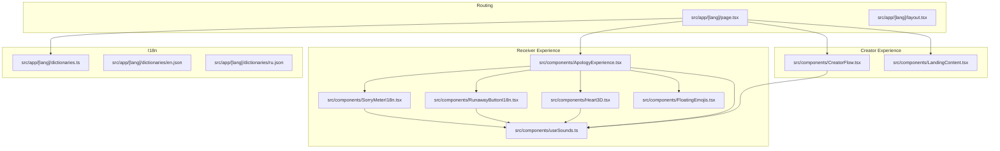
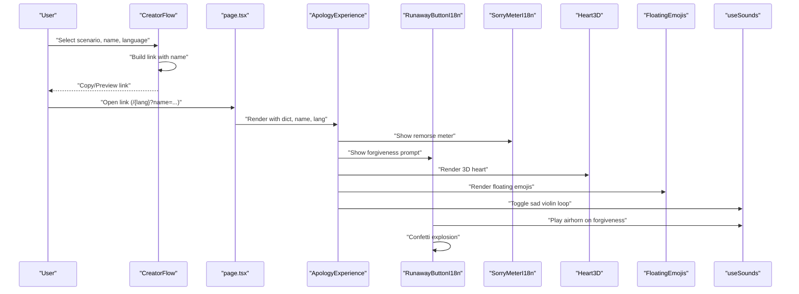
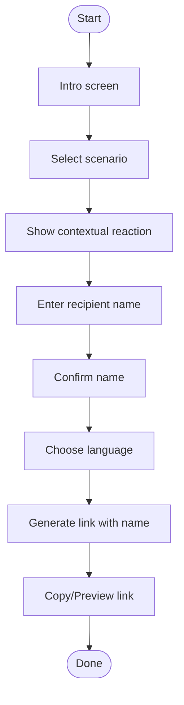
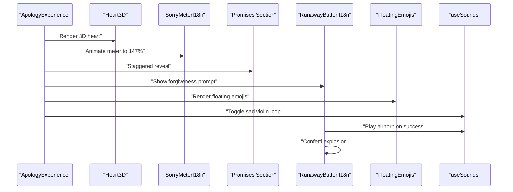
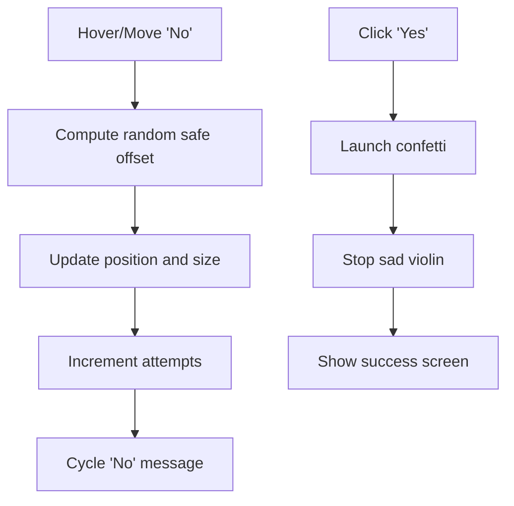
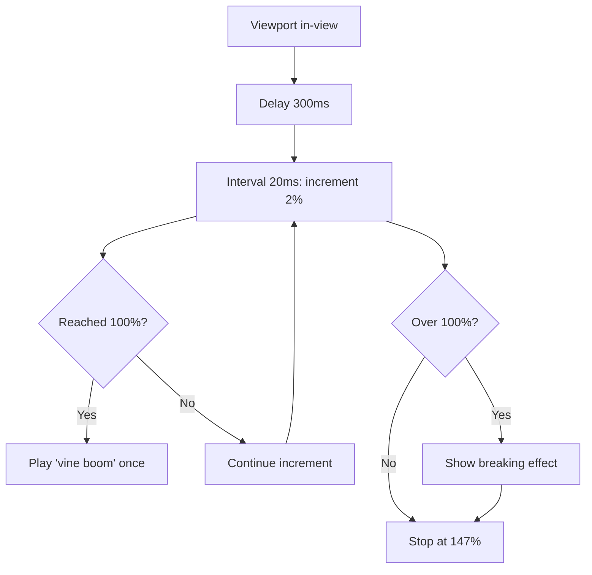
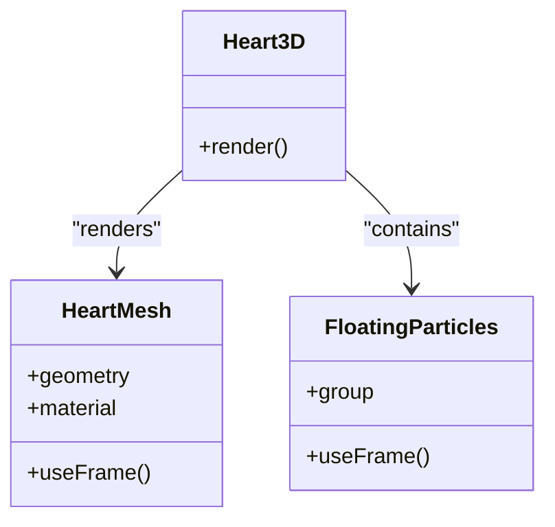
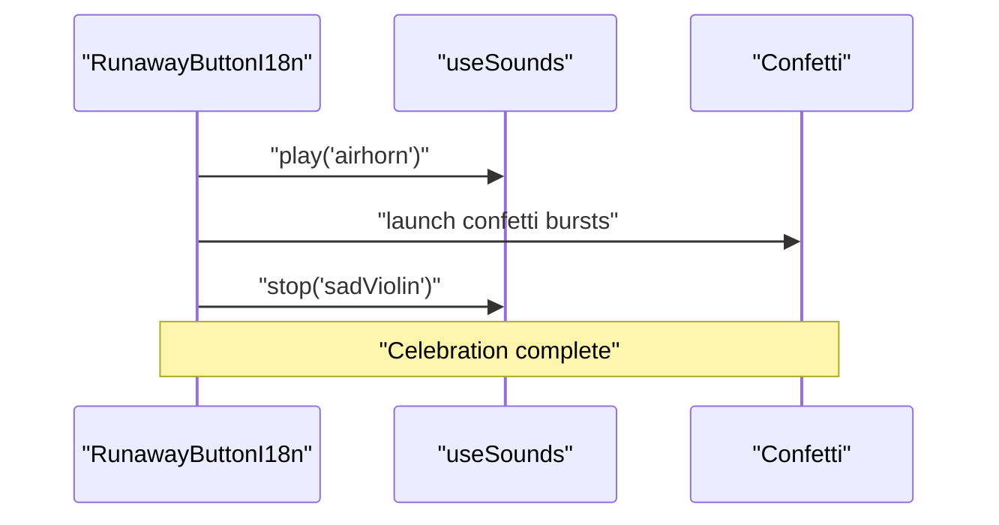
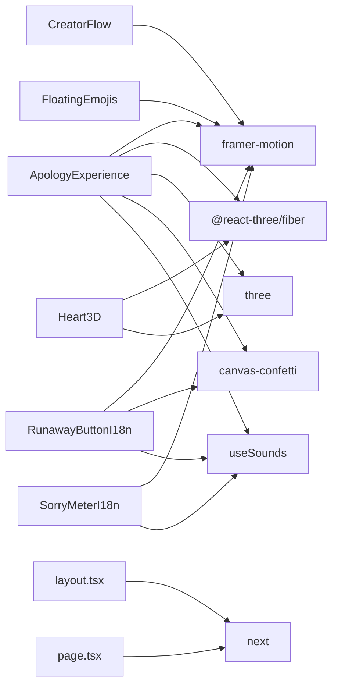

# Core Features

<cite>
**Referenced Files in This Document**
- [src/app/[lang]/page.tsx](file://src/app/[lang]/page.tsx)
- [src/app/[lang]/layout.tsx](file://src/app/[lang]/layout.tsx)
- [src/app/[lang]/dictionaries.ts](file://src/app/[lang]/dictionaries.ts)
- [src/app/[lang]/dictionaries/en.json](file://src/app/[lang]/dictionaries/en.json)
- [src/app/[lang]/dictionaries/ru.json](file://src/app/[lang]/dictionaries/ru.json)
- [src/components/ApologyExperience.tsx](file://src/components/ApologyExperience.tsx)
- [src/components/CreatorFlow.tsx](file://src/components/CreatorFlow.tsx)
- [src/components/LandingContent.tsx](file://src/components/LandingContent.tsx)
- [src/components/RunawayButton.tsx](file://src/components/RunawayButton.tsx)
- [src/components/RunawayButtonI18n.tsx](file://src/components/RunawayButtonI18n.tsx)
- [src/components/SorryMeter.tsx](file://src/components/SorryMeter.tsx)
- [src/components/SorryMeterI18n.tsx](file://src/components/SorryMeterI18n.tsx)
- [src/components/Heart3D.tsx](file://src/components/Heart3D.tsx)
- [src/components/FloatingEmojis.tsx](file://src/components/FloatingEmojis.tsx)
- [src/components/useSounds.ts](file://src/components/useSounds.ts)
- [package.json](file://package.json)
</cite>

## Table of Contents
1. [Introduction](#introduction)
2. [Project Structure](#project-structure)
3. [Core Components](#core-components)
4. [Architecture Overview](#architecture-overview)
5. [Detailed Component Analysis](#detailed-component-analysis)
6. [Dependency Analysis](#dependency-analysis)
7. [Performance Considerations](#performance-considerations)
8. [Troubleshooting Guide](#troubleshooting-guide)
9. [Conclusion](#conclusion)
10. [Appendices](#appendices)

## Introduction
This document explains the core features of the I Am Really Sorry platform, focusing on:
- The multi-step creator flow for generating personalized apology pages
- The interactive apology experience engine that guides users through hero sections, remorse quantification, enumerated reasons, solemn promises, and forgiveness interactions
- Physics-based interactive elements, including the runaway button mechanics and sorry meter animation
- The 3D heart visualization system with realistic lighting and particle effects
- Celebration system, sound integration, and floating emoji effects
- Usage examples, configuration options, and integration patterns
- User workflows, common use cases, and customization possibilities

## Project Structure
The platform is a Next.js application with:
- Internationalization via per-locale dictionaries
- A creator flow for generating links with embedded recipient names
- A receiver experience that renders the interactive apology page
- Reusable UI components for animations, physics, and sound

**Diagram sources**
- [src/app/[lang]/page.tsx](file://src/app/[lang]/page.tsx#L12-L31)
- [src/app/[lang]/layout.tsx](file://src/app/[lang]/layout.tsx#L68-L107)
- [src/app/[lang]/dictionaries.ts](file://src/app/[lang]/dictionaries.ts#L1-L26)
- [src/components/ApologyExperience.tsx:32-219](file://src/components/ApologyExperience.tsx#L32-L219)
- [src/components/CreatorFlow.tsx:44-335](file://src/components/CreatorFlow.tsx#L44-L335)
- [src/components/LandingContent.tsx:22-158](file://src/components/LandingContent.tsx#L22-L158)
- [src/components/RunawayButtonI18n.tsx:20-156](file://src/components/RunawayButtonI18n.tsx#L20-L156)
- [src/components/SorryMeterI18n.tsx:17-102](file://src/components/SorryMeterI18n.tsx#L17-L102)
- [src/components/Heart3D.tsx:87-107](file://src/components/Heart3D.tsx#L87-L107)
- [src/components/FloatingEmojis.tsx:15-64](file://src/components/FloatingEmojis.tsx#L15-L64)
- [src/components/useSounds.ts:41-69](file://src/components/useSounds.ts#L41-L69)

**Section sources**
- [src/app/[lang]/page.tsx](file://src/app/[lang]/page.tsx#L12-L31)
- [src/app/[lang]/layout.tsx](file://src/app/[lang]/layout.tsx#L68-L107)
- [src/app/[lang]/dictionaries.ts](file://src/app/[lang]/dictionaries.ts#L1-L26)

## Core Components
- CreatorFlow: Multi-step wizard to select scenario, recipient name, and language; generates a sharable link embedding the recipient’s name.
- ApologyExperience: Full-screen interactive experience with hero, remorse meter, enumerated reasons, solemn promises, and forgiveness interaction.
- Interactive Elements: Runaway button with physics-based movement and escalation; sorry meter with animated overflow and celebratory effects.
- 3D Heart Visualization: Realistic heart model with beat and rotation, ambient and directional lighting, and floating particle effects.
- Celebration System: Confetti explosions and celebratory messaging upon forgiveness.
- Sound Integration: Shared audio hooks for looping sad violin, meme sound effects, and controlled playback.
- Floating Emojis: Background floating emoji animation for ambiance.
- Internationalization: Locale-aware dictionaries and rendering.

**Section sources**
- [src/components/CreatorFlow.tsx:44-335](file://src/components/CreatorFlow.tsx#L44-L335)
- [src/components/ApologyExperience.tsx:32-219](file://src/components/ApologyExperience.tsx#L32-L219)
- [src/components/RunawayButtonI18n.tsx:20-156](file://src/components/RunawayButtonI18n.tsx#L20-L156)
- [src/components/SorryMeterI18n.tsx:17-102](file://src/components/SorryMeterI18n.tsx#L17-L102)
- [src/components/Heart3D.tsx:87-107](file://src/components/Heart3D.tsx#L87-L107)
- [src/components/FloatingEmojis.tsx:15-64](file://src/components/FloatingEmojis.tsx#L15-L64)
- [src/components/useSounds.ts:41-69](file://src/components/useSounds.ts#L41-L69)

## Architecture Overview
The system separates creator and receiver experiences:
- CreatorFlow builds a URL with recipient name and locale.
- Receiver ApologyExperience loads localized content and orchestrates the interactive journey.
- Components coordinate animations, physics, sound, and celebrations.

**Diagram sources**
- [src/components/CreatorFlow.tsx:52-63](file://src/components/CreatorFlow.tsx#L52-L63)
- [src/app/[lang]/page.tsx](file://src/app/[lang]/page.tsx#L19-L22)
- [src/components/ApologyExperience.tsx:39-61](file://src/components/ApologyExperience.tsx#L39-L61)
- [src/components/RunawayButtonI18n.tsx:41-74](file://src/components/RunawayButtonI18n.tsx#L41-L74)
- [src/components/SorryMeterI18n.tsx:24-45](file://src/components/SorryMeterI18n.tsx#L24-L45)
- [src/components/Heart3D.tsx:87-107](file://src/components/Heart3D.tsx#L87-L107)
- [src/components/FloatingEmojis.tsx:15-64](file://src/components/FloatingEmojis.tsx#L15-L64)
- [src/components/useSounds.ts:41-69](file://src/components/useSounds.ts#L41-L69)

## Detailed Component Analysis

### Creator Flow Wizard
The wizard guides creators through three steps:
- Scenario selection: choose from predefined scenarios with contextual reactions.
- Recipient identification: enter the recipient’s name.
- Language selection: pick locale for the generated experience.
- Link generation: produces a URL embedding the name and locale.

**Diagram sources**
- [src/components/CreatorFlow.tsx:67-102](file://src/components/CreatorFlow.tsx#L67-L102)
- [src/components/CreatorFlow.tsx:104-159](file://src/components/CreatorFlow.tsx#L104-L159)
- [src/components/CreatorFlow.tsx:161-205](file://src/components/CreatorFlow.tsx#L161-L205)
- [src/components/CreatorFlow.tsx:207-253](file://src/components/CreatorFlow.tsx#L207-L253)
- [src/components/CreatorFlow.tsx:255-331](file://src/components/CreatorFlow.tsx#L255-L331)

Key behaviors:
- Animations and transitions powered by Framer Motion.
- Dynamic reactions mapped to selected scenarios.
- Link construction uses window origin and URL encoding for the name.
- Copy-to-clipboard feedback with temporary state.

**Section sources**
- [src/components/CreatorFlow.tsx:44-335](file://src/components/CreatorFlow.tsx#L44-L335)

### Apology Experience Engine
The receiver experience orchestrates a narrative journey:
- Hero section with gradient text, optional recipient name, and animated 3D heart.
- Remorse quantification via an animated meter that exceeds 100%.
- Enumerated reasons and solemn promises presented with staggered animations.
- Forgiveness interaction with a runaway “No” button and celebratory outcome.
- Ambient floating emojis and optional sad violin background music.

**Diagram sources**
- [src/components/ApologyExperience.tsx:63-116](file://src/components/ApologyExperience.tsx#L63-L116)
- [src/components/ApologyExperience.tsx:118-134](file://src/components/ApologyExperience.tsx#L118-L134)
- [src/components/ApologyExperience.tsx:136-162](file://src/components/ApologyExperience.tsx#L136-L162)
- [src/components/ApologyExperience.tsx:164-200](file://src/components/ApologyExperience.tsx#L164-L200)
- [src/components/ApologyExperience.tsx:202-210](file://src/components/ApologyExperience.tsx#L202-L210)
- [src/components/Heart3D.tsx:87-107](file://src/components/Heart3D.tsx#L87-L107)
- [src/components/SorryMeterI18n.tsx:17-102](file://src/components/SorryMeterI18n.tsx#L17-L102)
- [src/components/RunawayButtonI18n.tsx:20-156](file://src/components/RunawayButtonI18n.tsx#L20-L156)
- [src/components/FloatingEmojis.tsx:15-64](file://src/components/FloatingEmojis.tsx#L15-L64)
- [src/components/useSounds.ts:39-46](file://src/components/useSounds.ts#L39-L46)

**Section sources**
- [src/components/ApologyExperience.tsx:32-219](file://src/components/ApologyExperience.tsx#L32-L219)

### Runaway Button Mechanics
The “No” button is intentionally hard to click:
- On hover/move, it jumps within safe bounds calculated from the container.
- Tracks consecutive attempts and scales down progressively.
- Messages cycle through a localized list.
- On “Yes,” triggers confetti explosion, stops background music, and displays a celebratory message.

**Diagram sources**
- [src/components/RunawayButtonI18n.tsx:28-39](file://src/components/RunawayButtonI18n.tsx#L28-L39)
- [src/components/RunawayButtonI18n.tsx:41-74](file://src/components/RunawayButtonI18n.tsx#L41-L74)
- [src/components/RunawayButtonI18n.tsx:112-154](file://src/components/RunawayButtonI18n.tsx#L112-L154)

**Section sources**
- [src/components/RunawayButtonI18n.tsx:20-156](file://src/components/RunawayButtonI18n.tsx#L20-L156)

### Sorry Meter Animation
The meter animates from 0% to 147%, with:
- A gradient bar that breaks when exceeding 100%.
- A celebratory “vine boom” sound when crossing 100%.
- Continuous pulsing animation while over 100%.

**Diagram sources**
- [src/components/SorryMeterI18n.tsx:24-45](file://src/components/SorryMeterI18n.tsx#L24-L45)
- [src/components/SorryMeterI18n.tsx:53-72](file://src/components/SorryMeterI18n.tsx#L53-L72)
- [src/components/SorryMeterI18n.tsx:80-98](file://src/components/SorryMeterI18n.tsx#L80-L98)

**Section sources**
- [src/components/SorryMeterI18n.tsx:17-102](file://src/components/SorryMeterI18n.tsx#L17-L102)

### 3D Heart Visualization System
The heart scene includes:
- A procedurally generated heart geometry extruded with bevels.
- A slow heartbeat scale animation and continuous rotation.
- Ambient and directional lights with rim highlights.
- Floating particles that rotate slowly around the heart.
- Responsive canvas sizing and always-on frame loop.

**Diagram sources**
- [src/components/Heart3D.tsx:87-107](file://src/components/Heart3D.tsx#L87-L107)
- [src/components/Heart3D.tsx:7-48](file://src/components/Heart3D.tsx#L7-L48)
- [src/components/Heart3D.tsx:50-85](file://src/components/Heart3D.tsx#L50-L85)

**Section sources**
- [src/components/Heart3D.tsx:1-107](file://src/components/Heart3D.tsx#L1-L107)

### Celebration System and Sound Integration
- Confetti explosions on forgiveness with layered bursts and rainbow colors.
- Background music toggle that starts/stops a looping sad violin track.
- Shared audio cache ensures single instances and avoids duplication.
- Sound effects for button movement, success, and celebratory moments.

**Diagram sources**
- [src/components/RunawayButtonI18n.tsx:41-74](file://src/components/RunawayButtonI18n.tsx#L41-L74)
- [src/components/useSounds.ts:41-69](file://src/components/useSounds.ts#L41-L69)

**Section sources**
- [src/components/RunawayButtonI18n.tsx:20-156](file://src/components/RunawayButtonI18n.tsx#L20-L156)
- [src/components/useSounds.ts:1-69](file://src/components/useSounds.ts#L1-L69)

### Floating Emojis
Background ambiance with floating emojis:
- Generates a fixed number of emojis based on viewport size.
- Randomized positions, sizes, durations, and delays.
- Smooth linear loops with opacity fade-in/out and rotation.

**Section sources**
- [src/components/FloatingEmojis.tsx:15-64](file://src/components/FloatingEmojis.tsx#L15-L64)

### Internationalization and Layout
- Per-locale dictionaries loaded dynamically.
- Static generation of language variants and metadata.
- Directionality support for RTL locales.

**Section sources**
- [src/app/[lang]/dictionaries.ts](file://src/app/[lang]/dictionaries.ts#L1-L26)
- [src/app/[lang]/layout.tsx](file://src/app/[lang]/layout.tsx#L6-L107)
- [src/app/[lang]/dictionaries/en.json](file://src/app/[lang]/dictionaries/en.json#L1-L88)
- [src/app/[lang]/dictionaries/ru.json](file://src/app/[lang]/dictionaries/ru.json#L1-L88)

## Dependency Analysis
External libraries and their roles:
- @react-three/fiber and three: 3D rendering and scene management
- @react-three/drei: helpers for lighting and controls
- framer-motion: animations and gestures
- canvas-confetti: celebratory particle effects
- negotiator and @formatjs/intl-localematcher: locale negotiation
- next, react, react-dom: framework runtime

**Diagram sources**
- [package.json:11-24](file://package.json#L11-L24)
- [src/components/ApologyExperience.tsx:3-12](file://src/components/ApologyExperience.tsx#L3-L12)
- [src/components/CreatorFlow.tsx:3-4](file://src/components/CreatorFlow.tsx#L3-L4)
- [src/components/RunawayButtonI18n.tsx:3-6](file://src/components/RunawayButtonI18n.tsx#L3-L6)
- [src/components/SorryMeterI18n.tsx:3-5](file://src/components/SorryMeterI18n.tsx#L3-L5)
- [src/components/Heart3D.tsx:3-5](file://src/components/Heart3D.tsx#L3-L5)
- [src/components/FloatingEmojis.tsx:3-4](file://src/components/FloatingEmojis.tsx#L3-L4)
- [src/app/[lang]/layout.tsx](file://src/app/[lang]/layout.tsx#L1-L107)
- [src/app/[lang]/page.tsx](file://src/app/[lang]/page.tsx#L1-L5)

**Section sources**
- [package.json:11-24](file://package.json#L11-L24)

## Performance Considerations
- 3D rendering: Keep geometry simple; use efficient materials and minimal lights. The heart uses beveled extrusion and a modest particle count.
- Animations: Prefer transform-based animations and hardware acceleration; throttle frequent reflows.
- Audio: Cache instances globally to avoid redundant decoding and playback overhead.
- Images and assets: Lazy-load dictionaries and defer heavy 3D initialization until needed.
- Mobile: Reduce floating emoji count and simplify confetti bursts on smaller screens.

## Troubleshooting Guide
Common issues and resolutions:
- Sounds not playing: Ensure user interaction before playing audio; the hook checks for interaction events and ignores plays until then.
- Confetti not appearing: Verify canvas-confetti is imported and the DOM is ready; ensure the success path triggers confetti.
- 3D scene not rendering: Confirm WebGL support and that the canvas is visible; check for console errors related to three.js.
- Localization mismatch: Validate locale keys in dictionaries and ensure fallbacks are present.
- Link generation: Confirm window origin availability and proper URL encoding of the recipient name.

**Section sources**
- [src/components/useSounds.ts:14-27](file://src/components/useSounds.ts#L14-L27)
- [src/components/RunawayButtonI18n.tsx:41-74](file://src/components/RunawayButtonI18n.tsx#L41-L74)
- [src/components/Heart3D.tsx:87-107](file://src/components/Heart3D.tsx#L87-L107)
- [src/components/CreatorFlow.tsx:52-57](file://src/components/CreatorFlow.tsx#L52-L57)

## Conclusion
The I Am Really Sorry platform combines a delightful creator flow with a rich, interactive receiver experience. Its blend of physics-driven interactions, 3D visuals, soundscapes, and celebratory effects creates an emotionally resonant and technically engaging product. The modular component architecture and strong internationalization foundation enable easy customization and global reach.

## Appendices

### Usage Examples and Workflows
- Creator workflow:
  - Select a scenario, enter the recipient’s name, choose a language, and copy the generated link.
  - Share the link; the recipient sees a personalized experience with their name.
- Receiver workflow:
  - Scroll through the hero, watch the remorse meter break 100%, read enumerated reasons and promises, and face the runaway button challenge.
  - On forgiveness, enjoy confetti and a heartfelt message.

**Section sources**
- [src/components/CreatorFlow.tsx:44-335](file://src/components/CreatorFlow.tsx#L44-L335)
- [src/components/ApologyExperience.tsx:32-219](file://src/components/ApologyExperience.tsx#L32-L219)

### Configuration Options
- Internationalization:
  - Add or modify locale dictionaries under the dictionaries directory.
  - Extend supported locales in the dictionaries loader and ensure static params include new entries.
- Theming and styles:
  - Adjust gradients, colors, and typography in the experience components.
- Interactive elements:
  - Tune animation timings, easing, and thresholds in meter and button components.
- Assets:
  - Replace or add sound files and update the sound map accordingly.

**Section sources**
- [src/app/[lang]/dictionaries.ts](file://src/app/[lang]/dictionaries.ts#L1-L26)
- [src/app/[lang]/dictionaries/en.json](file://src/app/[lang]/dictionaries/en.json#L1-L88)
- [src/app/[lang]/dictionaries/ru.json](file://src/app/[lang]/dictionaries/ru.json#L1-L88)
- [src/components/useSounds.ts:5-10](file://src/components/useSounds.ts#L5-L10)

### Integration Patterns
- Embedding recipient name:
  - Build URLs with the name parameter; the receiver route reads the name and personalizes the experience.
- Sharing and previews:
  - Provide copy-to-clipboard and preview actions in the creator flow.
- Accessibility:
  - Ensure keyboard navigation for buttons and sufficient contrast for animations.
- Analytics:
  - Integrate event tracking on link generation and forgiveness success.

**Section sources**
- [src/app/[lang]/page.tsx](file://src/app/[lang]/page.tsx#L17-L22)
- [src/components/CreatorFlow.tsx:52-63](file://src/components/CreatorFlow.tsx#L52-L63)
- [src/components/RunawayButtonI18n.tsx:41-74](file://src/components/RunawayButtonI18n.tsx#L41-L74)