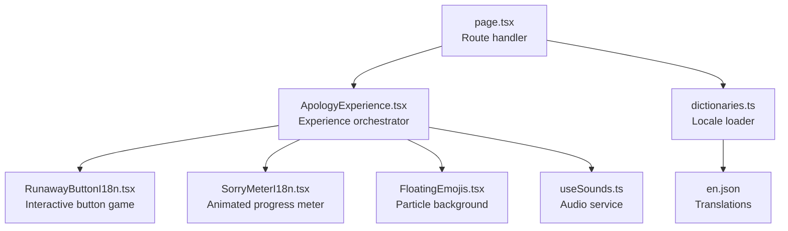
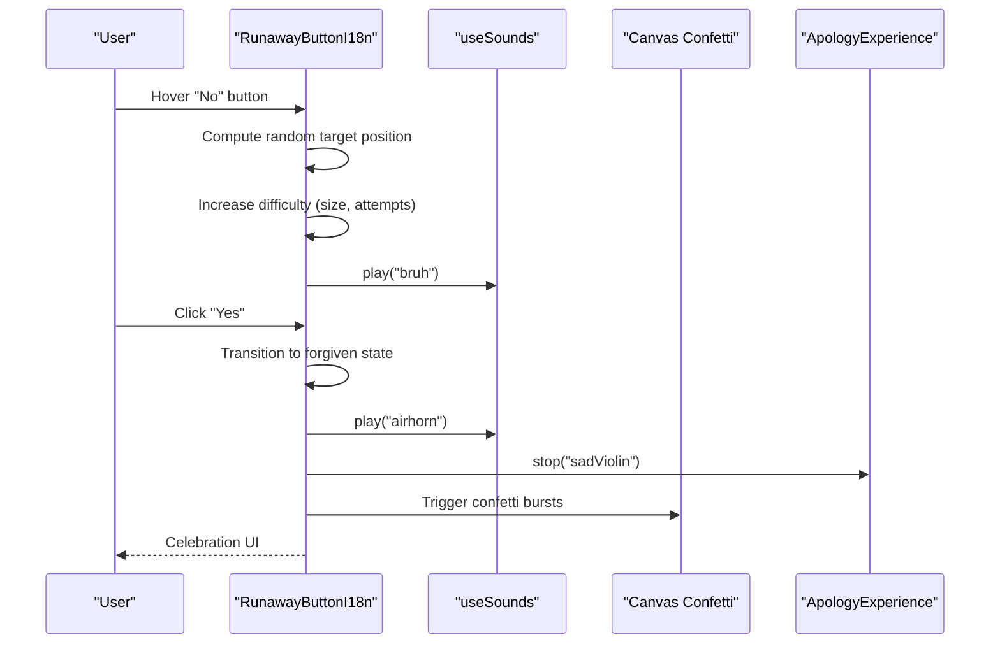
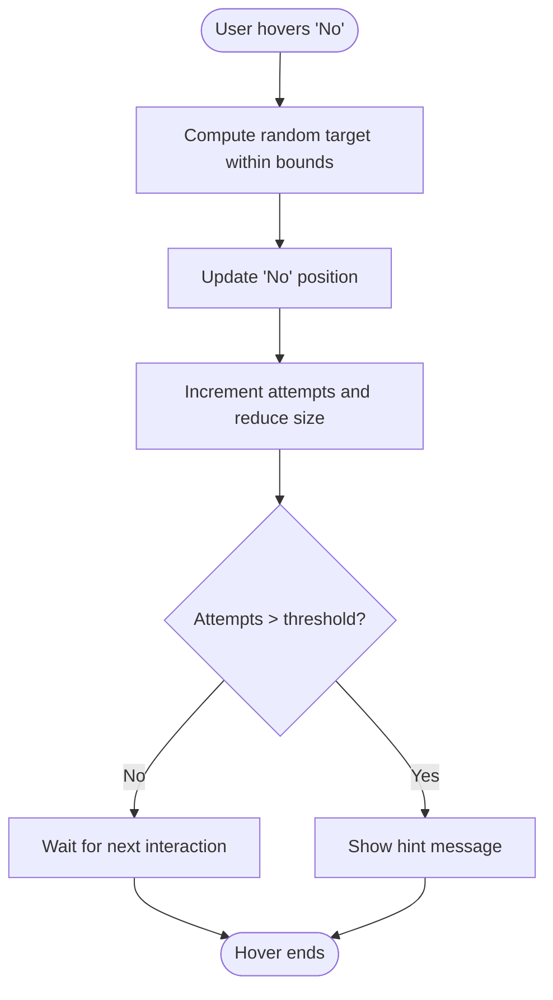
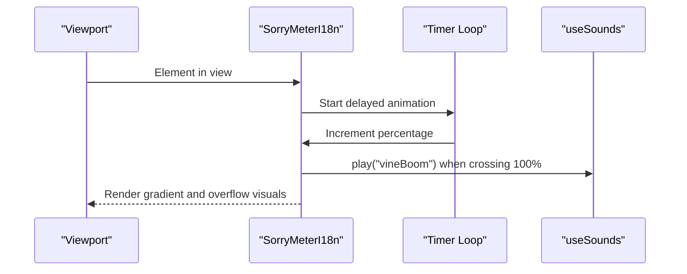
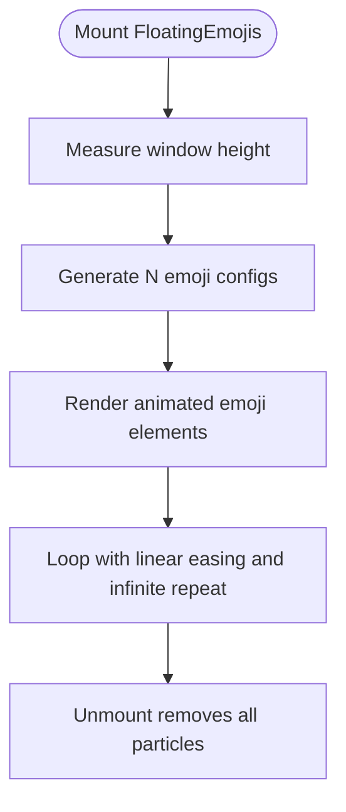
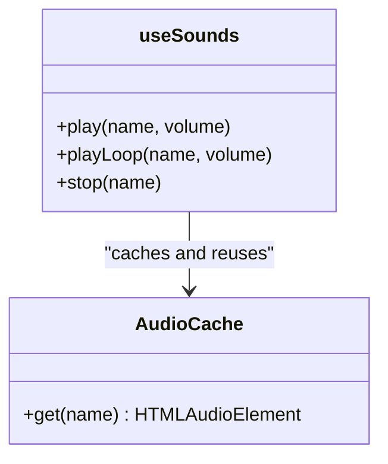
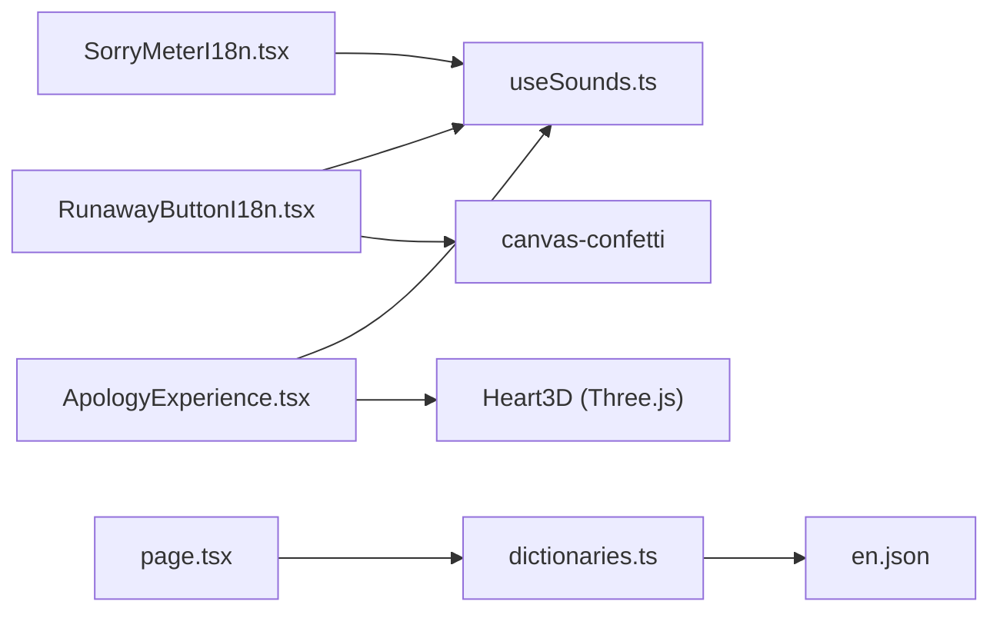

# Interactive Elements

<cite>
**Referenced Files in This Document**
- [RunawayButtonI18n.tsx](file://src/components/RunawayButtonI18n.tsx)
- [SorryMeterI18n.tsx](file://src/components/SorryMeterI18n.tsx)
- [FloatingEmojis.tsx](file://src/components/FloatingEmojis.tsx)
- [useSounds.ts](file://src/components/useSounds.ts)
- [ApologyExperience.tsx](file://src/components/ApologyExperience.tsx)
- [RunawayButton.tsx](file://src/components/RunawayButton.tsx)
- [SorryMeter.tsx](file://src/components/SorryMeter.tsx)
- [page.tsx](file://src/app/[lang]/page.tsx)
- [dictionaries.ts](file://src/app/[lang]/dictionaries.ts)
- [en.json](file://src/app/[lang]/dictionaries/en.json)
- [package.json](file://package.json)
</cite>

## Table of Contents
1. [Introduction](#introduction)
2. [Project Structure](#project-structure)
3. [Core Components](#core-components)
4. [Architecture Overview](#architecture-overview)
5. [Detailed Component Analysis](#detailed-component-analysis)
6. [Dependency Analysis](#dependency-analysis)
7. [Performance Considerations](#performance-considerations)
8. [Accessibility Considerations](#accessibility-considerations)
9. [Troubleshooting Guide](#troubleshooting-guide)
10. [Conclusion](#conclusion)

## Introduction
This document focuses on the interactive elements that drive the emotional engagement of the apology experience. It covers:
- RunawayButtonI18n: physics-based movement mechanics, increasing difficulty levels, collision-free behavior, and responsive behavior
- SorryMeterI18n: animated progress visualization, sound feedback integration, and visual indicators
- FloatingEmojis: particle effects, animation timing, and performance optimization
- Supporting systems: physics simulation foundations, animation frameworks, event handling patterns, and cross-platform compatibility
- Implementation examples, customization options, integration guidelines, performance optimization, and accessibility considerations

## Project Structure
The interactive experience is composed of:
- Experience orchestration: ApologyExperience orchestrates sections and integrates interactive components
- Interactive components: RunawayButtonI18n, SorryMeterI18n, and FloatingEmojis
- Shared services: useSounds for audio playback and caching
- Internationalization: dictionaries and language selection pipeline
- Runtime dependencies: Next.js, Framer Motion, canvas-confetti, Three.js for 3D elements

**Diagram sources**
- [page.tsx:12-31](file://src/app/[lang]/page.tsx#L12-L31)
- [ApologyExperience.tsx:32-218](file://src/components/ApologyExperience.tsx#L32-L218)
- [RunawayButtonI18n.tsx:20-155](file://src/components/RunawayButtonI18n.tsx#L20-L155)
- [SorryMeterI18n.tsx:17-101](file://src/components/SorryMeterI18n.tsx#L17-L101)
- [FloatingEmojis.tsx:15-63](file://src/components/FloatingEmojis.tsx#L15-L63)
- [useSounds.ts:41-68](file://src/components/useSounds.ts#L41-L68)
- [dictionaries.ts:3-25](file://src/app/[lang]/dictionaries.ts#L3-L25)
- [en.json:1-150](file://src/app/[lang]/dictionaries/en.json#L1-L150)

**Section sources**
- [page.tsx:12-31](file://src/app/[lang]/page.tsx#L12-L31)
- [ApologyExperience.tsx:32-218](file://src/components/ApologyExperience.tsx#L32-L218)
- [dictionaries.ts:3-25](file://src/app/[lang]/dictionaries.ts#L3-L25)

## Core Components
- RunawayButtonI18n: A playful, physics-inspired interaction where the “No” button moves away from the pointer with spring-like dynamics, increasing difficulty with repeated attempts, and provides celebratory confetti upon success.
- SorryMeterI18n: A dramatic progress visualization that animates beyond 100%, triggers sound feedback, and displays contextual messaging.
- FloatingEmojis: A lightweight particle system that floats emojis with randomized timing and easing for a soft, ambient background effect.

**Section sources**
- [RunawayButtonI18n.tsx:20-155](file://src/components/RunawayButtonI18n.tsx#L20-L155)
- [SorryMeterI18n.tsx:17-101](file://src/components/SorryMeterI18n.tsx#L17-L101)
- [FloatingEmojis.tsx:15-63](file://src/components/FloatingEmojis.tsx#L15-L63)

## Architecture Overview
The interactive experience is driven by React components orchestrated by ApologyExperience. Each interactive element relies on:
- Framer Motion for declarative animations and scroll-triggered effects
- Canvas Confetti for celebratory particle bursts
- useSounds for audio playback with global caching and user-interaction gating
- Responsive design patterns and device-aware performance tuning

**Diagram sources**
- [RunawayButtonI18n.tsx:28-74](file://src/components/RunawayButtonI18n.tsx#L28-L74)
- [useSounds.ts:41-68](file://src/components/useSounds.ts#L41-L68)
- [ApologyExperience.tsx:39-46](file://src/components/ApologyExperience.tsx#L39-L46)

## Detailed Component Analysis

### RunawayButtonI18n: Physics-Based Movement and Increasing Difficulty
- Physics and movement:
  - Spring-based animation for the “No” button using Framer Motion transitions with configurable stiffness and damping.
  - Randomized displacement within container bounds to prevent collisions with edges.
  - Dynamic scaling of the “No” button to visually increase difficulty as attempts grow.
- Increasing difficulty:
  - Tracks number of “No” attempts and clamps to dictionary entries.
  - Gradually reduces “No” button size to simulate shrinking under pressure.
  - “Yes” button grows proportionally to attempts to reinforce progression.
- Responsive behavior:
  - Uses container width to compute safe movement range, ensuring mobile usability.
  - Supports both mouse hover and touch events for cross-device compatibility.
- Celebration and sound:
  - Plays celebratory sounds and triggers confetti bursts upon forgiveness.
  - Integrates with the shared audio service and stops background music.
- Internationalization:
  - Accepts localized dictionary for prompts, choices, hints, and success messages.

**Diagram sources**
- [RunawayButtonI18n.tsx:28-39](file://src/components/RunawayButtonI18n.tsx#L28-L39)
- [RunawayButtonI18n.tsx:144-152](file://src/components/RunawayButtonI18n.tsx#L144-L152)

**Section sources**
- [RunawayButtonI18n.tsx:20-155](file://src/components/RunawayButtonI18n.tsx#L20-L155)
- [useSounds.ts:41-68](file://src/components/useSounds.ts#L41-L68)

### SorryMeterI18n: Animated Progress Visualization and Sound Feedback
- Animation framework:
  - Scroll-triggered animation using Framer Motion’s in-view hook to start the meter when it becomes visible.
  - Smooth percentage increments with a timer-based loop until reaching a capped value beyond 100%.
- Visual indicators:
  - Gradient-filled bar that fills up to 100% and then shows an overflow effect with a secondary animated strip.
  - Percentage display with pulsing animation when exceeding 100%.
  - Contextual error message appears after overflow completes.
- Sound feedback:
  - Plays a distinctive sound when the meter crosses 100%.
- Internationalization:
  - Localized labels for meter title, thresholds, and overflow message.

**Diagram sources**
- [SorryMeterI18n.tsx:17-45](file://src/components/SorryMeterI18n.tsx#L17-L45)
- [useSounds.ts:41-68](file://src/components/useSounds.ts#L41-L68)

**Section sources**
- [SorryMeterI18n.tsx:17-101](file://src/components/SorryMeterI18n.tsx#L17-L101)
- [useSounds.ts:41-68](file://src/components/useSounds.ts#L41-L68)

### FloatingEmojis: Particle Effects, Timing, and Performance
- Particle system:
  - Generates a fixed number of emoji particles with randomized positions, sizes, durations, and delays.
  - Uses linear easing for smooth, constant-speed floating motion with infinite repetition.
- Performance optimization:
  - Reduces particle count on smaller screens to minimize rendering overhead.
  - Uses a fixed z-index and pointer-events-none to keep the effect unobtrusive.
- Ambient feel:
  - Provides a soft, continuous background animation that complements the main interactive elements.

**Diagram sources**
- [FloatingEmojis.tsx:19-34](file://src/components/FloatingEmojis.tsx#L19-L34)
- [FloatingEmojis.tsx:36-62](file://src/components/FloatingEmojis.tsx#L36-L62)

**Section sources**
- [FloatingEmojis.tsx:15-63](file://src/components/FloatingEmojis.tsx#L15-L63)

### Supporting Systems

#### Audio Service (useSounds)
- Global audio caching:
  - Reuses audio instances across components to avoid redundant loading and improve responsiveness.
- User interaction gating:
  - Requires a user gesture before playing sounds to satisfy browser autoplay policies.
- Playback controls:
  - Provides methods to play once, loop, and stop audio clips with adjustable volumes.

**Diagram sources**
- [useSounds.ts:41-68](file://src/components/useSounds.ts#L41-L68)

**Section sources**
- [useSounds.ts:1-69](file://src/components/useSounds.ts#L1-L69)

#### Experience Orchestration (ApologyExperience)
- Integrates interactive components into a cohesive flow:
  - Toggles background music via the audio service.
  - Hosts the RunawayButtonI18n and SorryMeterI18n within dedicated sections.
  - Manages global animations and transitions for a polished presentation.

**Section sources**
- [ApologyExperience.tsx:32-218](file://src/components/ApologyExperience.tsx#L32-L218)
- [useSounds.ts:41-68](file://src/components/useSounds.ts#L41-L68)

#### Internationalization Pipeline
- Locale resolution:
  - Route handler selects dictionary based on URL locale and validates against supported locales.
- Dictionary structure:
  - Provides keys for all interactive text, including button labels, hints, and success messages.
- Component consumption:
  - Interactive components receive localized dictionaries to render context-appropriate text.

**Section sources**
- [page.tsx:12-31](file://src/app/[lang]/page.tsx#L12-L31)
- [dictionaries.ts:3-25](file://src/app/[lang]/dictionaries.ts#L3-L25)
- [en.json:60-90](file://src/app/[lang]/dictionaries/en.json#L60-L90)

## Dependency Analysis
- Animation and motion:
  - Framer Motion powers all animations, transitions, and scroll-triggered effects.
- Particle effects:
  - Canvas Confetti is used for celebratory bursts in the button interaction.
- 3D elements:
  - Three.js and React Three Fiber enable the 3D heart animation in the hero section.
- Audio:
  - useSounds wraps HTMLAudioElement with caching and user-interaction gating.
- Routing and i18n:
  - Next.js dynamic routes and server-only dictionary loaders manage localization.

**Diagram sources**
- [RunawayButtonI18n.tsx:26-26](file://src/components/RunawayButtonI18n.tsx#L26-L26)
- [SorryMeterI18n.tsx:21-21](file://src/components/SorryMeterI18n.tsx#L21-L21)
- [ApologyExperience.tsx:12-12](file://src/components/ApologyExperience.tsx#L12-L12)
- [useSounds.ts:30-39](file://src/components/useSounds.ts#L30-L39)
- [page.tsx:16-16](file://src/app/[lang]/page.tsx#L16-L16)
- [dictionaries.ts:3-15](file://src/app/[lang]/dictionaries.ts#L3-L15)
- [en.json:1-150](file://src/app/[lang]/dictionaries/en.json#L1-L150)
- [package.json:11-24](file://package.json#L11-L24)

**Section sources**
- [package.json:11-24](file://package.json#L11-L24)

## Performance Considerations
- Animation performance:
  - Prefer transform-based animations (translate, scale) for GPU acceleration.
  - Use Framer Motion’s optimized variants and avoid unnecessary re-renders by passing stable callbacks.
- Particle system:
  - Limit particle count on mobile devices to reduce DOM nodes and layout cost.
  - Use pointer-events-none to prevent interaction overhead from background elements.
- Audio:
  - Cache audio instances globally to avoid repeated decoding and initialization.
  - Gate playback behind user gestures to comply with autoplay policies and reduce jank.
- Rendering:
  - Defer heavy 3D assets with dynamic imports to avoid blocking initial load.
  - Use viewport-based triggers to start animations only when elements are visible.

[No sources needed since this section provides general guidance]

## Accessibility Considerations
- Keyboard navigation:
  - Ensure buttons are focusable and operable via keyboard (Tab order and Enter/Space activation).
- Screen reader support:
  - Provide meaningful aria-labels for interactive elements and convey state changes (e.g., success messages).
- Motion preferences:
  - Respect reduced motion settings by allowing users to disable animations where possible.
- Audio:
  - Offer alternatives to audio cues (e.g., visual feedback) and allow users to mute or control volume.
- Contrast and readability:
  - Maintain sufficient color contrast for text and interactive elements, especially during celebratory animations.

[No sources needed since this section provides general guidance]

## Troubleshooting Guide
- Buttons not responding on mobile:
  - Verify touch handlers are attached and container bounds are computed correctly.
  - Confirm that the “No” button remains within container boundaries to avoid unexpected jumps.
- Confetti not appearing:
  - Ensure the confetti library is imported and the trigger occurs after the button enters the forgiven state.
  - Check that the animation loop is scheduled with requestAnimationFrame.
- Audio not playing:
  - Confirm that a user gesture has occurred before attempting to play sounds.
  - Verify that cached audio instances are initialized and not paused/stuck.
- Meter not animating:
  - Ensure the element is in view before starting the timer-based loop.
  - Check that the in-view hook is configured to trigger only once to avoid restarts.

**Section sources**
- [RunawayButtonI18n.tsx:28-74](file://src/components/RunawayButtonI18n.tsx#L28-L74)
- [useSounds.ts:14-27](file://src/components/useSounds.ts#L14-L27)
- [useSounds.ts:41-68](file://src/components/useSounds.ts#L41-L68)
- [SorryMeterI18n.tsx:24-45](file://src/components/SorryMeterI18n.tsx#L24-L45)

## Conclusion
The interactive elements combine physics-inspired movement, expressive animations, and immersive audio to create an emotionally engaging experience. By leveraging Framer Motion, canvas-confetti, and a centralized audio service, the components deliver responsive, cross-platform interactions that adapt to user behavior and device capabilities. The modular architecture allows for easy customization of behaviors and appearances while maintaining performance and accessibility standards.