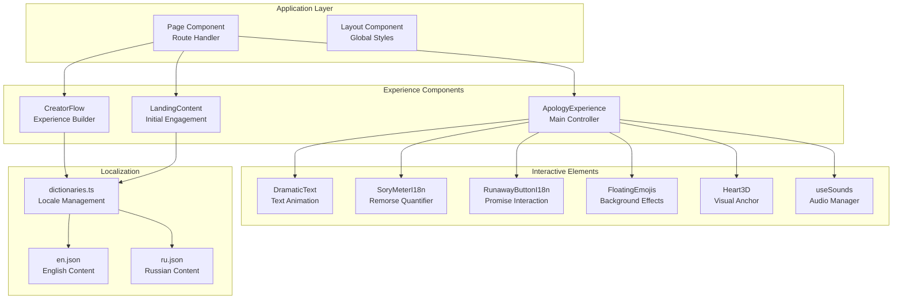
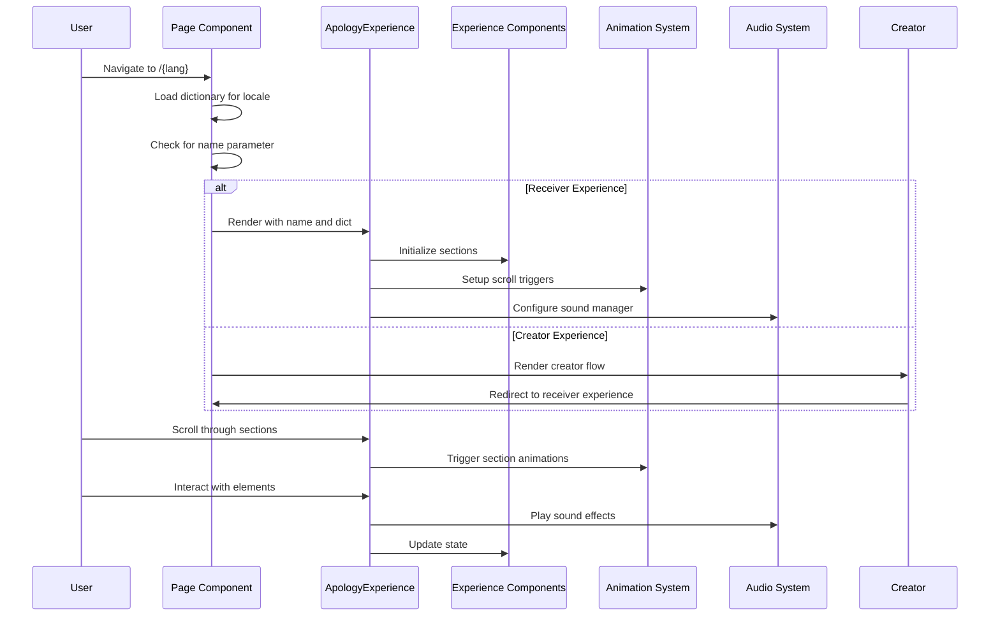
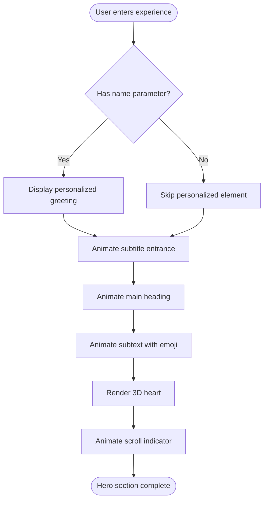
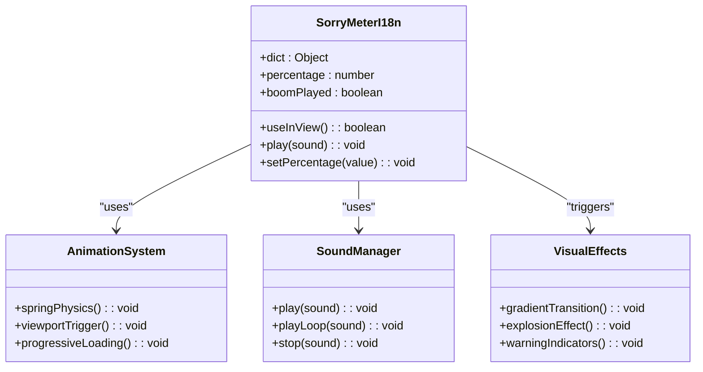
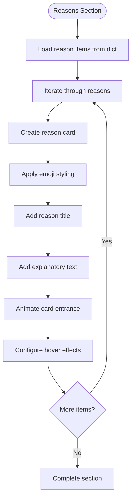
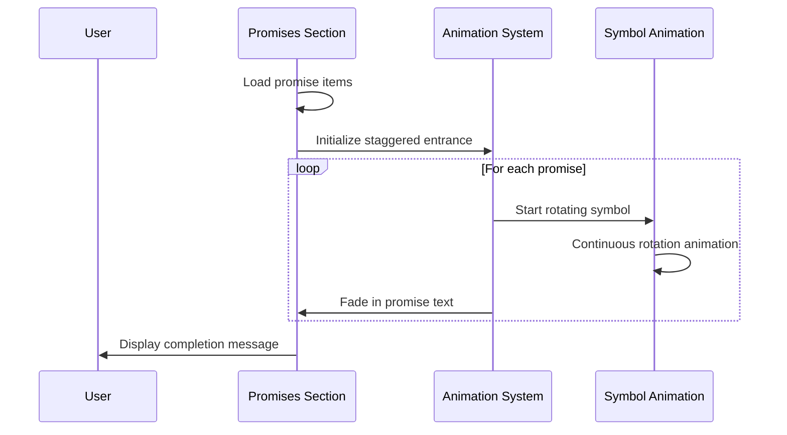
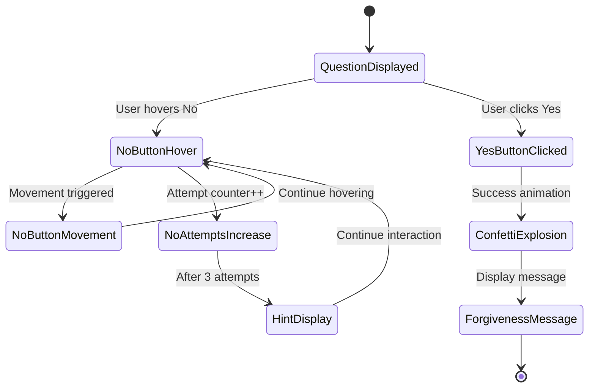
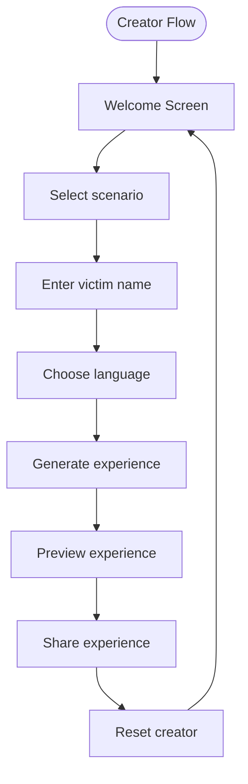

# Interactive Experience Engine

<cite>
**Referenced Files in This Document**
- [ApologyExperience.tsx](file://src/components/ApologyExperience.tsx)
- [LandingContent.tsx](file://src/components/LandingContent.tsx)
- [DramaticText.tsx](file://src/components/DramaticText.tsx)
- [page.tsx](file://src/app/[lang]/page.tsx)
- [dictionaries.ts](file://src/app/[lang]/dictionaries.ts)
- [SorryMeterI18n.tsx](file://src/components/SorryMeterI18n.tsx)
- [RunawayButtonI18n.tsx](file://src/components/RunawayButtonI18n.tsx)
- [FloatingEmojis.tsx](file://src/components/FloatingEmojis.tsx)
- [Heart3D.tsx](file://src/components/Heart3D.tsx)
- [useSounds.ts](file://src/components/useSounds.ts)
- [CreatorFlow.tsx](file://src/components/CreatorFlow.tsx)
- [en.json](file://src/app/[lang]/dictionaries/en.json)
- [ru.json](file://src/app/[lang]/dictionaries/ru.json)
</cite>

## Table of Contents
1. [Introduction](#introduction)
2. [Project Structure](#project-structure)
3. [Core Components](#core-components)
4. [Architecture Overview](#architecture-overview)
5. [Detailed Component Analysis](#detailed-component-analysis)
6. [Dependency Analysis](#dependency-analysis)
7. [Performance Considerations](#performance-considerations)
8. [Troubleshooting Guide](#troubleshooting-guide)
9. [Conclusion](#conclusion)

## Introduction
The Interactive Experience Engine orchestrates a personalized apology journey through a carefully crafted sequence of emotional storytelling, interactive mechanics, and immersive multimedia elements. The system centers around the ApologyExperience component, which serves as the primary controller managing the complete user interaction flow from initial engagement to resolution. This engine combines narrative progression with sophisticated animations, sound design, and responsive interactions to create an emotionally resonant experience that transforms a simple apology into a memorable, interactive journey.

The system operates on a dual-path model: creators can build personalized apology experiences through an intuitive flow, while receivers experience the complete narrative journey. The engine emphasizes accessibility, internationalization, and cross-platform compatibility while maintaining a consistent emotional arc that builds toward reconciliation.

## Project Structure
The Interactive Experience Engine follows a modular React architecture with clear separation of concerns across components, localization, and shared utilities.



**Diagram sources**
- [page.tsx:12-31](file://src/app/[lang]/page.tsx#L12-L31)
- [ApologyExperience.tsx:32-218](file://src/components/ApologyExperience.tsx#L32-L218)
- [CreatorFlow.tsx:65-359](file://src/components/CreatorFlow.tsx#L65-L359)

**Section sources**
- [page.tsx:12-31](file://src/app/[lang]/page.tsx#L12-L31)
- [dictionaries.ts:1-26](file://src/app/[lang]/dictionaries.ts#L1-L26)

## Core Components

### ApologyExperience: Central Controller
The ApologyExperience component acts as the primary orchestrator, managing the complete user journey through six distinct narrative sections. It implements a sophisticated state management pattern with localized content injection and dynamic component composition.

Key orchestration responsibilities include:
- **Content Localization**: Accepts dictionary objects containing all text content, enabling seamless internationalization
- **State Management**: Coordinates music playback state, user interaction states, and component visibility
- **Animation Coordination**: Integrates Framer Motion animations with scroll-triggered effects
- **Component Composition**: Dynamically renders specialized components for each narrative phase

The component implements a progressive disclosure pattern where content appears as users scroll, creating a cinematic experience that builds emotional momentum throughout the journey.

**Section sources**
- [ApologyExperience.tsx:32-218](file://src/components/ApologyExperience.tsx#L32-L218)

### DramaticText: Text Transition Engine
The DramaticText component provides sophisticated text animation capabilities with spring physics and staggered timing. It implements viewport-based triggering to ensure animations only activate when content becomes visible, optimizing performance and user experience.

Core features include:
- **Spring Physics**: Uses Framer Motion's spring animation for natural text reveal
- **Viewport Detection**: Leverages useInView hook for scroll-triggered animations
- **Staggered Timing**: Implements word-by-word animation with configurable delays
- **Responsive Design**: Adapts animation timing based on content complexity

**Section sources**
- [DramaticText.tsx:12-42](file://src/components/DramaticText.tsx#L12-L42)

### LandingContent: Initial Engagement Hub
The LandingContent component serves as the entry point for creators, providing comprehensive value proposition and feature explanation. It implements SEO optimization through structured data and offers a guided workflow for building personalized apology experiences.

Key engagement features:
- **SEO Optimization**: Implements FAQ structured data for improved search visibility
- **Feature Showcase**: Presents core capabilities through organized content blocks
- **Internationalization**: Supports RTL languages and bidirectional content flow
- **Call-to-Action**: Provides clear pathways to experience creation

**Section sources**
- [LandingContent.tsx:22-157](file://src/components/LandingContent.tsx#L22-L157)

## Architecture Overview

The Interactive Experience Engine employs a layered architecture that separates concerns while maintaining tight integration between components:



**Diagram sources**
- [page.tsx:12-31](file://src/app/[lang]/page.tsx#L12-L31)
- [ApologyExperience.tsx:32-218](file://src/components/ApologyExperience.tsx#L32-L218)
- [useSounds.ts:41-68](file://src/components/useSounds.ts#L41-L68)

The architecture emphasizes:
- **Separation of Concerns**: Clear boundaries between experience orchestration, content presentation, and interactive mechanics
- **Performance Optimization**: Lazy loading of heavy 3D components and scroll-triggered animations
- **Accessibility**: Progressive enhancement with fallback content for reduced motion preferences
- **Scalability**: Modular component design enabling easy extension and customization

## Detailed Component Analysis

### Hero Section: Personalized Greeting Engine
The hero section implements a sophisticated greeting system that personalizes the experience based on the recipient's name while maintaining visual impact and emotional resonance.



**Diagram sources**
- [ApologyExperience.tsx:63-116](file://src/components/ApologyExperience.tsx#L63-L116)

Personalization features include:
- **Dynamic Name Display**: Conditional rendering of personalized greeting with romantic emoji
- **Sequential Animation**: Carefully choreographed entrance sequence using staggered delays
- **3D Visual Anchor**: Heart3D component provides focal point with realistic animation
- **Interactive Elements**: FloatingEmojis component creates ambient atmosphere

**Section sources**
- [ApologyExperience.tsx:63-116](file://src/components/ApologyExperience.tsx#L63-L116)
- [Heart3D.tsx:87-106](file://src/components/Heart3D.tsx#L87-L106)
- [FloatingEmojis.tsx:15-63](file://src/components/FloatingEmojis.tsx#L15-L63)

### Remorse Quantification System: Breaking the 100% Barrier
The SorryMeterI18n component implements an innovative remorse measurement system that visually communicates emotional intensity beyond conventional scales.



**Diagram sources**
- [SorryMeterI18n.tsx:17-101](file://src/components/SorryMeterI18n.tsx#L17-L101)
- [useSounds.ts:41-68](file://src/components/useSounds.ts#L41-L68)

The system's unique characteristics include:
- **Progressive Animation**: Staggered percentage increase creating tension and anticipation
- **Sound Integration**: Vine boom effect triggers when surpassing 100% threshold
- **Visual Warning**: Color gradient shifts from amber to purple indicating exceeded capacity
- **Dynamic Effects**: Subtle pulsing animation for percentages above 100%

**Section sources**
- [SorryMeterI18n.tsx:17-101](file://src/components/SorryMeterI18n.tsx#L17-L101)

### Reason Enumeration: Emoji-Enhanced Storytelling
The reasons section presents a collection of self-aware admissions using emoji integration to enhance emotional communication and cultural accessibility.



**Diagram sources**
- [ApologyExperience.tsx:136-162](file://src/components/ApologyExperience.tsx#L136-L162)

Implementation highlights:
- **Grid Layout**: Responsive 1-column on mobile, 2-column on larger screens
- **Sequential Animation**: Cards enter with staggered delays (0.2-second intervals)
- **Hover Interactions**: Subtle scaling and rotation effects for enhanced engagement
- **Cultural Adaptation**: Emojis chosen for universal recognition and emotional impact

**Section sources**
- [ApologyExperience.tsx:136-162](file://src/components/ApologyExperience.tsx#L136-L162)

### Promise Section: Commitment Statement Engine
The promises section utilizes animated commitment statements with symbolic gesture integration to reinforce sincerity and reliability.



**Diagram sources**
- [ApologyExperience.tsx:164-200](file://src/components/ApologyExperience.tsx#L164-L200)

Promise presentation features:
- **Rotating Symbol**: Animated finger-cross gesture (🤞) reinforces commitment
- **Staggered Timing**: 0.15-second intervals create rhythmic visual pattern
- **Progressive Disclosure**: Text fades in as symbol animation establishes context
- **Symbolic Consistency**: Universal gesture recognized across cultures

**Section sources**
- [ApologyExperience.tsx:164-200](file://src/components/ApologyExperience.tsx#L164-L200)

### The Big Question: Interactive Resolution Mechanism
The final interactive element presents the critical decision point through an engaging game-like interface designed to be both challenging and emotionally satisfying.



**Diagram sources**
- [RunawayButtonI18n.tsx:20-155](file://src/components/RunawayButtonI18n.tsx#L20-L155)

Interactive mechanics include:
- **Impossibility Design**: No button movement area calculated to prevent successful clicking
- **Progressive Difficulty**: No button size decreases exponentially with repeated attempts
- **Adaptive Responses**: Dynamic button text changes based on attempt count
- **Celebratory Completion**: Confetti explosion and heart animation upon success

**Section sources**
- [RunawayButtonI18n.tsx:20-155](file://src/components/RunawayButtonI18n.tsx#L20-L155)

### CreatorFlow: Experience Creation Engine
The CreatorFlow component provides an intuitive interface for building personalized apology experiences, guiding users through a structured workflow with immediate feedback and real-time preview capabilities.



**Diagram sources**
- [CreatorFlow.tsx:65-359](file://src/components/CreatorFlow.tsx#L65-L359)

Creator experience features:
- **Multi-step Wizard**: Four-step process with clear progress indicators
- **Real-time Preview**: Immediate URL generation and preview capability
- **Copy Integration**: One-click copying of generated links
- **Educational Tips**: Helpful suggestions for optimal sharing strategies

**Section sources**
- [CreatorFlow.tsx:65-359](file://src/components/CreatorFlow.tsx#L65-L359)

## Dependency Analysis

The Interactive Experience Engine demonstrates sophisticated dependency management with clear separation of concerns and strategic coupling between components.

```mermaid
graph TB
subgraph "Core Dependencies"
Apology[ApologyExperience] --> Dramatic[DramaticText]
Apology --> Meter[SoryMeterI18n]
Apology --> Button[RunawayButtonI18n]
Apology --> Emojis[FloatingEmojis]
Apology --> Heart[Heart3D]
Apology --> Sounds[useSounds]
end
subgraph "Shared Utilities"
Dramatic --> Framer[Framer Motion]
Meter --> Framer
Button --> Framer
Emojis --> Framer
Heart --> ThreeJS[Three.js]
Sounds --> AudioAPI[Web Audio API]
end
subgraph "Content Management"
Page[Page Component] --> Dict[dictionaries.ts]
Dict --> EnDict[English Dictionary]
Dict --> RuDict[Russian Dictionary]
Dict --> OtherDicts[Other Languages]
Apology --> Dict
Creator --> Dict
Landing --> Dict
end
subgraph "External Libraries"
Framer --> MotionCore[Motion Core]
ThreeJS --> Fiber[@react-three/fiber]
Canvas[Canvas Component] --> Fiber
end
```

**Diagram sources**
- [ApologyExperience.tsx:3-12](file://src/components/ApologyExperience.tsx#L3-L12)
- [useSounds.ts:1-10](file://src/components/useSounds.ts#L1-L10)
- [dictionaries.ts:3-25](file://src/app/[lang]/dictionaries.ts#L3-L25)

Key dependency characteristics:
- **Lazy Loading**: Heavy 3D components loaded dynamically to optimize initial load
- **Animation Library**: Framer Motion provides consistent animation framework
- **Audio Management**: Centralized sound system with caching and user interaction gating
- **Localization**: Modular dictionary system supporting 11 languages with consistent structure

**Section sources**
- [ApologyExperience.tsx:3-12](file://src/components/ApologyExperience.tsx#L3-L12)
- [useSounds.ts:1-10](file://src/components/useSounds.ts#L1-L10)
- [dictionaries.ts:3-25](file://src/app/[lang]/dictionaries.ts#L3-L25)

## Performance Considerations

The Interactive Experience Engine implements several performance optimization strategies to ensure smooth operation across diverse devices and network conditions.

### Rendering Optimizations
- **Selective Lazy Loading**: Heart3D component loads only when needed, reducing initial bundle size
- **Viewport-Based Animations**: Components animate only when visible, minimizing unnecessary computations
- **CSS Transitions**: Prefer CSS animations over JavaScript where possible for GPU acceleration
- **Image Optimization**: Emoji rendering uses efficient character-based approach rather than image assets

### Memory Management
- **Audio Caching**: useSounds implements global audio instance caching to prevent memory leaks
- **Event Cleanup**: Proper cleanup of event listeners and animation frames
- **Conditional Rendering**: Components render only when relevant to current user state

### Network Efficiency
- **Dictionary Loading**: Language files loaded on-demand based on user locale selection
- **Asset Optimization**: Minimal external dependencies with focused library usage
- **CDN-Friendly**: Static assets configured for optimal caching and delivery

## Troubleshooting Guide

### Common Issues and Solutions

**Animation Performance Problems**
- Verify viewport intersection observer is functioning correctly
- Check for excessive DOM manipulation during animations
- Ensure proper cleanup of animation frames and event listeners

**Audio Playback Issues**
- Confirm user interaction requirement is met before playing sounds
- Verify audio files are accessible and properly formatted
- Check browser autoplay policies and user gesture requirements

**Localization Problems**
- Validate dictionary keys match expected structure
- Ensure fallback mechanisms for missing translations
- Check locale detection and fallback to default language

**Mobile Responsiveness**
- Test touch event handling on various device sizes
- Verify proper viewport meta tag configuration
- Check for adequate tap target sizing and spacing

**Section sources**
- [useSounds.ts:14-27](file://src/components/useSounds.ts#L14-L27)
- [dictionaries.ts:22-25](file://src/app/[lang]/dictionaries.ts#L22-L25)

## Conclusion

The Interactive Experience Engine represents a sophisticated approach to digital emotional expression, combining technical excellence with thoughtful user experience design. Through careful orchestration of animations, sound, and interactive elements, the system creates a compelling narrative journey that transforms a simple apology into a memorable, shareable experience.

The engine's strength lies in its modular architecture, which enables both creators and receivers to engage with the experience while maintaining technical coherence and performance standards. The integration of internationalization, accessibility considerations, and cross-platform compatibility ensures broad reach and usability.

Future enhancements could include expanded customization options, social sharing integrations, and analytics capabilities to measure emotional impact and user engagement. The foundational architecture provides a solid platform for such extensions while maintaining the core experience's integrity and effectiveness.