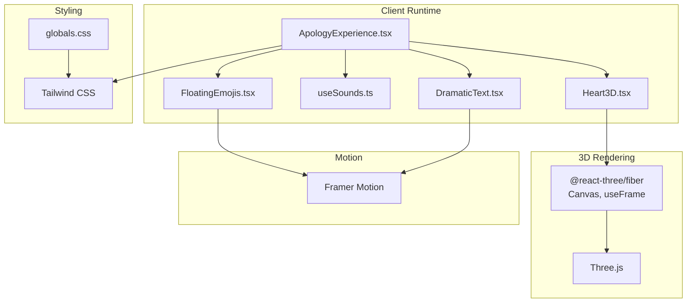
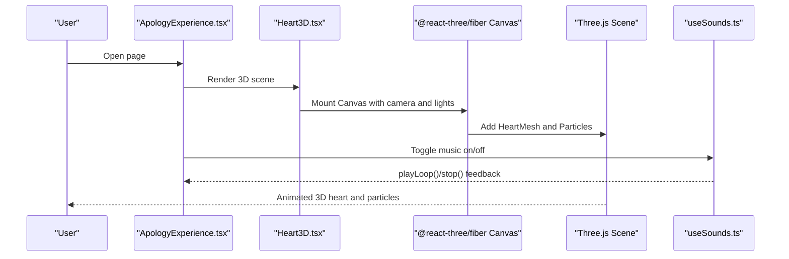
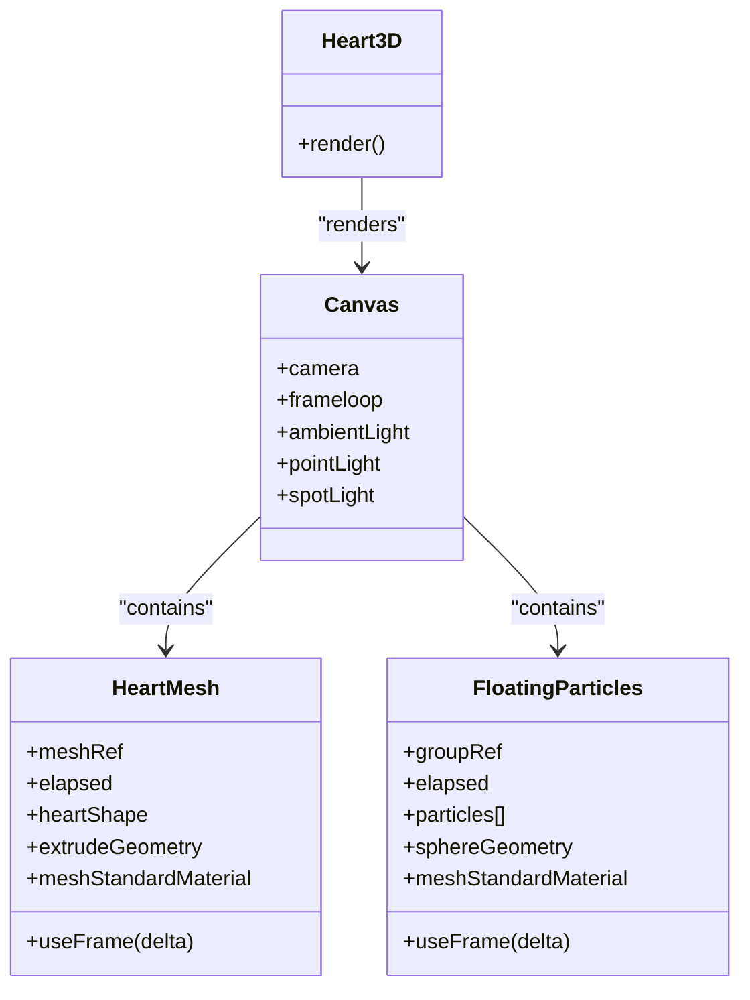
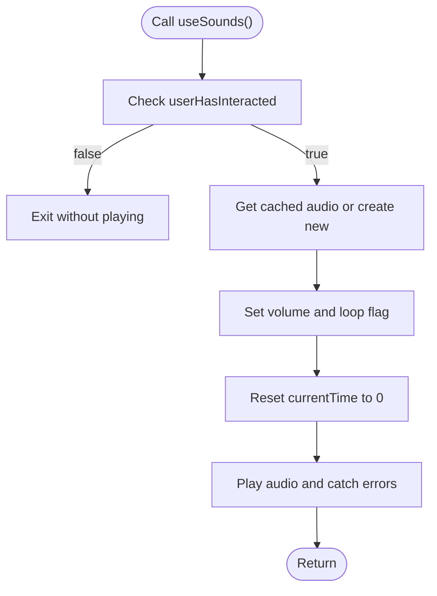
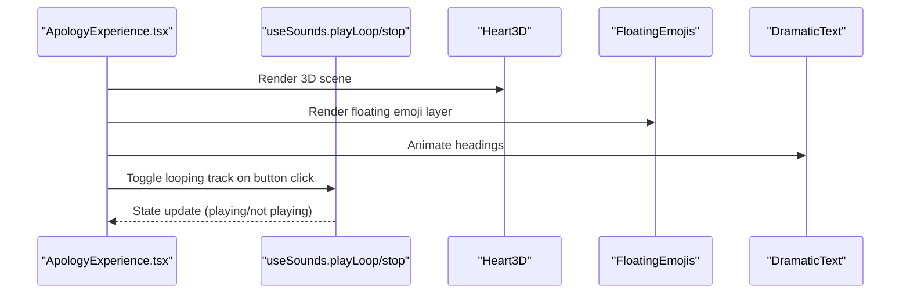
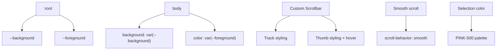
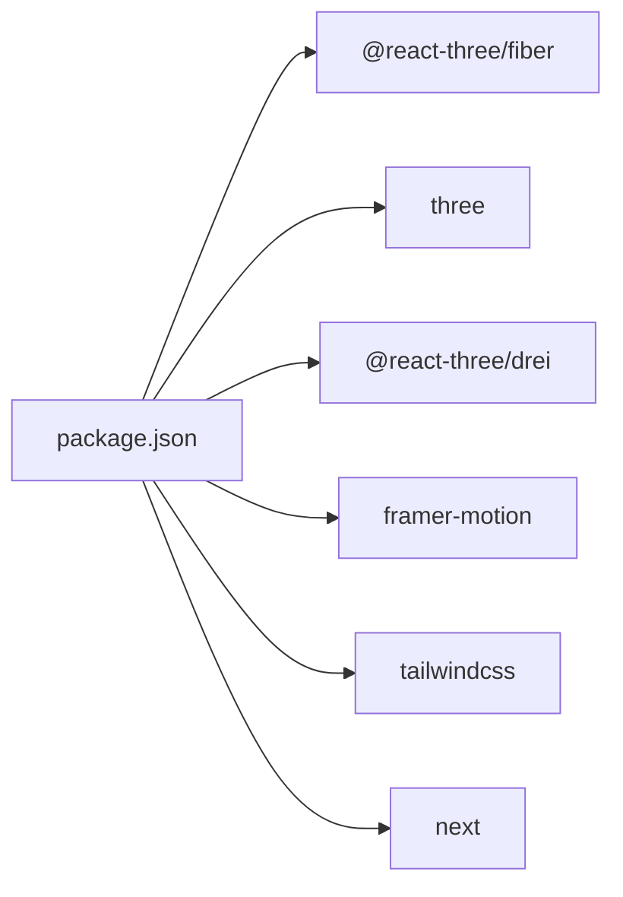

# Visual Systems

<cite>
**Referenced Files in This Document**
- [Heart3D.tsx](file://src/components/Heart3D.tsx)
- [useSounds.ts](file://src/components/useSounds.ts)
- [ApologyExperience.tsx](file://src/components/ApologyExperience.tsx)
- [FloatingEmojis.tsx](file://src/components/FloatingEmojis.tsx)
- [DramaticText.tsx](file://src/components/DramaticText.tsx)
- [globals.css](file://src/app/globals.css)
- [package.json](file://package.json)
- [next.config.ts](file://next.config.ts)
- [postcss.config.mjs](file://postcss.config.mjs)
- [layout.tsx](file://src/app/[lang]/layout.tsx)
- [site.webmanifest](file://public/site.webmanifest)
</cite>

## Table of Contents
1. [Introduction](#introduction)
2. [Project Structure](#project-structure)
3. [Core Components](#core-components)
4. [Architecture Overview](#architecture-overview)
5. [Detailed Component Analysis](#detailed-component-analysis)
6. [Dependency Analysis](#dependency-analysis)
7. [Performance Considerations](#performance-considerations)
8. [Troubleshooting Guide](#troubleshooting-guide)
9. [Conclusion](#conclusion)
10. [Appendices](#appendices)

## Introduction
This document explains the visual systems that deliver an immersive 3D experience and integrated audio. It covers:
- The Heart3D component powered by Three.js and @react-three/fiber, including geometry generation, materials, lighting, and animation loops
- The sound system architecture with audio caching, autoplay policy compliance, and volume controls
- The CSS animation framework, responsive design patterns, color schemes, and Tailwind-based styling
- Three.js configuration, WebGL optimization, audio resource management, and performance considerations
- Practical guidance for customizing visual effects, adding new animations, and device-specific tuning
- Browser compatibility, accessibility features, and troubleshooting common visual and audio issues

## Project Structure
The visual stack is organized around a few key areas:
- 3D rendering: Heart3D.tsx integrates Three.js via @react-three/fiber
- Audio: useSounds.ts centralizes audio caching and playback
- Page composition: ApologyExperience.tsx orchestrates animations, 3D scenes, and sound
- Motion and effects: FloatingEmojis.tsx and DramaticText.tsx use Framer Motion
- Styling: globals.css defines theme tokens, scrollbars, selection colors, and Tailwind integration
- Build and tooling: package.json lists dependencies; next.config.ts and postcss.config.mjs configure Next.js and Tailwind

**Diagram sources**
- [ApologyExperience.tsx:32-219](file://src/components/ApologyExperience.tsx#L32-L219)
- [Heart3D.tsx:87-107](file://src/components/Heart3D.tsx#L87-L107)
- [useSounds.ts:41-69](file://src/components/useSounds.ts#L41-L69)
- [FloatingEmojis.tsx:15-64](file://src/components/FloatingEmojis.tsx#L15-L64)
- [DramaticText.tsx:12-43](file://src/components/DramaticText.tsx#L12-L43)
- [globals.css:1-42](file://src/app/globals.css#L1-L42)

**Section sources**
- [ApologyExperience.tsx:32-219](file://src/components/ApologyExperience.tsx#L32-L219)
- [Heart3D.tsx:87-107](file://src/components/Heart3D.tsx#L87-L107)
- [useSounds.ts:41-69](file://src/components/useSounds.ts#L41-L69)
- [FloatingEmojis.tsx:15-64](file://src/components/FloatingEmojis.tsx#L15-L64)
- [DramaticText.tsx:12-43](file://src/components/DramaticText.tsx#L12-L43)
- [globals.css:1-42](file://src/app/globals.css#L1-L42)
- [package.json:11-24](file://package.json#L11-L24)
- [next.config.ts:3-8](file://next.config.ts#L3-L8)
- [postcss.config.mjs:1-8](file://postcss.config.mjs#L1-L8)

## Core Components
- Heart3D: Creates a 3D heart geometry, applies materials, and animates scale and rotation. Includes ambient and directional lights plus floating particle effects.
- useSounds: Provides a global audio cache, enforces user interaction before autoplay, and exposes play/playLoop/stop APIs.
- ApologyExperience: Dynamically loads Heart3D, toggles looping music, and composes page sections with motion and emoji effects.
- FloatingEmojis: Renders animated floating emojis with randomized trajectories and easing.
- DramaticText: Animates text entrance with spring physics and per-word staggering.
- globals.css: Defines CSS variables for theme colors, custom scrollbar styles, smooth scrolling, and selection colors.

**Section sources**
- [Heart3D.tsx:7-107](file://src/components/Heart3D.tsx#L7-L107)
- [useSounds.ts:5-69](file://src/components/useSounds.ts#L5-L69)
- [ApologyExperience.tsx:32-219](file://src/components/ApologyExperience.tsx#L32-L219)
- [FloatingEmojis.tsx:15-64](file://src/components/FloatingEmojis.tsx#L15-L64)
- [DramaticText.tsx:12-43](file://src/components/DramaticText.tsx#L12-L43)
- [globals.css:3-42](file://src/app/globals.css#L3-L42)

## Architecture Overview
The visual architecture combines declarative 3D rendering, reactive motion, and centralized audio management. The page composes these subsystems into a cohesive experience.

**Diagram sources**
- [ApologyExperience.tsx:32-219](file://src/components/ApologyExperience.tsx#L32-L219)
- [Heart3D.tsx:87-107](file://src/components/Heart3D.tsx#L87-L107)
- [useSounds.ts:41-69](file://src/components/useSounds.ts#L41-L69)

## Detailed Component Analysis

### Heart3D Component
The Heart3D component renders a 3D heart with:
- Geometry: heart-shaped profile extruded along depth with beveled edges
- Materials: Standard material with tint, metalness, and roughness
- Animation loop: frame-based scaling and rotation for a beating effect
- Lighting: ambient light and multiple point/spot lights for depth and highlights
- Particles: Floating spheres with emissive material for a glowing aura

**Diagram sources**
- [Heart3D.tsx:7-107](file://src/components/Heart3D.tsx#L7-L107)

Key implementation notes:
- Geometry creation uses a Shape with bezier curves and extrusion settings for beveling and steps
- Material uses metallic and rough values for realistic shading
- Animation updates scale and rotation each frame using elapsed time
- Lighting setup balances ambient, directional, and spot sources for visual richness

**Section sources**
- [Heart3D.tsx:7-48](file://src/components/Heart3D.tsx#L7-L48)
- [Heart3D.tsx:50-85](file://src/components/Heart3D.tsx#L50-L85)
- [Heart3D.tsx:87-107](file://src/components/Heart3D.tsx#L87-L107)

### Sound System Architecture
The sound system ensures autoplay compliance and efficient resource reuse:
- Autoplay policy: Tracks first user interaction via click, touchstart, or scroll
- Audio cache: Reuses HTMLAudioElement instances to avoid loading overhead
- Playback APIs: play(name, volume), playLoop(name, volume), stop(name)
- Volume control: Per-call volume adjustment; looped tracks use lower volumes

**Diagram sources**
- [useSounds.ts:14-69](file://src/components/useSounds.ts#L14-L69)

Operational details:
- SOUNDS map enumerates asset paths; names are typed for safety
- Global cache prevents redundant audio instances
- playLoop enables continuous background ambiance at reduced volume
- stop pauses and resets audio to allow clean transitions

**Section sources**
- [useSounds.ts:5-10](file://src/components/useSounds.ts#L5-L10)
- [useSounds.ts:14-27](file://src/components/useSounds.ts#L14-L27)
- [useSounds.ts:29-39](file://src/components/useSounds.ts#L29-L39)
- [useSounds.ts:41-69](file://src/components/useSounds.ts#L41-L69)

### Page Composition and Motion Effects
ApologyExperience composes the visual experience:
- Dynamic import of Heart3D to avoid SSR issues
- Music toggle integrates with useSounds to start/stop looping audio
- FloatingEmojis creates ambient floating emoji animations
- DramaticText animates section headings with spring physics
- Responsive sizing and gradient backgrounds for visual depth

**Diagram sources**
- [ApologyExperience.tsx:32-219](file://src/components/ApologyExperience.tsx#L32-L219)
- [useSounds.ts:41-69](file://src/components/useSounds.ts#L41-L69)

**Section sources**
- [ApologyExperience.tsx:32-219](file://src/components/ApologyExperience.tsx#L32-L219)
- [FloatingEmojis.tsx:15-64](file://src/components/FloatingEmojis.tsx#L15-L64)
- [DramaticText.tsx:12-43](file://src/components/DramaticText.tsx#L12-L43)

### CSS Animation Framework and Visual Styling
The styling system leverages Tailwind and custom CSS:
- Theme tokens via CSS variables for background and foreground
- Custom scrollbar styling with hover effects
- Smooth scrolling behavior and accent selection color
- Gradient backgrounds and backdrop blur for depth and glassmorphism
- Responsive typography and spacing across breakpoints

**Diagram sources**
- [globals.css:3-42](file://src/app/globals.css#L3-L42)

**Section sources**
- [globals.css:3-42](file://src/app/globals.css#L3-L42)

## Dependency Analysis
External libraries and integrations:
- @react-three/fiber and three: 3D rendering pipeline
- @react-three/drei: helpful Three.js addons (not used in current Heart3D)
- framer-motion: motion and animation primitives
- tailwindcss: utility-first styling
- next: framework runtime and SSR/SSG

**Diagram sources**
- [package.json:11-24](file://package.json#L11-L24)

**Section sources**
- [package.json:11-24](file://package.json#L11-L24)

## Performance Considerations
- 3D rendering
  - Keep geometry complexity reasonable; extrusion settings balance quality and performance
  - Prefer instancing or batching for large particle counts; current solution uses small fixed count
  - Limit expensive materials (metalness/roughness) to key objects; use emissive materials sparingly
  - Use efficient lighting setups; avoid excessive shadow calculations
- Audio
  - Reuse audio instances via the global cache to reduce memory and startup latency
  - Enforce user interaction before autoplay to satisfy browser policies
  - Lower volume for looping tracks to prevent fatigue and reduce CPU usage
- Motion
  - Reduce emoji count on smaller screens to maintain frame rates
  - Use hardware-accelerated transforms (opacity, scale, rotate) in animations
- Styling
  - Leverage Tailwind utilities to minimize custom CSS and reduce bundle size
  - Avoid heavy filters/backdrop blur on low-end devices

[No sources needed since this section provides general guidance]

## Troubleshooting Guide
Common visual and audio issues:
- 3D scene does not render
  - Verify Canvas mounting and camera position
  - Ensure Heart3D is dynamically imported to avoid SSR issues
- No sound plays
  - Confirm user interaction occurred before attempting autoplay
  - Check that audio assets are served under the expected paths
- Performance drops on mobile
  - Reduce particle count and simplify geometry
  - Disable or reduce emissive materials
  - Lower motion complexity on smaller screens
- Accessibility
  - Provide alternative static fallbacks for 3D scenes
  - Offer controls to pause or reduce motion
  - Ensure sufficient color contrast against dark themes

**Section sources**
- [ApologyExperience.tsx:12](file://src/components/ApologyExperience.tsx#L12)
- [Heart3D.tsx:87-107](file://src/components/Heart3D.tsx#L87-L107)
- [useSounds.ts:14-27](file://src/components/useSounds.ts#L14-L27)

## Conclusion
The visual systems combine Three.js-powered 3D rendering, centralized audio management, and expressive motion to create an immersive experience. By leveraging caching, user interaction gating, and responsive design patterns, the implementation remains performant and accessible across devices. Extending the system involves adding new animations, adjusting materials and lighting, and introducing additional audio assets with the existing hooks.

[No sources needed since this section summarizes without analyzing specific files]

## Appendices

### Browser Compatibility and Manifest
- The application sets up a web app manifest and icons for installability and theme colors
- Next.js layout configures metadata, Open Graph, Twitter, and robots directives

**Section sources**
- [layout.tsx:68-107](file://src/app/[lang]/layout.tsx#L68-L107)
- [site.webmanifest:1](file://public/site.webmanifest#L1)

### Customization Playbook
- Customize visual effects
  - Adjust material colors and metallic/roughness values in HeartMesh
  - Modify extrusion depth and bevel settings for different heart profiles
  - Change lighting positions and intensities for dramatic mood shifts
- Integrate new animations
  - Add new animated meshes to the Canvas scene in Heart3D
  - Use Framer Motion for page-level transitions and micro-interactions
- Optimize for devices
  - Scale down particle counts and geometry segments on mobile
  - Reduce motion intensity or offer a “reduce motion” mode
  - Serve lower-resolution audio or disable looping tracks on constrained devices

[No sources needed since this section provides general guidance]