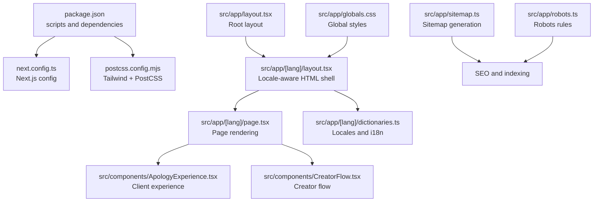
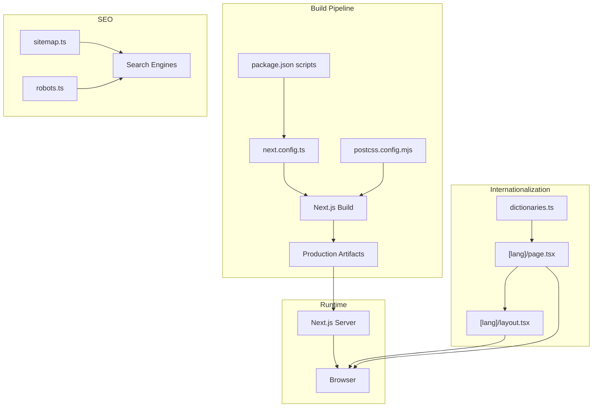
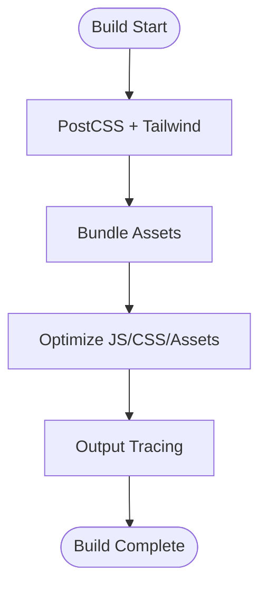
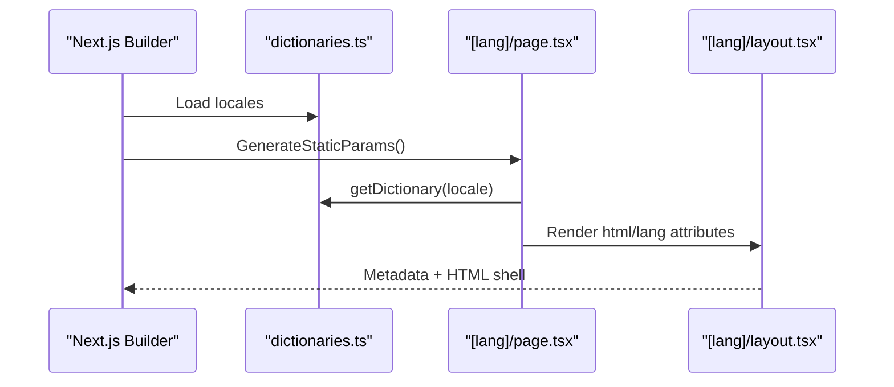
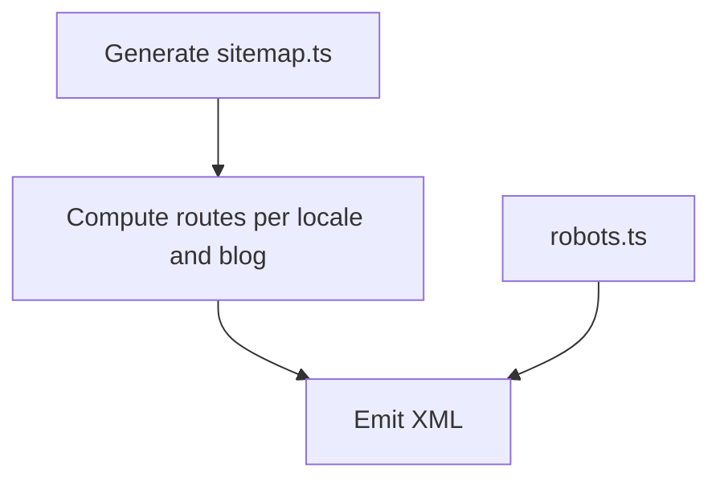
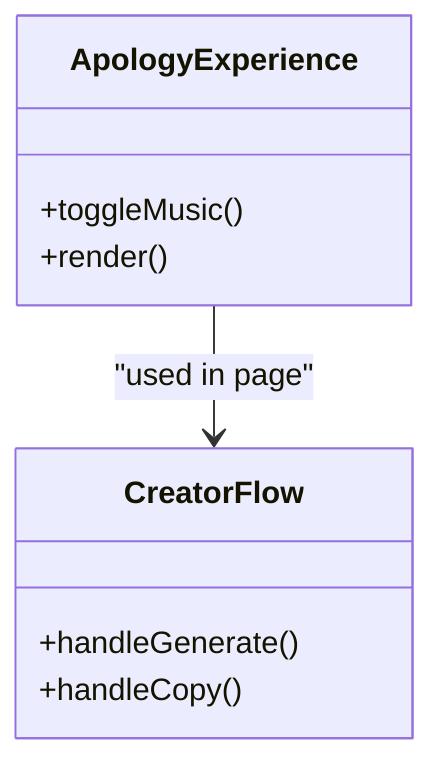
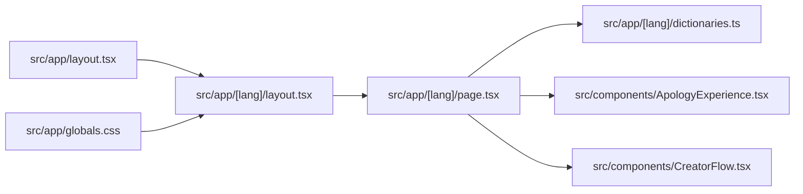

# Deployment & DevOps

<cite>
**Referenced Files in This Document**
- [package.json](file://package.json)
- [next.config.ts](file://next.config.ts)
- [postcss.config.mjs](file://postcss.config.mjs)
- [src/app/[lang]/layout.tsx](file://src/app/[lang]/layout.tsx)
- [src/app/[lang]/page.tsx](file://src/app/[lang]/page.tsx)
- [src/app/robots.ts](file://src/app/robots.ts)
- [src/app/sitemap.ts](file://src/app/sitemap.ts)
- [src/app/[lang]/dictionaries.ts](file://src/app/[lang]/dictionaries.ts)
- [src/app/layout.tsx](file://src/app/layout.tsx)
- [src/app/globals.css](file://src/app/globals.css)
- [src/components/ApologyExperience.tsx](file://src/components/ApologyExperience.tsx)
- [src/components/CreatorFlow.tsx](file://src/components/CreatorFlow.tsx)
- [README.md](file://README.md)
</cite>

## Table of Contents
1. [Introduction](#introduction)
2. [Project Structure](#project-structure)
3. [Core Components](#core-components)
4. [Architecture Overview](#architecture-overview)
5. [Detailed Component Analysis](#detailed-component-analysis)
6. [Dependency Analysis](#dependency-analysis)
7. [Performance Considerations](#performance-considerations)
8. [Troubleshooting Guide](#troubleshooting-guide)
9. [Conclusion](#conclusion)
10. [Appendices](#appendices)

## Introduction
This document provides comprehensive deployment and DevOps guidance for the I Am Really Sorry platform. It covers Next.js build configuration, environment variable management, deployment preparation, build optimization, asset bundling, production deployment strategies, CI/CD pipeline setup, automated testing integration, release management, environment configuration across development, staging, and production, monitoring and analytics, error tracking, performance monitoring, security considerations (including SSL/TLS and CSP), deployment automation scripts, rollback procedures, maintenance workflows, scaling, CDN configuration, load balancing, backup and disaster recovery, and operational runbooks.

## Project Structure
The platform is a Next.js 16 application using the App Router. Key areas relevant to deployment and DevOps include:
- Build and runtime scripts in package.json
- Next.js configuration in next.config.ts
- Tailwind CSS integration via PostCSS in postcss.config.mjs
- Internationalization and static generation in [lang] routes
- Sitemap and robots generation for SEO
- Global styles and root layout
- Client-side components leveraging dynamic imports and third-party libraries

**Diagram sources**
- [package.json:1-36](file://package.json#L1-L36)
- [next.config.ts:1-8](file://next.config.ts#L1-L8)
- [postcss.config.mjs:1-8](file://postcss.config.mjs#L1-L8)
- [src/app/layout.tsx:1-9](file://src/app/layout.tsx#L1-L9)
- [src/app/[lang]/layout.tsx:1-108](file://src/app/[lang]/layout.tsx#L1-L108)
- [src/app/[lang]/page.tsx:1-32](file://src/app/[lang]/page.tsx#L1-L32)
- [src/app/[lang]/dictionaries.ts:1-26](file://src/app/[lang]/dictionaries.ts#L1-L26)
- [src/app/sitemap.ts:1-60](file://src/app/sitemap.ts#L1-L60)
- [src/app/robots.ts:1-15](file://src/app/robots.ts#L1-L15)
- [src/app/globals.css:1-42](file://src/app/globals.css#L1-L42)
- [src/components/ApologyExperience.tsx:1-219](file://src/components/ApologyExperience.tsx#L1-L219)
- [src/components/CreatorFlow.tsx:1-335](file://src/components/CreatorFlow.tsx#L1-L335)

**Section sources**
- [package.json:1-36](file://package.json#L1-L36)
- [next.config.ts:1-8](file://next.config.ts#L1-L8)
- [postcss.config.mjs:1-8](file://postcss.config.mjs#L1-L8)
- [src/app/layout.tsx:1-9](file://src/app/layout.tsx#L1-L9)
- [src/app/[lang]/layout.tsx:1-108](file://src/app/[lang]/layout.tsx#L1-L108)
- [src/app/[lang]/page.tsx:1-32](file://src/app/[lang]/page.tsx#L1-L32)
- [src/app/[lang]/dictionaries.ts:1-26](file://src/app/[lang]/dictionaries.ts#L1-L26)
- [src/app/sitemap.ts:1-60](file://src/app/sitemap.ts#L1-L60)
- [src/app/robots.ts:1-15](file://src/app/robots.ts#L1-L15)
- [src/app/globals.css:1-42](file://src/app/globals.css#L1-L42)
- [src/components/ApologyExperience.tsx:1-219](file://src/components/ApologyExperience.tsx#L1-L219)
- [src/components/CreatorFlow.tsx:1-335](file://src/components/CreatorFlow.tsx#L1-L335)

## Core Components
- Build and runtime scripts: The project defines standard Next.js scripts for development, production build, and start in package.json.
- Next.js configuration: next.config.ts is present but currently empty; it can be extended for advanced optimizations and integrations.
- Styling pipeline: Tailwind CSS is configured via PostCSS; ensure Tailwind is properly generating purgeable CSS for production.
- Internationalization: Static generation of locale-specific pages and dictionary loading per locale.
- SEO: Sitemap and robots are generated dynamically for indexing and crawl control.
- Client experience: Components leverage dynamic imports and animations; SSR/SSG behavior should be considered for performance.

**Section sources**
- [package.json:5-10](file://package.json#L5-L10)
- [next.config.ts:3-5](file://next.config.ts#L3-L5)
- [postcss.config.mjs:1-8](file://postcss.config.mjs#L1-L8)
- [src/app/[lang]/dictionaries.ts:1-26](file://src/app/[lang]/dictionaries.ts#L1-L26)
- [src/app/sitemap.ts:1-60](file://src/app/sitemap.ts#L1-L60)
- [src/app/robots.ts:1-15](file://src/app/robots.ts#L1-L15)
- [src/components/ApologyExperience.tsx:12](file://src/components/ApologyExperience.tsx#L12)

## Architecture Overview
The deployment architecture centers around Next.js’s static generation and serverless runtime model. The App Router organizes locale-specific pages, with metadata and assets managed centrally. The build pipeline integrates Tailwind CSS and TypeScript, producing optimized bundles for production.

**Diagram sources**
- [package.json:5-10](file://package.json#L5-L10)
- [next.config.ts:3-5](file://next.config.ts#L3-L5)
- [postcss.config.mjs:1-8](file://postcss.config.mjs#L1-L8)
- [src/app/[lang]/dictionaries.ts:1-26](file://src/app/[lang]/dictionaries.ts#L1-L26)
- [src/app/[lang]/page.tsx:1-32](file://src/app/[lang]/page.tsx#L1-L32)
- [src/app/[lang]/layout.tsx:1-108](file://src/app/[lang]/layout.tsx#L1-L108)
- [src/app/sitemap.ts:1-60](file://src/app/sitemap.ts#L1-L60)
- [src/app/robots.ts:1-15](file://src/app/robots.ts#L1-L15)

## Detailed Component Analysis

### Next.js Build Configuration
- Purpose: Centralized Next.js configuration for advanced build and runtime behaviors.
- Current state: Empty configuration object; suitable for adding experimental features, redirects, headers, and performance-related settings.
- Recommendations:
  - Add output tracing and appDir optimizations.
  - Configure headers for security (CSP, HSTS).
  - Enable image optimization and remotePatterns if serving external images.
  - Set distDir and experimental features as needed.

**Section sources**
- [next.config.ts:3-5](file://next.config.ts#L3-L5)

### Environment Variable Management
- Current usage: No explicit environment variables are referenced in the codebase.
- Recommended variables:
  - Runtime: NEXT_PUBLIC_* for client-visible values; server-only variables for secrets.
  - Examples: BASE_URL, NEXT_PUBLIC_GA_ID, NEXT_PUBLIC_SENTRY_DSN, NEXT_PUBLIC_FATHOM_ID.
- Implementation pattern:
  - Define variables in CI/CD secrets and pass to build/runtime.
  - Use Next.js env handling and avoid leaking secrets to the client.

**Section sources**
- [src/app/[lang]/layout.tsx:19](file://src/app/[lang]/layout.tsx#L19)
- [src/app/sitemap.ts:3-4](file://src/app/sitemap.ts#L3-L4)

### Asset Bundling and Optimization
- Tailwind + PostCSS: Tailwind is configured via PostCSS; ensure purge is enabled for production to remove unused CSS.
- Fonts: Next.js automatic font optimization is leveraged; keep fonts local or via CDN.
- Images: Use next/image with appropriate loader and domains.
- Third-party libraries: Dynamic imports reduce initial bundle size (e.g., 3D components).

**Diagram sources**
- [postcss.config.mjs:1-8](file://postcss.config.mjs#L1-L8)
- [src/components/ApologyExperience.tsx:12](file://src/components/ApologyExperience.tsx#L12)

**Section sources**
- [postcss.config.mjs:1-8](file://postcss.config.mjs#L1-L8)
- [src/components/ApologyExperience.tsx:12](file://src/components/ApologyExperience.tsx#L12)

### Internationalization and Static Generation
- Static params: Generates locale-specific pages at build time.
- Dictionary loading: Async dictionary resolution per locale.
- Metadata: Canonical URLs and alternate languages for SEO.

**Diagram sources**
- [src/app/[lang]/dictionaries.ts:1-26](file://src/app/[lang]/dictionaries.ts#L1-L26)
- [src/app/[lang]/page.tsx:1-32](file://src/app/[lang]/page.tsx#L1-L32)
- [src/app/[lang]/layout.tsx:6-66](file://src/app/[lang]/layout.tsx#L6-L66)

**Section sources**
- [src/app/[lang]/dictionaries.ts:1-26](file://src/app/[lang]/dictionaries.ts#L1-L26)
- [src/app/[lang]/page.tsx:6-14](file://src/app/[lang]/page.tsx#L6-L14)
- [src/app/[lang]/layout.tsx:6-66](file://src/app/[lang]/layout.tsx#L6-L66)

### SEO, Sitemaps, and Robots
- Sitemap: Dynamically generates routes for locales and blog slugs.
- Robots: Defines allow/disallow rules and sitemap location.

**Diagram sources**
- [src/app/sitemap.ts:20-59](file://src/app/sitemap.ts#L20-L59)
- [src/app/robots.ts:3-14](file://src/app/robots.ts#L3-L14)

**Section sources**
- [src/app/sitemap.ts:1-60](file://src/app/sitemap.ts#L1-L60)
- [src/app/robots.ts:1-15](file://src/app/robots.ts#L1-L15)

### Client Experience and Dynamic Imports
- Dynamic imports: Components like 3D visuals are marked for client-only SSR to reduce server payload.
- Animations: Framer Motion enhances UX without impacting server rendering.

**Diagram sources**
- [src/components/ApologyExperience.tsx:32-219](file://src/components/ApologyExperience.tsx#L32-L219)
- [src/components/CreatorFlow.tsx:44-335](file://src/components/CreatorFlow.tsx#L44-L335)

**Section sources**
- [src/components/ApologyExperience.tsx:12](file://src/components/ApologyExperience.tsx#L12)
- [src/components/CreatorFlow.tsx:52-63](file://src/components/CreatorFlow.tsx#L52-L63)

### Conceptual Overview
- Deployment targets: Vercel, Netlify, or self-hosted Next.js servers.
- CI/CD: Automated linting, builds, preview deployments, and production releases.
- Monitoring: Analytics, error tracking, and performance metrics.
- Security: HTTPS, CSP, HSTS, and secure headers.
- Scaling: CDN, caching, and load balancing strategies.

[No sources needed since this section doesn't analyze specific files]

## Dependency Analysis
- Internal dependencies:
  - Root layout depends on locale-aware layout.
  - Page depends on dictionaries and renders creator/visitor experiences.
  - Components depend on shared hooks and assets.
- External dependencies:
  - Next.js, React, Tailwind CSS, Framer Motion, Three.js ecosystem.
- Build-time dependencies:
  - PostCSS, Tailwind plugin, TypeScript.

**Diagram sources**
- [src/app/layout.tsx:1-9](file://src/app/layout.tsx#L1-L9)
- [src/app/[lang]/layout.tsx:1-108](file://src/app/[lang]/layout.tsx#L1-L108)
- [src/app/[lang]/page.tsx:1-32](file://src/app/[lang]/page.tsx#L1-L32)
- [src/app/[lang]/dictionaries.ts:1-26](file://src/app/[lang]/dictionaries.ts#L1-L26)
- [src/app/globals.css:1-42](file://src/app/globals.css#L1-L42)
- [src/components/ApologyExperience.tsx:1-219](file://src/components/ApologyExperience.tsx#L1-L219)
- [src/components/CreatorFlow.tsx:1-335](file://src/components/CreatorFlow.tsx#L1-L335)

**Section sources**
- [src/app/layout.tsx:1-9](file://src/app/layout.tsx#L1-L9)
- [src/app/[lang]/layout.tsx:1-108](file://src/app/[lang]/layout.tsx#L1-L108)
- [src/app/[lang]/page.tsx:1-32](file://src/app/[lang]/page.tsx#L1-L32)
- [src/app/[lang]/dictionaries.ts:1-26](file://src/app/[lang]/dictionaries.ts#L1-L26)
- [src/app/globals.css:1-42](file://src/app/globals.css#L1-L42)
- [src/components/ApologyExperience.tsx:1-219](file://src/components/ApologyExperience.tsx#L1-L219)
- [src/components/CreatorFlow.tsx:1-335](file://src/components/CreatorFlow.tsx#L1-L335)

## Performance Considerations
- Build-time:
  - Enable PurgeCSS with Tailwind for smaller CSS.
  - Use next/image with proper sizing and formats.
  - Minimize third-party libraries and lazy-load heavy components.
- Runtime:
  - Prefer static generation for locale pages.
  - Use dynamic imports for client-only heavy modules.
  - Leverage Next.js caching and ISR if content updates are infrequent.
- Observability:
  - Instrument analytics and error tracking.
  - Monitor Largest Contentful Paint (LCP), First Input Delay (FID), and Cumulative Layout Shift (CLS).

[No sources needed since this section provides general guidance]

## Troubleshooting Guide
- Build fails due to missing environment variables:
  - Ensure NEXT_PUBLIC_* and server-only variables are set in CI/CD.
- Locale not found:
  - Verify generateStaticParams and hasLocale logic.
- Sitemap or robots not updating:
  - Confirm sitemap.ts and robots.ts export default functions and are reachable.
- Dynamic import errors:
  - Confirm SSR is disabled for client-only components.

**Section sources**
- [src/app/[lang]/layout.tsx:76](file://src/app/[lang]/layout.tsx#L76)
- [src/app/[lang]/page.tsx:14](file://src/app/[lang]/page.tsx#L14)
- [src/app/sitemap.ts:20-59](file://src/app/sitemap.ts#L20-L59)
- [src/app/robots.ts:3-14](file://src/app/robots.ts#L3-L14)
- [src/components/ApologyExperience.tsx:12](file://src/components/ApologyExperience.tsx#L12)

## Conclusion
This guide outlines a practical, production-ready deployment and DevOps strategy for the I Am Really Sorry platform. By extending next.config.ts, managing environment variables, optimizing assets, and implementing robust CI/CD, monitoring, and security controls, the platform can achieve reliable, scalable, and maintainable operations across development, staging, and production.

[No sources needed since this section summarizes without analyzing specific files]

## Appendices

### A. Environment Configuration Matrix
- Development:
  - Localhost base URL, mock analytics, verbose logging.
- Staging:
  - Staging domain, test analytics, limited rate limits.
- Production:
  - Canonical base URL, live analytics, strict CSP/HSTS.

**Section sources**
- [src/app/[lang]/layout.tsx:19](file://src/app/[lang]/layout.tsx#L19)
- [src/app/sitemap.ts:3-4](file://src/app/sitemap.ts#L3-L4)

### B. CI/CD Pipeline Outline
- Trigger: Push to main branch and pull requests.
- Steps:
  - Install dependencies.
  - Lint and type-check.
  - Build and export artifacts.
  - Preview deployment for PRs.
  - Production release on main branch.
- Artifacts: Next.js static export or server build.

**Section sources**
- [package.json:5-10](file://package.json#L5-L10)
- [README.md:32-36](file://README.md#L32-L36)

### C. Monitoring and Analytics
- Analytics: Integrate GA4/Fathom with NEXT_PUBLIC_GA_ID or NEXT_PUBLIC_FATHOM_ID.
- Error tracking: Sentry with NEXT_PUBLIC_SENTRY_DSN.
- Performance: Web Vitals instrumentation and synthetic checks.

**Section sources**
- [src/app/[lang]/layout.tsx:19](file://src/app/[lang]/layout.tsx#L19)

### D. Security Hardening
- HTTPS: Enforce TLS at origin and CDN edges.
- Headers: Add CSP, HSTS, X-Frame-Options, X-Content-Type-Options.
- Content security policy: Restrict inline scripts/styles; allow only trusted domains.

**Section sources**
- [src/app/[lang]/layout.tsx:19](file://src/app/[lang]/layout.tsx#L19)

### E. Deployment Automation Scripts
- Example commands:
  - Build: next build
  - Start: next start
  - Export (static): next export (if applicable)
- CI/CD:
  - Use platform-specific deployment steps (e.g., Vercel CLI, GitHub Actions).

**Section sources**
- [package.json:7-8](file://package.json#L7-L8)
- [README.md:32-36](file://README.md#L32-L36)

### F. Rollback Procedures
- Canary releases: Gradually shift traffic to new version.
- Version pinning: Keep previous build artifacts for quick rollback.
- Health checks: Monitor uptime, error rates, and performance post-deploy.

[No sources needed since this section provides general guidance]

### G. Maintenance Workflows
- Hotfixes: Branch from latest stable tag, merge to main after review.
- Feature deploys: Feature branches merged via pull requests with previews.
- Decommissioning: Remove unused routes and assets; update sitemap.

[No sources needed since this section provides general guidance]

### H. Scaling, CDN, and Load Balancing
- CDN: Serve static assets and ISR-generated pages via CDN.
- Load balancing: Distribute traffic across regional instances.
- Caching: Use cache-control headers and CDN caching strategies.

[No sources needed since this section provides general guidance]

### I. Backup and Disaster Recovery
- Backups: Regular snapshots of database/API keys and configuration.
- DR plan: Failover to secondary region; validate DNS failover and CDN propagation.

[No sources needed since this section provides general guidance]

### J. Operational Runbooks
- On-call: Escalation matrix and communication channels.
- Runbooks: Incident response, incident documentation, post-mortem process.

[No sources needed since this section provides general guidance]