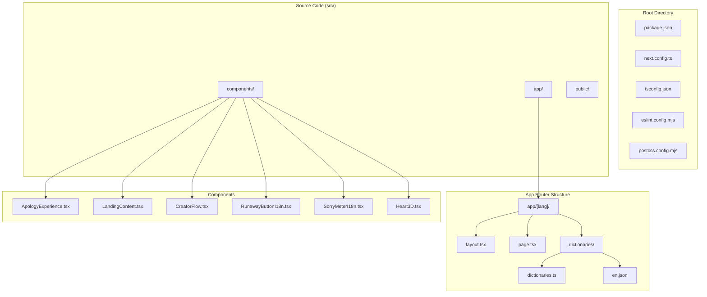

# Getting Started

<cite>
**Referenced Files in This Document**
- [package.json](file://package.json)
- [README.md](file://README.md)
- [next.config.ts](file://next.config.ts)
- [tsconfig.json](file://tsconfig.json)
- [eslint.config.mjs](file://eslint.config.mjs)
- [postcss.config.mjs](file://postcss.config.mjs)
- [src/app/[lang]/layout.tsx](file://src/app/[lang]/layout.tsx)
- [src/app/[lang]/page.tsx](file://src/app/[lang]/page.tsx)
- [src/app/[lang]/dictionaries.ts](file://src/app/[lang]/dictionaries.ts)
- [src/app/[lang]/dictionaries/en.json](file://src/app/[lang]/dictionaries/en.json)
- [src/proxy.ts](file://src/proxy.ts)
- [src/app/globals.css](file://src/app/globals.css)
- [src/components/ApologyExperience.tsx](file://src/components/ApologyExperience.tsx)
- [src/components/LandingContent.tsx](file://src/components/LandingContent.tsx)
</cite>

## Table of Contents
1. [Introduction](#introduction)
2. [Prerequisites](#prerequisites)
3. [Installation](#installation)
4. [Development Workflow](#development-workflow)
5. [Project Structure](#project-structure)
6. [Environment Variables](#environment-variables)
7. [Customization Guide](#customization-guide)
8. [Deployment](#deployment)
9. [Troubleshooting](#troubleshooting)
10. [Conclusion](#conclusion)

## Introduction
I Am Really Sorry is a Next.js application that creates personalized, interactive apology pages with 3D animations, meme sounds, and an engaging user experience. The project supports multiple languages and provides both creator and receiver experiences for generating heartfelt apologies.

## Prerequisites
Before installing the project, ensure your development environment meets the following requirements:

### Node.js Version
- Required: Node.js 18.x or later
- Recommended: Node.js 18.17.0 or higher for optimal compatibility

### Package Managers
The project supports multiple package managers. Choose one of the following:
- npm (Node Package Manager)
- yarn
- pnpm
- bun

### Operating System
- macOS, Windows, or Linux
- Git installed for repository cloning

### Development Tools
- Basic text editor or IDE (VS Code recommended)
- Terminal/command prompt
- Web browser for testing

**Section sources**
- [package.json:11-24](file://package.json#L11-L24)
- [tsconfig.json:3-14](file://tsconfig.json#L3-L14)

## Installation
Follow these step-by-step instructions to set up the project locally:

### Step 1: Clone the Repository
```bash
git clone https://github.com/yourusername/iamreallysorry.git
cd iamreallysorry
```

### Step 2: Install Dependencies
Choose one of the supported package managers:

Using npm:
```bash
npm install
```

Using yarn:
```bash
yarn install
```

Using pnpm:
```bash
pnpm install
```

Using bun:
```bash
bun install
```

### Step 3: Verify Installation
Check that all dependencies were installed correctly by running:
```bash
npm run build
```

**Section sources**
- [README.md:5-15](file://README.md#L5-L15)
- [package.json:5-10](file://package.json#L5-L10)

## Development Workflow
The development server provides hot reloading and live updates during development.

### Starting the Development Server
From the project root directory, run any of the following commands:

Using npm:
```bash
npm run dev
```

Using yarn:
```bash
yarn dev
```

Using pnpm:
```bash
pnpm dev
```

Using bun:
```bash
bun dev
```

### Access the Application
Once the server starts successfully, open your browser and navigate to:
```
http://localhost:3000
```

### Development Scripts
The project includes several useful scripts defined in package.json:
- `dev`: Starts the development server
- `build`: Creates an optimized production build
- `start`: Runs the production server
- `lint`: Executes ESLint for code quality checks

**Section sources**
- [README.md:5-17](file://README.md#L5-L17)
- [package.json:5-10](file://package.json#L5-L10)

## Project Structure
The project follows Next.js App Router conventions with a modern TypeScript setup:



**Diagram sources**
- [src/app/[lang]/layout.tsx:1-108](file://src/app/[lang]/layout.tsx#L1-L108)
- [src/app/[lang]/page.tsx:1-32](file://src/app/[lang]/page.tsx#L1-L32)
- [src/components/ApologyExperience.tsx:1-219](file://src/components/ApologyExperience.tsx#L1-L219)

### Key Directories and Files
- **src/app/**: Next.js App Router pages and layouts
- **src/components/**: Reusable React components
- **public/**: Static assets (sounds, manifests)
- **src/app/[lang]**: Internationalized routing with locale support
- **src/app/[lang]/dictionaries/**: Multi-language content files

**Section sources**
- [src/app/[lang]/layout.tsx:1-108](file://src/app/[lang]/layout.tsx#L1-L108)
- [src/app/[lang]/page.tsx:1-32](file://src/app/[lang]/page.tsx#L1-L32)

## Environment Variables
The project uses environment variables for configuration. Create a `.env.local` file in the project root with the following variables:

### Required Variables
```env
NEXT_PUBLIC_SITE_URL=https://iamreallysorry.com
NEXT_PUBLIC_DEFAULT_LOCALE=en
```

### Optional Variables
```env
NODE_ENV=development
PORT=3000
```

### Environment Variable Usage
The application uses environment variables for:
- Site URL configuration
- Locale preferences
- Feature flags
- Analytics integration

**Section sources**
- [src/proxy.ts:6-7](file://src/proxy.ts#L6-L7)
- [src/app/[lang]/layout.tsx:19-25](file://src/app/[lang]/layout.tsx#L19-L25)

## Customization Guide
Begin customizing the application by modifying the following key areas:

### 1. Content Customization
Edit the dictionary files in `src/app/[lang]/dictionaries/`:
- `en.json`: English content (default)
- `es.json`: Spanish content
- `fr.json`: French content
- Other supported languages follow the same pattern

### 2. Component Customization
Modify individual components in `src/components/`:
- `ApologyExperience.tsx`: Main apology experience
- `LandingContent.tsx`: Landing page content
- `CreatorFlow.tsx`: Creator interface
- `RunawayButtonI18n.tsx`: Interactive button component

### 3. Styling Customization
Update styles in `src/app/globals.css`:
- Color schemes and gradients
- Typography settings
- Responsive breakpoints
- Animation effects

### 4. Adding New Languages
To add a new language:
1. Create a new JSON file in `src/app/[lang]/dictionaries/`
2. Add language code to the locales array in `src/proxy.ts`
3. Import and register the new dictionary in `src/app/[lang]/dictionaries.ts`

**Section sources**
- [src/app/[lang]/dictionaries.ts](file://src/app/[lang]/dictionaries.ts)
- [src/app/[lang]/dictionaries/en.json](file://src/app/[lang]/dictionaries/en.json)
- [src/app/globals.css:1-42](file://src/app/globals.css#L1-L42)
- [src/components/ApologyExperience.tsx:14-30](file://src/components/ApologyExperience.tsx#L14-L30)

## Deployment
The project is optimized for deployment on various platforms:

### Production Build
```bash
npm run build
```

### Production Start
```bash
npm run start
```

### Deployment Options
1. **Vercel**: One-click deployment with automatic CI/CD
2. **Netlify**: Static site generation with serverless functions
3. **Traditional hosting**: Node.js server deployment
4. **Docker**: Containerized deployment

### Environment Configuration for Production
Set these environment variables for production:
```env
NODE_ENV=production
NEXT_PUBLIC_SITE_URL=https://yourdomain.com
```

### Performance Considerations
- Enable compression and caching
- Optimize image delivery
- Configure CDN for static assets
- Set up proper SSL certificates

**Section sources**
- [README.md:32-36](file://README.md#L32-L36)
- [package.json:7-8](file://package.json#L7-L8)

## Troubleshooting
Common issues and their solutions:

### Node.js Version Issues
**Problem**: Compatibility errors with Node.js versions
**Solution**: Upgrade to Node.js 18.17.0 or later
**Verification**: Check version with `node --version`

### Package Manager Conflicts
**Problem**: Dependency conflicts between package managers
**Solution**: Use only one package manager consistently
**Prevention**: Clear lock files when switching managers

### Port Already in Use
**Problem**: Port 3000 unavailable
**Solution**: Change port in environment variables
```env
PORT=3001
```

### Missing Dependencies
**Problem**: Components fail to load
**Solution**: Reinstall dependencies
```bash
npm ci
```

### Internationalization Issues
**Problem**: Wrong language detection
**Solution**: Check browser language settings
**Debug**: Verify locales array in `src/proxy.ts`

### Build Errors
**Problem**: TypeScript compilation failures
**Solution**: Check TypeScript configuration
**Verify**: Run `tsc --noEmit` for type checking

### Hot Reload Not Working
**Problem**: Changes not reflecting in browser
**Solution**: Restart development server
**Check**: Verify file permissions and watch limits

**Section sources**
- [src/proxy.ts:9-20](file://src/proxy.ts#L9-L20)
- [tsconfig.json:16-23](file://tsconfig.json#L16-L23)

## Conclusion
You're now ready to work with the I Am Really Sorry project. The setup is straightforward with multiple package manager options and comprehensive internationalization support. Start by customizing the content in the dictionary files, then explore the component system to tailor the user experience to your needs. For deployment, choose the platform that best fits your requirements and configure the environment variables accordingly.

Happy developing!