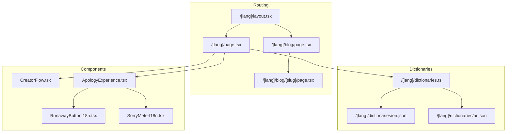
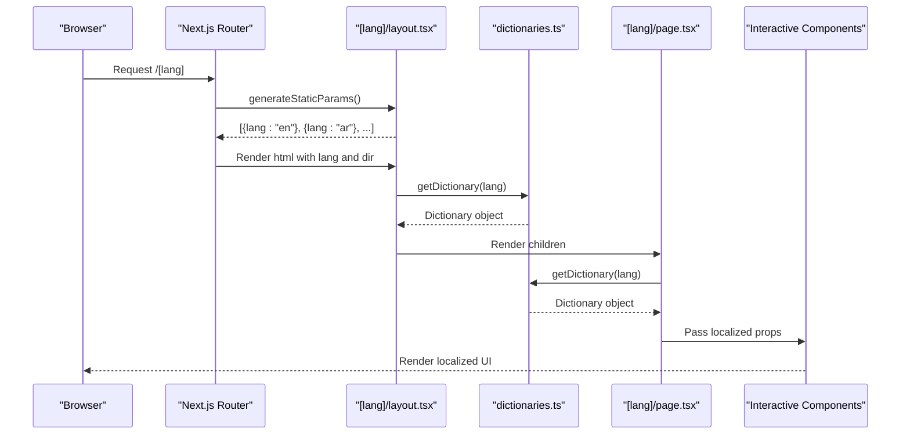
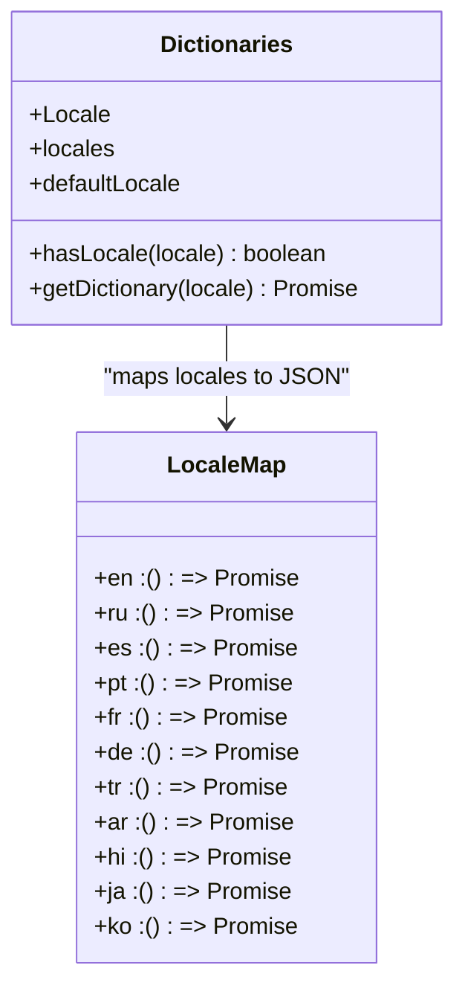
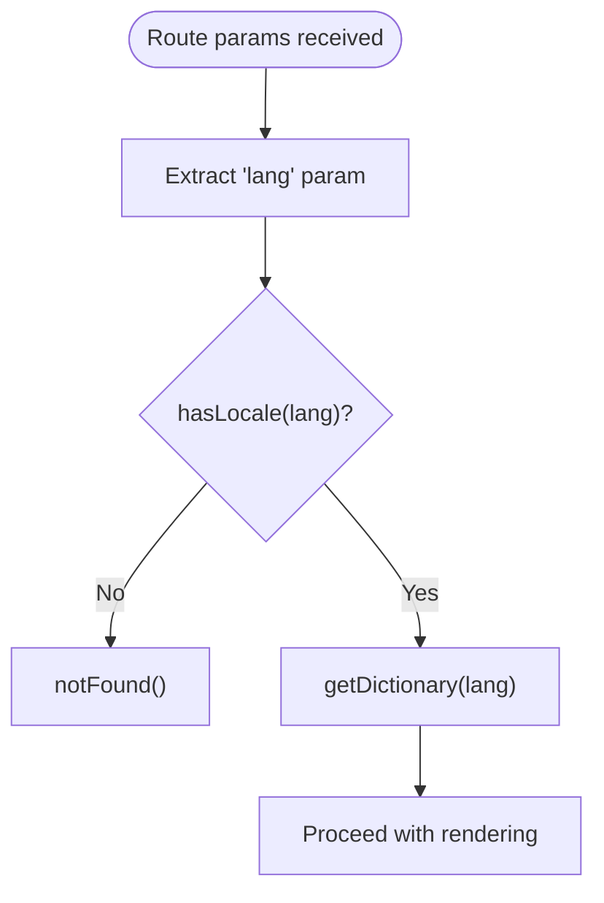
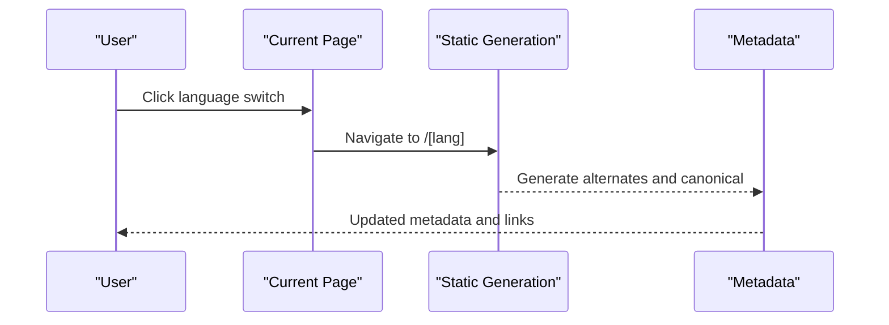
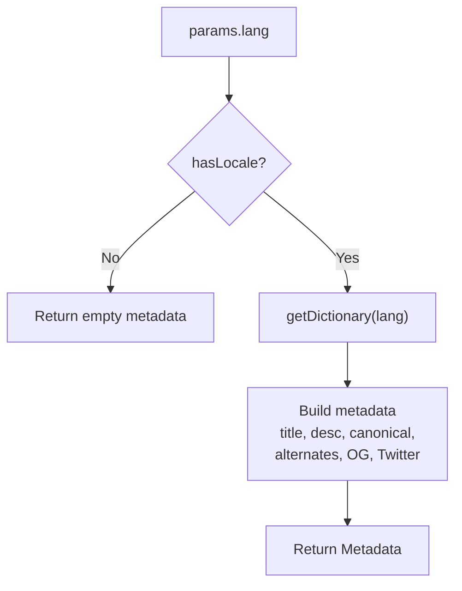
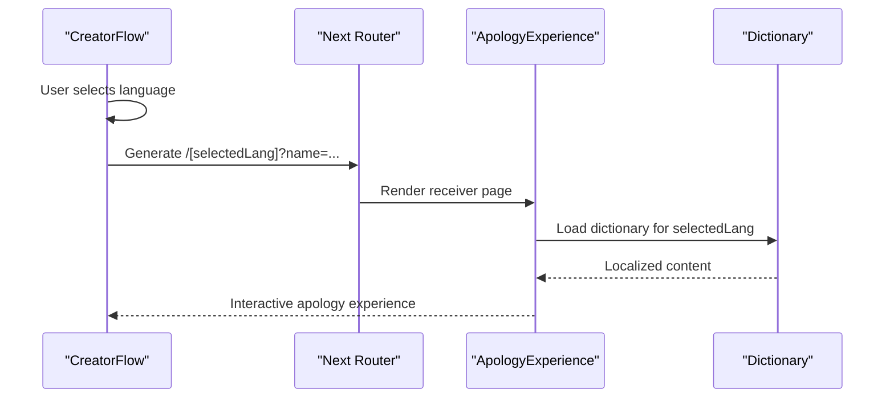

# Internationalization System

<cite>
**Referenced Files in This Document**
- [src/app/[lang]/dictionaries.ts](file://src/app/[lang]/dictionaries.ts)
- [src/app/[lang]/layout.tsx](file://src/app/[lang]/layout.tsx)
- [src/app/[lang]/page.tsx](file://src/app/[lang]/page.tsx)
- [src/app/layout.tsx](file://src/app/layout.tsx)
- [src/app/sitemap.ts](file://src/app/sitemap.ts)
- [src/app/robots.ts](file://src/app/robots.ts)
- [src/app/[lang]/blog/page.tsx](file://src/app/[lang]/blog/page.tsx)
- [src/app/[lang]/blog/[slug]/page.tsx](file://src/app/[lang]/blog/[slug]/page.tsx)
- [src/app/[lang]/blog/posts.ts](file://src/app/[lang]/blog/posts.ts)
- [src/components/CreatorFlow.tsx](file://src/components/CreatorFlow.tsx)
- [src/components/ApologyExperience.tsx](file://src/components/ApologyExperience.tsx)
- [src/components/RunawayButtonI18n.tsx](file://src/components/RunawayButtonI18n.tsx)
- [src/components/SorryMeterI18n.tsx](file://src/components/SorryMeterI18n.tsx)
- [src/app/[lang]/dictionaries/en.json](file://src/app/[lang]/dictionaries/en.json)
- [src/app/[lang]/dictionaries/ar.json](file://src/app/[lang]/dictionaries/ar.json)
- [package.json](file://package.json)
</cite>

## Table of Contents
1. [Introduction](#introduction)
2. [Project Structure](#project-structure)
3. [Core Components](#core-components)
4. [Architecture Overview](#architecture-overview)
5. [Detailed Component Analysis](#detailed-component-analysis)
6. [Dependency Analysis](#dependency-analysis)
7. [Performance Considerations](#performance-considerations)
8. [Troubleshooting Guide](#troubleshooting-guide)
9. [Conclusion](#conclusion)
10. [Appendices](#appendices)

## Introduction
This document explains the internationalization (i18n) system powering the I Am Really Sorry platform. It covers dynamic dictionary loading, locale detection and routing, language switching, SEO metadata generation, canonical URL handling, right-to-left (RTL) layout support for Arabic, and integration with the apology creation flow and interactive components. The platform supports 11 languages: English, Spanish, French, German, Russian, Portuguese, Turkish, Arabic, Hindi, Japanese, and Korean. Cultural considerations, RTL layout handling, and accessibility requirements are addressed alongside practical guidelines for adding new languages and maintaining translation consistency.

## Project Structure
The i18n system is centered around a locale-aware route structure and a dynamic dictionary loader. Key elements:
- Route-based localization: `/[lang]` catch-all route with static generation for each locale
- Dynamic dictionary loader: per-locale JSON files loaded on demand
- Locale-aware metadata and canonical URLs
- Creator flow with language selection
- Interactive components consuming localized content

**Diagram sources**
- [src/app/[lang]/layout.tsx](file://src/app/[lang]/layout.tsx#L1-L108)
- [src/app/[lang]/page.tsx](file://src/app/[lang]/page.tsx#L1-L32)
- [src/app/[lang]/blog/page.tsx](file://src/app/[lang]/blog/page.tsx#L1-L87)
- [src/app/[lang]/blog/[slug]/page.tsx](file://src/app/[lang]/blog/[slug]/page.tsx#L1-L49)
- [src/app/[lang]/dictionaries.ts](file://src/app/[lang]/dictionaries.ts#L1-L26)
- [src/components/CreatorFlow.tsx:1-335](file://src/components/CreatorFlow.tsx#L1-L335)
- [src/components/ApologyExperience.tsx:1-219](file://src/components/ApologyExperience.tsx#L1-L219)
- [src/components/RunawayButtonI18n.tsx:1-156](file://src/components/RunawayButtonI18n.tsx#L1-L156)
- [src/components/SorryMeterI18n.tsx:1-102](file://src/components/SorryMeterI18n.tsx#L1-L102)

**Section sources**
- [src/app/[lang]/layout.tsx](file://src/app/[lang]/layout.tsx#L1-L108)
- [src/app/[lang]/page.tsx](file://src/app/[lang]/page.tsx#L1-L32)
- [src/app/[lang]/dictionaries.ts](file://src/app/[lang]/dictionaries.ts#L1-L26)

## Core Components
- Dynamic Dictionary Loader: Loads locale-specific JSON files dynamically and exposes typed helpers for locale validation and retrieval.
- Locale-Aware Layout: Generates metadata, canonical URLs, alternate language links, and sets html dir attribute for RTL languages.
- Route-Based Pages: Validates locale, loads dictionary, and renders either creator flow or receiver experience.
- Creator Flow: Allows selecting language and generating localized apology links.
- Interactive Components: Consume localized strings for dynamic UI elements (runaway button, sorry meter).

Key responsibilities:
- Locale detection: via route parameter and validation
- Dictionary loading: per-request dynamic import
- SEO: metadata, canonical, alternates, OpenGraph, Twitter cards
- RTL: html dir attribute for Arabic
- Routing: static params generation and notFound fallback

**Section sources**
- [src/app/[lang]/dictionaries.ts](file://src/app/[lang]/dictionaries.ts#L1-L26)
- [src/app/[lang]/layout.tsx](file://src/app/[lang]/layout.tsx#L6-L66)
- [src/app/[lang]/page.tsx](file://src/app/[lang]/page.tsx#L12-L31)
- [src/components/CreatorFlow.tsx:6-18](file://src/components/CreatorFlow.tsx#L6-L18)

## Architecture Overview
The i18n architecture combines Next.js file-based routing with a dynamic dictionary loader and locale-aware metadata generation. The system ensures:
- Each locale has its own route segment
- Dictionary files are loaded on-demand
- Metadata and canonical URLs are generated per locale
- Alternate language links enable seamless switching
- RTL layout is applied for Arabic

**Diagram sources**
- [src/app/[lang]/layout.tsx](file://src/app/[lang]/layout.tsx#L6-L17)
- [src/app/[lang]/dictionaries.ts](file://src/app/[lang]/dictionaries.ts#L22-L25)
- [src/app/[lang]/page.tsx](file://src/app/[lang]/page.tsx#L16-L16)
- [src/components/RunawayButtonI18n.tsx:9-16](file://src/components/RunawayButtonI18n.tsx#L9-L16)
- [src/components/SorryMeterI18n.tsx:8-14](file://src/components/SorryMeterI18n.tsx#L8-L14)

## Detailed Component Analysis

### Dynamic Dictionary Loading
The dictionary loader defines a mapping of locale codes to dynamic imports of JSON files. It exports:
- Locale union type
- Available locales array
- Default locale
- Locale validator
- Async dictionary getter

Implementation highlights:
- Server-only import guard
- Lazy loading via dynamic import
- Type-safe locale validation
- Consistent dictionary shape across locales

**Diagram sources**
- [src/app/[lang]/dictionaries.ts](file://src/app/[lang]/dictionaries.ts#L3-L15)

**Section sources**
- [src/app/[lang]/dictionaries.ts](file://src/app/[lang]/dictionaries.ts#L1-L26)

### Locale Detection and Validation
Locale detection occurs via the route parameter and is validated against the known dictionary map. Non-matching locales trigger a 404 response.

**Diagram sources**
- [src/app/[lang]/layout.tsx](file://src/app/[lang]/layout.tsx#L75-L76)
- [src/app/[lang]/page.tsx](file://src/app/[lang]/page.tsx#L14-L14)
- [src/app/[lang]/dictionaries.ts](file://src/app/[lang]/dictionaries.ts#L22-L23)

**Section sources**
- [src/app/[lang]/layout.tsx](file://src/app/[lang]/layout.tsx#L75-L76)
- [src/app/[lang]/page.tsx](file://src/app/[lang]/page.tsx#L14-L14)
- [src/app/[lang]/dictionaries.ts](file://src/app/[lang]/dictionaries.ts#L22-L23)

### Language Switching and Routing
Language switching is achieved by navigating to the desired locale route. The system:
- Generates static params for all locales
- Provides alternate language links
- Sets canonical URL per locale
- Uses html dir attribute for RTL

**Diagram sources**
- [src/app/[lang]/layout.tsx](file://src/app/[lang]/layout.tsx#L6-L8)
- [src/app/[lang]/layout.tsx](file://src/app/[lang]/layout.tsx#L26-L31)
- [src/app/[lang]/layout.tsx](file://src/app/[lang]/layout.tsx#L78-L78)

**Section sources**
- [src/app/[lang]/layout.tsx](file://src/app/[lang]/layout.tsx#L6-L66)
- [src/app/[lang]/layout.tsx](file://src/app/[lang]/layout.tsx#L78-L78)

### SEO Metadata and Canonical URLs
The system generates comprehensive SEO metadata per locale, including:
- Title and description from dictionary
- Canonical URL pointing to the locale route
- Alternate language links for all locales
- OpenGraph and Twitter metadata
- Robots directives

**Diagram sources**
- [src/app/[lang]/layout.tsx](file://src/app/[lang]/layout.tsx#L10-L66)

**Section sources**
- [src/app/[lang]/layout.tsx](file://src/app/[lang]/layout.tsx#L10-L66)

### RTL Language Support (Arabic)
Arabic receives special handling for right-to-left layout:
- html dir attribute set to "rtl" when lang is "ar"
- All other locales remain "ltr"
- This affects text direction and alignment in the UI shell

**Section sources**
- [src/app/[lang]/layout.tsx](file://src/app/[lang]/layout.tsx#L78-L78)

### Dictionary Structure and Translation Keys
Dictionaries are organized into semantic groups:
- meta: title, description, keywords
- hero: subtitle, nameLabel, namePlaceholder, heading, subtext, scrollHint
- meter: title, label, low, mid, high, error, footnote
- reasons: title, items[] with emoji, title, text
- promises: title, subtitle, items[]
- forgive: title, question, yes[], no[], hint, success, successSub
- music: on, off
- footer: madeWith, copyright
- landing: h1, h2_1, p1, h2_2, steps[], h2_3, features[], h2_faq, faq[], cta

Examples:
- English dictionary demonstrates the full structure
- Arabic dictionary mirrors the structure for RTL content

**Section sources**
- [src/app/[lang]/dictionaries/en.json](file://src/app/[lang]/dictionaries/en.json#L1-L88)
- [src/app/[lang]/dictionaries/ar.json](file://src/app/[lang]/dictionaries/ar.json#L1-L88)

### Content Management Patterns
- Dictionary-driven UI: Components receive a dict prop and render localized strings
- Interactive components: RunawayButtonI18n and SorryMeterI18n consume localized arrays and labels
- CreatorFlow: Presents language selection with country flags and native names
- Blog content: Separate posts module with locale-specific posts and slugs

**Section sources**
- [src/components/RunawayButtonI18n.tsx:9-16](file://src/components/RunawayButtonI18n.tsx#L9-L16)
- [src/components/SorryMeterI18n.tsx:8-14](file://src/components/SorryMeterI18n.tsx#L8-L14)
- [src/components/CreatorFlow.tsx:6-18](file://src/components/CreatorFlow.tsx#L6-L18)
- [src/app/[lang]/blog/posts.ts](file://src/app/[lang]/blog/posts.ts#L433-L446)

### Integration with Apology Creation Flow
The creator flow allows choosing language and generates a localized URL:
- Step 3: Language selection with 11 options
- Link generation: includes selected language and recipient name
- Receiver experience: ApologyExperience consumes dictionary and renders interactive components

**Diagram sources**
- [src/components/CreatorFlow.tsx:44-57](file://src/components/CreatorFlow.tsx#L44-L57)
- [src/app/[lang]/page.tsx](file://src/app/[lang]/page.tsx#L19-L22)
- [src/components/ApologyExperience.tsx:32-31](file://src/components/ApologyExperience.tsx#L32-L31)

**Section sources**
- [src/components/CreatorFlow.tsx:6-25](file://src/components/CreatorFlow.tsx#L6-L25)
- [src/app/[lang]/page.tsx](file://src/app/[lang]/page.tsx#L19-L22)
- [src/components/ApologyExperience.tsx:14-30](file://src/components/ApologyExperience.tsx#L14-L30)

### Blog Localization and Sitemaps
- Blog index and posts are localized by route
- Sitemap includes alternates for all locales and locale-specific blog slugs
- Blog posts module returns locale-specific content

**Section sources**
- [src/app/[lang]/blog/page.tsx](file://src/app/[lang]/blog/page.tsx#L23-L31)
- [src/app/[lang]/blog/[slug]/page.tsx](file://src/app/[lang]/blog/[slug]/page.tsx#L7-L16)
- [src/app/sitemap.ts:3-36](file://src/app/sitemap.ts#L3-L36)
- [src/app/[lang]/blog/posts.ts](file://src/app/[lang]/blog/posts.ts#L433-L446)

## Dependency Analysis
External libraries supporting i18n and related functionality:
- @formatjs/intl-localematcher: locale matching utilities
- negotiator: HTTP content negotiation
- framer-motion: animations in interactive components
- three, @react-three/fiber, @react-three/drei: 3D elements (Heart3D)

These dependencies underpin the interactive experience and localization pipeline.

**Section sources**
- [package.json:11-24](file://package.json#L11-L24)

## Performance Considerations
- Dynamic dictionary imports: On-demand loading reduces initial bundle size; cache is effective across requests
- Static params generation: Pre-renders locale routes for improved performance and SEO
- Minimal server-side rendering: Root layout is minimal; most logic is in locale-aware pages and components
- Image and asset optimization: Next.js handles image optimization; ensure dictionary assets remain lightweight

## Troubleshooting Guide
Common issues and resolutions:
- Unknown locale: Ensure the route parameter matches a defined locale; non-matching locales trigger 404
- Missing dictionary keys: Verify all required keys exist in each locale JSON; components expect specific shapes
- Incorrect canonical/alternate links: Confirm locales array and alternates generation in metadata
- RTL layout not applied: Check html dir attribute logic for Arabic; ensure proper CSS for RTL alignment
- Blog content not localized: Confirm posts module returns locale-specific content and slugs

**Section sources**
- [src/app/[lang]/layout.tsx](file://src/app/[lang]/layout.tsx#L75-L76)
- [src/app/[lang]/layout.tsx](file://src/app/[lang]/layout.tsx#L26-L31)
- [src/app/[lang]/layout.tsx](file://src/app/[lang]/layout.tsx#L78-L78)
- [src/app/[lang]/blog/posts.ts](file://src/app/[lang]/blog/posts.ts#L433-L446)

## Conclusion
The I Am Really Sorry platform implements a robust, scalable internationalization system centered on dynamic dictionary loading, locale-aware routing, and comprehensive SEO metadata. With support for 11 languages, automatic canonical and alternate links, and dedicated RTL handling for Arabic, the system ensures a consistent, accessible, and culturally appropriate experience. Interactive components integrate seamlessly with localized content, and the creator flow enables easy language selection and sharing. The architecture provides clear patterns for adding new languages and maintaining translation consistency across the platform.

## Appendices

### Supported Languages and Codes
- English (en)
- Spanish (es)
- French (fr)
- German (de)
- Russian (ru)
- Portuguese (pt)
- Turkish (tr)
- Arabic (ar)
- Hindi (hi)
- Japanese (ja)
- Korean (ko)

**Section sources**
- [src/app/[lang]/dictionaries.ts](file://src/app/[lang]/dictionaries.ts#L3-L15)
- [src/components/CreatorFlow.tsx:6-18](file://src/components/CreatorFlow.tsx#L6-L18)

### Adding a New Language
Steps:
1. Add a new JSON file in src/app/[lang]/dictionaries/ with the new locale code
2. Extend the dictionaries mapping in src/app/[lang]/dictionaries.ts
3. Update static params generation and metadata to include the new locale
4. Add language selection option in CreatorFlow.tsx if applicable
5. Ensure dictionary keys match the expected structure
6. Update sitemap.ts to include alternates and locale-specific content
7. Test canonical URLs, alternates, and RTL layout for Arabic

Guidelines:
- Maintain identical dictionary structure across locales
- Preserve semantic grouping (meta, hero, meter, reasons, promises, forgive, music, footer, landing)
- Keep translation keys concise yet expressive
- Validate RTL layout for right-to-left scripts
- Test interactive components with localized strings

**Section sources**
- [src/app/[lang]/dictionaries.ts](file://src/app/[lang]/dictionaries.ts#L3-L15)
- [src/app/[lang]/layout.tsx](file://src/app/[lang]/layout.tsx#L6-L8)
- [src/app/[lang]/layout.tsx](file://src/app/[lang]/layout.tsx#L26-L31)
- [src/components/CreatorFlow.tsx:6-18](file://src/components/CreatorFlow.tsx#L6-L18)
- [src/app/sitemap.ts:3-36](file://src/app/sitemap.ts#L3-L36)

### Accessibility and Cultural Considerations
- RTL layout: Apply html dir="rtl" for Arabic; ensure CSS respects directionality
- Text scaling: Design components to accommodate longer translations
- Color contrast: Maintain sufficient contrast for all locales
- Keyboard navigation: Ensure interactive components are keyboard accessible
- Screen reader: Use semantic HTML and aria labels where appropriate
- Cultural sensitivity: Avoid imagery or metaphors that may not translate well; keep messages universally relatable

[No sources needed since this section provides general guidance]