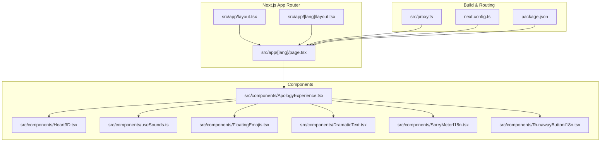
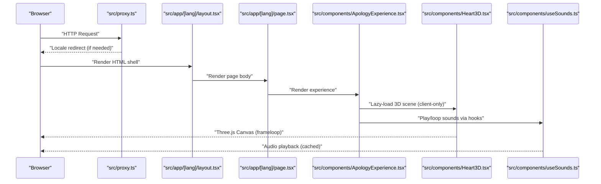
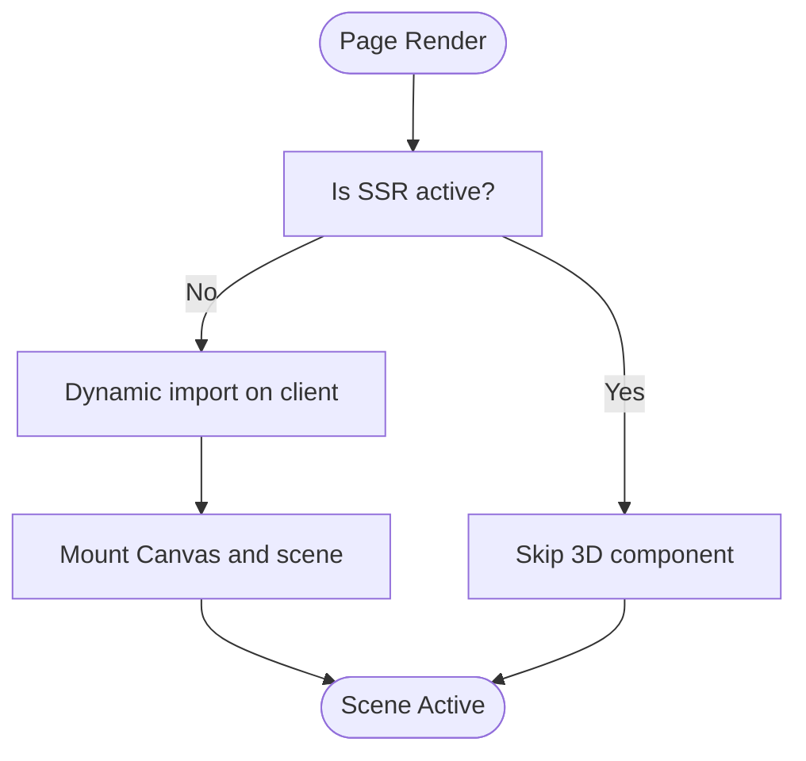
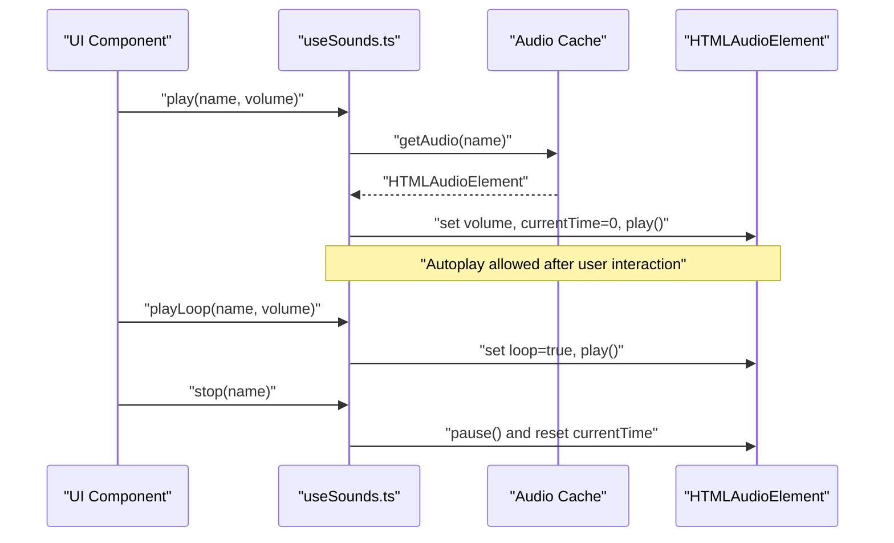
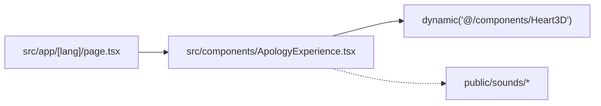
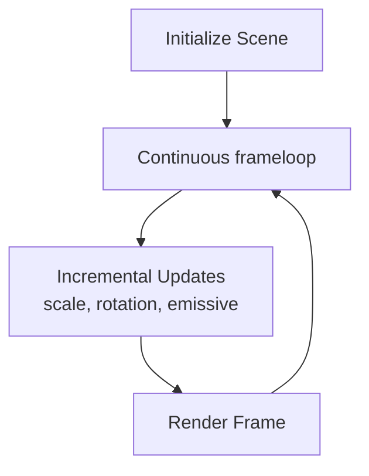
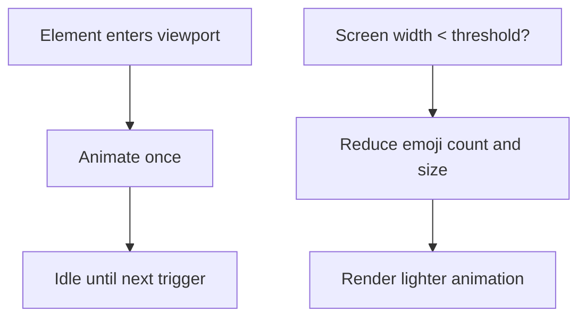
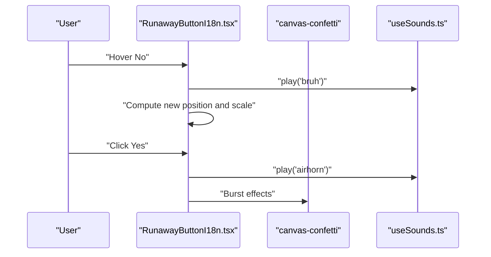
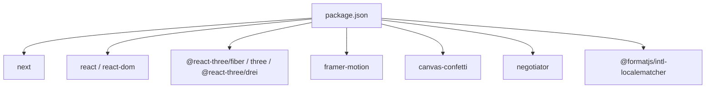

# Performance Optimization

<cite>
**Referenced Files in This Document**
- [README.md](file://README.md)
- [next.config.ts](file://next.config.ts)
- [package.json](file://package.json)
- [src/app/[lang]/layout.tsx](file://src/app/[lang]/layout.tsx)
- [src/app/[lang]/page.tsx](file://src/app/[lang]/page.tsx)
- [src/app/layout.tsx](file://src/app/layout.tsx)
- [src/proxy.ts](file://src/proxy.ts)
- [src/components/ApologyExperience.tsx](file://src/components/ApologyExperience.tsx)
- [src/components/Heart3D.tsx](file://src/components/Heart3D.tsx)
- [src/components/useSounds.ts](file://src/components/useSounds.ts)
- [src/components/FloatingEmojis.tsx](file://src/components/FloatingEmojis.tsx)
- [src/components/DramaticText.tsx](file://src/components/DramaticText.tsx)
- [src/components/SorryMeterI18n.tsx](file://src/components/SorryMeterI18n.tsx)
- [src/components/RunawayButtonI18n.tsx](file://src/components/RunawayButtonI18n.tsx)
</cite>

## Table of Contents
1. [Introduction](#introduction)
2. [Project Structure](#project-structure)
3. [Core Components](#core-components)
4. [Architecture Overview](#architecture-overview)
5. [Detailed Component Analysis](#detailed-component-analysis)
6. [Dependency Analysis](#dependency-analysis)
7. [Performance Considerations](#performance-considerations)
8. [Troubleshooting Guide](#troubleshooting-guide)
9. [Conclusion](#conclusion)
10. [Appendices](#appendices)

## Introduction
This document details the performance optimization strategies implemented in the I Am Really Sorry platform. It focuses on lazy loading for 3D components, audio resource management, animation performance, and Next.js build-time optimizations. It also covers memory management, re-rendering controls, browser performance considerations, profiling and monitoring approaches, mobile-first enhancements, progressive enhancement and graceful degradation patterns, metrics and budgets, and continuous optimization workflows.

## Project Structure
The application is a Next.js app using the App Router. Static generation and internationalization are configured at the root and language-specific layouts. The client-side experience is composed of several animated and interactive components, including a 3D scene, floating animations, and interactive elements with sound effects.

**Diagram sources**
- [src/app/[lang]/layout.tsx](file://src/app/[lang]/layout.tsx#L1-L108)
- [src/app/[lang]/page.tsx](file://src/app/[lang]/page.tsx#L1-L32)
- [src/app/layout.tsx:1-9](file://src/app/layout.tsx#L1-L9)
- [src/components/ApologyExperience.tsx:1-219](file://src/components/ApologyExperience.tsx#L1-L219)
- [src/components/Heart3D.tsx:1-107](file://src/components/Heart3D.tsx#L1-L107)
- [src/components/useSounds.ts:1-69](file://src/components/useSounds.ts#L1-L69)
- [src/components/FloatingEmojis.tsx:1-64](file://src/components/FloatingEmojis.tsx#L1-L64)
- [src/components/DramaticText.tsx:1-43](file://src/components/DramaticText.tsx#L1-L43)
- [src/components/SorryMeterI18n.tsx:1-102](file://src/components/SorryMeterI18n.tsx#L1-L102)
- [src/components/RunawayButtonI18n.tsx:1-156](file://src/components/RunawayButtonI18n.tsx#L1-L156)
- [next.config.ts:1-8](file://next.config.ts#L1-L8)
- [src/proxy.ts:1-50](file://src/proxy.ts#L1-L50)
- [package.json:1-36](file://package.json#L1-L36)

**Section sources**
- [src/app/[lang]/layout.tsx](file://src/app/[lang]/layout.tsx#L1-L108)
- [src/app/[lang]/page.tsx](file://src/app/[lang]/page.tsx#L1-L32)
- [src/app/layout.tsx:1-9](file://src/app/layout.tsx#L1-L9)
- [src/proxy.ts:1-50](file://src/proxy.ts#L1-L50)
- [next.config.ts:1-8](file://next.config.ts#L1-L8)
- [package.json:1-36](file://package.json#L1-L36)

## Core Components
- Lazy loading for 3D scenes: The 3D component is dynamically imported on the client and disabled for SSR to reduce initial payload and avoid server-side WebGL dependencies.
- Audio resource management: A global audio cache ensures single instances per sound, with user-interaction gating for autoplay policies and loop/stop controls.
- Animation performance: Framer Motion is used with viewport-triggered animations and controlled repeats to minimize unnecessary renders.
- Mobile-first rendering: Floating emoji counts and sizes adapt to screen width to limit DOM nodes and GPU work on smaller devices.
- Interactive experiences: Runaway button and confetti effects are throttled via animation frames and bounded particle counts.

**Section sources**
- [src/components/ApologyExperience.tsx:1-219](file://src/components/ApologyExperience.tsx#L1-L219)
- [src/components/Heart3D.tsx:1-107](file://src/components/Heart3D.tsx#L1-L107)
- [src/components/useSounds.ts:1-69](file://src/components/useSounds.ts#L1-L69)
- [src/components/FloatingEmojis.tsx:1-64](file://src/components/FloatingEmojis.tsx#L1-L64)
- [src/components/DramaticText.tsx:1-43](file://src/components/DramaticText.tsx#L1-L43)
- [src/components/SorryMeterI18n.tsx:1-102](file://src/components/SorryMeterI18n.tsx#L1-L102)
- [src/components/RunawayButtonI18n.tsx:1-156](file://src/components/RunawayButtonI18n.tsx#L1-L156)

## Architecture Overview
The runtime architecture separates concerns between routing, internationalization, client-side experiences, and media assets. The 3D scene is lazily loaded, audio is centrally managed, and animations are optimized via viewport triggers and controlled loops.

**Diagram sources**
- [src/proxy.ts:1-50](file://src/proxy.ts#L1-L50)
- [src/app/[lang]/layout.tsx](file://src/app/[lang]/layout.tsx#L1-L108)
- [src/app/[lang]/page.tsx](file://src/app/[lang]/page.tsx#L1-L32)
- [src/components/ApologyExperience.tsx:1-219](file://src/components/ApologyExperience.tsx#L1-L219)
- [src/components/Heart3D.tsx:1-107](file://src/components/Heart3D.tsx#L1-L107)
- [src/components/useSounds.ts:1-69](file://src/components/useSounds.ts#L1-L69)

## Detailed Component Analysis

### Lazy Loading for 3D Components
- Implementation: The 3D component is dynamically imported with SSR disabled, ensuring it only loads on the client.
- Benefits: Reduces server-side rendering cost, avoids heavy client libraries on the server, and defers expensive initialization until user interaction.
- Impact: Lower initial bundle size and improved server response times.

**Diagram sources**
- [src/components/ApologyExperience.tsx:12-12](file://src/components/ApologyExperience.tsx#L12-L12)
- [src/components/Heart3D.tsx:88-106](file://src/components/Heart3D.tsx#L88-L106)

**Section sources**
- [src/components/ApologyExperience.tsx:12-12](file://src/components/ApologyExperience.tsx#L12-L12)
- [src/components/Heart3D.tsx:88-106](file://src/components/Heart3D.tsx#L88-L106)

### Audio Resource Management and Caching
- Global audio cache: Ensures a single HTMLAudioElement per sound, preventing duplication and redundant decoding.
- User interaction gating: Tracks first user gesture to satisfy browser autoplay policies before playing non-looping sounds.
- Loop vs non-loop control: Dedicated APIs for looping and one-shot playback with consistent volume and reset semantics.
- Sound toggling: Centralized stop function to pause and rewind sounds.

**Diagram sources**
- [src/components/useSounds.ts:14-69](file://src/components/useSounds.ts#L14-L69)

**Section sources**
- [src/components/useSounds.ts:14-69](file://src/components/useSounds.ts#L14-L69)

### Bundle Splitting Techniques
- Dynamic imports: The 3D component is split into its own chunk, loaded only when needed.
- Route-based code splitting: Next.js automatically splits pages and route segments.
- Asset separation: Sounds and images are served separately under public assets, enabling independent caching and compression.

**Diagram sources**
- [src/app/[lang]/page.tsx](file://src/app/[lang]/page.tsx#L1-L32)
- [src/components/ApologyExperience.tsx:12-12](file://src/components/ApologyExperience.tsx#L12-L12)
- [src/components/Heart3D.tsx:1-107](file://src/components/Heart3D.tsx#L1-L107)

**Section sources**
- [src/app/[lang]/page.tsx](file://src/app/[lang]/page.tsx#L1-L32)
- [src/components/ApologyExperience.tsx:12-12](file://src/components/ApologyExperience.tsx#L12-L12)

### Three.js Rendering Optimization
- Frameloop control: The canvas uses a continuous loop suitable for smooth animations.
- Minimal geometry updates: Animations rely on incremental transforms and material properties rather than recreating geometries.
- Particle count tuning: Fixed small count for floating particles to balance visual quality and performance.

**Diagram sources**
- [src/components/Heart3D.tsx:88-106](file://src/components/Heart3D.tsx#L88-L106)

**Section sources**
- [src/components/Heart3D.tsx:88-106](file://src/components/Heart3D.tsx#L88-L106)

### Animation Performance
- Viewport-triggered animations: Components like dramatic text and sections animate only when in view, reducing unnecessary computations.
- Controlled repeats and easing: Infinite repeats are constrained by viewport visibility and spring-based easing reduces jank.
- Floating emojis: Counts and sizes adapt to device width to limit DOM nodes and GPU work on mobile.

**Diagram sources**
- [src/components/DramaticText.tsx:17-39](file://src/components/DramaticText.tsx#L17-L39)
- [src/components/FloatingEmojis.tsx:19-34](file://src/components/FloatingEmojis.tsx#L19-L34)

**Section sources**
- [src/components/DramaticText.tsx:17-39](file://src/components/DramaticText.tsx#L17-L39)
- [src/components/FloatingEmojis.tsx:19-34](file://src/components/FloatingEmojis.tsx#L19-L34)

### Interactive Elements and Effects
- Runaway button: Movement is randomized but bounded, with scaling that decreases over attempts to prevent excessive DOM growth.
- Confetti effects: Bounded particle counts and requestAnimationFrame loops ensure smooth bursts without blocking the main thread.
- Sound triggers: Hover and click events trigger short sound clips to enhance UX without heavy audio processing.

**Diagram sources**
- [src/components/RunawayButtonI18n.tsx:28-74](file://src/components/RunawayButtonI18n.tsx#L28-L74)
- [src/components/useSounds.ts:41-69](file://src/components/useSounds.ts#L41-L69)

**Section sources**
- [src/components/RunawayButtonI18n.tsx:28-74](file://src/components/RunawayButtonI18n.tsx#L28-L74)
- [src/components/useSounds.ts:41-69](file://src/components/useSounds.ts#L41-L69)

## Dependency Analysis
- Client-side libraries: @react-three/fiber, three, @react-three/drei, framer-motion, canvas-confetti.
- Build and framework: next, react, react-dom.
- Internationalization and negotiation: @formatjs/intl-localematcher, negotiator.
- The proxy module handles locale detection and redirects, impacting routing and potentially hydration timing.

**Diagram sources**
- [package.json:11-24](file://package.json#L11-L24)

**Section sources**
- [package.json:11-24](file://package.json#L11-L24)
- [src/proxy.ts:3-19](file://src/proxy.ts#L3-L19)

## Performance Considerations
- Next.js build optimization
  - Static generation: The language layout generates static params for known locales, enabling pre-rendered pages.
  - Fonts and images: The project README mentions automatic font optimization via next/font; image optimization is commonly enabled in Next.js projects.
  - Asset compression: Next.js applies compression during builds; ensure gzip/brotli are enabled in hosting.
- Memory management
  - Audio cache prevents memory leaks by reusing audio instances.
  - Cleanup timers and intervals in components to avoid lingering effects.
- Component re-rendering optimization
  - Use viewport-based triggers to animate only when visible.
  - Keep animation-heavy components mounted only when needed (e.g., 3D scene).
- Browser performance
  - Prefer transform and opacity for animations; avoid layout thrashing.
  - Limit DOM nodes on mobile (as seen with floating emojis).
- Profiling and monitoring
  - Use browser DevTools Performance and Memory panels.
  - Monitor long tasks and layout times; track CLS and INP for interactivity.
- Progressive enhancement and graceful degradation
  - Disable 3D and heavy animations on low-end devices.
  - Provide fallbacks for autoplay restrictions and unsupported features.
- Metrics and budgets
  - Establish budgets for First Contentful Paint, Largest Contentful Paint, Cumulative Layout Shift, and Total Blocking Time.
  - Continuously monitor in production and alert on regressions.
- Mobile performance
  - Reduce particle counts and animation complexity on smaller screens.
  - Use reduced resolution textures and simpler materials for 3D scenes.

[No sources needed since this section provides general guidance]

## Troubleshooting Guide
- 3D scene does not render
  - Verify client-only rendering and dynamic import paths.
  - Ensure the canvas container has explicit dimensions.
- Autoplay blocked
  - Confirm user interaction before playing non-looping sounds.
  - Use loop sounds for ambient tracks after interaction.
- Excessive CPU/GPU usage
  - Reduce particle counts and animation complexity.
  - Limit DOM nodes on mobile and disable non-critical animations.
- Long initial load
  - Confirm dynamic imports are effective and assets are compressed.
  - Audit third-party scripts and fonts.
- Locale redirect loops
  - Review proxy matcher and static paths to avoid redirection cycles.

**Section sources**
- [src/components/Heart3D.tsx:88-106](file://src/components/Heart3D.tsx#L88-L106)
- [src/components/useSounds.ts:14-49](file://src/components/useSounds.ts#L14-L49)
- [src/proxy.ts:22-45](file://src/proxy.ts#L22-L45)

## Conclusion
The platform employs strategic lazy loading, centralized audio caching, viewport-triggered animations, and mobile-aware rendering to deliver a smooth, engaging experience. By combining Next.js static generation, dynamic imports, and performance-conscious component design, it balances rich interactivity with strong performance across devices.

[No sources needed since this section summarizes without analyzing specific files]

## Appendices
- Next.js configuration: The configuration file is currently empty; consider adding performance-focused plugins or overrides as needed.
- Internationalization: The proxy module detects locale via headers and redirects to prefixed routes, supporting static generation per locale.

**Section sources**
- [next.config.ts:1-8](file://next.config.ts#L1-L8)
- [src/proxy.ts:9-45](file://src/proxy.ts#L9-L45)