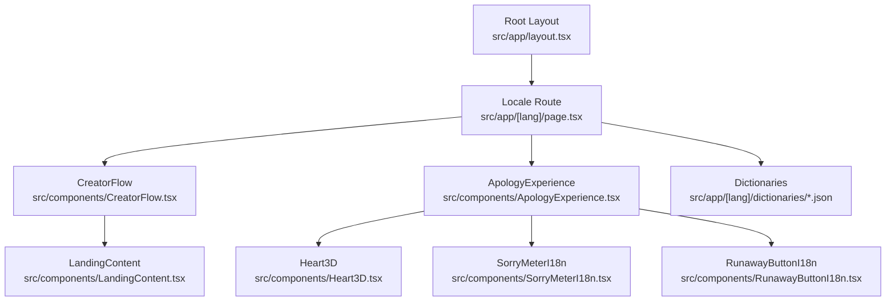
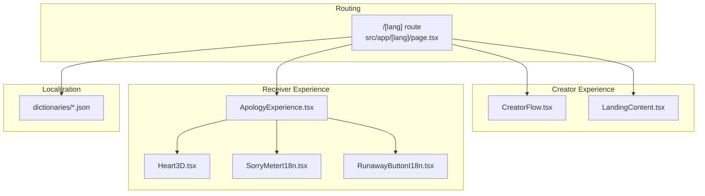
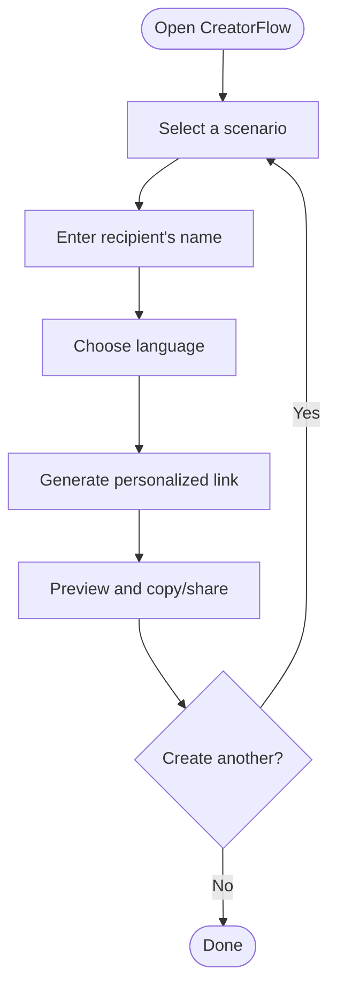
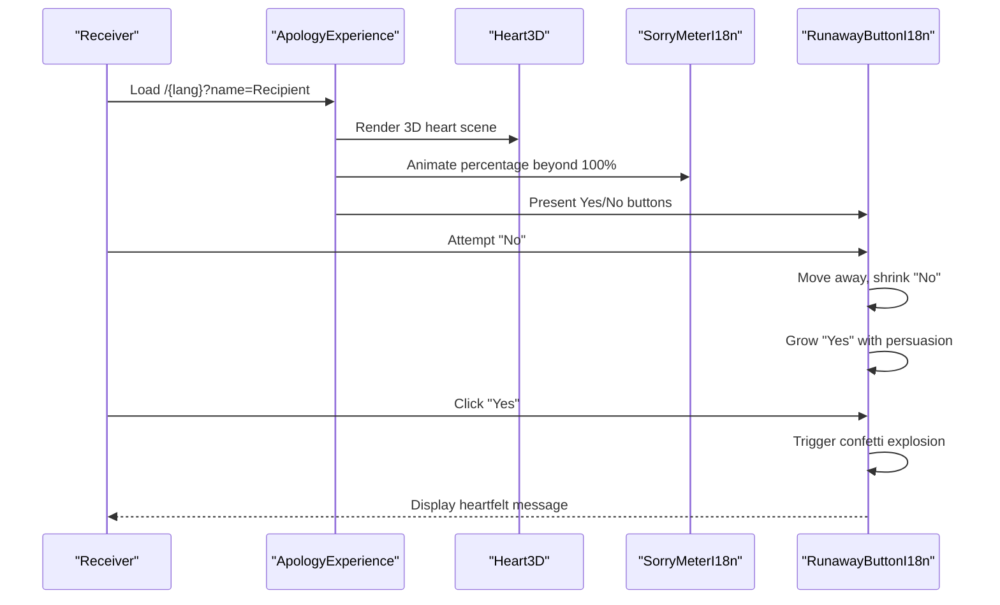
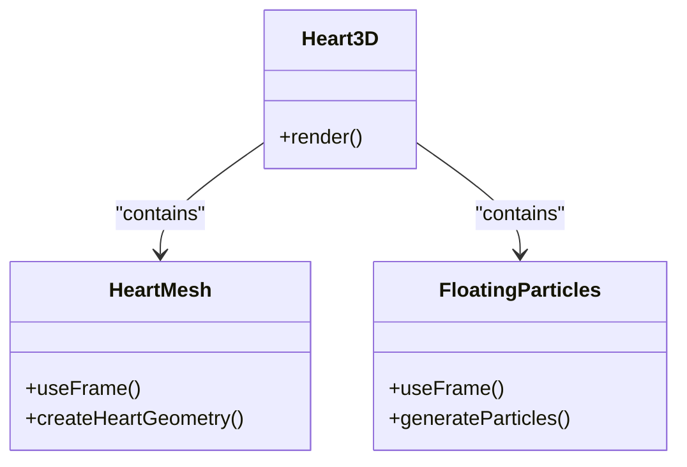
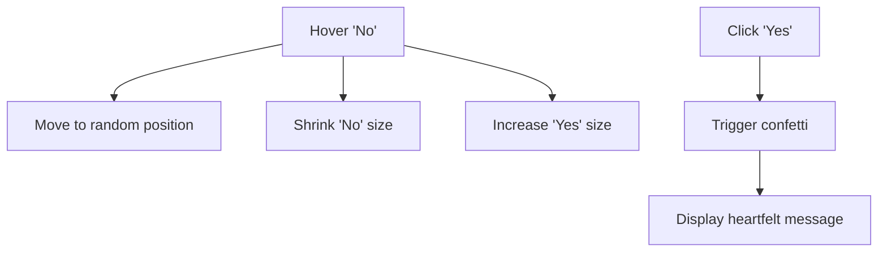
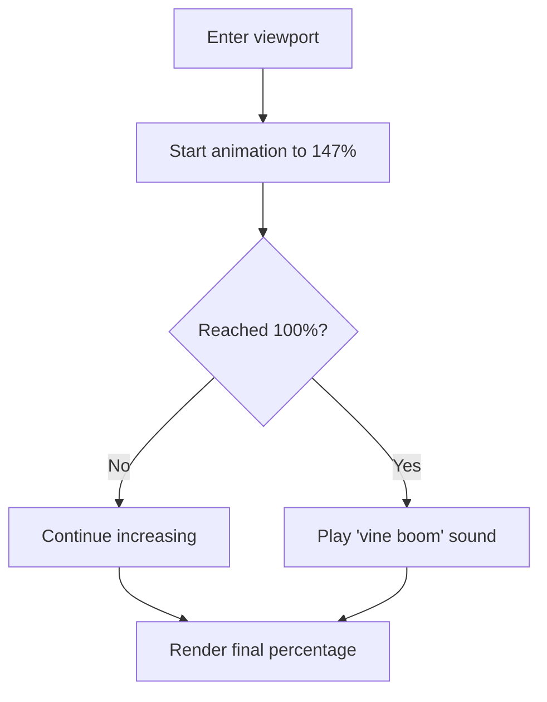
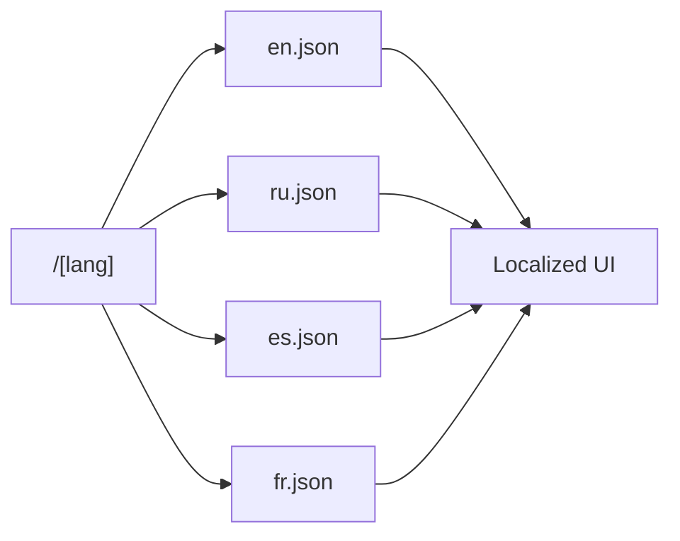
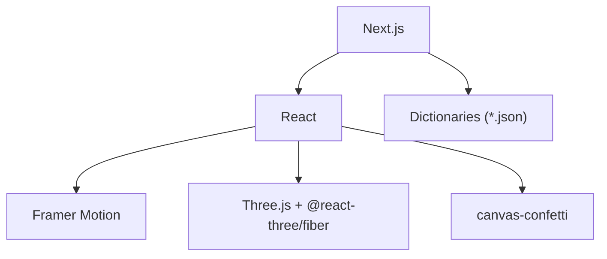

# Project Overview

<cite>
**Referenced Files in This Document**
- [README.md](file://README.md)
- [package.json](file://package.json)
- [src/app/layout.tsx](file://src/app/layout.tsx)
- [src/app/[lang]/page.tsx](file://src/app/[lang]/page.tsx)
- [src/app/[lang]/dictionaries/en.json](file://src/app/[lang]/dictionaries/en.json)
- [src/app/[lang]/dictionaries/ru.json](file://src/app/[lang]/dictionaries/ru.json)
- [src/app/[lang]/dictionaries/es.json](file://src/app/[lang]/dictionaries/es.json)
- [src/app/[lang]/dictionaries/fr.json](file://src/app/[lang]/dictionaries/fr.json)
- [src/components/ApologyExperience.tsx](file://src/components/ApologyExperience.tsx)
- [src/components/CreatorFlow.tsx](file://src/components/CreatorFlow.tsx)
- [src/components/Heart3D.tsx](file://src/components/Heart3D.tsx)
- [src/components/RunawayButton.tsx](file://src/components/RunawayButton.tsx)
- [src/components/RunawayButtonI18n.tsx](file://src/components/RunawayButtonI18n.tsx)
- [src/components/SorryMeter.tsx](file://src/components/SorryMeter.tsx)
- [src/components/SorryMeterI18n.tsx](file://src/components/SorryMeterI18n.tsx)
- [src/components/LandingContent.tsx](file://src/components/LandingContent.tsx)
</cite>

## Table of Contents
1. [Introduction](#introduction)
2. [Project Structure](#project-structure)
3. [Core Components](#core-components)
4. [Architecture Overview](#architecture-overview)
5. [Detailed Component Analysis](#detailed-component-analysis)
6. [Dependency Analysis](#dependency-analysis)
7. [Performance Considerations](#performance-considerations)
8. [Troubleshooting Guide](#troubleshooting-guide)
9. [Conclusion](#conclusion)

## Introduction
I Am Really Sorry is an interactive, emotionally engaging platform that reimagines digital apologies as a delightful, shareable experience. Instead of mundane text messages, users create personalized, animated pages filled with 3D visuals, playful sound effects, and humorous interactions. The platform’s mission is to transform the often awkward task of saying sorry into an entertaining journey that strengthens emotional connections.

Key innovations include:
- Interactive apology creation wizard guiding creators through scenarios, recipient names, and language selection
- Personalized experiences with recipient names embedded in URLs for a tailored receiver experience
- 3D animated heart visualization powered by WebGL for immersive storytelling
- Physics-based “runaway” button mechanics that delightfully chase the mouse/finger while growing increasingly persuasive
- Internationalization supporting multiple languages to reach global audiences

The platform targets both casual users seeking creative ways to express remorse and developers who want to explore modern web technologies for expressive UI/UX.

## Project Structure
The project follows a Next.js App Router structure with locale-aware routing under [lang]. Content and translations are organized per-language dictionaries, while reusable UI components encapsulate animations, interactions, and internationalized messaging.

**Diagram sources**
- [src/app/layout.tsx:1-9](file://src/app/layout.tsx#L1-L9)
- [src/app/[lang]/page.tsx](file://src/app/[lang]/page.tsx#L1-L32)
- [src/components/CreatorFlow.tsx:1-335](file://src/components/CreatorFlow.tsx#L1-L335)
- [src/components/ApologyExperience.tsx:1-219](file://src/components/ApologyExperience.tsx#L1-L219)
- [src/components/Heart3D.tsx:1-107](file://src/components/Heart3D.tsx#L1-L107)
- [src/components/SorryMeterI18n.tsx:1-102](file://src/components/SorryMeterI18n.tsx#L1-L102)
- [src/components/RunawayButtonI18n.tsx:1-156](file://src/components/RunawayButtonI18n.tsx#L1-L156)
- [src/components/LandingContent.tsx:1-158](file://src/components/LandingContent.tsx#L1-L158)

**Section sources**
- [src/app/layout.tsx:1-9](file://src/app/layout.tsx#L1-L9)
- [src/app/[lang]/page.tsx](file://src/app/[lang]/page.tsx#L1-L32)

## Core Components
- CreatorFlow: Guides users through three steps—selecting a scenario, entering the recipient’s name, and choosing a language—to generate a shareable apology link.
- ApologyExperience: Renders the personalized apology page with hero section, 3D heart, interactive sorry meter, reasons/promises, and the runaway button.
- Heart3D: A Three.js scene featuring a beating heart and floating particles for a visceral, emotional centerpiece.
- SorryMeterI18n: An animated progress indicator that visually communicates remorse, exceeding 100% with celebratory effects.
- RunawayButtonI18n: A playful, physics-driven interaction where the “No” button flees while the “Yes” button grows larger, with localized messages.
- LandingContent: Provides value propositions, steps, features, FAQs, and a call-to-action, with localized content and SEO-friendly markup.

**Section sources**
- [src/components/CreatorFlow.tsx:1-335](file://src/components/CreatorFlow.tsx#L1-L335)
- [src/components/ApologyExperience.tsx:1-219](file://src/components/ApologyExperience.tsx#L1-L219)
- [src/components/Heart3D.tsx:1-107](file://src/components/Heart3D.tsx#L1-L107)
- [src/components/SorryMeterI18n.tsx:1-102](file://src/components/SorryMeterI18n.tsx#L1-L102)
- [src/components/RunawayButtonI18n.tsx:1-156](file://src/components/RunawayButtonI18n.tsx#L1-L156)
- [src/components/LandingContent.tsx:1-158](file://src/components/LandingContent.tsx#L1-L158)

## Architecture Overview
The platform uses Next.js App Router with static generation and client-side interactivity. Locale routing determines content and language-specific dictionaries. Components are split into creator-centric flows and receiver-centric experiences, unified by shared animations and sound effects.

**Diagram sources**
- [src/app/[lang]/page.tsx](file://src/app/[lang]/page.tsx#L1-L32)
- [src/components/CreatorFlow.tsx:1-335](file://src/components/CreatorFlow.tsx#L1-L335)
- [src/components/ApologyExperience.tsx:1-219](file://src/components/ApologyExperience.tsx#L1-L219)
- [src/components/Heart3D.tsx:1-107](file://src/components/Heart3D.tsx#L1-L107)
- [src/components/SorryMeterI18n.tsx:1-102](file://src/components/SorryMeterI18n.tsx#L1-L102)
- [src/components/RunawayButtonI18n.tsx:1-156](file://src/components/RunawayButtonI18n.tsx#L1-L156)
- [src/app/[lang]/dictionaries/en.json](file://src/app/[lang]/dictionaries/en.json#L1-L88)

## Detailed Component Analysis

### CreatorFlow: Interactive Apology Creation Wizard
CreatorFlow is a guided, stepwise builder that:
- Presents relatable scenarios with emojis and humorous reactions
- Captures the recipient’s name for personalization
- Lets creators choose a language from a curated list
- Generates a shareable link embedding the recipient’s name and locale

**Diagram sources**
- [src/components/CreatorFlow.tsx:1-335](file://src/components/CreatorFlow.tsx#L1-L335)

**Section sources**
- [src/components/CreatorFlow.tsx:1-335](file://src/components/CreatorFlow.tsx#L1-L335)

### ApologyExperience: Receiver-Facing Personalized Page
ApologyExperience orchestrates the receiver’s journey:
- Hero section with optional recipient name and dramatic typography
- 3D heart visualization with subtle beating and floating particles
- Interactive sorry meter exceeding 100% with celebratory effects
- Reasoning and promises sections with animated cards
- The runaway button interaction culminating in a confetti celebration

**Diagram sources**
- [src/components/ApologyExperience.tsx:1-219](file://src/components/ApologyExperience.tsx#L1-L219)
- [src/components/Heart3D.tsx:1-107](file://src/components/Heart3D.tsx#L1-L107)
- [src/components/SorryMeterI18n.tsx:1-102](file://src/components/SorryMeterI18n.tsx#L1-L102)
- [src/components/RunawayButtonI18n.tsx:1-156](file://src/components/RunawayButtonI18n.tsx#L1-L156)

**Section sources**
- [src/components/ApologyExperience.tsx:1-219](file://src/components/ApologyExperience.tsx#L1-L219)

### Heart3D: 3D Animated Heart Visualization
Heart3D creates a visually compelling centerpiece using Three.js:
- Parametric heart geometry extruded with beveled edges
- Subtle beating animation synchronized with elapsed time
- Floating particle system around the heart for depth and emotion
- Dynamic lighting and materials for a polished look

**Diagram sources**
- [src/components/Heart3D.tsx:1-107](file://src/components/Heart3D.tsx#L1-L107)

**Section sources**
- [src/components/Heart3D.tsx:1-107](file://src/components/Heart3D.tsx#L1-L107)

### RunawayButtonI18n: Physics-Based Interaction
RunawayButtonI18n delivers a delightful, physics-driven interaction:
- “No” button moves away when hovered/touched, shrinking with repeated attempts
- “Yes” button grows larger and more persuasive with each failed “No”
- Localized messages for questions, persuasion, hints, and success
- Confetti explosion and sound effects upon forgiveness

**Diagram sources**
- [src/components/RunawayButtonI18n.tsx:1-156](file://src/components/RunawayButtonI18n.tsx#L1-L156)

**Section sources**
- [src/components/RunawayButtonI18n.tsx:1-156](file://src/components/RunawayButtonI18n.tsx#L1-L156)

### SorryMeterI18n: Emotionally Charged Progress Indicator
SorryMeterI18n visualizes remorse with:
- Smooth animation toward 147% to emphasize overwhelming guilt
- Colorful gradient transitioning from mild to intense
- Celebratory overflow effect and sound cue at 100%
- Localized labels for low/mid/high and error messaging

**Diagram sources**
- [src/components/SorryMeterI18n.tsx:1-102](file://src/components/SorryMeterI18n.tsx#L1-L102)

**Section sources**
- [src/components/SorryMeterI18n.tsx:1-102](file://src/components/SorryMeterI18n.tsx#L1-L102)

### Internationalization and Localization
The platform supports multiple languages with locale-aware routing and dictionary-driven content:
- Locale detection and fallback handling
- Dictionaries for meta, hero, meter, reasons, promises, forgive, music, footer, and landing sections
- Right-to-left layout support for Arabic
- CreatorFlow includes a language selector with flags and names

**Diagram sources**
- [src/app/[lang]/page.tsx](file://src/app/[lang]/page.tsx#L1-L32)
- [src/app/[lang]/dictionaries/en.json](file://src/app/[lang]/dictionaries/en.json#L1-L88)
- [src/app/[lang]/dictionaries/ru.json](file://src/app/[lang]/dictionaries/ru.json#L1-L88)
- [src/app/[lang]/dictionaries/es.json](file://src/app/[lang]/dictionaries/es.json#L1-L88)
- [src/app/[lang]/dictionaries/fr.json](file://src/app/[lang]/dictionaries/fr.json#L1-L88)

**Section sources**
- [src/app/[lang]/page.tsx](file://src/app/[lang]/page.tsx#L1-L32)
- [src/app/[lang]/dictionaries/en.json](file://src/app/[lang]/dictionaries/en.json#L1-L88)
- [src/app/[lang]/dictionaries/ru.json](file://src/app/[lang]/dictionaries/ru.json#L1-L88)
- [src/app/[lang]/dictionaries/es.json](file://src/app/[lang]/dictionaries/es.json#L1-L88)
- [src/app/[lang]/dictionaries/fr.json](file://src/app/[lang]/dictionaries/fr.json#L1-L88)

## Dependency Analysis
The project leverages modern web technologies for performance, interactivity, and accessibility:
- Next.js App Router for routing and rendering
- React and Framer Motion for smooth animations and transitions
- Three.js and @react-three/fiber for 3D rendering
- canvas-confetti for celebratory particle effects
- Dictionary-driven localization for scalable multilingual support

**Diagram sources**
- [package.json:1-36](file://package.json#L1-L36)

**Section sources**
- [package.json:1-36](file://package.json#L1-L36)

## Performance Considerations
- Client-side rendering is deferred for 3D components using dynamic imports to reduce initial bundle size.
- Animations leverage efficient frame loops and controlled re-renders to maintain smooth interactions.
- Dictionary loading is asynchronous per locale to avoid blocking the main thread.
- Responsive design ensures optimal performance across devices.

## Troubleshooting Guide
Common issues and resolutions:
- Locale not found: The route validates locales and returns a 404 for unsupported codes.
- 3D rendering errors: Ensure WebGL is enabled and supported by the device/browser.
- Confetti not appearing: Verify that the confetti trigger is invoked after successful forgiveness.
- Audio cues: Confirm that sound effects are enabled and not blocked by browser policies.

**Section sources**
- [src/app/[lang]/page.tsx](file://src/app/[lang]/page.tsx#L1-L32)
- [src/components/RunawayButtonI18n.tsx:1-156](file://src/components/RunawayButtonI18n.tsx#L1-L156)

## Conclusion
I Am Really Sorry redefines digital communication by combining emotional storytelling with cutting-edge web technologies. Its creator-driven wizard, receiver-focused narrative, and playful interactions deliver a memorable experience that turns a simple “I’m sorry” into a shared moment of connection. With robust internationalization, immersive 3D visuals, and physics-based interactions, the platform offers both entertainment and genuine sentiment—making it a unique tool for meaningful digital expressions of remorse.