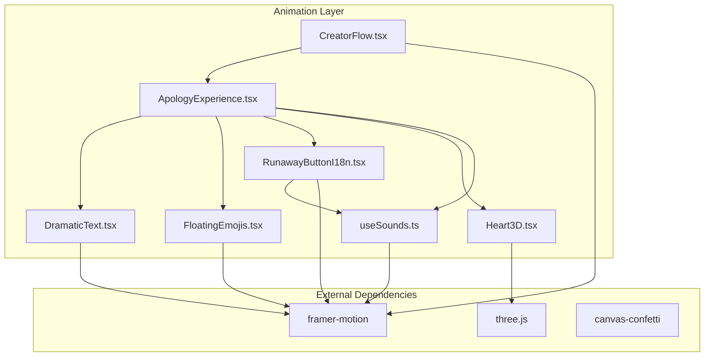
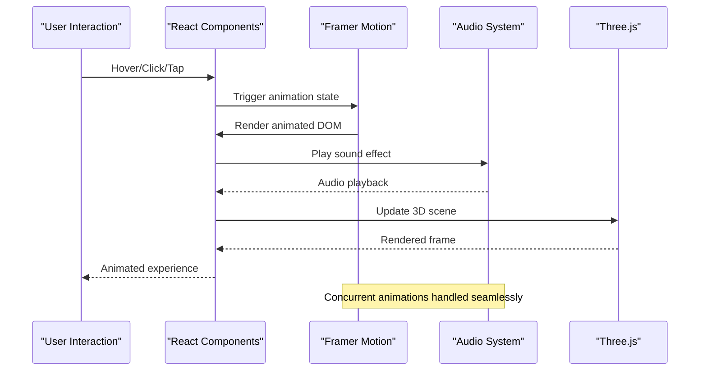
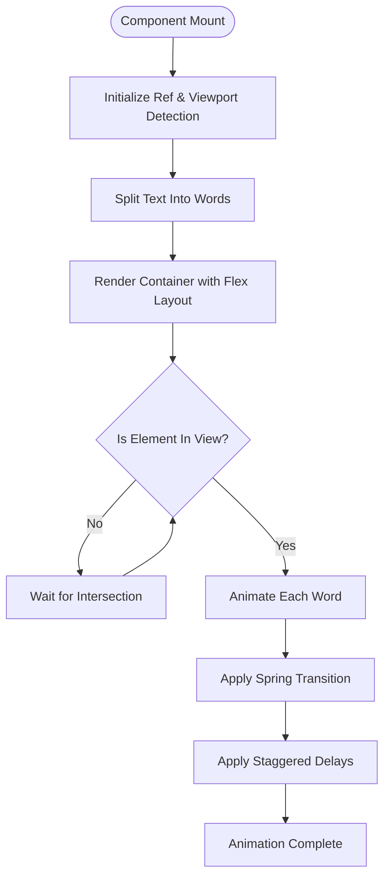
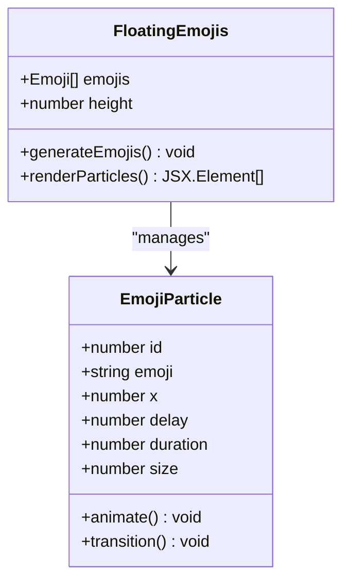
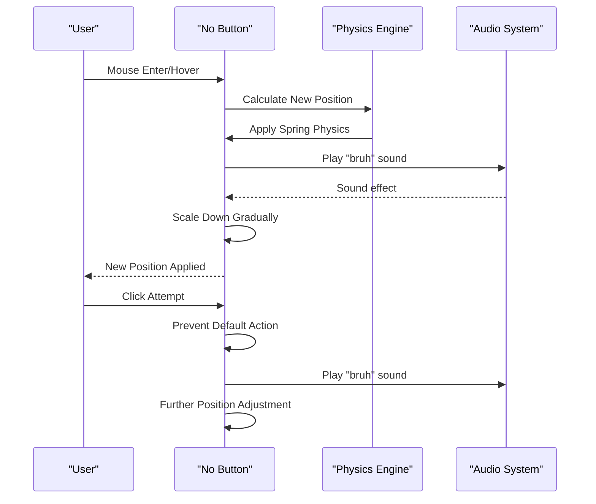
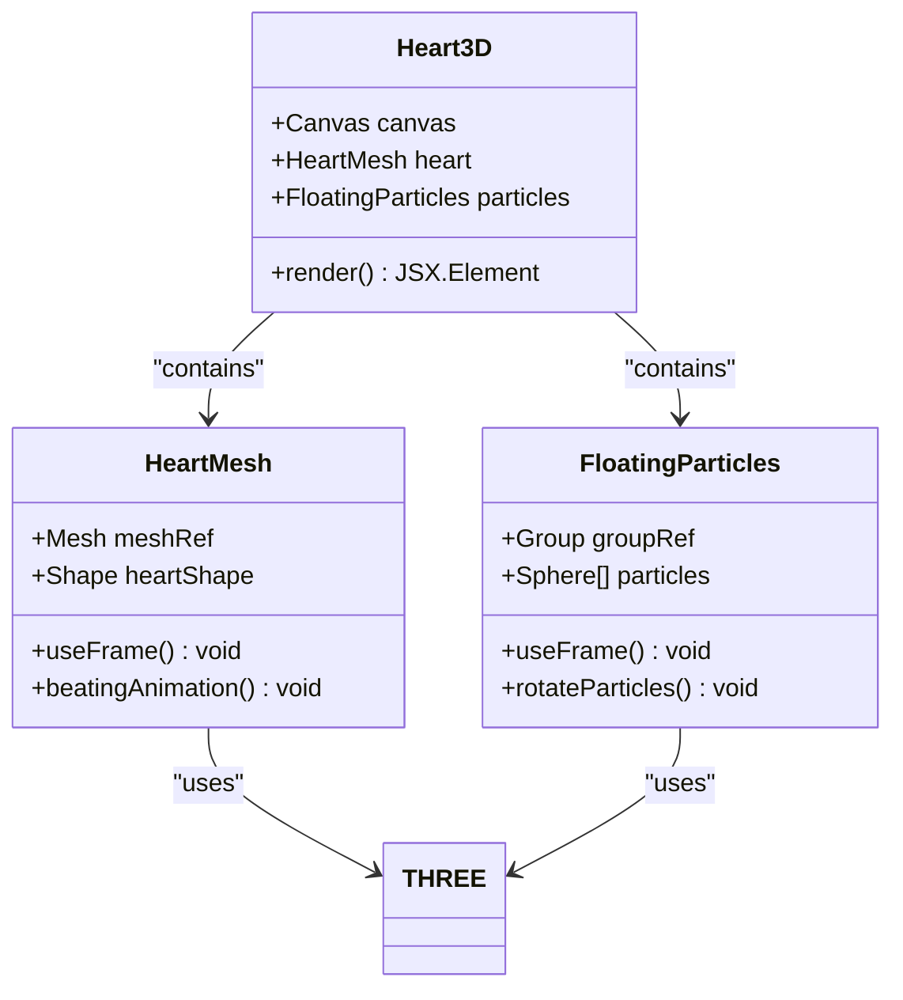
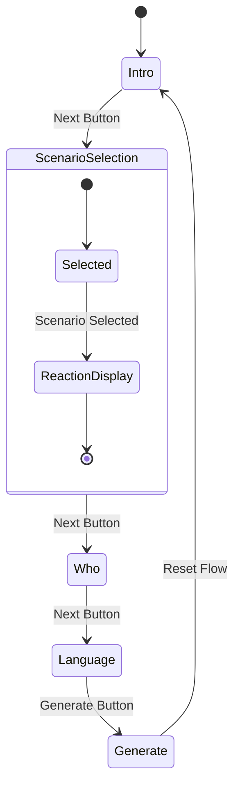
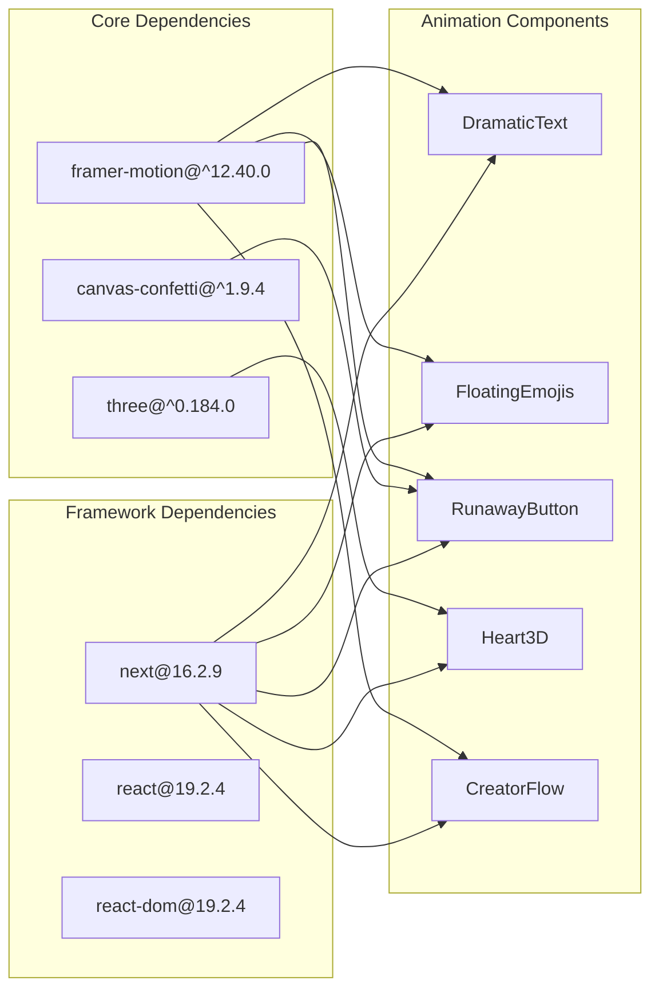

# Animation Framework

<cite>
**Referenced Files in This Document**
- [DramaticText.tsx](file://src/components/DramaticText.tsx)
- [FloatingEmojis.tsx](file://src/components/FloatingEmojis.tsx)
- [ApologyExperience.tsx](file://src/components/ApologyExperience.tsx)
- [CreatorFlow.tsx](file://src/components/CreatorFlow.tsx)
- [RunawayButtonI18n.tsx](file://src/components/RunawayButtonI18n.tsx)
- [useSounds.ts](file://src/components/useSounds.ts)
- [Heart3D.tsx](file://src/components/Heart3D.tsx)
- [globals.css](file://src/app/globals.css)
- [package.json](file://package.json)
</cite>

## Table of Contents
1. [Introduction](#introduction)
2. [Project Structure](#project-structure)
3. [Core Components](#core-components)
4. [Architecture Overview](#architecture-overview)
5. [Detailed Component Analysis](#detailed-component-analysis)
6. [Dependency Analysis](#dependency-analysis)
7. [Performance Considerations](#performance-considerations)
8. [Troubleshooting Guide](#troubleshooting-guide)
9. [Conclusion](#conclusion)

## Introduction
This document provides comprehensive documentation for the animation framework that powers the interactive apology experience. The system combines Framer Motion for declarative animations, Three.js for 3D visualizations, and canvas-confetti for celebratory effects. The framework emphasizes character-by-character text reveals, floating emoji particle systems, gesture-driven interactions, and immersive soundscapes designed to create an emotionally engaging experience.

## Project Structure
The animation framework is distributed across several React components, each responsible for specific animation patterns:

**Diagram sources**
- [ApologyExperience.tsx:1-219](file://src/components/ApologyExperience.tsx#L1-L219)
- [CreatorFlow.tsx:1-356](file://src/components/CreatorFlow.tsx#L1-L356)
- [RunawayButtonI18n.tsx:1-156](file://src/components/RunawayButtonI18n.tsx#L1-L156)
- [DramaticText.tsx:1-43](file://src/components/DramaticText.tsx#L1-L43)
- [FloatingEmojis.tsx:1-64](file://src/components/FloatingEmojis.tsx#L1-L64)
- [Heart3D.tsx:1-107](file://src/components/Heart3D.tsx#L1-L107)
- [useSounds.ts:1-69](file://src/components/useSounds.ts#L1-L69)

**Section sources**
- [package.json:11-24](file://package.json#L11-L24)

## Core Components
The animation framework centers around four primary components:

### Dramatic Text Reveal
The DramaticText component implements character-by-character text animations with spring-based easing and staggered delays. It leverages viewport detection to trigger animations only when elements come into view, optimizing performance for long pages.

### Floating Emoji Particle System
FloatingEmojis creates a continuous loop of animated emoji particles with randomized trajectories, sizes, and timing. The system adapts particle count and sizing based on device capabilities for optimal performance.

### Gesture-Driven Interactions
The RunawayButton component demonstrates advanced gesture handling with physics-based movement, collision avoidance, and adaptive scaling based on user interaction attempts.

### 3D Heart Visualization
The Heart3D component provides a beating 3D heart model with floating particle effects, combining Three.js rendering with Framer Motion for seamless integration.

**Section sources**
- [DramaticText.tsx:12-42](file://src/components/DramaticText.tsx#L12-L42)
- [FloatingEmojis.tsx:15-63](file://src/components/FloatingEmojis.tsx#L15-L63)
- [RunawayButtonI18n.tsx:20-155](file://src/components/RunawayButtonI18n.tsx#L20-L155)
- [Heart3D.tsx:87-106](file://src/components/Heart3D.tsx#L87-L106)

## Architecture Overview
The animation system follows a layered architecture with clear separation of concerns:

**Diagram sources**
- [ApologyExperience.tsx:32-218](file://src/components/ApologyExperience.tsx#L32-L218)
- [useSounds.ts:41-68](file://src/components/useSounds.ts#L41-L68)
- [Heart3D.tsx:87-106](file://src/components/Heart3D.tsx#L87-L106)

## Detailed Component Analysis

### Dramatic Text System
The DramaticText component implements sophisticated text reveal animations through a combination of viewport detection and spring-based transitions.

**Diagram sources**
- [DramaticText.tsx:17-34](file://src/components/DramaticText.tsx#L17-L34)

Key implementation characteristics:
- Uses `useInView` hook for efficient viewport detection
- Implements spring-based animations with configurable stiffness and damping
- Applies staggered delays for sequential word appearance
- Supports custom CSS class injection for styling flexibility

**Section sources**
- [DramaticText.tsx:12-42](file://src/components/DramaticText.tsx#L12-L42)

### Floating Emoji Particle System
The FloatingEmojis component creates an immersive background animation using a particle-based approach with physics-inspired movement patterns.

**Diagram sources**
- [FloatingEmojis.tsx:6-34](file://src/components/FloatingEmojis.tsx#L6-L34)

Performance optimization strategies:
- Dynamic particle count based on screen width (fewer on mobile devices)
- Randomized animation durations and delays to prevent synchronization
- Linear easing for consistent upward motion
- Infinite repetition with smooth opacity transitions

**Section sources**
- [FloatingEmojis.tsx:15-63](file://src/components/FloatingEmojis.tsx#L15-L63)

### Gesture-Driven Runaway Button
The RunawayButton component exemplifies advanced interaction patterns with physics-based movement and adaptive scaling.

**Diagram sources**
- [RunawayButtonI18n.tsx:28-39](file://src/components/RunawayButtonI18n.tsx#L28-L39)
- [useSounds.ts:42-48](file://src/components/useSounds.ts#L42-L48)

Advanced features:
- Physics-based positioning using spring animations
- Adaptive scaling that decreases with repeated attempts
- Touch and mouse event support for cross-device compatibility
- Confetti celebration system for successful interactions

**Section sources**
- [RunawayButtonI18n.tsx:20-155](file://src/components/RunawayButtonI18n.tsx#L20-L155)
- [useSounds.ts:1-69](file://src/components/useSounds.ts#L1-L69)

### 3D Heart Visualization
The Heart3D component combines Three.js rendering with Framer Motion animations to create a visually compelling centerpiece.

**Diagram sources**
- [Heart3D.tsx:7-48](file://src/components/Heart3D.tsx#L7-L48)
- [Heart3D.tsx:50-85](file://src/components/Heart3D.tsx#L50-L85)

Integration patterns:
- Continuous animation loop using Three.js `useFrame`
- Spring-based scaling for heartbeat effect
- Rotating particle system for depth perception
- Responsive lighting with multiple light sources

**Section sources**
- [Heart3D.tsx:87-106](file://src/components/Heart3D.tsx#L87-L106)

### Creator Flow Animation System
The CreatorFlow component demonstrates complex multi-step animation sequences with AnimatePresence for smooth transitions between states.

**Diagram sources**
- [CreatorFlow.tsx:88-352](file://src/components/CreatorFlow.tsx#L88-L352)

Animation patterns:
- Sequential step transitions with fade and slide effects
- Infinite looping animations for visual interest
- Interactive button states with hover and tap feedback
- Spring-based scaling for emphasis and engagement

**Section sources**
- [CreatorFlow.tsx:65-355](file://src/components/CreatorFlow.tsx#L65-L355)

## Dependency Analysis
The animation framework relies on several key dependencies that enable its sophisticated behavior:

**Diagram sources**
- [package.json:11-24](file://package.json#L11-L24)
- [DramaticText.tsx](file://src/components/DramaticText.tsx#L3)
- [FloatingEmojis.tsx](file://src/components/FloatingEmojis.tsx#L3)
- [RunawayButtonI18n.tsx](file://src/components/RunawayButtonI18n.tsx#L4)
- [Heart3D.tsx](file://src/components/Heart3D.tsx#L3)

**Section sources**
- [package.json:11-24](file://package.json#L11-L24)

## Performance Considerations
The animation framework implements several optimization strategies to ensure smooth performance across devices:

### Hardware Acceleration
- All animations utilize transform and opacity properties for GPU acceleration
- 3D transforms leverage hardware-accelerated compositing
- Canvas-based confetti uses efficient requestAnimationFrame loops

### Memory Management
- Audio instances are cached globally to prevent memory leaks
- Emoji particle arrays are generated once and reused
- Animation cleanup occurs automatically with component unmounting

### Device Optimization
- Mobile-first approach with reduced particle counts on smaller screens
- Adaptive animation durations based on device capabilities
- Touch-friendly interaction areas sized appropriately for mobile use

### Animation Efficiency
- Staggered animations prevent simultaneous heavy computations
- Infinite animations use efficient easing functions
- Viewport detection minimizes unnecessary calculations

**Section sources**
- [FloatingEmojis.tsx:22-33](file://src/components/FloatingEmojis.tsx#L22-L33)
- [useSounds.ts:29-39](file://src/components/useSounds.ts#L29-L39)

## Troubleshooting Guide
Common animation issues and their solutions:

### Animation Not Triggering
- Verify viewport detection is configured correctly
- Check intersection observer thresholds and margins
- Ensure parent containers have proper dimensions

### Performance Issues
- Reduce particle count on mobile devices
- Limit concurrent animations to 3-5 simultaneous
- Use transform properties instead of layout-affecting CSS
- Implement throttled animation updates

### Cross-Browser Compatibility
- Test animations on Safari, Chrome, Firefox, and Edge
- Verify Web Animations API support
- Check Three.js WebGL compatibility
- Validate Framer Motion version compatibility

### Accessibility Concerns
- Respect reduced motion preferences
- Provide alternative static content
- Ensure sufficient color contrast for animations
- Test with screen readers and keyboard navigation

**Section sources**
- [ApologyExperience.tsx:120-133](file://src/components/ApologyExperience.tsx#L120-L133)
- [globals.css:32-35](file://src/app/globals.css#L32-L35)

## Conclusion
The animation framework successfully combines multiple animation libraries to create an immersive, emotionally engaging experience. Through careful implementation of viewport detection, physics-based interactions, and performance optimizations, the system delivers smooth animations across all supported devices. The modular architecture allows for easy extension and customization while maintaining consistent performance standards.

The framework serves as a foundation for creating interactive experiences that balance entertainment value with accessibility considerations, providing a template for similar projects requiring sophisticated animation systems.