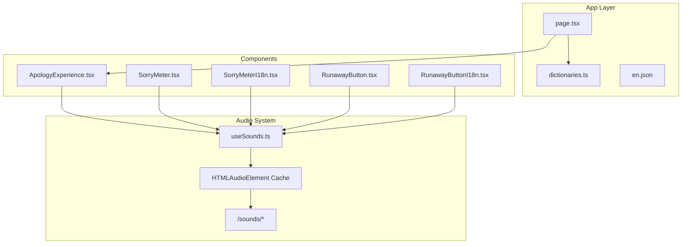
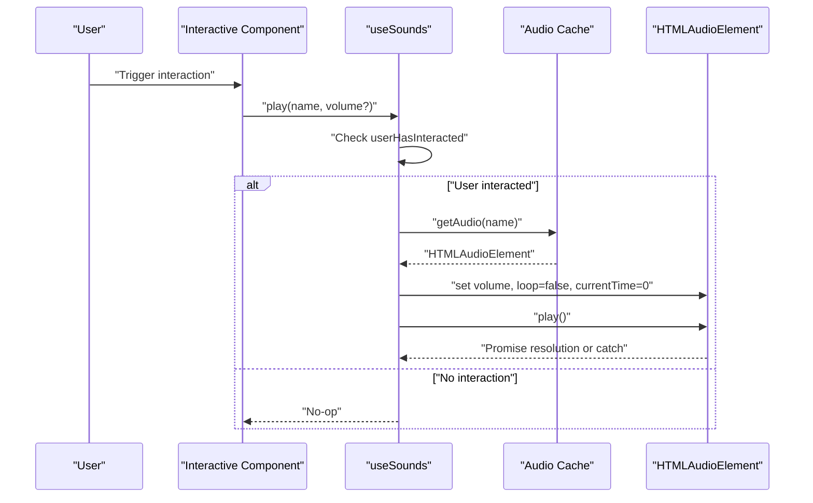
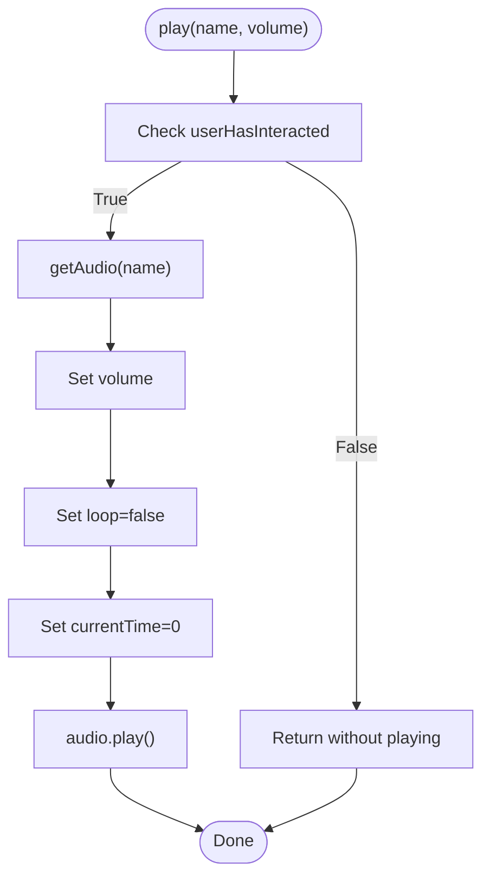
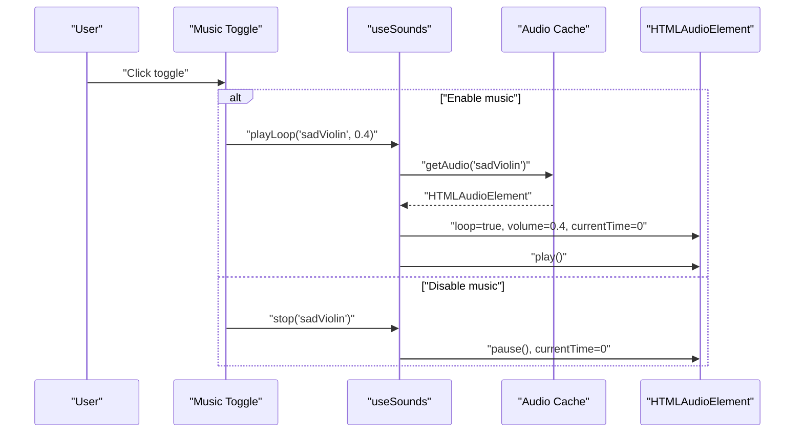
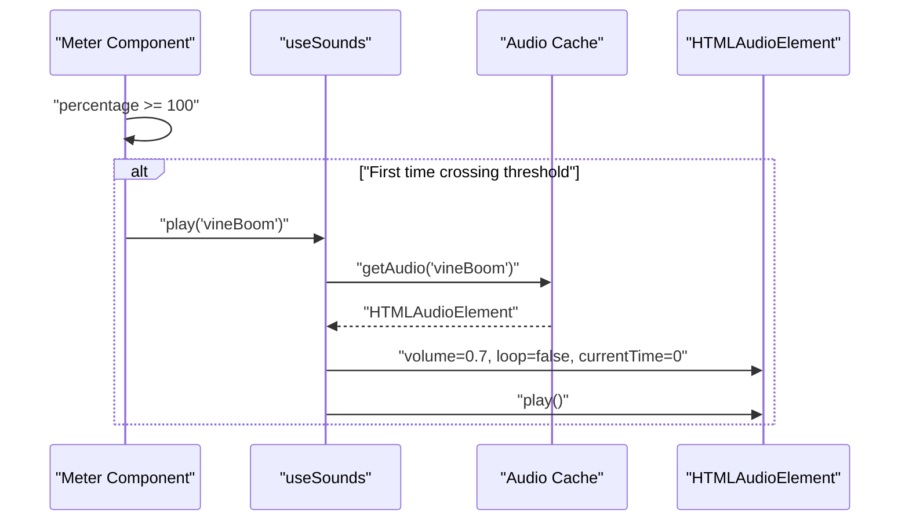
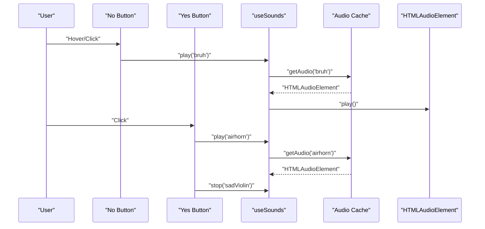
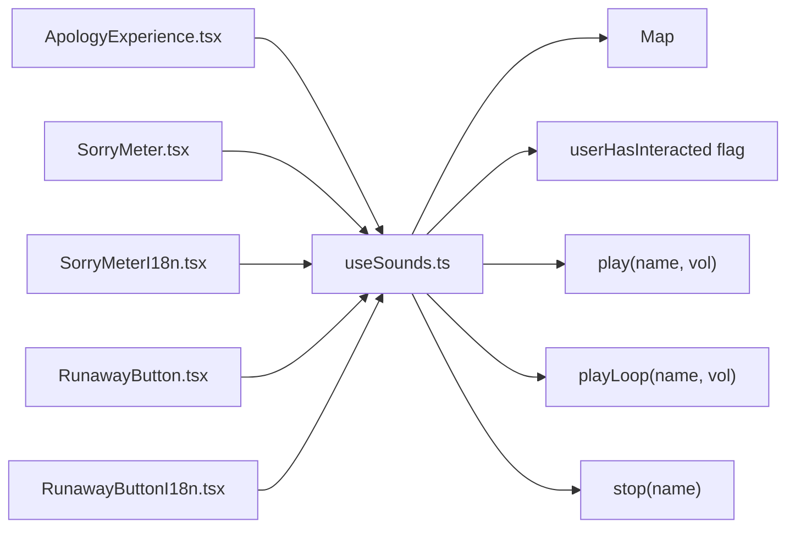

# Audio System

<cite>
**Referenced Files in This Document**
- [useSounds.ts](file://src/components/useSounds.ts)
- [ApologyExperience.tsx](file://src/components/ApologyExperience.tsx)
- [SorryMeter.tsx](file://src/components/SorryMeter.tsx)
- [SorryMeterI18n.tsx](file://src/components/SorryMeterI18n.tsx)
- [RunawayButton.tsx](file://src/components/RunawayButton.tsx)
- [RunawayButtonI18n.tsx](file://src/components/RunawayButtonI18n.tsx)
- [page.tsx](file://src/app/[lang]/page.tsx)
- [dictionaries.ts](file://src/app/[lang]/dictionaries.ts)
- [en.json](file://src/app/[lang]/dictionaries/en.json)
</cite>

## Table of Contents
1. [Introduction](#introduction)
2. [Project Structure](#project-structure)
3. [Core Components](#core-components)
4. [Architecture Overview](#architecture-overview)
5. [Detailed Component Analysis](#detailed-component-analysis)
6. [Dependency Analysis](#dependency-analysis)
7. [Performance Considerations](#performance-considerations)
8. [Troubleshooting Guide](#troubleshooting-guide)
9. [Conclusion](#conclusion)
10. [Appendices](#appendices)

## Introduction
This document explains the audio system powering the interactive apology experience. It focuses on the sound caching mechanism implemented in the React hook useSounds.ts, covering audio preload strategies, memory management, autoplay policy compliance, and integration patterns across interactive components. It also documents sound effect management for button clicks, progress meter celebrations, and ambient music, along with volume control, audio context handling, and browser autoplay restrictions. Guidance is included for adding new sounds, configuring volumes, optimizing performance, and addressing cross-browser and mobile device limitations.

## Project Structure
The audio system is implemented as a centralized React hook that manages shared audio resources and playback across components. The hook exposes methods to play one-shot effects, loop ambient tracks, and stop playback. Interactive components consume the hook to trigger sound effects during user interactions.

**Diagram sources**
- [page.tsx:12-31](file://src/app/[lang]/page.tsx#L12-L31)
- [dictionaries.ts:1-26](file://src/app/[lang]/dictionaries.ts#L1-L26)
- [useSounds.ts:1-69](file://src/components/useSounds.ts#L1-L69)
- [ApologyExperience.tsx:32-46](file://src/components/ApologyExperience.tsx#L32-L46)
- [SorryMeter.tsx:7-37](file://src/components/SorryMeter.tsx#L7-L37)
- [SorryMeterI18n.tsx:17-45](file://src/components/SorryMeterI18n.tsx#L17-L45)
- [RunawayButton.tsx:8-94](file://src/components/RunawayButton.tsx#L8-L94)
- [RunawayButtonI18n.tsx:20-74](file://src/components/RunawayButtonI18n.tsx#L20-L74)

**Section sources**
- [page.tsx:12-31](file://src/app/[lang]/page.tsx#L12-L31)
- [dictionaries.ts:1-26](file://src/app/[lang]/dictionaries.ts#L1-L26)
- [useSounds.ts:1-69](file://src/components/useSounds.ts#L1-L69)

## Core Components
- useSounds.ts: Centralized audio manager providing:
  - Sound caching via a global Map keyed by sound name
  - Autoplay policy compliance by tracking user interaction
  - Methods to play one-shot effects, loop ambient tracks, and stop playback
  - Volume control per-playback
- Interactive components:
  - ApologyExperience.tsx: Toggles ambient music loop
  - SorryMeter.tsx and SorryMeterI18n.tsx: Trigger celebratory sound when exceeding 100%
  - RunawayButton.tsx and RunawayButtonI18n.tsx: Trigger button click and success sounds

Key behaviors:
- Preload strategy: Audio elements are lazily created on first use and cached globally
- Memory management: Shared cache prevents redundant instances; components pause and reset currentTime on reuse
- Autoplay policy: Playback is gated until user interaction is detected

**Section sources**
- [useSounds.ts:14-69](file://src/components/useSounds.ts#L14-L69)
- [ApologyExperience.tsx:32-46](file://src/components/ApologyExperience.tsx#L32-L46)
- [SorryMeter.tsx:14-37](file://src/components/SorryMeter.tsx#L14-L37)
- [SorryMeterI18n.tsx:24-45](file://src/components/SorryMeterI18n.tsx#L24-L45)
- [RunawayButton.tsx:42-94](file://src/components/RunawayButton.tsx#L42-L94)
- [RunawayButtonI18n.tsx:28-74](file://src/components/RunawayButtonI18n.tsx#L28-L74)

## Architecture Overview
The audio system follows a functional hook pattern with a global cache and user-interaction gating. Components call useSounds to request playback, which ensures compliance with browser autoplay policies and optimizes resource usage.

**Diagram sources**
- [useSounds.ts:14-49](file://src/components/useSounds.ts#L14-L49)
- [ApologyExperience.tsx:39-46](file://src/components/ApologyExperience.tsx#L39-L46)
- [RunawayButton.tsx:56-59](file://src/components/RunawayButton.tsx#L56-L59)
- [SorryMeter.tsx:27-31](file://src/components/SorryMeter.tsx#L27-L31)

## Detailed Component Analysis

### Sound Caching and Autoplay Policy Compliance
- Global cache: A Map stores HTMLAudioElement instances keyed by sound name, enabling reuse across components and avoiding repeated network requests.
- User interaction gating: A flag is set upon the first user interaction (click, touchstart, or scroll). Subsequent play attempts are ignored until the flag is true.
- Lazy initialization: Audio elements are created only when first accessed, reducing initial load overhead.
- Looping vs one-shot: play() sets loop=false; playLoop() sets loop=true for ambient tracks.
- Volume control: Volume is set per-play invocation, allowing fine-grained control per component.

**Diagram sources**
- [useSounds.ts:41-49](file://src/components/useSounds.ts#L41-L49)

**Section sources**
- [useSounds.ts:14-69](file://src/components/useSounds.ts#L14-L69)

### Ambient Music Management
- Toggle behavior: The music toggle in ApologyExperience switches between playing and stopping the ambient track.
- Looping volume: playLoop is invoked with a lower volume for ambient tracks.
- Cleanup: stop pauses and resets the ambient track when toggled off.

**Diagram sources**
- [ApologyExperience.tsx:39-46](file://src/components/ApologyExperience.tsx#L39-L46)
- [useSounds.ts:51-65](file://src/components/useSounds.ts#L51-L65)

**Section sources**
- [ApologyExperience.tsx:32-46](file://src/components/ApologyExperience.tsx#L32-L46)
- [useSounds.ts:51-65](file://src/components/useSounds.ts#L51-L65)

### Celebration Effects on Progress Meter
- Trigger condition: When the meter exceeds 100%, a celebratory sound is triggered once.
- Internationalization: Both localized and non-localized meters use the same hook to play the effect.
- Animation and sound coordination: The effect occurs alongside visual feedback when the threshold is crossed.

**Diagram sources**
- [SorryMeter.tsx:27-31](file://src/components/SorryMeter.tsx#L27-L31)
- [SorryMeterI18n.tsx:36-40](file://src/components/SorryMeterI18n.tsx#L36-L40)

**Section sources**
- [SorryMeter.tsx:14-37](file://src/components/SorryMeter.tsx#L14-L37)
- [SorryMeterI18n.tsx:24-45](file://src/components/SorryMeterI18n.tsx#L24-L45)

### Button Click and Success Effects
- No button hover: Plays a humorous reaction sound with each hover/click to encourage clicking Yes.
- Success: On successful forgiveness, plays a celebratory sound and stops ambient music.
- Confetti integration: While not audio, the success flow demonstrates coordinated UX feedback.

**Diagram sources**
- [RunawayButton.tsx:42-59](file://src/components/RunawayButton.tsx#L42-L59)
- [RunawayButtonI18n.tsx:28-44](file://src/components/RunawayButtonI18n.tsx#L28-L44)
- [useSounds.ts:59-65](file://src/components/useSounds.ts#L59-L65)

**Section sources**
- [RunawayButton.tsx:42-94](file://src/components/RunawayButton.tsx#L42-L94)
- [RunawayButtonI18n.tsx:28-74](file://src/components/RunawayButtonI18n.tsx#L28-L74)

### Volume Control and Audio Context Handling
- Per-call volume: Each play invocation accepts a volume parameter, allowing components to adjust loudness independently.
- Loop volume: playLoop defaults to a lower volume for ambient tracks.
- Reset behavior: Before playback, currentTime is reset to ensure consistent retriggering.
- Browser autoplay restrictions: The hook defers playback until userHasInteracted is true, complying with autoplay policies.

**Section sources**
- [useSounds.ts:41-57](file://src/components/useSounds.ts#L41-L57)
- [useSounds.ts:14-27](file://src/components/useSounds.ts#L14-L27)

## Dependency Analysis
The audio system is consumed by multiple components, each invoking the hook for specific events. The hook depends on:
- Global cache for resource sharing
- User interaction detection for autoplay compliance
- HTMLAudioElement APIs for playback control

**Diagram sources**
- [useSounds.ts:14-69](file://src/components/useSounds.ts#L14-L69)
- [ApologyExperience.tsx:32-46](file://src/components/ApologyExperience.tsx#L32-L46)
- [SorryMeter.tsx:11-37](file://src/components/SorryMeter.tsx#L11-L37)
- [SorryMeterI18n.tsx:21-45](file://src/components/SorryMeterI18n.tsx#L21-L45)
- [RunawayButton.tsx:13-94](file://src/components/RunawayButton.tsx#L13-L94)
- [RunawayButtonI18n.tsx:26-74](file://src/components/RunawayButtonI18n.tsx#L26-L74)

**Section sources**
- [useSounds.ts:14-69](file://src/components/useSounds.ts#L14-L69)

## Performance Considerations
- Preloading strategy: Audio elements are created lazily on first use, minimizing initial payload and reducing unnecessary network requests.
- Resource reuse: A global cache avoids creating multiple instances of the same sound, saving memory and CPU.
- Autoplay gating: Prevents failed playback attempts and reduces wasted retries before user interaction.
- Volume normalization: Components can set appropriate volumes to avoid overwhelming the user and to balance ambient and effect sounds.
- Mobile considerations: On mobile devices, autoplay is often restricted; the hook’s interaction gating ensures reliable playback after user gesture.

[No sources needed since this section provides general guidance]

## Troubleshooting Guide
Common issues and resolutions:
- Sounds do not play:
  - Verify user interaction occurred; the hook ignores play attempts until userHasInteracted is true.
  - Confirm the audio element resolves and that play() does not throw errors (the hook catches and swallows errors).
- Duplicate or overlapping sounds:
  - Use stop(name) to pause and reset before re-triggering.
  - For loops, ensure playLoop is used appropriately and stop is called when switching contexts.
- Memory growth:
  - The cache is global and reused; avoid creating new keys or manually managing audio instances outside the hook.
- Cross-browser differences:
  - Some browsers require explicit user gestures before audio can play; ensure the interaction listeners are firing.
  - On iOS Safari, autoplay is strictly enforced; the hook’s gating is essential.

**Section sources**
- [useSounds.ts:14-49](file://src/components/useSounds.ts#L14-L49)
- [useSounds.ts:59-65](file://src/components/useSounds.ts#L59-L65)

## Conclusion
The audio system centralizes sound management with a robust caching strategy, strict autoplay compliance, and flexible volume control. Components integrate seamlessly by consuming the useSounds hook, enabling consistent and performant audio experiences across interactive elements. The design balances user experience with technical constraints, providing a scalable foundation for adding new sounds and effects.

[No sources needed since this section summarizes without analyzing specific files]

## Appendices

### Adding New Sound Effects
Steps to add a new sound:
1. Place the audio file under public/sounds with a descriptive filename.
2. Add a new key to the SOUNDS constant in the hook with the desired sound name and path.
3. Import the hook in the target component and call play("yourSoundName", volume) when the event occurs.
4. Optionally, call stop("yourSoundName") to reset or pause before re-triggering.

Example integration points:
- Ambient music: use playLoop("yourAmbientTrack", 0.3)
- One-shot effects: use play("yourEffect", 0.7)
- Cleanup: use stop("yourAmbientTrack")

**Section sources**
- [useSounds.ts:5-10](file://src/components/useSounds.ts#L5-L10)
- [useSounds.ts:41-49](file://src/components/useSounds.ts#L41-L49)
- [useSounds.ts:51-65](file://src/components/useSounds.ts#L51-L65)

### Configuring Audio Volumes
- Ambient tracks: Use playLoop with a lower volume (e.g., 0.3–0.5) to keep them subtle.
- Effects: Use play with moderate volume (e.g., 0.7) for clarity without overwhelming.
- Dynamic adjustments: Adjust volume per component based on context (e.g., increase effect volume during success).

**Section sources**
- [ApologyExperience.tsx:43](file://src/components/ApologyExperience.tsx#L43)
- [RunawayButton.tsx:58](file://src/components/RunawayButton.tsx#L58)
- [SorryMeter.tsx:30](file://src/components/SorryMeter.tsx#L30)

### Optimizing Audio Performance
- Prefer lazy initialization: The hook creates audio elements on first use.
- Reuse cached instances: Avoid manual instantiation; rely on the global cache.
- Reset playback state: The hook resets currentTime before play to prevent seeking overhead.
- Minimize concurrent loops: Limit simultaneous looping tracks to reduce CPU usage.

**Section sources**
- [useSounds.ts:32-39](file://src/components/useSounds.ts#L32-L39)
- [useSounds.ts:41-49](file://src/components/useSounds.ts#L41-L49)

### Cross-Browser Compatibility and Mobile Limitations
- Autoplay policies: Many browsers restrict autoplay; the hook gates playback until user interaction.
- iOS Safari: Autoplay is strictly enforced; ensure userHasInteracted is set via click/touchstart/scroll.
- Network delivery: Serve audio files with appropriate MIME types and consider compression for faster loading.
- Gesture requirements: Ensure the page responds to user gestures to enable subsequent audio playback.

**Section sources**
- [useSounds.ts:14-27](file://src/components/useSounds.ts#L14-L27)