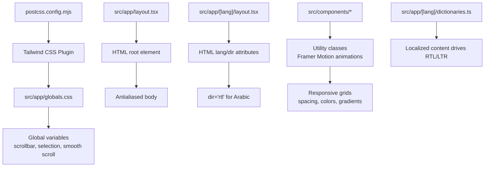
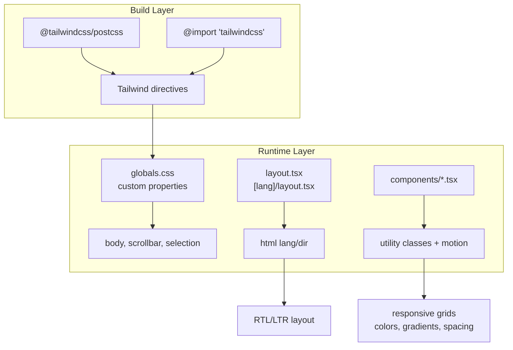
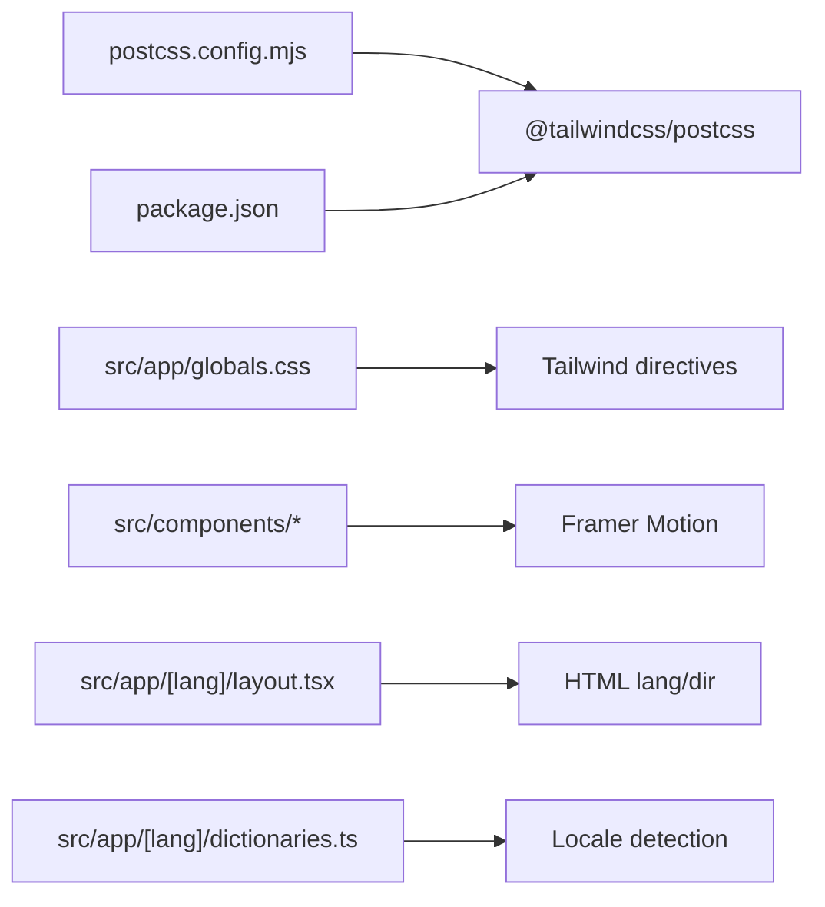

# Styling System

<cite>
**Referenced Files in This Document**
- [postcss.config.mjs](file://postcss.config.mjs)
- [package.json](file://package.json)
- [src/app/globals.css](file://src/app/globals.css)
- [src/app/layout.tsx](file://src/app/layout.tsx)
- [src/app/[lang]/layout.tsx](file://src/app/[lang]/layout.tsx)
- [src/app/[lang]/dictionaries.ts](file://src/app/[lang]/dictionaries.ts)
- [src/components/ApologyExperience.tsx](file://src/components/ApologyExperience.tsx)
- [src/components/LandingContent.tsx](file://src/components/LandingContent.tsx)
- [src/components/CreatorFlow.tsx](file://src/components/CreatorFlow.tsx)
- [src/components/RunawayButtonI18n.tsx](file://src/components/RunawayButtonI18n.tsx)
- [src/components/SorryMeterI18n.tsx](file://src/components/SorryMeterI18n.tsx)
</cite>

## Table of Contents
1. [Introduction](#introduction)
2. [Project Structure](#project-structure)
3. [Core Components](#core-components)
4. [Architecture Overview](#architecture-overview)
5. [Detailed Component Analysis](#detailed-component-analysis)
6. [Dependency Analysis](#dependency-analysis)
7. [Performance Considerations](#performance-considerations)
8. [Troubleshooting Guide](#troubleshooting-guide)
9. [Conclusion](#conclusion)

## Introduction
This document describes the styling system powering the I Am Really Sorry platform. It explains how Tailwind CSS is configured and integrated, how responsive design is implemented across components, and how the color scheme, typography, and spacing conventions are applied consistently. It also covers internationalization styling considerations for right-to-left languages, font loading strategies, and CSS-in-JS integration patterns used with Framer Motion. Finally, it provides practical guidance for extending the design system, optimizing performance, and ensuring accessibility and cross-device compatibility.

## Project Structure
The styling system is organized around:
- Global base styles and CSS custom properties
- PostCSS configuration enabling Tailwind CSS
- Layout-level HTML directionality and antialiasing
- Component-level Tailwind utility classes and Framer Motion animations
- Internationalized content driving layout direction and localized styling

**Diagram sources**
- [postcss.config.mjs:1-8](file://postcss.config.mjs#L1-L8)
- [src/app/globals.css:1-42](file://src/app/globals.css#L1-L42)
- [src/app/layout.tsx:1-8](file://src/app/layout.tsx#L1-L8)
- [src/app/[lang]/layout.tsx:68-107](file://src/app/[lang]/layout.tsx#L68-L107)
- [src/app/[lang]/dictionaries.ts:1-25](file://src/app/[lang]/dictionaries.ts#L1-L25)

**Section sources**
- [postcss.config.mjs:1-8](file://postcss.config.mjs#L1-L8)
- [src/app/globals.css:1-42](file://src/app/globals.css#L1-L42)
- [src/app/layout.tsx:1-8](file://src/app/layout.tsx#L1-L8)
- [src/app/[lang]/layout.tsx:68-107](file://src/app/[lang]/layout.tsx#L68-L107)
- [src/app/[lang]/dictionaries.ts:1-25](file://src/app/[lang]/dictionaries.ts#L1-L25)

## Core Components
- Tailwind CSS integration via PostCSS plugin
- Global CSS custom properties for background/foreground
- Scrollbar, selection, and smooth scrolling customizations
- Layout-level HTML directionality (LTR/RTL) based on locale
- Component-level utility classes for responsive grids, spacing, colors, and gradients
- Framer Motion for animation-driven styling and transitions

Key implementation references:
- Tailwind plugin registration: [postcss.config.mjs:1-8](file://postcss.config.mjs#L1-L8)
- Global variables and custom scroll/selection styles: [src/app/globals.css:1-42](file://src/app/globals.css#L1-L42)
- HTML lang/dir and antialiasing: [src/app/[lang]/layout.tsx:78-107](file://src/app/[lang]/layout.tsx#L78-L107)
- Utility class usage across components: [src/components/ApologyExperience.tsx:48-218](file://src/components/ApologyExperience.tsx#L48-L218), [src/components/LandingContent.tsx:39-157](file://src/components/LandingContent.tsx#L39-L157), [src/components/CreatorFlow.tsx:90-467](file://src/components/CreatorFlow.tsx#L90-L467), [src/components/RunawayButtonI18n.tsx:112-155](file://src/components/RunawayButtonI18n.tsx#L112-L155), [src/components/SorryMeterI18n.tsx:47-101](file://src/components/SorryMeterI18n.tsx#L47-L101)

**Section sources**
- [postcss.config.mjs:1-8](file://postcss.config.mjs#L1-L8)
- [src/app/globals.css:1-42](file://src/app/globals.css#L1-L42)
- [src/app/[lang]/layout.tsx:78-107](file://src/app/[lang]/layout.tsx#L78-L107)
- [src/components/ApologyExperience.tsx:48-218](file://src/components/ApologyExperience.tsx#L48-L218)
- [src/components/LandingContent.tsx:39-157](file://src/components/LandingContent.tsx#L39-L157)
- [src/components/CreatorFlow.tsx:90-467](file://src/components/CreatorFlow.tsx#L90-L467)
- [src/components/RunawayButtonI18n.tsx:112-155](file://src/components/RunawayButtonI18n.tsx#L112-L155)
- [src/components/SorryMeterI18n.tsx:47-101](file://src/components/SorryMeterI18n.tsx#L47-L101)

## Architecture Overview
The styling architecture combines:
- Build-time CSS generation via Tailwind (PostCSS)
- Runtime styling via utility classes and component composition
- Internationalization influencing layout direction and localized content
- Animation library integrating with Tailwind for motion-driven visuals

**Diagram sources**
- [postcss.config.mjs:1-8](file://postcss.config.mjs#L1-L8)
- [src/app/globals.css:1-42](file://src/app/globals.css#L1-L42)
- [src/app/layout.tsx:1-8](file://src/app/layout.tsx#L1-L8)
- [src/app/[lang]/layout.tsx:68-107](file://src/app/[lang]/layout.tsx#L68-L107)
- [src/components/ApologyExperience.tsx:48-218](file://src/components/ApologyExperience.tsx#L48-L218)

## Detailed Component Analysis

### Tailwind CSS Configuration and Integration
- PostCSS configuration registers the Tailwind plugin, enabling directive processing at build time.
- Global CSS imports Tailwind directives to generate utility classes across the app.
- Package dependencies include Tailwind v4 and the PostCSS plugin.

Implementation references:
- Plugin registration: [postcss.config.mjs:1-8](file://postcss.config.mjs#L1-L8)
- Tailwind directive import: [src/app/globals.css:1](file://src/app/globals.css#L1)
- Dependencies: [package.json:25-34](file://package.json#L25-L34)

**Section sources**
- [postcss.config.mjs:1-8](file://postcss.config.mjs#L1-L8)
- [src/app/globals.css:1](file://src/app/globals.css#L1)
- [package.json:25-34](file://package.json#L25-L34)

### Responsive Design Principles
- Mobile-first approach using Tailwind’s responsive prefixes (e.g., md:, lg:).
- Adaptive layouts with grid and flex utilities scaling across breakpoints.
- Consistent spacing and typography scales applied across components.

Examples across components:
- Grids adapting from single to multi-column layouts: [src/components/ApologyExperience.tsx:143-161](file://src/components/ApologyExperience.tsx#L143-L161), [src/components/LandingContent.tsx:70-82](file://src/components/LandingContent.tsx#L70-L82)
- Flexible hero and section paddings: [src/components/ApologyExperience.tsx:64-116](file://src/components/ApologyExperience.tsx#L64-L116), [src/components/CreatorFlow.tsx:90-91](file://src/components/CreatorFlow.tsx#L90-L91)
- Motion-triggered responsive visibility: [src/components/ApologyExperience.tsx:125-133](file://src/components/ApologyExperience.tsx#L125-L133)

**Section sources**
- [src/components/ApologyExperience.tsx:64-161](file://src/components/ApologyExperience.tsx#L64-L161)
- [src/components/LandingContent.tsx:70-82](file://src/components/LandingContent.tsx#L70-L82)
- [src/components/CreatorFlow.tsx:90-91](file://src/components/CreatorFlow.tsx#L90-L91)

### Color Scheme System
- Dark theme palette centered on gray-950/gray-900 backgrounds with accent colors (pink, red, rose, purple).
- Semantic color usage: foreground text, borders, and interactive states.
- Gradient accents for headings, buttons, and progress indicators.

References:
- Background gradient sections: [src/components/ApologyExperience.tsx:49](file://src/components/ApologyExperience.tsx#L49), [src/components/CreatorFlow.tsx:91](file://src/components/CreatorFlow.tsx#L91)
- Accent gradients: [src/components/ApologyExperience.tsx:91-95](file://src/components/ApologyExperience.tsx#L91-L95), [src/components/RunawayButtonI18n.tsx:122-123](file://src/components/RunawayButtonI18n.tsx#L122-L123)
- Progress bar gradient: [src/components/SorryMeterI18n.tsx:56-60](file://src/components/SorryMeterI18n.tsx#L56-L60)

**Section sources**
- [src/components/ApologyExperience.tsx:49](file://src/components/ApologyExperience.tsx#L49)
- [src/components/CreatorFlow.tsx:91](file://src/components/CreatorFlow.tsx#L91)
- [src/components/RunawayButtonI18n.tsx:122-123](file://src/components/RunawayButtonI18n.tsx#L122-L123)
- [src/components/SorryMeterI18n.tsx:56-60](file://src/components/SorryMeterI18n.tsx#L56-L60)

### Typography Hierarchy and Spacing Conventions
- Typography scale: headings use large text sizes with bold weights; paragraphs use medium/large text with appropriate line heights.
- Consistent spacing with padding/margin utilities and max-width containers for readability.
- Motion-driven emphasis for headings and interactive elements.

References:
- Heading sizes and gradients: [src/components/ApologyExperience.tsx:91-95](file://src/components/ApologyExperience.tsx#L91-L95), [src/components/CreatorFlow.tsx:110-114](file://src/components/CreatorFlow.tsx#L110-L114)
- Paragraph and list spacing: [src/components/LandingContent.tsx:62](file://src/components/LandingContent.tsx#L62), [src/components/LandingContent.tsx:90-100](file://src/components/LandingContent.tsx#L90-L100)
- Container widths and spacing: [src/components/LandingContent.tsx:49](file://src/components/LandingContent.tsx#L49), [src/components/CreatorFlow.tsx:390-393](file://src/components/CreatorFlow.tsx#L390-L393)

**Section sources**
- [src/components/ApologyExperience.tsx:91-95](file://src/components/ApologyExperience.tsx#L91-L95)
- [src/components/CreatorFlow.tsx:110-114](file://src/components/CreatorFlow.tsx#L110-L114)
- [src/components/LandingContent.tsx:62](file://src/components/LandingContent.tsx#L62)
- [src/components/LandingContent.tsx:90-100](file://src/components/LandingContent.tsx#L90-L100)
- [src/components/CreatorFlow.tsx:390-393](file://src/components/CreatorFlow.tsx#L390-L393)

### Internationalization Styling Considerations
- HTML dir attribute is set to rtl for Arabic and ltr for other locales.
- Localized content determines layout direction for specific components.
- Right-to-left alignment is handled at the component level via props and conditional rendering.

References:
- HTML dir assignment: [src/app/[lang]/layout.tsx:78](file://src/app/[lang]/layout.tsx#L78)
- Component-level RTL prop: [src/components/LandingContent.tsx:42](file://src/components/LandingContent.tsx#L42)
- Locale dictionary loader: [src/app/[lang]/dictionaries.ts:1-25](file://src/app/[lang]/dictionaries.ts#L1-L25)

**Section sources**
- [src/app/[lang]/layout.tsx:78](file://src/app/[lang]/layout.tsx#L78)
- [src/components/LandingContent.tsx:42](file://src/components/LandingContent.tsx#L42)
- [src/app/[lang]/dictionaries.ts:1-25](file://src/app/[lang]/dictionaries.ts#L1-L25)

### CSS-in-JS Integration Patterns
- Framer Motion integrates with Tailwind classes for animations and transforms.
- Dynamic inline styles are used for animated progress bars and glow effects.
- Motion variants combine utility classes with animation triggers.

References:
- Motion buttons and hover states: [src/components/ApologyExperience.tsx:53-61](file://src/components/ApologyExperience.tsx#L53-L61), [src/components/RunawayButtonI18n.tsx:122-123](file://src/components/RunawayButtonI18n.tsx#L122-L123)
- Animated progress bar: [src/components/SorryMeterI18n.tsx:54-71](file://src/components/SorryMeterI18n.tsx#L54-L71)
- Motion transitions and delays: [src/components/ApologyExperience.tsx:65-104](file://src/components/ApologyExperience.tsx#L65-L104), [src/components/CreatorFlow.tsx:95-101](file://src/components/CreatorFlow.tsx#L95-L101)

**Section sources**
- [src/components/ApologyExperience.tsx:53-61](file://src/components/ApologyExperience.tsx#L53-L61)
- [src/components/RunawayButtonI18n.tsx:122-123](file://src/components/RunawayButtonI18n.tsx#L122-L123)
- [src/components/SorryMeterI18n.tsx:54-71](file://src/components/SorryMeterI18n.tsx#L54-L71)
- [src/components/ApologyExperience.tsx:65-104](file://src/components/ApologyExperience.tsx#L65-L104)
- [src/components/CreatorFlow.tsx:95-101](file://src/components/CreatorFlow.tsx#L95-L101)

### Creating Custom Styles and Extending the Design System
- Extend global variables for consistent theming across the app.
- Add new utility classes by composing existing Tailwind utilities.
- Introduce motion variants for repeated animation patterns.
- Maintain consistency by reusing color and spacing tokens.

Guidelines:
- Centralize color tokens in global CSS variables: [src/app/globals.css:3-6](file://src/app/globals.css#L3-L6)
- Compose utility classes for common patterns: [src/components/LandingContent.tsx:74-75](file://src/components/LandingContent.tsx#L74-L75)
- Use motion wrappers for reusable animations: [src/components/ApologyExperience.tsx:65-104](file://src/components/ApologyExperience.tsx#L65-L104)

**Section sources**
- [src/app/globals.css:3-6](file://src/app/globals.css#L3-L6)
- [src/components/LandingContent.tsx:74-75](file://src/components/LandingContent.tsx#L74-L75)
- [src/components/ApologyExperience.tsx:65-104](file://src/components/ApologyExperience.tsx#L65-L104)

### Cross-Device Compatibility
- Responsive breakpoints ensure readable text and touch-friendly targets.
- Interactive elements maintain sufficient size and spacing on small screens.
- Motion animations adapt to device capabilities using Framer Motion.

References:
- Touch-friendly buttons: [src/components/RunawayButtonI18n.tsx:132-141](file://src/components/RunawayButtonI18n.tsx#L132-L141)
- Responsive grids: [src/components/LandingContent.tsx:70-82](file://src/components/LandingContent.tsx#L70-L82)
- Motion scaling for smaller screens: [src/components/CreatorFlow.tsx:110-114](file://src/components/CreatorFlow.tsx#L110-L114)

**Section sources**
- [src/components/RunawayButtonI18n.tsx:132-141](file://src/components/RunawayButtonI18n.tsx#L132-L141)
- [src/components/LandingContent.tsx:70-82](file://src/components/LandingContent.tsx#L70-L82)
- [src/components/CreatorFlow.tsx:110-114](file://src/components/CreatorFlow.tsx#L110-L114)

## Dependency Analysis
The styling system depends on:
- Tailwind CSS v4 and the PostCSS plugin for build-time CSS generation
- Framer Motion for animation-driven styling
- Next.js app directory for layout and internationalization

**Diagram sources**
- [postcss.config.mjs:1-8](file://postcss.config.mjs#L1-L8)
- [package.json:25-34](file://package.json#L25-L34)
- [src/app/globals.css:1](file://src/app/globals.css#L1)
- [src/app/[lang]/layout.tsx:78-107](file://src/app/[lang]/layout.tsx#L78-L107)
- [src/app/[lang]/dictionaries.ts:1-25](file://src/app/[lang]/dictionaries.ts#L1-L25)

**Section sources**
- [postcss.config.mjs:1-8](file://postcss.config.mjs#L1-L8)
- [package.json:25-34](file://package.json#L25-L34)
- [src/app/globals.css:1](file://src/app/globals.css#L1)
- [src/app/[lang]/layout.tsx:78-107](file://src/app/[lang]/layout.tsx#L78-L107)
- [src/app/[lang]/dictionaries.ts:1-25](file://src/app/[lang]/dictionaries.ts#L1-L25)

## Performance Considerations
- Prefer utility classes over ad-hoc CSS to leverage PurgeCSS and minimize bundle size.
- Use motion sparingly and optimize animation durations and easing for smooth performance.
- Keep global styles minimal; avoid heavy custom CSS outside Tailwind utilities.
- Ensure images and media are optimized for various screen densities.

[No sources needed since this section provides general guidance]

## Troubleshooting Guide
- If animations appear janky, reduce motion or adjust timing in Framer Motion components.
- If RTL layout appears incorrect, verify the html dir attribute and component-level direction props.
- If colors seem inconsistent, confirm usage of shared semantic color classes and global variables.

**Section sources**
- [src/app/[lang]/layout.tsx:78](file://src/app/[lang]/layout.tsx#L78)
- [src/components/LandingContent.tsx:42](file://src/components/LandingContent.tsx#L42)

## Conclusion
The styling system for I Am Really Sorry leverages Tailwind CSS for a scalable, utility-first approach, complemented by Framer Motion for expressive animations and Next.js internationalization for layout direction. By adhering to consistent color tokens, typography scales, and responsive patterns, the platform achieves a cohesive visual identity across devices and languages. Extensibility is achieved through global variables, composed utility classes, and reusable motion patterns, while performance is maintained through minimal custom CSS and efficient animation practices.