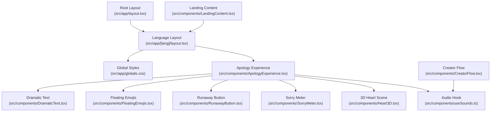
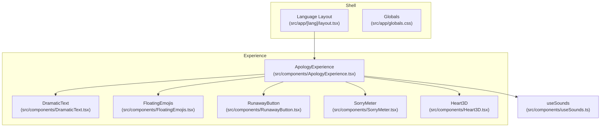
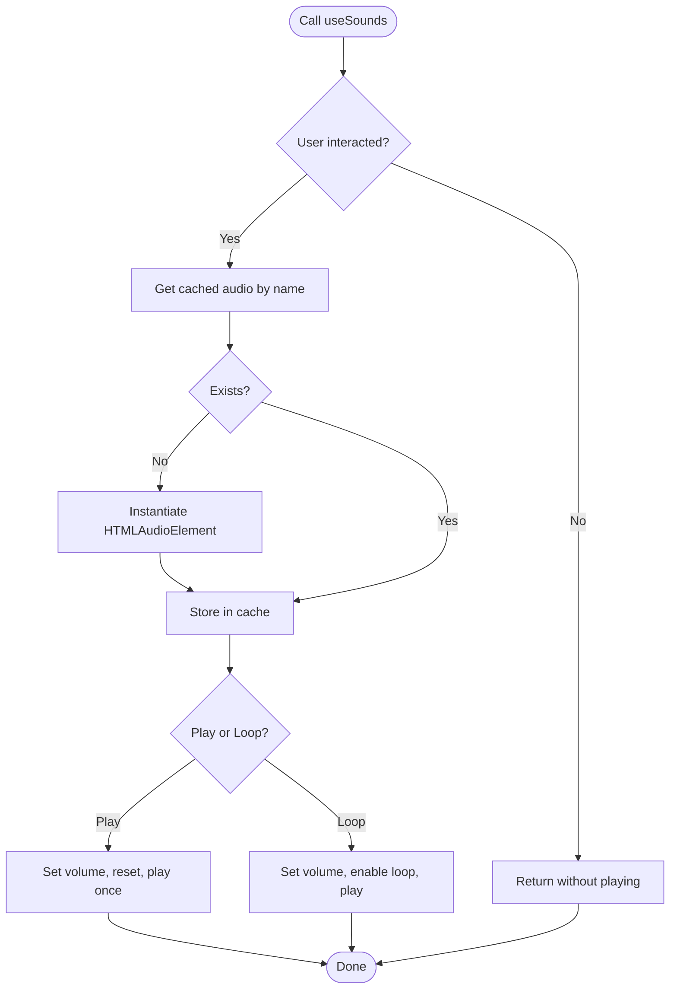
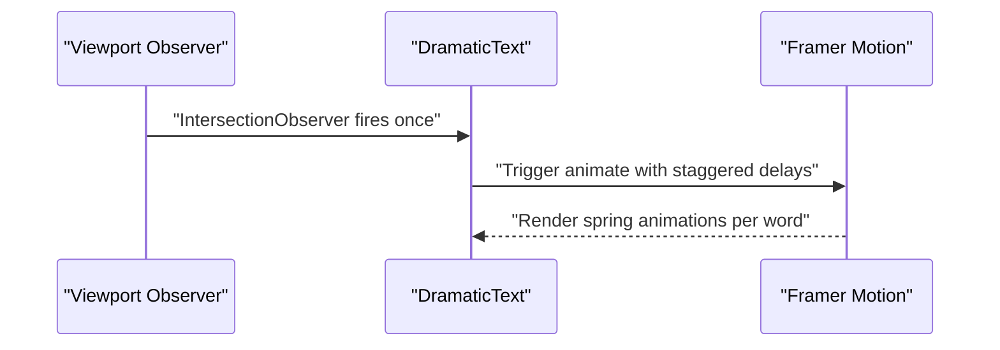
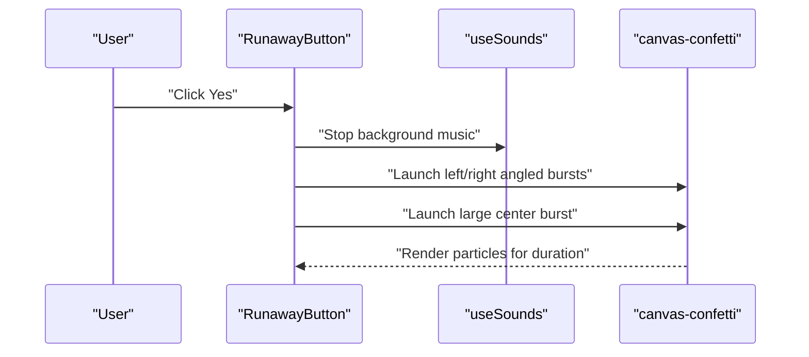
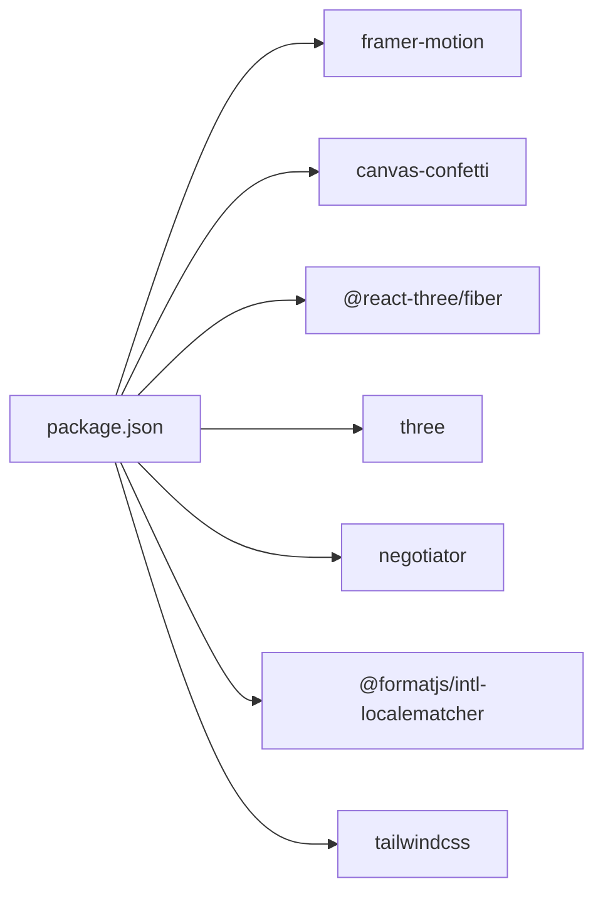

# Technical Components

<cite>
**Referenced Files in This Document**
- [README.md](file://README.md)
- [package.json](file://package.json)
- [next.config.ts](file://next.config.ts)
- [src/app/layout.tsx](file://src/app/layout.tsx)
- [src/app/[lang]/layout.tsx](file://src/app/[lang]/layout.tsx)
- [src/app/globals.css](file://src/app/globals.css)
- [src/components/useSounds.ts](file://src/components/useSounds.ts)
- [src/components/ApologyExperience.tsx](file://src/components/ApologyExperience.tsx)
- [src/components/DramaticText.tsx](file://src/components/DramaticText.tsx)
- [src/components/FloatingEmojis.tsx](file://src/components/FloatingEmojis.tsx)
- [src/components/CreatorFlow.tsx](file://src/components/CreatorFlow.tsx)
- [src/components/RunawayButton.tsx](file://src/components/RunawayButton.tsx)
- [src/components/SorryMeter.tsx](file://src/components/SorryMeter.tsx)
- [src/components/Heart3D.tsx](file://src/components/Heart3D.tsx)
- [src/components/LandingContent.tsx](file://src/components/LandingContent.tsx)
</cite>

## Table of Contents
1. [Introduction](#introduction)
2. [Project Structure](#project-structure)
3. [Core Components](#core-components)
4. [Architecture Overview](#architecture-overview)
5. [Detailed Component Analysis](#detailed-component-analysis)
6. [Dependency Analysis](#dependency-analysis)
7. [Performance Considerations](#performance-considerations)
8. [Troubleshooting Guide](#troubleshooting-guide)
9. [Conclusion](#conclusion)

## Introduction
This document explains the technical foundation of the I Am Really Sorry platform. It covers the audio system with sound caching, autoplay compliance, and volume control; the animation framework powered by Framer Motion for transitions and entrance/exit effects; the styling system built on Tailwind CSS; the confetti celebration system; dramatic text transitions; floating emoji effects; component lifecycle management; state management patterns; and reusable utility functions. Implementation details, configuration options, and integration examples are included, along with performance considerations, browser compatibility, and optimization strategies.

## Project Structure
The project is a Next.js application organized around a root layout, language-specific pages, and a set of shared components. Key areas:
- Application shell and internationalization metadata generation
- Global styles and theme tokens
- Shared hooks and utilities for audio playback
- Page experiences composed from reusable components
- Third-party integrations for 3D rendering and confetti

**Diagram sources**
- [src/app/layout.tsx:1-9](file://src/app/layout.tsx#L1-L9)
- [src/app/[lang]/layout.tsx:68-107](file://src/app/[lang]/layout.tsx#L68-L107)
- [src/app/globals.css:1-42](file://src/app/globals.css#L1-L42)
- [src/components/ApologyExperience.tsx:32-219](file://src/components/ApologyExperience.tsx#L32-L219)
- [src/components/DramaticText.tsx:12-43](file://src/components/DramaticText.tsx#L12-L43)
- [src/components/FloatingEmojis.tsx:15-64](file://src/components/FloatingEmojis.tsx#L15-L64)
- [src/components/RunawayButton.tsx:8-184](file://src/components/RunawayButton.tsx#L8-L184)
- [src/components/SorryMeter.tsx:7-100](file://src/components/SorryMeter.tsx#L7-L100)
- [src/components/Heart3D.tsx:87-107](file://src/components/Heart3D.tsx#L87-L107)
- [src/components/useSounds.ts:41-69](file://src/components/useSounds.ts#L41-L69)
- [src/components/CreatorFlow.tsx:44-335](file://src/components/CreatorFlow.tsx#L44-L335)
- [src/components/LandingContent.tsx:22-158](file://src/components/LandingContent.tsx#L22-L158)

**Section sources**
- [README.md:1-37](file://README.md#L1-L37)
- [package.json:1-36](file://package.json#L1-L36)
- [next.config.ts:1-8](file://next.config.ts#L1-L8)
- [src/app/layout.tsx:1-9](file://src/app/layout.tsx#L1-L9)
- [src/app/[lang]/layout.tsx:68-107](file://src/app/[lang]/layout.tsx#L68-L107)
- [src/app/globals.css:1-42](file://src/app/globals.css#L1-L42)

## Core Components
- Audio system with global caching, user-interaction gating, and volume control
- Animation framework using Framer Motion for entrance, transitions, and micro-interactions
- Styling system leveraging Tailwind CSS with custom tokens and responsive design
- Confetti celebration using canvas-confetti
- Dramatic text transitions with spring-based staggered animations
- Floating emoji background with per-instance randomization
- 3D scene with animated heart and particle effects
- Creator flow with guided steps and link generation
- Landing content with structured data and multilingual support

**Section sources**
- [src/components/useSounds.ts:1-69](file://src/components/useSounds.ts#L1-L69)
- [src/components/ApologyExperience.tsx:32-219](file://src/components/ApologyExperience.tsx#L32-L219)
- [src/components/DramaticText.tsx:12-43](file://src/components/DramaticText.tsx#L12-L43)
- [src/components/FloatingEmojis.tsx:15-64](file://src/components/FloatingEmojis.tsx#L15-L64)
- [src/components/RunawayButton.tsx:8-184](file://src/components/RunawayButton.tsx#L8-L184)
- [src/components/SorryMeter.tsx:7-100](file://src/components/SorryMeter.tsx#L7-L100)
- [src/components/Heart3D.tsx:87-107](file://src/components/Heart3D.tsx#L87-L107)
- [src/components/CreatorFlow.tsx:44-335](file://src/components/CreatorFlow.tsx#L44-L335)
- [src/components/LandingContent.tsx:22-158](file://src/components/LandingContent.tsx#L22-L158)

## Architecture Overview
The platform composes a language-aware page shell with global styles and a central experience component. The experience orchestrates animations, audio, and interactive elements. Reusable components encapsulate specific UI behaviors, while a shared audio hook centralizes sound playback and caching.

**Diagram sources**
- [src/app/[lang]/layout.tsx:68-107](file://src/app/[lang]/layout.tsx#L68-L107)
- [src/app/globals.css:1-42](file://src/app/globals.css#L1-L42)
- [src/components/ApologyExperience.tsx:32-219](file://src/components/ApologyExperience.tsx#L32-L219)
- [src/components/DramaticText.tsx:12-43](file://src/components/DramaticText.tsx#L12-L43)
- [src/components/FloatingEmojis.tsx:15-64](file://src/components/FloatingEmojis.tsx#L15-L64)
- [src/components/RunawayButton.tsx:8-184](file://src/components/RunawayButton.tsx#L8-L184)
- [src/components/SorryMeter.tsx:7-100](file://src/components/SorryMeter.tsx#L7-L100)
- [src/components/Heart3D.tsx:87-107](file://src/components/Heart3D.tsx#L87-L107)
- [src/components/useSounds.ts:41-69](file://src/components/useSounds.ts#L41-L69)

## Detailed Component Analysis

### Audio System and Sound Management
The audio system provides a centralized hook for playing short sound effects and looping background tracks. It ensures autoplay compliance by gating playback until the first user interaction, caches audio instances globally to avoid duplication, and exposes methods to play once or loop with configurable volumes.

Key behaviors:
- Autoplay compliance: Playback is blocked until a user interaction event occurs (click, touchstart, scroll). A single listener removes itself after the first trigger.
- Global audio cache: A Map stores HTMLAudioElement instances keyed by sound name to reuse audio objects.
- Volume control: Per-playback volume and per-loop volume are supported.
- Looping vs. one-shot: Dedicated methods differentiate looping and non-looping playback.
- Stop method: Pauses and resets a cached audio instance.

**Diagram sources**
- [src/components/useSounds.ts:14-27](file://src/components/useSounds.ts#L14-L27)
- [src/components/useSounds.ts:32-39](file://src/components/useSounds.ts#L32-L39)
- [src/components/useSounds.ts:41-69](file://src/components/useSounds.ts#L41-L69)

Implementation highlights:
- Sound registry: A constant map defines available sound names and asset paths.
- Interaction gating: Listeners on document events mark interaction and remove themselves.
- Cache retrieval: Lazily creates audio elements and stores them for reuse.
- Playback control: Resets currentTime and catches play promise rejections.

Integration example:
- Toggle music in the experience component by calling the loop method with a volume parameter and stopping on toggle.

**Section sources**
- [src/components/useSounds.ts:1-69](file://src/components/useSounds.ts#L1-L69)
- [src/components/ApologyExperience.tsx:39-46](file://src/components/ApologyExperience.tsx#L39-L46)

### Animation Framework with Framer Motion
Framer Motion powers entrance animations, staggered text reveals, hover and tap interactions, and continuous micro-motions. Components leverage variants, viewport-based triggers, and spring physics for natural-feeling motion.

Highlights:
- DramaticText: Splits text into words and animates each word with a staggered spring transition when in view.
- ApologyExperience: Uses initial/animate/transition patterns for hero scaling, subtitle fade-in, and continuous scroll hint bounce.
- CreatorFlow: Steps transition with AnimatePresence and wait mode for smooth cross-fade between screens.
- RunawayButton: Animates button growth and No button escape trajectory; Yes button scales with attempts.
- SorryMeter: Animates percentage fill and a breaking overflow effect when exceeding 100%.

**Diagram sources**
- [src/components/DramaticText.tsx:17-34](file://src/components/DramaticText.tsx#L17-L34)

Additional examples:
- Entrance springs and fades in the experience hero section.
- Infinite bounce and pulse effects for interactive elements.
- Staggered reveal lists in the experience sections.

**Section sources**
- [src/components/DramaticText.tsx:12-43](file://src/components/DramaticText.tsx#L12-L43)
- [src/components/ApologyExperience.tsx:64-116](file://src/components/ApologyExperience.tsx#L64-L116)
- [src/components/CreatorFlow.tsx:67-102](file://src/components/CreatorFlow.tsx#L67-L102)
- [src/components/RunawayButton.tsx:142-170](file://src/components/RunawayButton.tsx#L142-L170)
- [src/components/SorryMeter.tsx:46-67](file://src/components/SorryMeter.tsx#L46-L67)

### Styling System with Tailwind CSS
Tailwind CSS is configured as a PostCSS plugin and extended with custom CSS variables for theme tokens. The design system emphasizes:
- Dark theme with gradient accents and glass-like overlays
- Responsive typography and spacing
- Scrollbar customization and selection colors
- Smooth scrolling behavior

Key configuration points:
- Tailwind imported as PostCSS plugin in global CSS
- CSS variables define background and foreground tokens
- Utility classes drive layout, borders, gradients, and blur effects
- Scroll behavior and selection colors are customized

Responsive design principles:
- Mobile-first grid layouts with column overrides
- Flexible typography scales across breakpoints
- Interactive elements scale with hover/tap states

**Section sources**
- [src/app/globals.css:1-42](file://src/app/globals.css#L1-L42)
- [package.json:25-34](file://package.json#L25-L34)

### Confetti Celebration System
The confetti system triggers celebratory bursts upon successful actions. It uses canvas-confetti to render colorful particle explosions with directional origins and color palettes.

Behavior:
- On “Yes” click, two angled bursts originate from the edges and a large central burst radiates upward.
- A timed animation loop renders continuous confetti for a duration, then stops.

**Diagram sources**
- [src/components/RunawayButton.tsx:56-94](file://src/components/RunawayButton.tsx#L56-L94)
- [src/components/useSounds.ts:59-65](file://src/components/useSounds.ts#L59-L65)

**Section sources**
- [src/components/RunawayButton.tsx:8-184](file://src/components/RunawayButton.tsx#L8-L184)

### Dramatic Text Transitions
DramaticText splits a sentence into words and animates each word independently when it enters the viewport. The animation uses a spring-based transition with a per-word delay to create a cascading effect.

Implementation details:
- Uses viewport intersection observer to trigger animations once
- Applies 3D transforms (rotateX) combined with opacity and vertical translation
- Exposes props for text content, optional className, and base delay offset

**Section sources**
- [src/components/DramaticText.tsx:12-43](file://src/components/DramaticText.tsx#L12-L43)

### Floating Emoji Effects
FloatingEmojis generates a randomized set of emoji elements with per-instance properties (position, size, duration, delay). Each emoji floats upward infinitely with opacity and rotation transitions, and fewer emojis are rendered on smaller screens for performance.

Behavior:
- On mount, computes window height and generates a count based on viewport width
- Creates emoji entries with random emoji, horizontal position, size, and timing
- Renders fixed-position absolute elements animated with Framer Motion

**Section sources**
- [src/components/FloatingEmojis.tsx:15-64](file://src/components/FloatingEmojis.tsx#L15-L64)

### Component Lifecycle Management and State Patterns
Patterns observed across components:
- Controlled state updates with useState for ephemeral UI state (e.g., music toggle, button attempts, creator flow step)
- Viewport-triggered animations with useInView and whileInView for lazy, performance-friendly effects
- Dynamic imports for heavy 3D scenes to avoid SSR overhead
- Cleanup timers and intervals to prevent memory leaks

Examples:
- ApologyExperience toggles background music and coordinates multiple sections’ animations.
- CreatorFlow manages multi-step navigation with AnimatePresence and controlled inputs.
- SorryMeter animates a percentage with intervals and plays a sound when crossing thresholds.

**Section sources**
- [src/components/ApologyExperience.tsx:32-219](file://src/components/ApologyExperience.tsx#L32-L219)
- [src/components/CreatorFlow.tsx:44-335](file://src/components/CreatorFlow.tsx#L44-L335)
- [src/components/SorryMeter.tsx:7-100](file://src/components/SorryMeter.tsx#L7-L100)

### 3D Scene with Animated Heart and Particles
The 3D scene uses React Three Fiber to render a parametric heart shape with extrusion and materials. The scene includes ambient and directional lights, a rotating heart mesh, and floating glowing particles.

Highlights:
- HeartMesh: Defines a heart shape, extrudes geometry, and animates scale and rotation each frame.
- FloatingParticles: Spawns randomized spheres around the heart with emissive materials.
- Canvas configuration sets camera position and field of view, and enables always-on frame loop.

**Section sources**
- [src/components/Heart3D.tsx:7-107](file://src/components/Heart3D.tsx#L7-L107)

### Creator Flow and Link Generation
The CreatorFlow component guides users through three steps: selecting a scenario, entering a recipient’s name, and choosing a language. It generates a sharable link with the chosen language and name, supports copying to clipboard, and previews the resulting page.

Key behaviors:
- Step-based navigation with AnimatePresence for transitions
- Scenario reactions mapped to humorous messages
- Language selector with flags and names
- Link generation using window origin and URL encoding

**Section sources**
- [src/components/CreatorFlow.tsx:44-335](file://src/components/CreatorFlow.tsx#L44-L335)

### Landing Content and Structured Data
LandingContent renders SEO-focused content including value propositions, steps, features, FAQs, and a call-to-action. It also injects structured data (FAQPage) for improved search visibility and supports RTL layouts for Arabic.

Highlights:
- Schema markup injected via script tag for FAQPage
- Grid layouts for steps and features
- Details/summary pattern for collapsible FAQs
- Conditional content for localized blog links

**Section sources**
- [src/components/LandingContent.tsx:22-158](file://src/components/LandingContent.tsx#L22-L158)

## Dependency Analysis
External libraries and their roles:
- Framer Motion: Animation orchestration and viewport triggers
- canvas-confetti: Particle-based celebrations
- @react-three/fiber and three: 3D rendering pipeline
- negotiator and @formatjs/intl-localematcher: Internationalization helpers
- Tailwind CSS v4: Utility-first styling framework

**Diagram sources**
- [package.json:11-34](file://package.json#L11-L34)

**Section sources**
- [package.json:11-34](file://package.json#L11-L34)

## Performance Considerations
- Audio caching: Reuse HTMLAudioElement instances to minimize memory and initialization overhead.
- Autoplay gating: Delay playback until user interaction to satisfy browser policies and avoid silent failures.
- Viewport-triggered animations: Use intersection observers to animate only when visible, reducing unnecessary work.
- Dynamic imports: Defer heavy 3D scenes to client-only rendering to reduce SSR cost.
- Motion complexity: Prefer simpler transforms and fewer simultaneous animations on lower-powered devices; adjust durations and easing accordingly.
- Floating effects: Limit floating emoji counts on small screens to maintain smoothness.
- Confetti bursts: Cap particle counts and duration to balance spectacle with performance.

[No sources needed since this section provides general guidance]

## Troubleshooting Guide
Common issues and remedies:
- Sounds not playing:
  - Verify user interaction occurred before attempting playback.
  - Confirm audio assets are present at the declared paths.
  - Check for play promise rejections and ensure fallback handling.
- Autoplay blocked:
  - Ensure a user gesture listener is attached and removes itself after first use.
  - Avoid invoking play outside of event handlers.
- 3D scene not rendering:
  - Confirm dynamic import is used for client-side rendering.
  - Verify Canvas camera settings and lighting are appropriate.
- Confetti not appearing:
  - Ensure canvas-confetti is imported and invoked on user action.
  - Check that bursts are scheduled within a reasonable timeframe.

**Section sources**
- [src/components/useSounds.ts:14-27](file://src/components/useSounds.ts#L14-L27)
- [src/components/useSounds.ts:41-69](file://src/components/useSounds.ts#L41-L69)
- [src/components/Heart3D.tsx:87-107](file://src/components/Heart3D.tsx#L87-L107)
- [src/components/RunawayButton.tsx:56-94](file://src/components/RunawayButton.tsx#L56-L94)

## Conclusion
The I Am Really Sorry platform combines a robust audio system with autoplay-compliant playback, a polished animation framework using Framer Motion, a flexible Tailwind-based styling system, and immersive effects like confetti and 3D visuals. Components are designed with performance and accessibility in mind, leveraging viewport triggers, caching, and dynamic imports. These patterns provide a scalable foundation for interactive, emotionally resonant experiences.